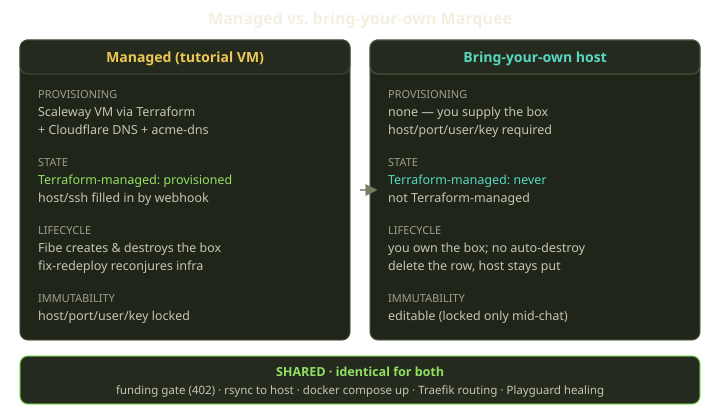
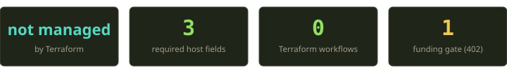
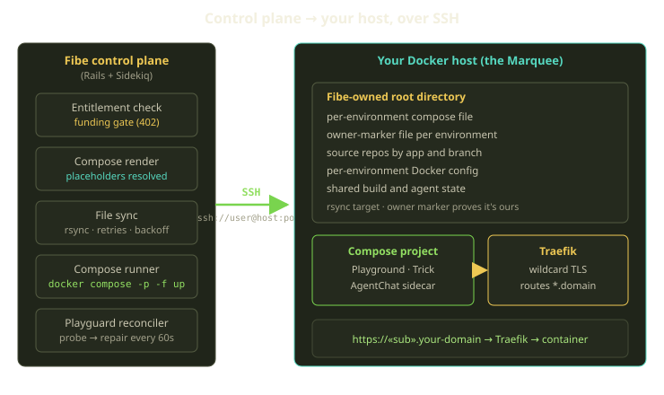

Some people don't want us to conjure them a VM. They already have a box — a beefy machine under a desk, a hardened instance in a VPC their security team trusts, the staging server they've been paying for anyway — and they want *their* host to be the thing Fibe deploys onto.

So we let them. You hand Fibe an SSH endpoint — host, port, user, a private key — and that box becomes a Marquee: a first-class Docker host that runs Playgrounds, Tricks, and AgentChats just like one we provisioned ourselves. The interesting part is how little we had to add: a bring-your-own Marquee is the same Marquee, minus the part that conjures and tears down a VM.

<!-- truncate -->



The managed path is elaborate: a payment dispatches a GitHub Actions workflow, Terraform builds a Scaleway VM and a fistful of Cloudflare records, and webhook steps walk a database row to life. That whole pipeline exists to answer one question — *where is the box, and how do we reach it over SSH?* Bring your own host and you've answered it already, so we skip the pipeline.

## One model, two ways to fill it in

A Marquee is a single row in our database — the same row, whether we built the host or you did. What separates the two paths is one nullable piece of state: whether Terraform manages the box. For a managed Marquee that state walks a small state machine as Terraform works — provisioning, provisioned, eventually destroying and destroyed, or failed. For a bring-your-own Marquee, empty, forever.

With a distinction that clean, the rest of the model practically writes itself. For a managed Marquee, the connection details — host, port, and SSH user — *can't* be required at creation, because the box doesn't exist yet; a deploy webhook fills them in once Terraform has an actual IP to write down. For a bring-your-own Marquee the logic inverts: no webhook is coming, so you supply those details up front, required precisely *because* the Marquee isn't Terraform-managed.



The same toggle gates a cluster of BYO-only validations: that your host isn't an internal or non-routable address, that your host-and-port pair is unique so two Marquees don't fight over the same box, and that any domains you attach are well-formed. None run for a managed Marquee — Terraform owns those concerns there. All run for yours, because we'd rather catch a typo than fail mysteriously three steps later. In short: **managed Marquees discover their details; BYO Marquees declare them.**

## What Fibe does with your host

Once the row validates, your host is just a Marquee. Everything that makes Fibe *Fibe* runs over SSH, none of it caring how the row got created. Your connection details compose into a single `ssh://user@host:port` URL — the only address the runtime needs. Deploying a Playground onto your host looks like this:



There's no local `git clone`, no `docker compose up` from a repo root:

1. **Generate.** Fibe renders the environment's template into a concrete compose file, with every `${PLACEHOLDER}` resolved against the environment's variables. A file with unresolved placeholders is never synced, so a half-rendered file can't reach your host.
2. **Sync.** `rsync` ships the rendered file over SSH to a fixed per-environment directory under a single Fibe-owned root on your host. The transfer runs non-interactively with a short connect timeout and retries with backoff — the network to a box you own isn't a cloud datacenter's, so we plan for turbulence.
3. **Run.** Every invocation is the same explicit form, with source repositories cloned into a per-environment props directory keyed by app and branch, then bind-mounted where each service expects them:

```bash
docker compose -p «project» -f «compose_file» up -d --remove-orphans --pull missing
```

4. **Route.** Fibe joins Traefik to the project's Docker network and serves the containers over TLS at their subdomains.

That's the entire runtime, byte-for-byte identical to what a managed Marquee gets. The component that drives `docker compose`, the one that ships files with `rsync`, the on-host directory layout — none of it branches on who owns the box; each piece only sees a host and a key.

### The funding gate still applies

Bringing your own host does *not* buy you free orchestration. A Marquee only runs while it's funded: billing tops up your Mana and Sparks wallet daily, and before Fibe deploys anything it checks whether the Marquee is currently entitled. If it isn't, you get a `402` payment-required response and nothing touches your host. BYO is about *where* your environments run, not *whether* you pay to orchestrate them — the same funding gate every Marquee passes through, guarding roughly a hundred places Fibe might otherwise act. Your hardware, our control plane, our billing.

## The owner marker: why we won't nuke your box

Here's the part security-conscious teams ask about first, and the part we're proudest of. Your host might be running things that have nothing to do with Fibe — other containers, other projects, your actual work. When Fibe cleans up an environment, how do we guarantee we only touch our own stuff? With proof, not trust. Every Playground directory carries a small owner-marker file, written at creation, recording the resource type and which Playground and Marquee it belongs to.

Before the cleanup pass deletes anything, it clears three independent guards:

1. The directory name is a **valid Fibe project name** — not some arbitrary path.
2. The path lives **under Fibe's own root directory** — we never reach outside it.
3. The **owner-marker file is present and proves Fibe ownership**.

Only when all three pass does the path get removed; a directory we didn't create has no marker, so it survives untouched. On a box you share with your own workloads, that's the difference between "sure, deploy here" and "absolutely not."

## What's different: the lifecycle you now own

So far, *sameness*. Here's where BYO diverges, all on the lifecycle side.

| | Managed Marquee | Bring-your-own |
|---|---|---|
| Host creation | Terraform builds a Scaleway VM | You provide an existing host |
| Terraform-managed state | walks provisioning → provisioned → … | never set |
| Connection details | filled in by deploy webhook | required at creation |
| Host validation | owned by Terraform | host/port uniqueness + not-internal + domain format |
| Teardown | Fibe destroys the VM via Terraform | delete the row; **your host keeps running** |
| Fix-redeploy | reconjures the whole VM + DNS + TLS | not applicable — there's nothing to reconjure |

The headline difference is teardown. When a managed Marquee reaches end of life, Fibe runs Terraform's destroy step and the VM ceases to exist. For a bring-your-own Marquee there's nothing to destroy: deleting the row removes Fibe's *record* of your host and stops deploying to it, but the machine is still yours, still running. We don't tear down a server we don't own — that's the literal meaning of "bring your own." The same logic rules out fix-redeploy, the big hammer that rebuilds a managed VM, DNS, and TLS from scratch (capped at ten times in four hours so a panicking user can't melt the pipeline).

### Immutability: stricter for tutorial, looser for you

It's easy to assume BYO is the *more* locked-down path; it's the reverse. Tutorial (managed) Marquees treat their connection details — host, port, SSH user, and private key — as immutable, because Terraform wrote those to describe a VM it manages, and hand-editing them would desynchronize the row from reality.

Your bring-your-own Marquee has no such restriction. You declared those details, so you can update them — rotate the SSH key, move to a new host, change the port. The only time they lock down for *any* Marquee is while a live agent chat is running: those fields plus the attached domains all freeze so the rug isn't pulled out from under the session. That lock is about timing, not ownership — finish the chat and the fields are editable again.

### When can it launch?

Validation gets you a Marquee, not a *working* one. An AgentChat launches only when four conditions hold at once: the Marquee is funded, its agent runtime is operational, it's reachable over SSH, and it has a root domain to route under. For a BYO host the SSH-reachability check does the real work, confirming the connection details are present and the host isn't stuck mid-provision or destroyed — states you never enter, since Terraform doesn't manage your box.

The root domain is where TLS lives: attaching a domain becomes required once you turn HTTPS on — configuration you control, not the ZeroSSL wildcard dance we run during managed provisioning.

## What we learned

The cleanest features are usually the ones where you resist building a parallel system. We could have written a whole second code path for "external hosts" — its own deploy logic, healing, and cleanup — and we'd be maintaining two drifting copies by now. Instead, BYO is the absence of one subsystem. The lessons that fell out:

- **Model the variation as data, not a fork.** "Is this host Terraform-managed?" is the entire distinction; validations, lifecycle, and immutability all read that one fact, with no "is this BYO?" branch scattered through the deploy code.
- **Don't destroy what you didn't create.** Skipping the Terraform teardown for BYO isn't a missing feature — it's the correct behavior, and the whole promise of the name.

If you've got a box you trust, point Fibe at it. It'll treat your host like the first-class runtime it is, and leave everything it didn't create exactly where it found it.
