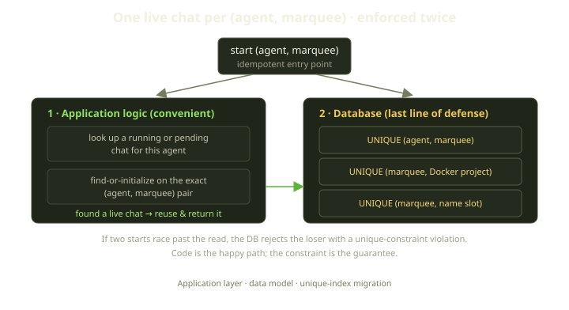
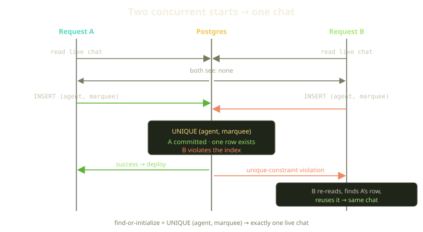
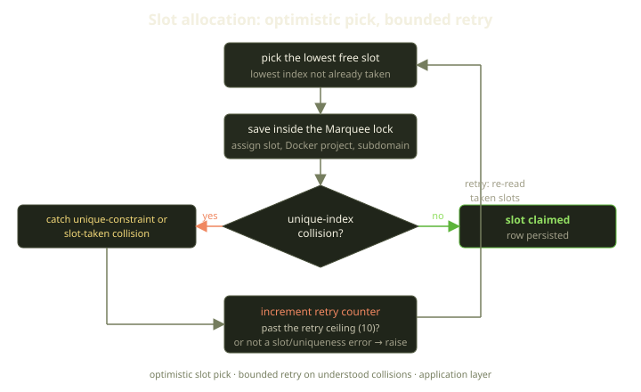

Every coding agent on Fibe — a "Genie" — runs as a Docker Compose project on someone's Marquee. When a Player clicks "start," we want one thing to be unambiguously true: at most one live Genie chat per agent on that host. Not "usually one." Not "one, unless two browser tabs fire at the same millisecond." One.

The interesting part isn't the rule. It's that we enforce it in two completely independent places — the application layer reuses the existing chat, and the database has a unique index that physically cannot hold two — and that this redundancy is the point, not an oversight. Here's why, and what leaning on a real invariant buys you downstream.

<!-- truncate -->

## The shape of the problem

Quick vocabulary so the rest reads cleanly. An **Agent** is a Player's persistent agent config — its provider, encrypted credentials, enabled skills, MCP servers. A **Marquee** is the Docker host. An **AgentChat** is one running instance of that agent on one Marquee: a single Docker Compose project with a stable name slot, its own subdomain, routed through Traefik.

The relationship is one-to-many: a single Agent backs many chats over time, across restarts and Marquees. But on a given Marquee, we deliberately collapse that to **one live chat per (agent, marquee)**. Two live chats for the same agent on the same host would mean two containers fighting over the same persistent volume, two Traefik routes, two sets of credentials writing to the same agent home directory. That's not a feature — it's a corruption bug waiting for a quiet afternoon.

So "start" has to be **idempotent**. Click it twice, get one chat. Have two Sidekiq workers pick up two enqueued start jobs, get one chat. Reload the page mid-deploy, get the same chat back.

The naive version of this is a check-then-act: read whether a live chat already exists, return it if so, otherwise create a new one. That logic is correct right up until two requests run it concurrently. Both read "nothing there," both create, and now you have two. The window between the read and the write is small, but "small" is not "zero," and under load you will hit it — Sidekiq retries, double-clicks, a Playguard redeploy racing a manual restart. The concurrency is inherent.

## Layer one: the application reuses the existing chat

The start path begins long before it thinks about creating anything: it first looks for a chat to reuse.

If there's already a running or pending chat for this agent, we hand it straight back. No new container, no new deploy — the start operation returns the existing chat and the caller re-deploys *that* chat if it needs to. That's what makes the operation idempotent in the common case: the second click finds the first click's chat and reuses it.

When we do need a fresh chat, we don't blindly create one. We look up the chat for this exact (agent, Marquee) pair and initialize a new one only if none exists yet. Keying on that exact pair matters: reactivating a *stopped* chat reuses the same record, which means it keeps the same name slot, the same Docker project name, the same subdomain, and the same volume. A stopped Genie that comes back keeps its name; the Player's bookmarked URL still works.

And the whole allocation runs inside a pessimistic lock on the Marquee — a row lock the database holds for the duration. Concurrent allocations on the same Marquee serialize through that lock instead of trampling each other. One goes first, finishes, releases; the next sees the result and reuses it.

This layer reads like the intent and handles the overwhelming majority of traffic correctly. It is also, on its own, not enough.

## Layer two: the database is the wall

The application lock only serializes allocations that *go through that code*. It does nothing about a code path you forgot, a future refactor that moves the create elsewhere, or a raw insert. Application-level invariants are only as strong as every caller's discipline — and that discipline erodes.

So the real guarantee is in the schema. The migration that introduced name slots added three unique indexes, each covering one thing that must be unique on a Marquee:

- One on **(agent, Marquee)** — this is the invariant itself, expressed as a thing the database physically cannot violate.
- One on **(Marquee, Docker project name)** — no two chats can claim the same Compose project on the same host.
- One on **(Marquee, name slot)** — no two chats can share the same Genie name and subdomain.

That first index is the one that carries the rule. It doesn't matter how a second insert arrives: another worker, a code path nobody remembers, a hand-run console command at 2am. Postgres will reject it. The other two indexes do the same job for the two other things that must be unique on a Marquee.

:::tip
A model-level uniqueness validation runs a `SELECT` before the `INSERT` — the exact same check-then-act race as the naive code above. The unique index is the only thing that's actually atomic. We keep the model validation too, because it produces nice error messages on the happy path, but the index is what we trust.
:::

The whole philosophy fits in one sentence: **the application layer is for convenience and good errors; the database is the last line of defense.**

## When they race, the database wins (gracefully)

Picture the worst case the application layer can't fully prevent: two start requests for the same agent on the same Marquee, close enough that both pass the "is there a live chat?" check before either writes.

Both look, see nothing, and try to insert. Postgres commits the first and raises a unique-constraint violation on the second. Crucially, the loser doesn't blow up in the Player's face: the collision is caught, the request re-reads, finds the winner's chat, and reuses it — the same outcome the happy path would have produced, arrived at the long way round. From the outside, both "starts" succeeded and both point at one chat.

That's the property worth naming: the constraint isn't only a guardrail against corruption, it's the *coordination mechanism*. No distributed lock spanning both requests — we let them both try, and let the database be the single source of truth about who won.

## Slot allocation: bounded retry, not a spin loop

There's a second, subtler collision. When a brand-new chat needs a name slot, we pick the lowest free index — the smallest slot number not already taken on that Marquee.

Slots map to a fixed table of 192 Genie names — `aladdin`, `jafar`, `genie`, `jasmine`, `merlin`, `gandalf`, and on down — so slot zero is always the same name on that Marquee, and the subdomain is stable across restarts. (Run out of all 192? We fall back to a name derived from the agent itself. We have never seen this in production.)

Here's the rub: between reading which slots are taken and actually saving, another allocation can grab the slot you were eyeing. The unique index on (Marquee, slot) then rejects your insert — the same check-then-act gap, one level down, and again the index catches it rather than letting two chats share a slot.

The fix is a **bounded retry loop**:

We try to claim a slot inside the Marquee lock. If the save fails with a slot collision, we increment a counter, re-read which slots are now taken, and try the next free one — up to a fixed ceiling, after which we give up and re-raise.

Two design choices in here are deliberate. First, the loop is **bounded**. We try eleven times — a ceiling of ten retries — and then give up. An unbounded retry on a contended resource turns a slot collision into a hot loop that pegs a database connection; bounded retry degrades to a clean error instead of a brownout. Eleven attempts is comfortably above the realistic concurrency on one Marquee while still being a hard ceiling.

Second, we only retry on collisions we actually understand. A genuine index collision is exactly what we expect to lose occasionally and retry past, so we retry it. A validation failure is retryable *only* when it's specifically the slot-uniqueness check firing. Any other validation failure — a missing field, a bad state — is a real bug, and retrying it eleven times would just be eleven identical failures wearing a trench coat. We let those propagate immediately.

:::note
Why catch both flavors of error? It's a timing thing. If the conflicting row is already committed when the pre-insert `SELECT` runs, you get a validation failure that reports the slot as taken. If it commits in the gap *after* the validation passes but before your `INSERT`, you get a raw unique-constraint violation from the database instead. Same logical event, two failure types — and the retry decision handles both while refusing to swallow anything else.
:::

## Why bother with both?

The honest counterargument: if the constraint is the real guarantee, why keep the application logic? And if the application logic is well-written, why pay for the constraint? Because they fail differently, and you want neither failure to reach a user.

| | Application logic | Database constraint |
|---|---|---|
| **Strength** | Expressive, idempotent reuse, friendly errors, reuses the same chat, slot, and name | Atomic, race-proof, immune to forgotten code paths |
| **Weakness** | Check-then-act races; only as strong as every caller's discipline | Blunt — raises an exception, no reuse semantics on its own |
| **Without it** | The DB still rejects dupes, but every collision becomes a raw 500 | A new code path or refactor silently allows two live chats |
| **Best at** | The 99.9% happy path | The 0.1% that would otherwise corrupt state |

Drop the constraint and the happy path stays pretty, until someone adds a second place that creates chats and two Genies quietly start chewing on the same volume — a bug that wouldn't show up in code review, only as mysterious credential corruption weeks later. Drop the application layer and you stay correct but miserable: every second click becomes a unique-constraint exception instead of a clean reuse.

Together they give you the thing that's genuinely valuable: an invariant you can **lean on**. Everything downstream of chat creation — the deploy pipeline, Traefik routing keyed on the unique subdomain, the Playguard reconciler that heals chats every 60 seconds, the orphan cleanup that reaps Compose projects with no matching record — gets to *assume* there's at most one live chat per (agent, marquee). They don't re-check, and they can't be wrong, because the assumption is enforced two layers down by something that physically can't be false.

That's the real payoff of a hard invariant. It's not the line of code that enforces it — it's every line of code that gets to stop worrying about it. None of this is exotic; it's the kind of belt-and-suspenders boring that lets a platform heal itself at 3am without paging anyone — which is exactly the kind of boring we're going for.
