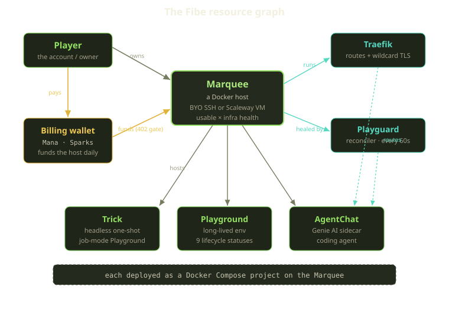
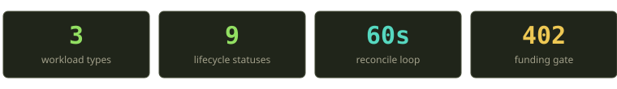
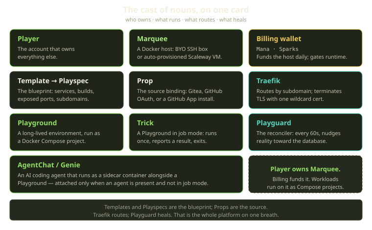
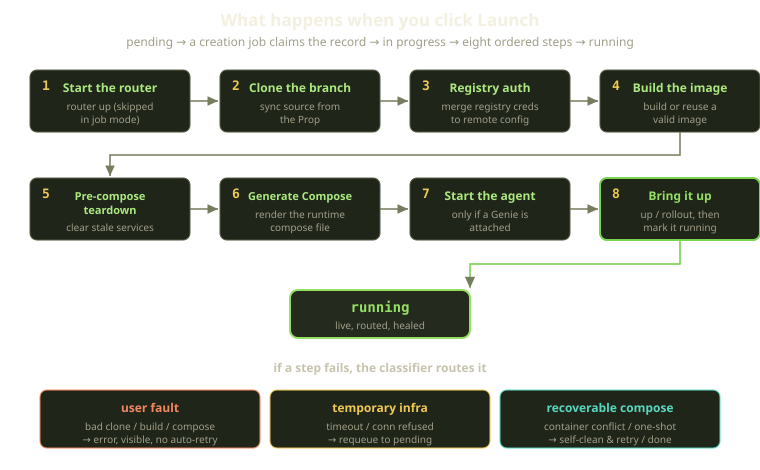
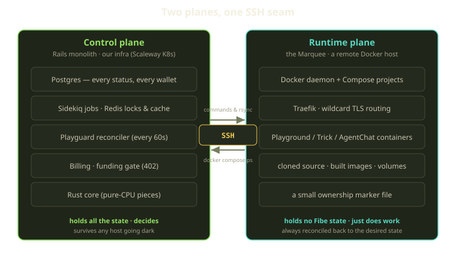

The first time someone watches a Fibe environment come up, the question is always the same: where is this thing actually running? You clicked a button, a URL appeared, and thirty seconds later you had a full-stack app with its own subdomain and a valid TLS cert. No `docker run`, no DNS records, no certbot. It feels like magic, and magic is exactly the kind of thing engineers distrust.

So let's pull the curtain back. This post is the map of the whole platform — the nouns, how they fit together, and the literal sequence of events between "click Launch" and "your app is live." If you read one thing about how Fibe is built, read this; the rest of the blog drills into the corners.

<!-- truncate -->

## The cast of characters

Fibe is a development-environment platform built on Docker. The core idea is small: you bring (or rent) a machine that can run Docker, and we turn it into a place where reproducible environments come and go on demand. Everything else is bookkeeping around that idea.

There are only a handful of nouns, and once they click, the whole system reads cleanly.

- A **Player** is you — the account that owns everything else.
- A **Marquee** is a Docker host. You can bring your own SSH-reachable box, or let us auto-provision one as a Scaleway VM. It's the stage; the environments are the show.
- **Billing** funds the Marquee on a daily cadence out of a wallet denominated in **Mana** and **Sparks**. Funding is not a nicety — it's a hard gate. An unfunded Marquee runs nothing.
- On a Marquee, three kinds of workload run as Docker Compose projects: **Playgrounds** (long-lived environments), **Tricks** (headless, one-shot Playgrounds running in job mode), and **AgentChats** (AI "Genie" coding agents running as sidecars).
- **Traefik** routes traffic to those workloads and terminates TLS with a wildcard cert.
- **Playguard** is the reconciler. Every 60 seconds it compares what the database thinks should be running against what Docker is actually doing, and quietly fixes the difference.

That's the system. Here's how the pieces connect.

### The nouns on one card

The list above introduces the nouns in the order the system uses them, but a few of them — `Template`, `Playspec`, `Prop`, `AgentChat` — don't fully show up until we get to a launch. Here's the whole vocabulary in one place, one tight line each, so you can refer back without scrolling. If a term here is unfamiliar, the section it belongs to fills it in.

| Noun | What it is, in one line |
|---|---|
| **Player** | You — the account that owns everything else. |
| **Marquee** | A Docker host: bring your own SSH-reachable box, or let us auto-provision a Scaleway VM. |
| **Template &#8594; Playspec** | The blueprint, resolved at launch — what services exist, what gets built and exposed, what the subdomains are. |
| **Prop** | The source binding — a player-owned Git connection (managed Gitea repo, GitHub OAuth, or GitHub App install). |
| **Playground** | A long-lived environment, run on the Marquee as a Docker Compose project. |
| **Trick** | A Playground running in job mode — runs once, reports a result, then exits. |
| **AgentChat / Genie** | An AI coding agent that runs as a sidecar container next to a Playground. |
| **Billing wallet** | Two currencies — Mana and Sparks — that fund the Marquee daily and hard-gate all runtime. |
| **Traefik** | Routes traffic to workloads by subdomain and terminates TLS with one wildcard cert. |
| **Playguard** | The reconciler — every 60 seconds it nudges the host back toward what the database says should be true. |

A useful way to read that table: the top row is *ownership* (a Player), the next two rows are the *inputs* to a launch (a Marquee to run on, a Template and a Prop to run), the middle rows are the *workloads* (Playgrounds, Tricks, AgentChats), and the bottom three (Billing, Traefik, Playguard) are the *machinery* that funds, routes, and heals them. Every other concept in this post is built out of those eleven words.

Two things are worth saying out loud before we go deeper, because they shape every design decision downstream.

First: **the source of truth lives in our control plane, not on your host.** The Marquee runs containers, but it doesn't *know* anything. Every status, every wallet balance, every decision about what should be running lives in Postgres in our Rails app. The host is disposable. That's deliberate, and we'll come back to why.

Second: **a Trick is just a Playground in a hat.** A Trick is a Playground running in job mode — it runs once, does its thing, and reports a result instead of staying up. Same model, same state machine, mostly the same code. So when we talk about "the Playground lifecycle" below, Tricks ride along for free.

## Step zero: getting a Marquee

Before anything runs, you need a stage. There are two paths, and they diverge early.

**Bring your own host.** You give Fibe an SSH-reachable machine — host, port, user, key. There's no infrastructure for us to manage, so the Marquee simply has no Terraform-managed state attached to it. Whether a Marquee is Terraform-managed is a single flag we branch on all over the platform, and for a BYO host the answer is always no. You're responsible for the box; we're responsible for what runs on it.

**Auto-provision a Scaleway VM.** This is the path that feels like magic, and it's the one worth walking through, because it's where the TLS-out-of-nowhere trick happens.

When you pay for a tutorial Marquee, checkout publishes a provision-requested event and a planner picks it up. It either reuses an existing record or creates a fresh one, marked as provisioning and not yet usable. Then a Terraform run (driven by a GitHub Actions workflow) goes off and builds the actual infrastructure: a Scaleway VM, Cloudflare DNS records, and an acme-dns registration. As it works, it calls back into our control plane via signed webhooks that march the Marquee through its provisioning steps — from queued, to the VM being created and ready, to SSH being configured, to TLS being provisioned, to the final deploy.

Each webhook is authenticated with a Bearer token and checked against a generation counter — every deploy bumps the Marquee's generation number, and webhooks carrying a stale generation are rejected outright. This is the kind of guard you don't appreciate until a retried old workflow tries to stomp on a freshly redeployed Marquee, and the generation check just... refuses. Drift protection that costs one integer.

### The wildcard TLS dance

Once Terraform reports a successful deploy, we store the host's IP, SSH key, free domain, and a set of acme-dns credentials. Then a bootstrap step brings Traefik up on the new host with three things wired together:

- **acme-dns** for the ACME DNS-01 challenge, so the cert can be issued without exposing port 80;
- **ZeroSSL** as the certificate authority, authenticated with EAB (External Account Binding) credentials;
- a small warm-up route that asks for a wildcard certificate up front — the apex domain plus a `*` wildcard covering every subdomain under it.

That wildcard is the whole point. Once Traefik holds a wildcard cert for your domain, every Playground you ever launch gets HTTPS on its own subdomain for free — no per-environment cert issuance, no rate-limit roulette with the CA. One cert, infinite subdomains.

We don't flip the Marquee to active on optimism. A readiness probe does a real HTTPS `GET` against the host with full peer and hostname verification, and only when that comes back clean do we mark the Marquee active with its infrastructure provisioned. The retries back off; if they're exhausted, the Marquee lands in an error state with its infrastructure marked failed, rather than pretending to be healthy.

:::tip
We track a Marquee's health on two independent axes: whether the Marquee itself is usable (active, disabled, or in error) crossed with whether its underlying infrastructure is healthy (provisioning, provisioned, destroying, destroyed, or failed). It's one of those modeling decisions that pays off forever. "Is this Marquee usable?" and "is its underlying infrastructure healthy?" are genuinely different questions, and conflating them into one flag would have us lying to ourselves constantly.
:::

## Money is a gate, not a footnote

Here's a design choice that surprises people: billing in Fibe is not a sidecar that occasionally sends invoices. It's load-bearing. A Marquee that isn't funded for the day cannot run anything, and it fails *closed*.

The mechanism is a wallet with two currencies. **Mana** is the tutorial currency, minted by checkout, recharges, and grants. **Sparks** is the standard currency, funded by converting Mana one-way — you can turn Mana into Sparks, and there is, very deliberately, no reverse. The wallet is double-entry: every transaction is idempotent (keyed so a replay returns the existing entry, not a second charge), pessimistically locked, mirrored by exactly one ledger entry that records the resulting balance, and it can never go negative. Try to overspend and you get an insufficient-balance error, not a silent overdraft.

Funding happens daily. A background sweep runs every five minutes, and for each Marquee that has requested funding it does the same small thing: debit the day's amount, extend the paid-through time to the end of the service-day, and set the Marquee active. Skip if it's already paid; skip if it wasn't requested for the day. The debit is itself keyed per Marquee per day so two overlapping sweeps can't double-charge you.

And then there's the gate. Before any runtime operation, a single entitlement check stands in the way: if the Marquee is entitled, the operation proceeds; if not, it's stopped with a `402` payment-required response carrying a clear not-funded code. That same check is guarded at roughly a hundred call sites across the platform — controllers, jobs, channels, and the SSH/rsync/Docker executors themselves. Entitlement boils down to "paid through at least now, or you're a super-admin." Notably, it does **not** consider health. Whether the host is reachable is a *separate* question — a launchability check that also looks at SSH access, runtime operability, and whether a root domain exists. Money and health are orthogonal, and the code keeps them that way.

How the gate behaves depends on who hits it. A web request gets a clean `402`. A background job marks its record errored at the billing step and preserves the not-funded code. A live WebSocket channel surfaces a not-funded status payload instead of crashing the socket. And critically, the unpaid teardown is **local-only** — it disables the Marquee, marks playgrounds errored, quiesces runtime, and writes an audit log. It never reaches out over SSH to nuke your containers. We don't punish a billing lapse by destroying work. Reads to the billing UI stay open the whole time, because the one thing a person with an unfunded Marquee needs to do is *fund it*.

If a day's funding fails, a grace incident opens — one per Marquee per service-day. Grace tracks the debt, sends a notification, and crucially never advances the paid-through time, so a Marquee in grace still fails the gate. From there it can be repaid (a wallet credit repays grace debt oldest-first, in the same currency), or it ages into a suspended state, and for tutorial Marquees eventually into a scheduled-for-destruction state and a Terraform teardown. Standard Marquees never get destroyed for non-payment — they just sit there, unfunded and idle, waiting for you to come back. That asymmetry is intentional: a rented tutorial VM costs us money to keep alive; your own BYO host doesn't.

## Click Launch: the thirty-second journey

Now the main event. You've got a funded, active Marquee. You pick a Template, point it at a Prop, and hit Launch. What happens?

A bit of vocabulary first, because two more nouns show up here:

- A **Template** (resolved into a **Playspec**) is the blueprint — what services exist, what gets built, what gets exposed, what the subdomains are.
- A **Prop** is the source binding — a player-owned Git connection. It can be a managed Gitea repo, a GitHub OAuth connection, or a GitHub App install. The Prop is where the *code* comes from.

A Playground is created in a pending state. That's it — pending is a promise, not a running thing. A background creation job picks it up, claims the record under a lock (only if it's still pending, so two jobs can't both run it), and transitions it into its in-progress state. Then it walks eight ordered steps, recording which step it's on as it goes so you can watch progress in real time.

The steps, in order:

| # | Step | What it does |
|---|------|-------------|
| 1 | Start the router | Make sure Traefik is up (skipped in job mode — a Trick has nothing to route) |
| 2 | Clone the branch | Sync source from the Prop onto the host |
| 3 | Authenticate to the registry | Merge registry credentials into the host's Docker config over SSH |
| 4 | Build the image | Build the image, or reuse a valid existing one |
| 5 | Pre-compose teardown | Clear out any stale version of this project |
| 6 | Generate the Compose file | Render the runtime Compose file from the Playspec |
| 7 | Start the agent | Bring up the Genie sidecar — only if an agent is attached and we're not in job mode |
| 8 | Bring the project up | `docker compose up` (or a rollout), then mark the Playground running |

A few of these deserve a closer look.

**Cloning the branch** pulls your actual code from the Prop. If it fails, that's almost always a *you* problem — a bad branch name, a private repo we can't reach — so it's classified as user fault and surfaced as an error rather than retried into oblivion. (More on that classifier in a second.)

**Registry authentication** is the quietly clever one. Registry credentials get *merged*, with explicit Playspec credentials winning over the Marquee's defaults for the same registry. For GHCR specifically, the credentials come from your Prop — your GitHub OAuth token, or the GitHub App installation token — and platform tokens are *never* used to pull your images. Your private images stay pulled with your own auth, full stop. There's no path anywhere in the system where a Fibe platform token touches a GHCR pull.

**Building the image** is smart about not redoing work. If a valid image already exists for this exact commit, it's reused. And if a rebuild fails *during a rollout of a live environment*, we don't tear the running thing down — we keep the previous image serving traffic and flag the Playground as needing recreation later. Your live env doesn't blink because a new build was broken.

**Bringing the project up** ends by marking the Playground running, which flips its status and kicks off a state-refresh. For a Trick (job mode), that same transition fires *and additionally* queues a follow-up job to capture the result — it's an "and," not an "instead."

### A day in the life of a launch

The table is the *what*; here's the *when*, narrated as the row moves through the system. Nothing here is new machinery — it's the same eight steps — but watching them as a sequence is how the design clicks.

- **t+0s — the click.** A Playground record is written in the pending state. That's the entire synchronous part of "Launch": one insert. Pending is a promise, not a process. The HTTP request returns immediately, and the database now holds an intention nobody has acted on yet.
- **t+0s — the claim.** A creation job is enqueued. When a Sidekiq worker picks it up, the first thing it does is take the record under a lock and re-check that it's *still* pending. If two workers race for the same launch, exactly one wins the claim and the other quietly returns — there is no path where two jobs drive the same Playground. The winner transitions the record into its in-progress state.
- **t+1s → t+5s — talking to the host.** Now the control plane reaches across the SSH seam. It confirms the router is up (skipped entirely for a Trick, which has nothing to route), rsyncs your source from the Prop onto the host, and merges registry credentials into the host's Docker config. Each of these is a remote command or file sync — the worker is in our Kubernetes, the work is happening on your Marquee, and the only channel between them is SSH.
- **t+5s → t+25s — the slow part.** Building the image is usually where the wall-clock time goes, and it's the step most worth skipping: if a valid image already exists for this exact commit, it's reused and we move on in milliseconds. A cold build of a fresh project is where you actually wait. As each step starts, the worker records which step it's on, so the progress you see in the UI is the literal cursor of the job, not an animation.
- **t+25s → t+29s — assembling runtime.** The host gets any stale version of this project cleared off it, the runtime Compose file is rendered from the resolved Playspec (this is where the Rust core earns its keep, generating Traefik labels), and the Genie sidecar is brought up — but only if an agent is attached and we're not in job mode.
- **t+29s → t+30s — going live.** The project is brought up with `docker compose up` (or a rollout for an existing environment), the system waits for health, and the Playground is marked running. The status flips, a route refresh is scheduled so Traefik starts directing your subdomain at the new containers, and a state-refresh is queued. The URL you were shown at t+0s now serves your app over HTTPS.

The whole arc is "one pending record, eight steps, one running record," and the only synchronous thing the person who clicked Launch ever waited on was that first insert. Everything after it is a job, observable step by step, and — as the next section covers — recoverable step by step too.

Get through all eight and you're running: live, routed on your subdomain with that wildcard cert, and from this moment on, watched.

### When a step fails

Failure is not one thing, and treating it as one thing is how you end up with environments stuck forever or, worse, retried into a billing hole. Fibe runs every failure through a single classifier that assigns a category, and the category decides the fate:

- **User fault** — a bad clone, a broken build, unresolved placeholders in the Compose template, a Compose run that won't come up. These become a visible error and *stay* there. We're not going to retry your typo a thousand times.
- **Temporary infrastructure** — permission denied, connection refused, a lost connection, a generic timeout, a Sidekiq worker shutting down mid-run. These get requeued back to pending and the creation job picks them up again. (SSH and rsync transport timeouts are now caught structurally, right at the boundary where we run remote commands, before they even reach the message-matching layer.)
- **Recoverable compose** — a container-name conflict, a health-wait timeout, a one-shot container that exited cleanly. A conflict triggers an inline self-clean and one retry; a clean exit of a one-shot is just *success*.

:::note
There's a real edge here we keep an eye on: a *temporary* failure that happens to land during the clone step still gets recorded as a user-facing error, because clone failures are deliberately excluded from the retryable pattern. It won't auto-requeue — it waits for Playguard, the recurring startup-recovery sweep, or a manual retry to move it. Honest systems have honest edges, and this is one we document rather than paper over.
:::

## Two planes and the seam between them

This is the architectural backbone, and it's worth being explicit about.

Fibe is split into a **control plane** and a **runtime plane**, and the line between them is SSH.

The **control plane** is our Rails modular monolith — Packwerk packs, Sorbet types, and a Rust core for the pure-CPU pieces like Compose label generation. It runs on our own Scaleway Kubernetes. It holds Postgres (every status, every wallet), Redis (locks and cache), Sidekiq (the jobs that do everything), the billing gate, and Playguard. This plane *decides*. It is the only thing that knows what should be true.

The **runtime plane** is your Marquee — a remote Docker host that could be a Scaleway VM or your own laptop-in-a-closet. It runs the Docker daemon, Traefik, and your Playground / Trick / AgentChat containers. It holds the cloned source, the built images, the volumes. And it holds essentially no Fibe *state* — just a small ownership marker file so we can prove which projects are ours and never clobber a stranger's containers.

Everything the control plane needs to do on the host, it does over SSH: run a command, rsync a file, ask `docker compose ps` what's actually up. The host is a hand, not a brain.

Why build it this way? Because hosts are unreliable and we refuse to be unreliable because of them. If your Marquee drops off the network at 3am, here's what does *not* happen: nothing gets destroyed. The availability probe notices the daemon is unreachable. State inspection comes back as failed, drift detection reports no actionable difference, and any in-flight compose operation refuses to run because the Docker daemon isn't available, and stops cold. No teardown, no data loss — because the rule baked into the system is **never take a destructive action against a host you can't currently see.** Blind means hands-off.

When the host comes back, the availability cache clears and the next reconcile cycle simply re-converges. Idempotently. A Playground stuck mid-creation (older than 30 minutes, or caught at the 2-minute mark by the startup-recovery sweep that runs every 60 seconds) gets recovered back to pending and re-driven — but only if no live Sidekiq worker still owns the record. The host went dark and came back, and the worst that happened was a few minutes of latency.

This is the payoff of keeping all the state in one place: the host can be as flaky as it wants, and the system stays correct.

## Playguard: the metronome

If the control plane decides and the runtime plane does, **Playguard** is the thing that keeps checking whether what got done matches what was decided. It runs once per launchable Marquee, every 60 seconds.

Each cycle takes a 15-minute Redis token lock (renewed between phases, so a single cycle can't run forever holding it) and then, in order:

1. **Probe Docker first.** If the daemon is unreachable, bail — and after five consecutive strikes, quarantine the Marquee into an error state... *unless* it has live agent chats, in which case we leave it alone. We will not yank the rug out from under someone's running AI session over a transient probe failure.
2. **Sync the slow-moving stuff** — git-dirty status, branch pulls, credential refresh, image pulls, expirations — with a lock renewal checkpoint between each phase.
3. **Reconcile every Playground** against Docker truth. Running and healthy with some artifact drift? Repair it in place. Drifted or flagged for recreation and *not* dirty? Roll it out, preserving production images. Drifted but *dirty* (you've got uncommitted work in there)? Skip it and log, at most once an hour. We never auto-destroy work in progress.

That last point is a rule, not a vibe: **dirty environments are never automatically destroyed.** Playguard has a recreation budget — at most three rebuilds per cycle — so even a Marquee full of drifted environments heals gradually instead of stampeding the host with simultaneous rebuilds.

Reconciliation reads Docker truth via `docker compose ps`, and if that inspection is indeterminate, it does nothing. Same principle as before: an unclear reading is never grounds for a destructive write. A pending or stopped Playground that's actually healthy and running on the host gets recovered *to* running. A cleanly stopped one that nobody asked to run stays stopped. The reconciler nudges reality toward the database, never the reverse, and never on a guess.

## Routing, and the maintenance page you'll never notice

One last piece: how traffic finds your environment. Traefik runs on the Marquee and routes by subdomain, using labels generated (partly in Rust) from the Playspec. Exposed services get a route; services in job mode or a destroying Playground get none.

When something isn't ready — mid-rollout, or explicitly in maintenance — there's a maintenance route registered at the very top of the priority order that catches the request and returns a `503` from a small nginx error-pages service. Because it outranks everything else, it wins, which means a request to an environment that's rebuilding gets a clean "back in a moment" instead of a connection refused or, worse, a half-built app. Lifecycle transitions schedule a route refresh as they happen, so the routing table tracks the actual state of the world within a beat.

## The mental model to keep

If you take one picture away from all of this, take this one:

> **The database is the truth. The host is a cache of the truth that we continuously rebuild.**

Everything else falls out of that sentence. State lives in the control plane, so a host can vanish without taking your data with it. Funding is checked in the control plane, so it can gate every action consistently. Playguard reconciles toward the database every 60 seconds, so drift is temporary by construction. And the SSH seam between the two planes is narrow on purpose — commands and file syncs in, observations out — so the blast radius of a flaky host is "things are slow for a minute," never "things are gone."

The four resources are the vocabulary: a **Player** owns a **Marquee**, billing funds it, and **Playgrounds** / **Tricks** / **AgentChats** run on it as Compose projects. Templates and Playspecs are the blueprint; Props are the source. Traefik routes; Playguard heals. That's the whole platform on one breath.

## What we learned

Three ideas did most of the heavy lifting, and they're worth stealing:

- **Make the unreliable thing stateless.** Remote Docker hosts are the flaky part. By keeping zero authoritative state on them, a host failure is a performance event, not a correctness event. The reconciler does the rest.
- **Fail closed on money, fail safe on data.** The funding gate is strict — no money, nothing runs, 402. But the *response* to no-money is gentle: disable locally, never reach out and destroy. Strict gate, soft teardown.
- **Never act destructively on a blind read.** Daemon unreachable, inspection failed, ambiguous `ps` output — every one of those resolves to "do nothing." It's astonishing how many incidents that single rule prevents.

This was the map. The rest of the engineering blog walks individual streets — the Playground state machine in full, the billing and grace lifecycle, how Genie agents run as sidecars, how provisioning and TLS bootstrap actually work under the hood. Now you know where they all live.
