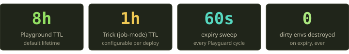
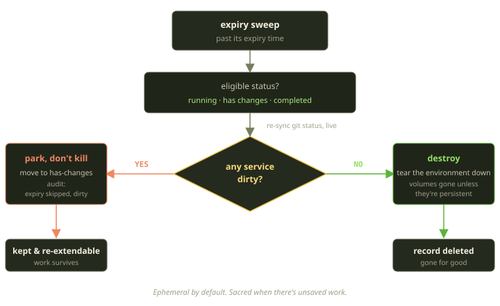
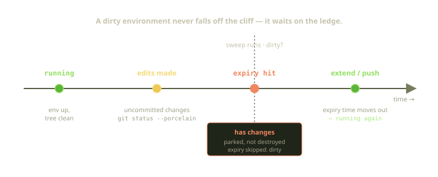

Every Playground on Fibe is born with an expiration date. Spin one up, walk away, and eight hours later it's gone — containers down, volumes reclaimed, the database row deleted. That's not a quota we enforce grudgingly; it's a default we're proud of. Idle environments are a tax everyone pays: they burn compute on a Marquee someone funds daily, pile up as ghost subdomains, and make "what's actually running here?" unanswerable. So we let them die.

But there's exactly one thing we will not do, no matter how expired an environment is: throw away your uncommitted work. If a Playground has dirty files when its clock runs out, the expiry sweep parks it rather than destroying it. This post is about that one rule — and how little code it takes to hold ephemerality and data safety at once.

<!-- truncate -->

## Two clocks: 8 hours and 1 hour

A Playground is a long-lived development environment — you open it, work in it, come back tomorrow. A Trick is the opposite: a headless, one-shot job-mode Playground that runs a task and exits — CI checks, batch jobs, "run this script against the real stack once." Radically different lifetimes, radically different TTLs.

So we give them two defaults. A Playground gets eight hours — roughly a working day: long enough that you won't lose an environment at lunch, short enough that the one you forgot on Friday is gone by Monday. A Trick gets one hour, generous for a job meant to finish in minutes but with slack so a slow build won't get reaped mid-run. That one-hour figure is configurable per deployment, since a job-mode lifetime is the kind of knob an operator may want to turn; everything else is a constant. The selection is the whole of the logic: a Playground in job mode gets the Trick lifetime, otherwise the working-day default.

These aren't hard kills at the boundary. Each value just stamps a paid-through expiry time onto the environment; something has to notice the clock has run out and act. That's Playguard.

## The sweep runs in the same loop that heals everything else

Fibe doesn't have a dedicated "expiry cron." A separate scheduler is one more thing to monitor and one more job that can silently stop firing. Instead, expiration enforcement is just another phase of the Playguard reconciler, the per-Marquee control loop that runs every 60 seconds anyway.

That co-location matters more than it looks. Playguard already probes whether the Docker daemon is reachable, and already holds a Redis token lock so two reconcilers can't fight over the same host. Expiry runs as the last phase in the cycle, so it inherits all of that for free: by the time it runs, the host is confirmed alive, the Marquee is funded and entitled, and Playguard owns the lock. Once a minute, on every launchable Marquee, it asks "is anything past its expiry?" and decides what to do.

## What's even eligible

The enforcer doesn't look at every Playground. It scopes to two conditions: the environment is past its expiry time, *and* it's in one of a short list of states.

The "past its expiry" half is obvious; the status filter is the interesting one. Only three of the nine lifecycle states are candidates: running (the common case), completed (a finished Trick), and has-changes (an already-parked dirty environment — the keystone of the whole design, which we'll return to). Pending, mid-creation, stopping, stopped, and being-destroyed environments are all on their own paths. And an error state is excluded on purpose: a broken environment is something a human probably wants to look at, not something we garbage-collect mid-debugging.

## The fork in the road: clean or dirty

For each eligible Playground, the enforcer makes one decision:

The first thing it does is *not* destroy anything. It re-syncs each service's git status live, then asks one question — is any service dirty? If yes, it flips the environment into has-changes (if it isn't already), writes an audit record naming which services were dirty, and stops. Only if the answer is no does it fall through to the destroy path. The asymmetry between the two branches is the whole point.

### Clean: destroy it, and mean it

If the working tree is clean, the environment is genuinely disposable: every committed change is safe in Git, and the containers are reproducible from the Template. So we destroy it properly — the teardown brings the Docker Compose project down, removes the named volumes too (the part people sometimes miss) unless the Playspec opted into persistent volumes, then deletes the database record.

That last bit settled an actual disagreement on the team. The fuzzy belief was that a "clean expiry" just stopped the containers and left a tombstone record behind. It doesn't — a clean expiry is a full delete: containers, volumes (modulo persistence), and record. "I think it just stops it" is the assumption that leaves orphaned volumes accreting on a host for a year.

:::note
Persistent volumes are the one escape hatch on the clean path, deliberately narrow. A stateful Playspec keeps its volumes across teardown — a clean expiry still removes the containers and the record, but the volume survives to re-attach next time, keyed to that Playspec and Marquee. Stateful Playspecs are also limited to one active Playground at a time, so that volume isn't a free-for-all.
:::

### Dirty: park it, never kill it

If any service comes back dirty, everything changes. We tear nothing down and remove no volumes; we move the Playground into has-changes, write an audit record with the exact list of dirty services, and stop. The environment keeps running, your uncommitted edits untouched on disk. That record says, in effect, *we were going to expire this, and deliberately skipped it because you have unsaved work* — about as honest as a log line gets, and the timestamped answer if you ever wonder why an environment is still here after 11 hours.

The philosophy underneath is a hierarchy we don't compromise on. Cost, hygiene, and idle-resource reclamation all matter — but all rank below work a human did and hasn't saved yet. When those values collide, **dirty work wins.**

## How "dirty" is actually decided

Over-trusting a cached flag here is how you delete someone's afternoon, so the enforcer trusts no cache: right before it decides, it runs git's own porcelain status query over SSH against each service's checkout, treating the environment as dirty if any one reports uncommitted changes. The check is per-service — if even one of several checkouts is dirty, the whole environment is, and we err toward preservation. It's also the same definition that guards branch pulls and build-drift, so two subsystems never disagree about whether a file is safe to clobber.

:::warning
Consistency has one sharp edge. "Muti" multi-environment restarts triggered by a push do a hard recreate *without* a dirty check — that path will rebuild an environment even with uncommitted edits in it, a real exception for the restart semantics muti needs. Expiry is not that path; the expiry sweep always checks.
:::

## Parked, not stuck: the road back to running

Parking a dirty environment would be cruel if it were a dead end. It isn't — getting back out is almost frictionless.

Notice that the has-changes state is itself in the eligible-for-expiry list. That's intentional: a parked environment isn't exempt forever — every sweep re-checks it. If it's still dirty, it stays parked (logging the skip again, rate-limited so we don't spam the audit trail). The moment it's clean — you committed, you pushed — the next sweep reclaims it. The protection lasts exactly as long as the unsaved work does, and not one minute longer.

And if you want to *keep* working, you extend. Pushing fresh commits or calling extend moves the expiry time into the future, and a small lifecycle hook does the rest: just before the environment is saved, if the new expiry is no longer in the past and it was in has-changes, it flips back to running in that same write. You never clicked "un-park" — giving it more life *is* un-parking it. One caveat: extending only applies to live environments. It's rejected for completed, stopping, and stopped Playgrounds, because extending something on its way out the door makes no sense.

| Situation at expiry | What the sweep does | Volumes | Record | Recoverable? |
|---|---|---|---|---|
| Clean tree | tears the environment down | removed unless persistent | deleted | re-create from Template |
| Dirty tree | parks it in has-changes | untouched | kept | yes — extend or push |
| Stateful + clean | containers + record destroyed | kept (re-attaches) | deleted | volume re-attaches next run |
| Already in an error, pending, or stopping state | not eligible | — | — | not swept |

## What we learned

The feature is small. The enforcer is under a hundred lines, with no distributed lock invented for it, no new cron, no clever scheduling — it rides the loop that was already running and reuses the dirty check that already existed. That smallness is the point: a reliability rule that's expensive to uphold gets eroded under deadline pressure; a cheap, uniform one survives.

The moment an environment is carrying something you can't get back, it stops being ephemeral and starts being sacred — the difference between a platform that's tidy and one you can trust with your afternoon. We'll take both.
