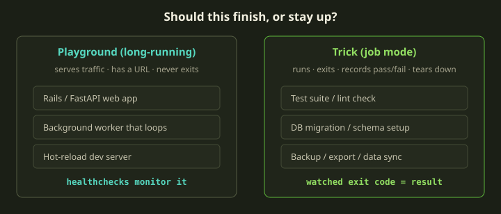
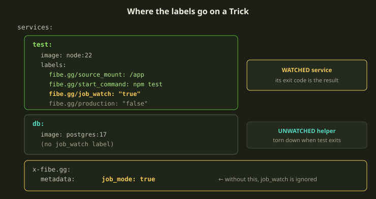
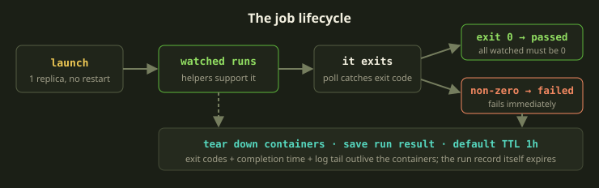
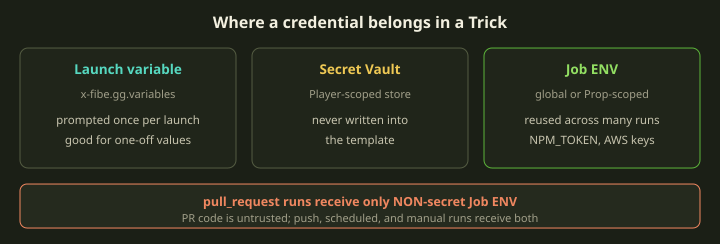

Most of your stacks are supposed to stay up. A web app, a worker, a dev server — you launch it, it serves, you keep it running. But a lot of the work you actually run against a project is the opposite shape: it should *start, do one thing, and stop*. Tests. A migration. A nightly backup. CI on a push. For that work, a long-running Playground is the wrong tool — it has no idea when it is finished, so it just sits there, holding resources, waiting for a URL that nobody is going to hit.

A **Trick** is Fibe's answer for the second shape. It is the same environment engine as a Playground — same Compose file, same Marquee, same logs and terminal — but Fibe treats it as one-shot: it runs the watched service to completion, records whether that service exited cleanly, tears the containers down, and keeps the result. This guide walks you through building one from scratch, with a real test-runner example, and explains the three things people get wrong the first time.

<!-- truncate -->

## When job mode is the right call

The decision is genuinely simple, and it is worth stating as a rule before anything else: **if the task should finish, it is a Trick. If it should stay up, it is a Playground.**



A Fibe template runs in one of four execution shapes, and the first two are the ones you'll reach for constantly:

| Shape | Marker | Lifecycle |
|---|---|---|
| Long-running HTTP | nothing — it's the default | Stays up, serves requests, healthchecks monitor it. |
| Job-mode (Trick) | `job_mode: true` + a watched service | Starts, runs, all watched services exit, tears down. |
| Scheduled job | Job-mode + `schedule_config` | Cron-driven launch of a job-mode template. |
| Triggered job | Job-mode + `trigger_config` | VCS event launches it (push or `pull_request`). |

Scheduled and triggered are just a Trick with one more block of metadata — same job underneath. So everything in this guide is the foundation for cron jobs and CI too.

The trap is wanting a "scheduled HTTP service." Fibe doesn't do that, and you shouldn't fight it: a long-running service serves continuously, a Trick exits when done. If you want periodic work behind an HTTP endpoint, run a long-running service that does the work internally, or run a Trick alongside it. Job mode means *exit when done* — it is not a way to keep a server warm.

:::tip
A Trick is plain Compose with one marker. `docker compose up` runs the very same file on your laptop for debugging. The only Fibe-specific piece is the watched-service label. If it passes locally, it passes as a Trick, because there is no second runtime to drift away from.
:::

## The two pieces that make a Trick

A job-mode template needs exactly two things, and missing either one is the single most common mistake:

1. `x-fibe.gg.metadata.job_mode: true` — this flags the *template* as a Trick.
2. `fibe.gg/job_watch: "true"` on at least one service — this is the **watched service**, the one whose exit code decides the result.



Here is the smallest useful Trick — a Node test runner that mounts a repo and runs `npm test`:

```yaml
services:
  test:
    image: node:22
    working_dir: /app
    labels:
      fibe.gg/repo_url: https://github.com/owner/repo
      fibe.gg/source_mount: /app
      fibe.gg/start_command: npm test
      fibe.gg/job_watch: "true"
      fibe.gg/production: "false"

x-fibe.gg:
  metadata:
    description: "Run npm test against the repo"
    category: "CI"
    job_mode: true
```

That's a complete, launchable Trick. The `test` service clones the repo into `/app`, runs `npm test`, and exits. The exit code becomes the result.

:::caution
Setting only one of the two markers is the classic failure. `fibe.gg/job_watch` *without* `job_mode: true` is silently ignored — the label does nothing and your template launches as a long-running Playground that never exits. And `job_mode: true` with no watched service is rejected at validation, **unless** a service is source-backed — source-backed services are watched by default in job mode, so a repo-connected service may still become the watcher. When in doubt, set both explicitly.
:::

## How completion is detected

This is the part that makes job mode feel different from a normal Compose run, so it's worth being precise.

Fibe polls the watched service until it finishes, then reads its exit code:

- Exit code `0` means that watched service **succeeded**.
- Any non-zero exit code means it **failed**.
- If you have several watched services, **all** of them must finish at `0` for the run to pass.
- If any watched service exits non-zero, the job result is failed **immediately** — Fibe doesn't wait for the others.



The word *exit* is load-bearing. The watched service must run a command that actually terminates. `npm test`, `pytest`, `bin/rails db:migrate`, `pg_dump` — these all exit. A dev server, a `sleep infinity`, a process supervisor, anything that watches-and-waits — these never exit, so the job never completes and just hangs until the lifetime limit reaps it. If you find yourself watching something that stays up, you wanted a Playground.

## Watched versus unwatched services

Real jobs need helpers — a database for the tests to talk to, a Redis for a queue, a migration step that runs first. Those are *unwatched*: they start, support the watched service, and get torn down with the job when the watched service exits.

```yaml
services:
  test:
    labels:
      fibe.gg/job_watch: "true"   # WATCHED — defines pass/fail
  db:
    image: postgres:17            # unwatched — supports the test
  cache:
    image: redis:8-alpine         # unwatched — supports the test
```

Only `test` defines success here. When it exits, `db` and `cache` are stopped. A helper should *not* carry `fibe.gg/job_watch: "true"` unless its own exit code is genuinely part of the result — otherwise you've just told Fibe to fail the run when Postgres shuts down.

The other piece you almost always need is ordering. If the test service starts before migrations have finished, you get a false failure. Use `depends_on` with the right conditions:

```yaml
services:
  test:
    labels:
      fibe.gg/job_watch: "true"
    depends_on:
      db:
        condition: service_healthy
      migrate:
        condition: service_completed_successfully
    command: pytest
  migrate:
    image: my-app
    command: bin/rails db:migrate
    restart: "no"
    depends_on:
      db:
        condition: service_healthy
  db:
    image: postgres:17
    healthcheck:
      test: ["CMD-SHELL", "pg_isready -U postgres"]
      interval: 5s
```

Note that `migrate` is **not** watched. It's a setup step that must complete before tests, but it isn't the thing whose result you care about — `service_completed_successfully` already gates the test on it. Only `test` carries the watch label.

## What Fibe enforces — so you don't write it

Job mode applies a set of one-shot defaults at launch. You don't write any of these, and if you do write the conflicting version, Fibe quietly overrides it:

- Every service is forced to **one replica** (`deploy.replicas: 1`). Replicas would multiply the work.
- Every service is forced to `restart: "no"`. A restart policy would fight the lifecycle — a service that's *supposed* to exit shouldn't be restarted for doing so.
- Routing and exposure labels are **stripped before launch** — `fibe.gg/port`, subdomain, expose, and Traefik routing labels all go. A Trick is not user-facing, so it never gets a URL.

That last point catches people: leaving `fibe.gg/port` on a job service isn't an error, but it does nothing, and `container_name:`, `ports:`, or `restart: always` are silently overridden. Remove them for clarity — a clean Trick template reads as exactly what it is.

If you want to be sure before you launch, validate specifically as a Trick:

```bash
fibe schema compose validate \
  --target-type trick \
  --job-mode \
  --file compose.yml
```

## The result you get back

The containers don't outlive the run — but the **result does**, and that is the whole point of job mode. When the watched service exits, Fibe saves a run result containing:

- the per-service **exit code**,
- the **completion time**,
- and a **log tail** of each watched service (the last 5,000 lines).

That saved result is how you inspect a run *after* the runtime containers are gone. A terminal run status just means the lifecycle finished; it's the saved exit codes that tell you whether the Trick actually passed or failed. You'll find runs in the run history inside Fibe — list past runs and filter by the template's Playspec.

One honest limitation to plan around: Fibe does **not** post commit status checks back to GitHub or Gitea. The result lives in Fibe's run history, not as a green check on your PR. If you need that, you'll wire it up yourself from the run record.

That saved run result is also why you should **not attach a Genie inside a job-mode template**. The Trick runs on its own; a Genie isn't part of the watched service and doesn't belong in the one-shot container set. (You *can* point a Genie at a finished Trick's logs to debug it, and for triggered Tricks you can name a Genie in the trigger settings to receive failure logs automatically — but that's configured around the Trick, not baked into it.)

## Lifetime and cleanup

A job Playground has a **shorter default lifetime** than a long-running one — currently **1 hour** — and this is independent of completion. Keep the two ideas separate:

- **Completion** is event-driven: a job *succeeds* the moment all watched services exit `0`, and *fails* the moment any watched service exits non-zero. This usually happens in seconds or minutes.
- **The 1-hour TTL** is cleanup safety. It's the backstop that reaps the run record (and the saved result with it) so old jobs don't pile up. It is not a runtime budget you're meant to lean on.

There's also a hard ceiling: a Trick has a maximum runtime of about **4 hours**. If the watched service hasn't exited by then, the run is marked as an **error (timed out)** — note, *error*, not *failed* — the containers are torn down, and for a timeout the container logs are not collected. Don't rely on the timeout as a stopping mechanism; if a test runner can hang, wrap the command in a `timeout` so *you* control the upper bound rather than discovering it at the 4-hour mark.

| Outcome | What it means | Logs saved? |
|---|---|---|
| Passed | all watched services exited `0` | yes — watched-service log tail |
| Failed | a watched service exited non-zero | yes — watched-service log tail |
| Error (timed out) | watched service never exited within ~4h | no — container logs not collected |

## Credentials: Job ENV, not the template

Tricks frequently need secrets the launcher shouldn't have to type every time — an `NPM_TOKEN` to install private packages, AWS keys for a backup, a deploy token. You have three homes for a credential, and for *reused* secrets the right one is **Job ENV**.



Job ENV entries are launcher-level env vars injected into the run at runtime, in two scopes:

- **Global Job ENV** — applies to every one of your jobs.
- **Prop-scoped Job ENV** — applies only when the job is tied to that repository (Prop).

Nothing secret ends up in the template. A backup job, for example, declares no AWS credentials at all — you create `AWS_ACCESS_KEY_ID` and `AWS_SECRET_ACCESS_KEY` as secret Job ENV entries and they're injected directly:

```yaml
services:
  backup:
    image: postgres:17
    environment:
      PGHOST: db.prod.internal
      PGUSER: backup_role
    command: >
      pg_dump --no-owner | gzip | aws s3 cp - s3://my-backups/db.gz
    labels:
      fibe.gg/job_watch: "true"

x-fibe.gg:
  metadata:
    job_mode: true
    description: "Nightly database backup to S3"
    category: "Operations"
```

:::caution
Entries marked **secret** are *not* injected into runs triggered by a `pull_request` event — PR code is untrusted, and a secret in scope of an attacker-authored PR is a leak waiting to happen. Secret Job ENV is available on push-triggered, scheduled, and manual runs. If a PR test genuinely needs a credential, it must come from a non-secret entry or the template itself — and you should understand that exposure before you do it.
:::

Besides your own entries, every run also gets **built-in run-context variables** describing the run — repository URL, owner and name, branch, commit SHA, the trigger event, and ids for the Prop, Template, and run. Source-backed service checkout paths are available to Compose interpolation as well. Reach for those rather than hardcoding anything about the run into the template.

## A worked example: Node tests against Postgres

Putting it together — here's a Trick you could run today. It caches `node_modules` between runs, waits for the database to be healthy, and runs the suite. The `test` service is watched; `db` is not.

```yaml
services:
  test:
    image: node:22
    working_dir: /app
    volumes:
      - app_node_modules:/app/node_modules
    environment:
      NODE_ENV: test
      DATABASE_URL: "postgres://test:test@db:5432/test"
    depends_on:
      db:
        condition: service_healthy
    labels:
      fibe.gg/repo_url: https://github.com/owner/repo
      fibe.gg/branch: main
      fibe.gg/source_mount: /app
      fibe.gg/start_command: sh -c "npm ci && npm test"
      fibe.gg/job_watch: "true"
      fibe.gg/production: "false"

  db:
    image: postgres:17-alpine
    environment:
      POSTGRES_USER: test
      POSTGRES_PASSWORD: test
      POSTGRES_DB: test
    healthcheck:
      test: ["CMD-SHELL", "pg_isready -U test"]
      interval: 5s
      timeout: 5s
      retries: 10
      start_period: 30s

volumes:
  app_node_modules:

x-fibe.gg:
  metadata:
    description: "Run npm test on every push"
    category: "CI"
    job_mode: true
```

Launch it, and the lifecycle plays out exactly as the pipeline diagram shows: `db` comes up and reports healthy; `test` waits on it, runs `npm ci && npm test`, and exits. If the suite passes, `test` exits `0`, the run is **passed**, and `db` is torn down. If a test fails, `test` exits non-zero, the run is **failed immediately**, and you have the exit code plus the test output's log tail waiting in the run history.

The named `app_node_modules` volume persists across runs on this Marquee, so the second run skips most of the install. If setup time is dominated by package downloads or image pulls, fix *that* with caching and pinned images — don't paper over it by raising the timeout, which only hides cold-start cost behind a bigger number.

### Before and after

The clearest way to see what job mode buys you is to compare the same intent expressed two ways. On the left, someone tried to run tests as a long-running service. On the right, the Trick.

```yaml
# BEFORE — runs forever, no result, holds a Playground open
services:
  test:
    image: node:22
    labels:
      fibe.gg/port: "3000"          # pointless for a test run
      fibe.gg/start_command: npm run test:watch   # never exits!
# (no x-fibe.gg.metadata.job_mode — so it's a Playground)
```

```yaml
# AFTER — runs once, exits, records pass/fail, cleans up
services:
  test:
    image: node:22
    labels:
      fibe.gg/source_mount: /app
      fibe.gg/start_command: npm test   # exits when done
      fibe.gg/job_watch: "true"
x-fibe.gg:
  metadata:
    job_mode: true
```

The "before" version runs `test:watch`, which never returns, on a Playground that has no notion of done — it just keeps a slot open and a `fibe.gg/port` label that creates a URL nobody wants. The "after" version is a Trick: `npm test` exits, the watch label captures the exit code, and `job_mode: true` flips on the whole one-shot lifecycle.

## Rules of thumb

- **Should it finish? Trick. Should it stay up? Playground.** That single question decides everything else.
- **Set both markers.** `job_mode: true` in metadata *and* `fibe.gg/job_watch: "true"` on a service. One without the other is the most common bug.
- **Watch the thing whose exit code you care about** — usually one service. Don't watch helpers (databases, caches); they get torn down for free.
- **The watched command must exit.** No dev servers, no `sleep`, no supervisors. If it can hang, wrap it in `timeout`.
- **Order with `depends_on`.** Gate the test on `service_healthy` for the DB and `service_completed_successfully` for migrations to avoid false failures.
- **Don't reach for routing.** `fibe.gg/port`, `ports:`, `restart:`, `container_name:` are stripped or overridden in job mode — remove them so the template reads honestly.
- **Reused secrets go in Job ENV**, not the template — and remember that secret Job ENV is withheld from `pull_request` runs.
- **No Genie inside the Trick.** Debug a finished run's logs with a Genie if you like, but keep it out of the watched service set.
- **Completion and TTL are different things.** The job ends the instant the watched service exits; the 1-hour lifetime is just cleanup safety, with a ~4-hour hard ceiling that shows up as an *error*, not a failure.
