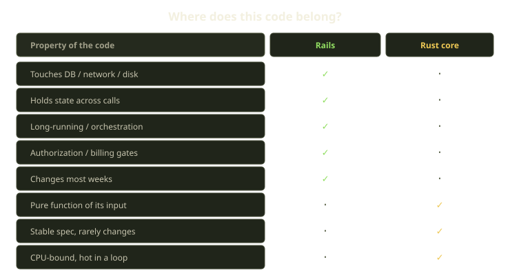
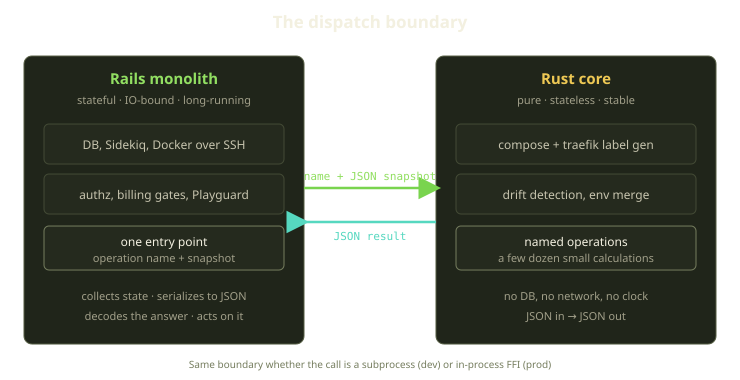
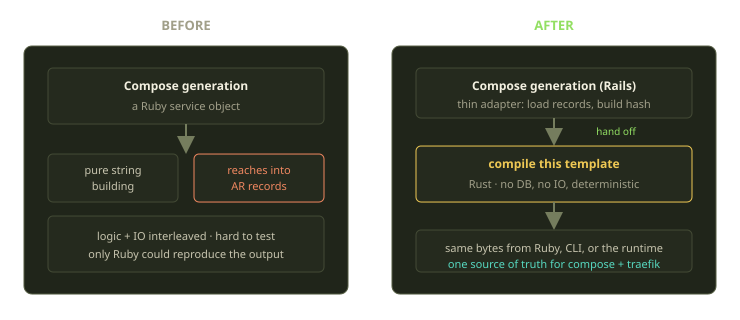

Fibe has been a Rails monolith since the first commit, and after a couple of years running a Docker-based dev-environment platform on it, we still think that was the right call. So when a small Rust workspace showed up in the repo, the obvious question — including from across the team — was some flavor of "oh no, are we rewriting in Rust?"

No. We extracted a very specific, very boring slice of the codebase into Rust, behind a rule we can state in one sentence. This post is that rule, why it works, and the genuinely annoying parts.

<!-- truncate -->

## The rule

> **Rails owns the unstable, the IO-bound, the long-running, and the stateful. Rust owns pure functions, stateless, stable logic.**

That's the whole thing; everything below is consequences of taking it seriously.

It sounds too simple to be a real boundary, and for a long time we didn't need it — Rails was happy being all of those things at once. What changed is that a handful of pieces of our codebase quietly drifted into a corner where they were *pure logic that several runtimes needed to agree on*. Those became the candidates. Nothing else did.

If code touches the database, holds state between calls, orchestrates a long workflow, or enforces an authorization or billing gate — it stays in Rails, full stop. Force any of that into a stateless helper and you end up reinventing ActiveRecord badly in a language that resists it. But if code is a pure function of its input — same input, same output, no clock, no network, no DB — and its *specification* is stable, it's a candidate. Compose-file generation. Traefik label generation. Drift detection. Env-file merging. These don't change with who's logged in or what's in the database; they change when the *format* changes, and the format barely changes.

## What actually moved

The Rust core is not a framework or a service. It's a small workspace that compiles to a command-line binary plus a C ABI, with a tiny dispatcher inside: every computation is one named operation with a stable dotted name, JSON in, JSON out, and a lookup that maps names to handlers. There are a few dozen of these named operations today, each one a small, self-contained calculation.

They group into a handful of areas, and each area earned its way out of Rails for the same reason — it had become pure, stable logic that more than one runtime needed to agree on:

| Area | What it holds | Example operations |
|---|---|---|
| Compose | Compose parsing, label generation, schema validation, templates, Traefik helpers | compile a template, build Traefik labels |
| Playground | Drift detection and health-check pure logic | detect drift, evaluate health |
| Diff | Hunk-diff parsing, template-version switch diffs | parse hunks, diff template versions |
| Env | `.env` content parsing and merging | parse content, merge globals |
| Remote | Shell/git/rsync **command-string builders** (not runners) | build an rsync command, build a git-clone command |
| Validate | Pure input validators | validate a Marquee domain, validate a repo URL |
| Auth | API-key token *shape*, scope expansion, header parsing | expand the scopes on an API key |

The Remote area is the rule at its sharpest. Building the string `rsync -az --delete src host:dest` is a pure function; *running* it over SSH against a Marquee is IO — it can hang, fail halfway, needs retries and timeouts. So the builder lives in Rust and the runner stays in Rails. The boundary cuts right down the middle of what looks, from a distance, like "the rsync feature." Auth splits the same way: expanding a coarse API-key scope into the concrete resource/action pairs it grants is a lookup table that moved to Rust, while BCrypt hashing and the is-this-request-allowed decision against the database stay in Rails.

## How Rails actually calls in

The Ruby side is a small library with one entry point: you hand it the name of an operation and a single hash of inputs, and it returns the result. A drift-detection call, for example, names the "detect drift" operation and passes a snapshot of everything the decision depends on — the Playground's current status, whether it's in job mode, the live Docker state, the reasons it looks unhealthy, and whether a recreation has already been flagged — all bundled into one argument.

The division of labor in that one call is the whole point. Ruby does the messy part — inspect the live Docker state on the Marquee, collect container health, handle inspection failing entirely — then hands a *serialized snapshot* to Rust, which decides whether the Playground has drifted, why, and what Playguard should do: roll the environment forward, tear it down, or leave it alone. The decision is pure; gathering the facts is not.

Under that single entry point are two backends, picked by one environment variable:

- **Subprocess** (the default, including in tests and local dev). Each call is an independent `fork + exec` of the Rust binary, piping JSON over stdin and reading JSON back from stdout. Roughly **3–5 ms** per call.
- **FFI** (production opt-in). The same Rust code, compiled to a `cdylib` with a stable C ABI, called in-process through Ruby's Fiddle. No fork, no exec.

The subprocess default is deliberate, not a fallback we're embarrassed about. Because every call re-execs the binary, a freshly rebuilt binary is picked up *immediately*: you edit Rust, rebuild, and the next request runs the new code, no restart. That hot-swap is worth a few milliseconds in dev and tests; on a Marquee, where some of this runs in tight reconciliation loops, you flip to FFI and the fork cost disappears. It's the test default on purpose, too: if the Rust code is the source of truth, specs should exercise it, not a Ruby twin that could drift.

Errors cross the boundary as a structured envelope, not exit-code roulette: the Rust side returns JSON that carries an error flag and an error *kind* — an unknown operation, a bad input, a failure while generating output, a transport problem, or a catch-all. Ruby maps each kind to its own typed exception, so callers rescue what they care about instead of pattern-matching on stderr.

## Why determinism is the whole point

If you only remember one thing from this post: **we didn't do this for speed.** Rust is faster at parsing YAML and building strings, sure, but a Rails request that talks to Postgres and SSHes into a Docker host doesn't live or die on whether label generation took 0.2 ms or 4 ms. The real reason is that **the same compose and Traefik output now has exactly one definition**, and more than one runtime has to agree on it.

Compose generation used to live in a Ruby service object that — like most long-lived service objects — had started reaching into the database mid-computation, interleaving string-building with data-loading. Reproducing the exact bytes a Playground would get meant booting Rails, setting up records, and running the service: fine while Rails was the only thing generating compose, not fine the moment anything else had to. Now the pure part is a single "compile this template" operation — feed it a template and a hash of variables and you get the same bytes every time, from the Rails request, from the command-line binary, or from the runtime — and the Ruby service shrank to a thin adapter: load records, build a hash, hand it across the boundary.

Compose and Traefik labels are the *contract* between Rails and the runtime, so that single definition matters. Let two systems each keep their own copy of byte-identical logic and you get a miserable bug: it passes tests, works in the app, then one environment routes wrong because a label came out a hair off. One copy makes that impossible.

:::tip
Smell test: if you'd write a property test asserting *output is identical across every caller*, it belongs in Rust. If that's incoherent because the output depends on the database or the current user, it belongs in Rails.
:::

## The trade-offs (this part is not free)

This was not a clean win. Here's the honest ledger.

**Build and deploy got more complex.** Our Rails Docker image now compiles Rust into *both* the command-line binary and the shared library — a toolchain we didn't used to need (we pin Rust 1.86), longer builds, a cross-build story for Linux artifacts. For a team whose mental model was "it's just Ruby," that taxes every deploy.

**Two languages, two test suites, one behavior.** Each Rust module carries its own unit, integration, and dispatch-level tests; Rails keeps companion specs in the Packwerk tree. We chose *not* to adopt property-based tests during the wire-up — the gap we'd most like to close, since for logic whose whole value is "deterministic and identical everywhere" they're the obvious fit. We left them on the table to ship.

**The boundary is a CLI/FFI seam, not a function call.** Crossing into Rust means serializing to JSON and back, so it has to be *coarse*: hand over a snapshot and get an answer, not a thousand tiny calls in a loop. The drift-detection operation takes the whole Docker-state payload in one shot for that reason.

**Choosing the seam was the hard part.** Rather than pick subprocess or FFI we kept both behind an env var — a small maintenance burden, but dev ergonomics and prod performance stop fighting:

| | Subprocess | FFI |
|---|---|---|
| Per-call cost | ~3–5 ms (fork+exec) | in-process, no fork |
| Picks up rebuilt code | immediately | needs reload |
| Failure isolation | separate process | shares the Ruby process |
| Where we use it | dev, tests | production Marquees |

## What we learned

**This was never about Rust as a language** — it was about finding the pieces of a Rails app that had quietly become *contracts* and giving them a home with one definition. The win is the boundary, not the binary. A few things we'd tell our past selves:

- **Lead with the rule, not the rewrite.** "Rails owns unstable/IO/stateful, Rust owns pure/stateless/stable" stopped a hundred bikeshed arguments cold.
- **Resist scope creep into the core.** The temptation to move "just a little IO" into Rust because it's *near* the pure logic is constant. The builders-not-runners split — Rust assembles the command string, Rails runs it — holds the line.
- **Keep the boundary coarse and typed.** JSON in, JSON out, structured errors with a `kind`. Snapshots, not chatter.

We still write Rails for almost everything, because almost everything we do is unstable, IO-bound, long-running, or stateful — which is to say, it's a *product*. The Rust core is small and we want it to stay small. It's not a stepping stone to a bigger rewrite; small *is* the design.
