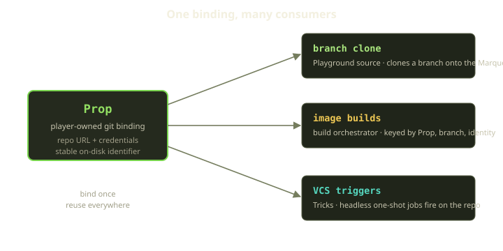
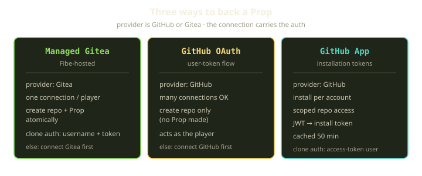
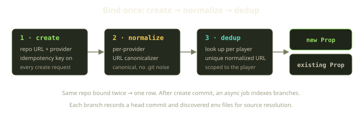

Early on, Fibe passed repository URLs around like loose change. A Playground needed source, so it took a URL. An image build took a URL — and a token, and a branch, and a guess about which provider this was and how to authenticate. Every place that touched a Git repo re-derived the same three or four facts, and every place got to be wrong in its own way.

So we stopped. A repo became a resource you bind once and reuse: a **Prop**. Clone it for a Playground, build an image from it, fire a headless Trick when it changes — all from the same binding, with auth resolved in one place. Here's why that's a real model, not just a wrapper around a string.

<!-- truncate -->

## What a Prop actually is

A Prop is a player-owned binding to a Git repository: a repo registered to a Player and used as a source of code, templates, and knowledge graphs. Register a repo once, and every part of the platform that needs source or builds refers to *the Prop*, not a loose URL.

A Prop carries the things every consumer would otherwise figure out for itself:

- The repository location, stored in canonical, normalized form (capped at a couple of thousand characters).
- The provider, which is either GitHub or Gitea.
- A status, which is one of a small set of states — active, disabled, or errored.
- The default branch, plus indexed metadata for every branch.
- Encrypted credentials, when the repo is private.

Two design choices matter. First, those credentials are encrypted at rest and size-capped (anything over 64 KB is rejected) — secrets live with the binding, not scattered through the call sites that clone. Second, uniqueness is enforced on the *normalized* URL per player, so you can't bind two Props to the same repo — the part that makes "bind once" true. More below.

One more quiet detail: each Prop has a stable on-disk identifier built from the org, the repo name, and the Prop's own id. Because the id anchors it, the on-disk path on a Marquee doesn't churn when someone renames the repo upstream.

## Three ways to back a Prop

The provider is only GitHub or Gitea, but there are three connection shapes behind it. The link to an external provider lives in a separate, player-owned connection record that holds an encrypted access token. Keeping the *connection* separate from the *Prop* lets one connection back many Props.

### Managed Gitea (Fibe-hosted)

The batteries-included path. Fibe hosts the Git server, so there's nothing to set up on GitHub's side. A player gets exactly **one** Gitea connection — non-GitHub providers are unique per player — holding the token that authenticates clones with a username-and-token pair.

The nice part is the create flow. Through the managed Gitea endpoint, Fibe makes the repo *and* the Prop in one database transaction: the Prop is persisted and ownership is recorded for the current player, and either both land or neither does. One call, one atomic result: a repo that exists and a Prop that points at it. With no Gitea connection yet, you get a clean error telling you to connect Gitea first.

### GitHub OAuth

The user-token flow. You connect your GitHub account, and Fibe acts as you. Unlike Gitea, a player can have **many** GitHub connections.

One asymmetry trips people up: the GitHub OAuth repo-create endpoint creates the **repo only**, not a Prop — you bind that as a separate step. Gitea makes both; OAuth makes one. If you haven't connected GitHub, the endpoint answers with an error telling you to connect GitHub first.

### GitHub App

The installation-token flow, for when access should be scoped rather than "everything this user can see." You install the Fibe GitHub App on an account or org, and Fibe mints short-lived **installation tokens** for the repos it reaches.

Mechanically: Fibe signs an RS256 JWT with the app's private key (10-minute expiry), exchanges it for an installation access token, and caches that for 50 minutes. Clones authenticate with a special access-token username. A small token endpoint resolves the right installation for a given repo and returns a token along with its 50-minute time-to-live; a repo with no matching install gets a clear "no installation found" error.

:::note
The OAuth-vs-App distinction lives in the connection, not the Prop: a GitHub App connection records an installation, an OAuth connection doesn't. Same provider, different auth path.
:::

All of this converges on clone-time auth precedence. To clone a Prop, the resolver walks a fixed order: stored credentials first; then, by provider, a Gitea token (as a username-and-token pair) or a GitHub App installation token (as an access-token username); finally a plain public URL. That logic lives on the Prop, so every consumer inherits it.

## Create, normalize, dedup

This is what makes "the same repo, bound once" hold up — because people paste the same repo three different ways.

When a Prop is created, the URL is normalized *before* it's saved — and *before* uniqueness is checked. A per-provider normalizer collapses cosmetic variants — a trailing `.git`, `https` versus the SSH-style form, a stray slash — into one canonical form. Uniqueness is then checked against that canonical URL, scoped to the player. Same repo, bound twice, one row.

The repo-create endpoints are idempotent: each one runs under an idempotency key, and the Gitea path looks for an existing Prop — among the ones the current player can access, matching the normalized URL — before making a new one, returning it if found. Retry the same create — flaky network, double-click, an over-eager client — and you get the *same* Prop back, not a duplicate. One more guard: a private repo can't be bound naked. Validation requires a secret (stored credentials, an installation token, or a Gitea token), so you don't get a Prop guaranteed to fail at clone time.

After the create commits, a background job kicks off branch indexing. It records each branch as its own row — a name, its head commit, and the env files found on it. (Against GitHub it retries on rate limits, honoring the provider's `retry-after`, and flips the Prop into its error state if it can't index.) That index lets a later clone or build resolve a branch and its source layout without re-hitting the provider.

## How a Prop feeds the platform

The payoff: three subsystems consume the same binding, none knowing how the others authenticate.

| Consumer | What it uses the Prop for | Key detail |
|---|---|---|
| Playground creation | Source for a branch clone | Clones a branch onto the Marquee under the Prop's stable on-disk identifier |
| Image builds | Source for the build | Build keyed by Prop, branch, and build identity so identical inputs dedup |
| Tricks | VCS trigger source | A headless one-shot job fires against the bound repo |

**Branch clone.** When a Playground spins up, services clone the relevant branch using the Prop's authenticated clone URL — so the precedence logic above runs. The Playground doesn't think about tokens; it asks the Prop to be cloneable.

**Image builds.** The orchestrator resolves each service to its Prop, then computes a build key from three parts: the Prop, the branch, and a build identity. That key is the dedup boundary. Two services on the same Prop, branch, and build identity collapse to a single build — the orchestrator skips the second. Resolution is scoped so a player sees only their own Props plus any system mirror.

**VCS triggers for Tricks.** A Trick is a headless, one-shot Playground — it runs in a job mode rather than as a long-lived environment. Because the Prop is a real resource with known provider and auth, a Trick can fire from VCS activity on the bound repo without re-establishing that context.

Each consumer gets source resolution, auth, branch metadata, and a stable on-disk identity *for free*, because those live on the binding — the whole argument for a first-class Prop.

## The lifecycle — and the non-edge that matters most

A Prop has a small state machine — active, disabled, and errored — with deliberately narrow transitions. From active you can go to disabled or to errored. From disabled you can only go back to active. From errored you can only go back to active. Every other move is rejected.

Those transitions are guarded, not advisory. Disabling raises unless the Prop is currently active; marking it errored refuses to fire on a disabled one. You can't error a Prop you've turned off, or disable one twice. The allowed moves *are* the contract — there's no path that quietly slips through. And the part worth tattooing on the back of your hand:

:::warning
Disabling a Prop does **not** stop already-running Playgrounds. Disabling is a pure status flip — it only writes the new state — with no callback that reaches compute. Running Playgrounds, in-flight builds, and active CI keep going. Disable means "don't start new work from this binding," not "tear down what's using it."
:::

We get asked this a lot — *"I disabled the Prop, why is my Playground still up?"* Disable is intentionally soft. Coupling a metadata flag to live teardown would make a single mis-click catastrophic and entangle two concerns that should stay separate: *can I start new work from this repo* versus *what's already running*. Stopping a Playground is its own operation.

Delete is where Fibe gets strict, because it's destructive and irreversible. A Prop refuses to be destroyed while a Playspec still references it — the delete is guarded up front, and if the Prop isn't safe to remove it surfaces an error and aborts before anything is touched. You can't pull the source out from under a template pointing at it.

Once a Prop *is* free to go, the cascade is intentional — each kind of dependent data gets the treatment it deserves:

- Indexed branch records are pure derived data, so they're dropped in bulk, fast, with no per-row ceremony.
- Build records and other derived runtime data are torn down through their own cleanup, so each one's teardown logic still runs.
- Job ENV entries outlive the binding, so they aren't deleted at all — they're simply unhooked from the Prop.

Bulk-drop versus full teardown versus unhook is a per-relationship decision — throwaway data, data that needs its own cleanup, or data that should survive the parent — and getting it right is most of what makes deletion feel safe.

## What we learned

The shift from "URL plus a bag of context" to "a named binding" looks small and is large in practice. Almost any platform's first version passes identifiers around as strings, and it works right up until the same identifier needs auth, normalization, an index, a lifecycle, and three consumers — at which point the string starts lying to you and the bugs all rhyme.

Making the binding a resource forced every one of those concerns into a single, testable place. The most valuable thing we did was *resist* coupling: keeping the connection separate from the Prop, and `disable` decoupled from teardown. The boring decisions — normalize before you dedup, pick the right cascade per association, make create idempotent — are what made it solid.

Bind your repo once. Let everything else just ask the Prop.
