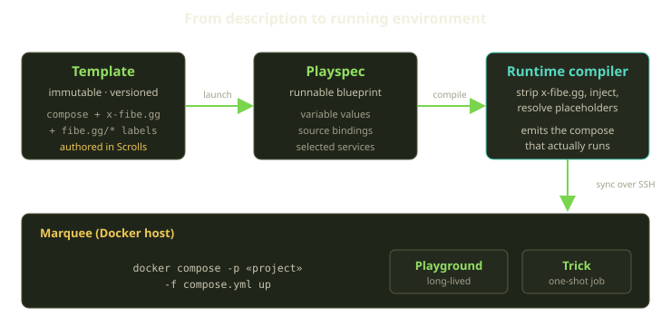
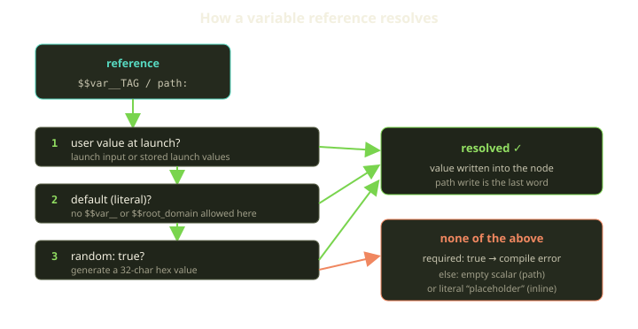
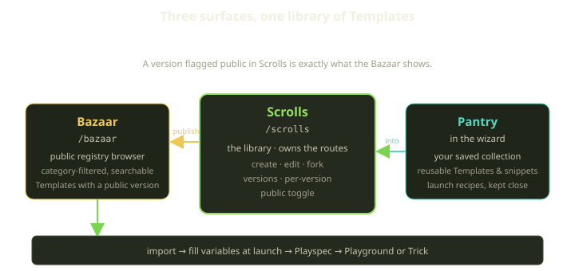

Every Fibe environment starts as a description before it is ever a running thing. Long before a container exists on a Marquee, before Traefik knows a subdomain, before the wallet is even checked — there is a document that says *what this environment is*. That document is a Template, and the way Fibe treats it tells you a lot about the platform's whole personality: declarative, versioned, shareable, and unforgiving about typos.

This post is about the authoring layer — what you touch when you decide what an environment should be, not how it gets healed at 3am. We'll walk from a Template to a Playspec to the Bazaar, with stops at variables, the `fibe.gg/*` config keys, and why unknown keys and unresolved `${...}` placeholders hard-fail.

<!-- truncate -->

## Three nouns, one job

Three things are in play here, and people mix them up constantly, so let's be precise.

A **Template** is an immutable, versioned definition of an environment. Think of it like a tagged release: once a version is cut, it doesn't change underneath you — you publish a new one, but you can't rewrite history.

A **Playspec** is the runnable blueprint — the compose-shaped spec that a Playground (a long-lived environment) or a Trick (a headless one-shot job) instantiates. If the Template is the cookbook recipe, the Playspec is the recipe card you carry to the stove, substitutions in the margins.

The **Bazaar** is the public marketplace: a searchable catalogue of importable Templates with at least one public version. It's where you *start from* something instead of a blank file.



The split exists because different things change at different rates: a Template version is stable (so "import my teammate's setup" means the same thing tomorrow as today), while a Playspec is mutable and personal — your variable values, source bindings, chosen services. Three layers, each owning one concern.

## The shape of a Template

A Fibe Template is, at heart, a Docker Compose file with a Fibe-specific dialect on top. If you can write `docker-compose.yml`, you're 80% of the way there. The remaining 20% is two namespaces:

- `x-fibe.gg:` — a top-level extension block where you declare metadata and **variables**.
- `fibe.gg/*` labels — per-service labels that tell the platform how to route, scale, and supervise.

Here's a small but real-shaped Template:

```yaml
services:
  web:
    image: ghcr.io/acme/app:$$var__TAG
    environment:
      PUBLIC_URL: https://app.example.com
    deploy:
      replicas: 2
    labels:
      fibe.gg/port: 3000
      fibe.gg/visibility: external
      fibe.gg/subdomain: app
      fibe.gg/healthcheck_path: /up

x-fibe.gg:
  variables:
    TAG:
      name: "Image tag"
      required: true
      default: latest
    SUBDOMAIN:
      name: "Subdomain"
      default: app
      path: services.web.labels.fibe.gg/subdomain
```

Two things are worth noticing. The `environment:` and `replicas:` values are valid Compose — run this file with `docker compose up` and you get something sensible. That's deliberate: a Template has *local parity*. And the Fibe-specific behavior lives entirely in labels and the `x-fibe.gg` block, so the platform reads intent without a separate format.

The compose that actually runs is generated, not hand-written: the runtime strips the `x-fibe.gg` and `playgrounds` keys, injects environment, build config, ports, TLS, volumes, and labels, then syncs to the host. Authoring document and running document are deliberately different artifacts.

## Variables: declare, then reference

A Template that can't be parameterized is a snowflake. The mechanics are small enough to hold in your head: you **declare** a variable under `x-fibe.gg.variables.<NAME>` and **reference** it one of two ways.

1. **Whole-node binding** via `path:` or `paths:` — the primary mechanism, replacing an entire YAML node at a dotted path. Use it for label values, env scalars, replica counts, public URLs — anything where the variable *is* the whole value.
2. **Inline fragment** via `$$var__NAME` — plain-text substitution before the YAML is reparsed. Use it only when the variable is *part* of a larger string, like an image tag inside `registry/app:$$var__TAG`.

Each declaration carries a few fields with precise compile-time effects:

| Field | What it does |
|---|---|
| `name` | Human label for the launch UI. If it's empty, the compile fails and names the offending variable. |
| `required: true` | If there's no user value, no `default`, and no `random`, the compile fails and tells you which variable is required. |
| `default` | Used when the launcher omits a value. Must be a literal — no `$$var__*` or `$$root_domain` inside defaults. |
| `random: true` | If no value is supplied, generates a stable 32-character hex string. Great for secrets and per-launch tokens. |
| `validation: "/regex/"` | Must be empty or wrapped in `/.../`. The compile fails on a value that doesn't match the pattern. |
| `path` / `paths` | Whole-node replacement at the named dotted path(s), applied after inline substitution. |

The resolution order is deterministic, which kills a whole class of "why did I get *that* value" confusion:

1. User-supplied value (from launch input or stored launch values)
2. `default` (if non-empty)
3. `random: true` generated value
4. If none of the above and `required: true` → compile error
5. Otherwise: empty string for a `path` binding, or the literal text `placeholder` for an inline `$$var__` reference



One subtlety that bites people: write the same variable both inline *and* with a `path`, and interpolation runs `$$var__` first (on raw text), then `path`/`paths` into the parsed nodes — so the path always wins.

:::tip
For a value that must be unique per launch and never typed by a human — a database password, a JWT secret — reach for `random: true`. The 32 hex characters are generated before the `required` check runs, so `required` and `random` together never error on missing input. Bind it with `paths:` and the same value lands in every service in one compile pass.
:::

There's also `$$root_domain`, an inline-only token *not* declared in `variables`, replaced at compile time with the launching Marquee's root domain (something like `next.fibe.live`) for the rare case where you need a fully-qualified public host inline. Most of the time, prefer an explicit public-URL variable with a literal default — a value a human can read.

## The `fibe.gg/*` keys, and why unknown ones hard-fail

The labels are where a Template stops being generic Compose and becomes a Fibe environment. A service with `fibe.gg/port: 3000` and `fibe.gg/visibility: external` gets a routed, TLS-terminated public subdomain. Add `fibe.gg/zerodowntime: "true"` for rolling-update semantics — which then *requires* `fibe.gg/port` and *forbids* a `container_name:`, since rolling replicas and fixed names don't mix.

This is a real DSL with real co-conditions. And here's the design decision we want to defend: **an unknown `fibe.gg/*` key is a hard error, not a warning.**

```yaml
services:
  web:
    labels:
      fibe.gg/subdmain: app   # typo -> compile fails, loudly
```

That typo doesn't route to a default — it fails the compile early, by name. The temptation in every config system is to ignore what you don't recognize, but permissiveness has the worst failure mode: the environment comes up *looking* fine, the subdomain quietly wrong, and you lose forty minutes before spotting the swapped `d` and `m`. A loud failure costs four seconds. The same strictness shows up elsewhere — declare a variable and never reference it, and the compile flags it as unused; reference a `$$var__NAME` you never declared, and the compile flags it as undeclared. Dead config and dangling references are both treated as mistakes, not as harmless noise.

The same gate guards the back end of the pipeline. **A compose file with an unresolved `${...}` is never synced to a host.** The compile validates that every placeholder resolved before the file leaves the platform, and the self-healing reconciler refuses to regenerate one that still carries a `${...}`, surfacing a clear "unresolved placeholders" failure rather than writing a landmine to the Marquee. The placeholders that *do* resolve are a small, fixed set of Playground- and service-scoped tokens — none of them exposes your source's on-host clone path, so a Template can't reach into the host filesystem.

## Job mode: when the Template is a one-shot

Not every environment is meant to live. A Trick is a headless, one-shot Playground — a migration, a test suite, a maintenance script. You signal a job-shaped Template with `x-fibe.gg.metadata.job_mode: true` plus at least one service marked `fibe.gg/job_watch: "true"`, and the runtime applies one-shot overrides.

```yaml
services:
  migrate:
    image: myapp:latest
    command: bin/rails db:migrate
    labels:
      fibe.gg/job_watch: "true"
      fibe.gg/production: "false"

x-fibe.gg:
  metadata:
    job_mode: true
```

- `restart: "no"` on every service
- `deploy.replicas: 1` on every service
- the run is **complete** when all watched services exit `0`
- **teardown** of every service once the watched ones finish

It also strips the routing labels — `fibe.gg/port`, `fibe.gg/visibility`, `fibe.gg/subdomain`, and any `traefik.*` — because a job that runs and dies has no business holding a subdomain.

:::warning
The most common job-mode footgun: a watched service with a long-running command. If your `fibe.gg/job_watch` service runs a dev server or anything in watch mode, it never exits `0`, so the job never completes and never tears down. Watched services must *finish*.
:::

## The Bazaar, the Pantry, and Scrolls

A shareable Template is only as useful as your ability to find one. Three product surfaces, easy to confuse — here's the map.



| Surface | What it is | Where it lives |
|---|---|---|
| **Bazaar** | Public, searchable registry of importable Templates with a public version | `/bazaar` |
| **Scrolls** | The library — your Templates, versions, editing, forking, publishing | `/scrolls` |
| **Pantry** | Onboarding-introduced personal collection of saved Templates & snippets | the wizard |

The Bazaar is read-only — it shows Templates with **at least one public version**, and "publishing to the Bazaar" is really just flipping a version's public flag inside Scrolls, which owns all the editing (the old `/library` redirects to it). The Pantry is the friendly front door: the onboarding wizard's "Fill up the Pantry" is the consumer-grade entry to it all.

Two ideas carry the whole authoring layer: **different things change at different rates, so they're different nouns** (immutable Templates, mutable Playspecs, ephemeral generated compose), and **strictness is kindness** — every unknown key or dangling placeholder that hard-fails trades four seconds now for forty minutes later, all while a Template stays real, runnable Compose. The variable mechanics — `path` versus inline, resolution order, random secrets, validation regexes — are where the day-to-day authoring power lives. Author once, version it correctly, and let the compiler catch the rest.
