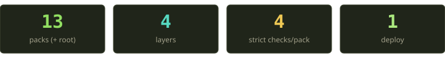
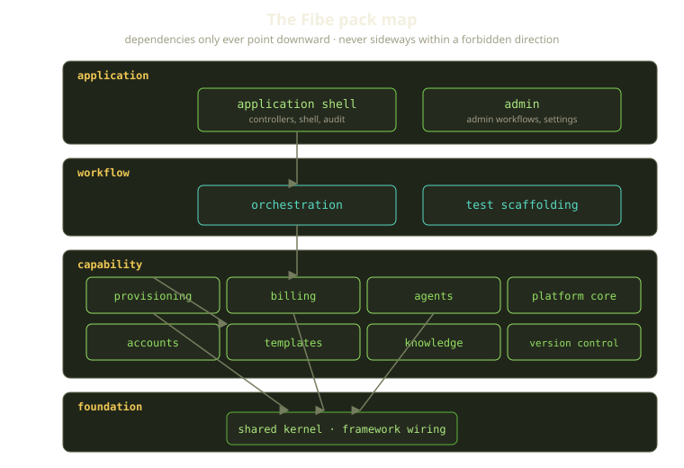
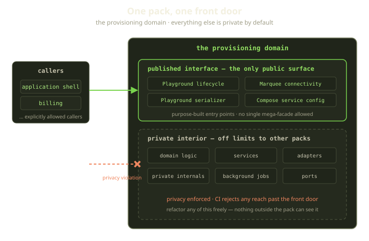

Every few months someone asks when Fibe is going to "break the monolith into services." It's a reasonable question. We provision Docker hosts, route TLS, run AI coding agents, charge money, and reconcile container state every sixty seconds — all in one Rails app that ships in one deploy. On paper, the thing the microservices talks warn you about.

It isn't, and the reason is boring in the best way: the monolith is split into ten-plus enforced domains whose boundaries are checked in CI, so a call from the billing domain into the provisioning domain's internals fails the build like a syntax error would. We get the part of microservices that matters — domains that can't secretly reach into each other — and skip the part that hurts: a network between every method call.

<!-- truncate -->

## Why not just split it into services?

The thing people actually want from services is **independent reasoning** — to change the billing code without wondering whether some controller three packs away is reaching into a half-private method. That's a real need, and it has nothing to do with deployment.

What services *charge* you for it is a long list: a network hop where there used to be a method call, with its own timeouts and partial failures; serialization and schema versioning at every boundary; the quiet abandonment of distributed transactions and a slow drip of "eventually consistent" bugs; and N deploy pipelines, dashboards, and rotations.

For a team our size that bill is enormous, and the thing it buys — decoupled domains — is something a compiler-style check gives us for almost free. So we kept one process, one Postgres, one deploy, and bought the decoupling with [Packwerk](https://github.com/Shopify/packwerk) instead. The trade: we give up scaling or deploying one domain in isolation, and keep transactional integrity, atomic cross-domain refactors, and a single artifact to ship. A Player funds their Marquee, that funding gates whether anything runs (an unfunded Marquee gets a payment-required `402`), and a Playground gets reconciled toward health — a story that crosses billing, accounts, and provisioning inside one transaction. We wouldn't give that up to run three more deploy pipelines.

:::tip
The mental model: **microservices enforce boundaries with the network; a modular monolith enforces them with the build.** Only one of them makes you serialize a hash to cross a function call.
:::

## The shape: packs, layers, and a single front door

Our Rails app is a set of Packwerk *packs* — self-contained domains, each its own directory with a manifest declaring what it depends on, who is allowed to see it, and which layer it sits in. Thirteen packs plus the root, grouped into four layers:

| Layer | Role |
|---|---|
| application | Rails entrypoints, authenticated controllers, the shell, admin workflows |
| workflow | Cross-cutting orchestration and test scaffolding |
| capability | The actual product domains — provisioning, billing, agents, accounts, templates, knowledge, version-control integrations, and the platform core |
| foundation | Generic types, result objects, pure helpers, framework wiring |

The domains map straight onto the product. Provisioning is Docker, Compose, Remote, Traefik, Terraform, and the reconciliation that heals Playgrounds. Billing is Stripe, subscriptions, referrals, Runes, and plan limits. The agents domain is the Genie runtime and its sidecars. Version-control integrations cover GitHub, Gitea, mirrors, and webhooks. You can read the domain map without opening a single source file — itself a feature.

The layers give us one rule that does an enormous amount of work: **dependencies point down, never up.** A capability pack like provisioning may depend on the foundation layer, and the application layer on everything beneath it, but the foundation can never reach back up into billing. That one directional constraint stops the "everything imports everything" gravity that turns most monoliths into a hairball — the hexagonal dependency rule, enforced by a linter instead of a forgotten code review.

### Every pack has exactly one front door

Inside a pack, only one place is public. A pack designates a single published-interface directory, and the only things that live there are a handful of purpose-built entry points — one for driving a Playground through its lifecycle, one for Marquee connectivity, one for serializing a Playground, and so on. Everything else — the domain logic, the services, the adapters, the background jobs, the genuinely private internals — is invisible from outside the pack.

This is where it pays off. When the application layer drives a Playground through its lifecycle, it calls a named entry point on the provisioning domain's public surface. It does *not* know — and is structurally prevented from knowing — that behind that call sits a state machine moving a Playground between pending, running, has-changes, error, stopping, stopped, and destroying, firing events and webhooks on each transition. We can rebuild that interior, and as long as the public entry point keeps its contract, no other pack notices — the refactor freedom a monolith is supposed to give you, guaranteed instead of hoped for.

Each pack carries a small manifest, and every pack turns on all four of Packwerk's checks at full strength. The manifest is short by design: it states the pack's layer, points at the one directory that holds its public surface, lists the exact set of other domains it is allowed to depend on, and lists the exact set of domains that are allowed to depend on *it*. Those two lists are the whole game — every edge in the dependency graph is written down on purpose, and anything not written down is forbidden.

Four checks, four different ways to be wrong:

- **Dependencies** — you can only reference a domain you've explicitly listed as a dependency. New coupling has to be declared on purpose, in the diff — never by accident.
- **Privacy** — you can only touch another pack through its published surface; reaching into its domain logic or services is a violation.
- **Visibility** — a pack chooses who's even *allowed* to depend on it. The admin domain, for instance, is visible only to the application shell, and the build keeps it from quietly becoming a public utility.
- **Layers** — the down-only rule from above.

Strict is the important word. Packwerk's non-strict mode records new violations in a to-do file and keeps the build green — right for a codebase mid-migration, wrong for one that's already clean, because a recorded violation is one you've agreed to live with, and those compound. We paid down our list and turned the dial to strict on all four checks. Zero new boundary violations, ever.

## Catching it in CI

A boundary you don't enforce is a comment. Ours runs on every change in the same CI gate that runs Sorbet and the tests before anything merges. When you cross a line, the failure is precise: it names the exact file and line that committed the violation, identifies the private thing you reached for, names the domain that owns it, and asks whether there's a public entry point you could use instead.

That message is doing real teaching. It doesn't just say no — it points at the pack that owns the thing and asks whether there's a public entry point you should use instead. Usually there is, and you add it on purpose — the conversation you want a boundary to force.

:::note
Packwerk only understands *static, resolvable* references — actual Ruby constants the checker can follow at analysis time. That's a feature, not a gap: any constant looked up dynamically from a string is a reference the checker can't see, which makes it a hole in the wall. More below.
:::

## The boundary behind the boundary

Packwerk is excellent at the rule it knows: *don't reference a constant you're not allowed to reference.* But a whole category of bad architecture is legal to Packwerk and still rots a codebase. So we wrote a second guardrail — a plain Ruby script of our own — that fails the same CI gate on patterns we never want:

**No mega-facade public surfaces.** The fastest way to neuter Packwerk is to make a pack's public surface a single god-object that re-exports everything — the boundary is then technically intact and practically meaningless. A catch-all public module in production code fails the build. A public surface should be a handful of named entry points, not a wall with "door" painted on it.

**Keep the domain layer pure.** Inside any pack's domain layer, we forbid a list of infrastructure reach-throughs — no touching the database or its base classes, no calling Stripe or GitHub, no HTTP client, no Redis, no random-number generation, not even reading the system clock. Domain logic should be pure business decisions, not a place that quietly talks to Stripe or reads the clock. Push those to the edges; keep the core deterministic. The outer application layer gets a looser list, and the public surface looser still — the constraint tightens as you move inward, backwards from how an unsupervised codebase drifts.

**No dynamic constant lookup in production code.** Resolving a class from a string at runtime, or walking the object space to find one, is banned outside a tiny allowlist (a single view resolver). Dynamic lookup is how you smuggle a dependency past Packwerk: the checker sees a string, not a constant, and can't tell you've crossed a boundary.

**No domain wiring in initializers.** No mixing modules in or rewriting classes at boot time, no runtime registration of subscribers or serializers. Boot-time monkeypatching is invisible coupling. If two domains talk, they talk through a declared dependency and a public entry point.

None of these are exotic. Each is a specific mistake we've made or watched another codebase make, written down so we can't repeat it. That's all an architecture guardrail is: institutional memory that runs in CI.

The day-to-day payoff: adding a new entry to a pack's dependency list is a flag in code review, and the seam for a future service is always pre-cut — a boundary you *can* extract later beats a network call you pay for today.

## What we learned

If you take one thing from this: **decide what you actually want from "services," then buy only that.** For us the want was decoupled domains, and the network was pure cost. A few principles that outlast Ruby.

- **Enforce boundaries with a tool, not a wiki page.** A rule a human has to remember is already broken.
- **Run it `strict`, or the violations compound.** A recorded exception is debt, and architectural debt compounds fast.
- **One front door per domain.** Keep the public surface small and everything else private, so you can change it freely.
- **Cover the holes your main tool can't see** with a second check.

A monolith isn't a mess by nature, and microservices aren't modular by nature. Modularity is a property you choose and then enforce. We enforce it in the build, and it has kept one Rails app legible while it grew into an entire Docker-based platform — Marquees, Playgrounds, Tricks, Genies, and all.
