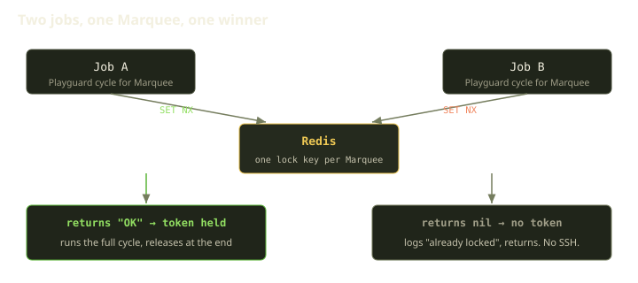
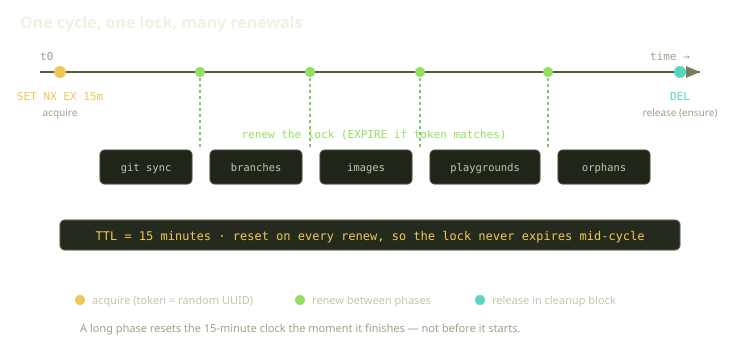
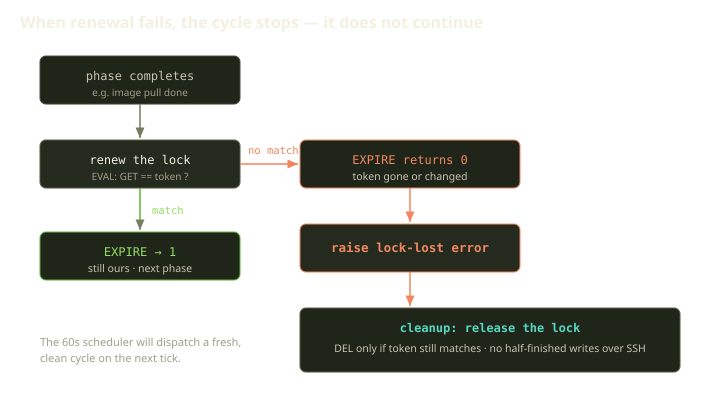

Every 60 seconds, Fibe's reconciler — we call it Playguard — wakes up and walks each Marquee, asking the same question: is reality what the database says it should be? It pulls git branches, refreshes credentials, pulls images, detects drift on Playgrounds, recovers stuck ones, enforces expirations, sweeps orphaned containers. All of that happens over SSH, against a real Docker daemon, on a host we don't own.

Here's the nightmare we work to avoid: two of those runs touching the *same* Marquee at the *same* time. One job tearing down a container while another rebuilds it. Two `docker compose up` calls fighting over the same project. A drift "fix" applied on top of a half-finished "fix." Over SSH, against a stateful daemon, concurrency isn't a performance problem — it's a correctness problem. So Playguard runs each Marquee under a lock. The interesting part isn't that we take a lock; it's that we keep *proving* we still hold it.

<!-- truncate -->

## A lock is a claim, and claims go stale

The naive version is one line of Redis: `SET key "1" NX EX 900`.

`SET NX` ("set if not exists") gives you mutual exclusion: the first caller wins, everyone else gets nil. `EX 900` is a safety net — if the job crashes and never cleans up, the lock evaporates in fifteen minutes instead of wedging the Marquee forever. For many jobs, that's all you need.

It breaks down the moment your critical section is *long* and your value is *meaningless*. A Playguard cycle runs for several minutes — git and image pulls over the network are not fast, and a stuck SSH call stretches it further. The dangerous failure: your `SET NX` succeeded, you started working, the 15 minutes elapsed mid-cycle, the key vanished, and a *second* job sailed in and acquired it. Two of you now, and neither knows.

The constant value `"1"` is why it stays invisible. On release you simply `DEL` the key — but that key might be job #2's lock now, which you just stomped. The two jobs stored the same placeholder, so the key itself can't tell them apart. A naive lock can't answer the one question that matters at release and renewal: **is this still mine?**

## Token locks: prove it's yours

The fix is small and it's the whole game. Instead of a constant, store a value only you know — a random token, fresh per acquisition. Our lock primitive is built from exactly three operations, and each one is load-bearing:

- **Acquire returns the token, or nothing.** It runs the same `SET NX EX`, but the value it writes is a freshly generated UUID. On success it hands that token back to the caller; on failure it hands back nothing. The token *is* your proof of ownership. The winner holds a UUID nobody else can guess; the loser holds nothing, and does nothing.
- **Release is a compare-and-delete.** It deletes the key only if the key's current value still equals *your* token. If your lock expired and someone else holds it, you delete *nothing*. You can't delete a lock that became someone else's — the naive bug, gone.
- **Renew is a compare-and-EXPIRE.** Same guard: it pushes the TTL forward only if the key still holds *your* token. Otherwise it reports failure — and that failure is a signal, not a shrug. More on that below.

The compare-and-act step is the subtle one. You can't do it as a Ruby `GET` followed by a Ruby `DEL`: between those two round-trips your lock could expire and someone else could acquire it — now your `DEL` deletes *their* lock. The fix is to run the comparison and the action inside a single Redis-side Lua script via `EVAL`. The script reads the value, checks it against your token, and only then deletes (or extends) — all as one uninterrupted server-side operation. Atomicity is the point.

A token lock is the difference between "the lock is free" and "*I* hold the lock" — and only the token tells you which.

## The race, settled

When Playguard's dispatcher fans out — one job per launchable Marquee, every 60 seconds — a slow previous run can still be going when the next starts:

The acquire is the entire arbitration: whoever's `SET NX` lands first gets back `"OK"` and a token, everyone else gets nothing. So the job's very first step is to try for the lock, and a job that comes back empty-handed simply logs that the Marquee is already locked and returns immediately.

The loser doesn't queue, doesn't retry, doesn't block. It just leaves, and the next tick reconciles the Marquee 60 seconds later. Skipping a cycle costs us nothing; *overlapping* one could cost us a corrupted environment. The lock key is scoped per-Marquee — one distinct key for each Marquee — so two different Marquees never contend. Exclusivity stays exactly as narrow as it needs to be.

## Holding a lock is not a one-time event

Here's the part people skip — it's the reason this post exists. You acquired the lock with `EX 900` — fifteen minutes — and your cycle takes, say, eight. "Fifteen is bigger than eight" is reasoning that's right until it isn't. An SSH call hanging on a flaky network, a Docker pull stalling on a slow registry, the worker scheduled off CPU under load — any of these can stretch a phase past your headroom. The instant your TTL lapses mid-work, Redis drops the key, the next dispatch acquires it cleanly, and you are now the *second* reconciler you fought to prevent.

So Fibe doesn't grab the lock once — it re-asserts it between phases. The lock's TTL is 15 minutes, and the cycle renews it after *every* step. Concretely, the cycle is a sequence of phases — sync git state, fetch remote branches, pull images for the Playspecs, reconcile Playgrounds, process AgentChats, sweep orphaned containers — and the renewal call is interleaved between them. Finish a phase, renew. Finish the next phase, renew. The renewal sits at every phase boundary, not just at the start.

The renew goes *after* each phase, not before. Picture the 15-minute window as a countdown that every phase boundary slaps back to full: the TTL only has to cover one phase, not the whole cycle, so we get a long effective lease (as long as work progresses) out of a short, safe TTL (so a dead worker's lock clears fast). You don't predict how long the cycle takes — you keep showing up. Crash or hang past 15 minutes on one step, and the countdown runs out, freeing the lock. An alive job holds exclusivity indefinitely; a dead one loses it.

## Losing the lock is information, not an error to swallow

Now the failure case. Renewal reports failure when the key no longer holds your token — your lock expired and, possibly, somebody else took it. Logging a warning and continuing is the wrong move: once you've lost exclusivity, every remaining phase is an *unsynchronized* write to a shared Docker host — the disaster the lock existed to prevent.

So our renewal step between phases doesn't quietly return a failure flag for the cycle to ignore. It raises a dedicated "lock lost" exception. And it does so under two conditions, not one. The first is the obvious one: the compare-and-EXPIRE came back saying the token no longer matches. The second is the subtle one: *any* error talking to Redis during renewal — a connection blip, a timeout, anything — is caught and converted into that same "lock lost" exception.

That second condition is the crux. Even a *Redis hiccup* during renewal becomes a lost-lock signal. If we can't confirm we hold the lock, we treat ourselves as not holding it. When the rule is "exactly one reconciler," the only safe reading of uncertainty is that you're not it. The exception then tears down the rest of the cycle — no more phases run.

The bail-out is *clean*, not abrupt. The whole cycle runs inside a block whose cleanup clause always releases the lock, no matter how the cycle exits — and that release is the compare-and-delete from earlier. We also special-case one exit: when the worker is shutting down (Sidekiq's own shutdown signal), we re-enqueue the job so it picks up again after the restart, rather than dropping the Marquee until the next tick.

However the cycle ends — normally, via the lost-lock exception, or interrupted by a worker shutdown — the cleanup clause releases the lock. Because release is a compare-and-delete, the abort a lost lock triggers can't yank the new owner's lock away: we only ever delete a token that's still ours. The token that protects renewal protects release too.

And then we just... wait. The 60-second scheduler dispatches a fresh cycle on the next tick, and a clean restart beats a contaminated continuation. Every Playguard phase is idempotent enough that abandoning a cycle halfway does no harm — so the lock needn't guarantee a cycle *completes*, only that no two run *at once*.

## When not to reach for a token lock

A token lock is overkill when the job is simply "don't fire this twice." When Fibe triggers a Terraform workflow on GitHub Actions, we just want to suppress *duplicate dispatches* — a retry or a double-click shouldn't spin up a second Actions run. No long-held lease, no renewal, no "am I still the owner." So that path uses a plain NX key-with-TTL via the Rails cache (`unless_exist: true` is `SET NX` wearing a Rails hat), keyed on a fingerprint of the specific dispatch. No token needed — the lock just exists for a window and disappears. Reach for the heavier tool only when the lighter one would let a bug through.

## What we learned

The lessons generalize past Redis.

- **A short TTL plus renewal beats a long TTL.** A short lease you refresh between phases gives a live job an unbounded hold while freeing the lock fast when a worker dies. One TTL "long enough for the worst case" is both too short *and* too slow.
- **Store proof of ownership, not a placeholder.** The token makes release and renewal *safe* instead of hopeful. Without it, every `DEL` is an act of faith.
- **Renewal failure is a real event — react to it.** Turning a failed (or even *unconfirmable*) renewal into a hard, cycle-aborting error stops a silently lost lock from becoming two reconcilers on one host.
- **Make the work restartable, and the lock gets simpler.** Idempotent phases mean the lock needn't guarantee completion — only that no two cycles overlap.

Holding a lock isn't a moment. It's a posture you maintain, phase after phase, until you put it down — or until Redis tells you it was never yours.
