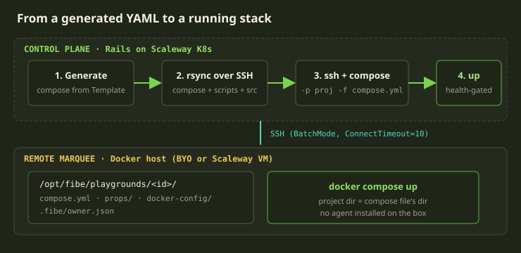
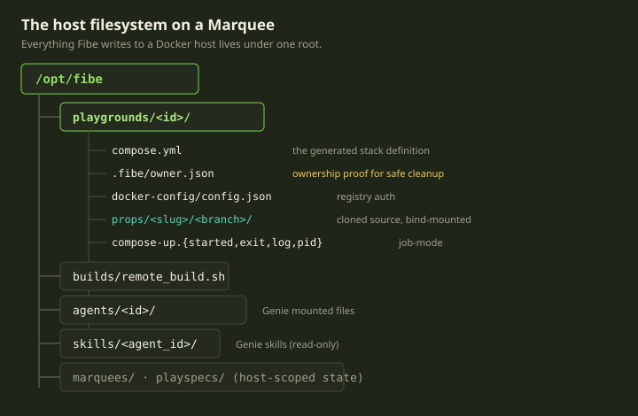
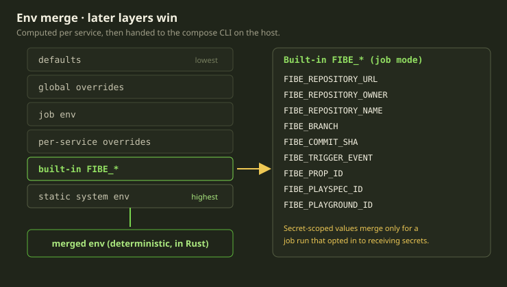

Here is the mental model most people start with: Fibe checks out your repo, runs `docker compose up` from the repo root, and that's your environment. Clean picture. Wrong in every load-bearing detail.

There is no repo root Fibe `cd`s into, no checkout you pushed. The control plane *generates* a compose file from your Template, `rsync`s it to a precise path on your Marquee, and runs `docker compose -p <project> -f compose.yml up` over SSH — explicit `-p` and `-f`, never "whatever's in this directory." This post walks that machinery: the `/opt/fibe` layout, the generate → rsync → up pipeline, and the marker that makes cleanup safe.

<!-- truncate -->

## Two planes, one boring wire

Fibe is two planes that almost never share a machine. The **control plane** is the Rails monolith on our Scaleway Kubernetes cluster — it owns the database, the lifecycle state machine and reconcilers, and decides *what* runs. The **runtime** is your Marquee — a Docker host over SSH or a Scaleway VM — and decides *nothing*: it executes.

The interesting decision is the wire. We could have shipped an agent — a long-lived daemon over RPC — but didn't: the wire is just **SSH + rsync + the Docker CLI**, nothing Fibe-specific on your machine. Why:

- **Debuggable by a human.** When something's wrong, an engineer SSHes in and sees what Fibe sees — real files, a real `docker compose ps`. No opaque agent state.
- **Portable.** One code path drives a host you own and a VM we provisioned — not two runtimes with a shared interface but *one*, since every host already has SSH and Docker.
- **Nothing to version or crash.** What rots on a fleet of hosts is what you installed. We installed nothing.

We pay the cost knowingly: every operation must survive a transport that can drop mid-command. `rsync` runs with `BatchMode`, `ConnectTimeout=10`, and four retries with backoff — we treat the network as hostile, because over a fleet of arbitrary hosts it is.



## Everything under `/opt/fibe`

Every file Fibe writes to a Marquee lives under one root: `/opt/fibe` — so cleanup, auditing, and "what is Fibe even doing on my machine" all have a single answer. Every path under that root is computed by a small Rust helper: pure string construction, same input, same path, no I/O. Pushing path-building into a deterministic function means the control plane and any verifier agree byte-for-byte on where a file should live before anyone touches a disk.



The sub-layout:

| Path | What lives there |
|---|---|
| `/opt/fibe/playgrounds/<id>/` | one directory per Playground; `<id>` is the compose project |
| `/opt/fibe/builds/remote_build.sh` | the shared build runner |
| `/opt/fibe/agents/<id>/` | files mounted into a Genie AgentChat, one per uploaded blob |
| `/opt/fibe/skills/<agent_id>/` | Genie skills, synced read-only |
| `/opt/fibe/marquees/`, `/opt/fibe/playspecs/` | host-scoped state |

Inside a Playground directory:

```text
compose.yml                       # the generated stack definition
.fibe/owner.json                  # ownership proof (more below)
docker-config/config.json         # registry auth, via DOCKER_CONFIG
props/<slug>/<branch>/            # cloned source, bind-mounted into services
compose-up.{started,exit,log,pid} # job-mode bookkeeping
```

Two paths worth lingering on. `` `props/<slug>/<branch>/` `` is your source: slug and branch come from your Prop binding, `/` sanitized to `-`. A repo is cloned *only* if attached to a dynamic service — no "source-only" Prop cloned just in case. And `docker-config/` scopes registry auth per-Playground, not a shared `~/.docker`.

## Generating the compose file

Fibe recomputes the compose file from your Template resolved into a Playspec. The generator first strips the Fibe-specific keys (the `x-fibe` block and the `playgrounds` section) that aren't valid Compose, then runs an ordered series of *injectors* — order matters, since later ones assume earlier ones ran. Conceptually that pipeline is:

> environment → build (mounts and configs) → static image, command, resource limits, and job constraints → ports → TLS → volumes → labels → platform and ulimits → resolve placeholders

The **TLS step** runs only when the Marquee has an ACME certificate *and* this isn't a job — it attaches the Traefik wildcard wiring (a ZeroSSL EAB key plus acme-dns requesting a `*.domain` cert); a headless Trick needs no public hostname, so gets none. The **job-constraints step** forces a one-shot shape: no restart, a single replica, no public exposure. The final **resolve** step substitutes placeholders, and the fully-resolved YAML is persisted on the Playground as the canonical, single source of truth — generated once, then read everywhere.

:::warning
A compose file with unresolved `${...}` placeholders is **never** synced to a host. The generator resolves them last, and the self-healing repair service independently refuses placeholders too. A half-interpolated compose file on a remote host wastes an afternoon — we fail loudly at generation.
:::

One subtlety: there's no `${SOURCE_PATH}` placeholder — the clone path resolves from *where* compose runs, which is next.

## Running it: `-p <project> -f compose.yml`

Every compose invocation has the same shape:

```bash
docker compose -p <project> -f /opt/fibe/playgrounds/<id>/compose.yml <args>
```

Explicit project name, explicit compose file, and critically **no `--project-directory`** — so Compose treats the compose file's own directory as the project directory, making relative paths work with no absolute path in the YAML: a `./props/acme-my-api/main` bind mount resolves against `/opt/fibe/playgrounds/<id>/`, where rsync put it.

The standard up is `up -d --remove-orphans --pull missing`. But bringing a Playground up runs a whole gauntlet around that one call:

1. refresh state, validate preconditions (is the daemon even reachable?)
2. write + sync the compose file, verify it landed, write the owner marker
3. configure registry auth
4. *(job mode)* remove stale containers from a prior run
5. pull images
6. ensure source mounts exist
7. ensure build contexts exist
8. ensure config files exist
9. `up`
10. wait for health
11. mark running

Steps 6–8 are filesystem-readiness gates — not assertions but self-repairs. A missing source mount triggers one re-sync and re-verify; only if it's *still* missing do we fail with an explicit "source mount missing" error. Build contexts work the same.

### The health gate

For a standard Playground, after `up` we poll health every **2 seconds for up to 90 seconds**; a timeout is treated as *recoverable*, not fatal — the runtime simply tries again rather than tearing anything down. Once healthy, a non-job Playground gets attached to Traefik on its `<project>_default` network, becoming routable. (The compose-up timeout is 300 seconds, with a separate 300-second pull budget.)

Two modes skip the health wait. **Job mode (Tricks)** launches detached via `nohup`, writing `compose-up.{started,exit,log,pid}` so the control plane can read the exit status later — a job exiting 0 is a *success*, so the 30-second timeout covers *launch*, not runtime. **AgentChats (Genies)** bring up the `agent` service with `--pull always` but *without* `--wait`: its healthcheck is async, and blocking would tie startup to model warmup.



## Env, secrets, and `FIBE_*`

Each service's environment is a merge of layers computed by the same deterministic Rust helper — **later layers win**:

> defaults → global overrides → job environment → per-service overrides → built-in `FIBE_*` → static system environment

The built-in `FIBE_*` variables tell your code where it runs (job mode):

```bash
FIBE_REPOSITORY_URL    FIBE_REPOSITORY_OWNER   FIBE_REPOSITORY_NAME
FIBE_BRANCH            FIBE_COMMIT_SHA         FIBE_TRIGGER_EVENT
FIBE_PROP_ID           FIBE_PLAYSPEC_ID        FIBE_PLAYGROUND_ID
```

A Trick reads them to know which commit and repo it's on.

:::note
**Secrets are opt-in, per job.** Secret-scoped values merge in only for a job run that explicitly opted into receiving secrets. A normal Playground doesn't get them.
:::

Job-mode Tricks get a second flavor of injection that isn't container env: each dynamic service gets a `FIBE_SERVICES_<NAME>_PATH` with its source's on-host clone path. These are **Docker Compose interpolation** variables — handed to the CLI, not baked into the container — so one service's source can interpolate into another's config.

## When the host disagrees with the database

A Marquee is not a database row. Disks fill, directories vanish, a VM reboots mid-sync — the host drifts from what the control plane thinks, and the runtime must converge them without destroying work it can't recreate.

The Playguard reconciler probes every launchable Marquee every 60 seconds for host artifacts: does `compose.yml` exist? The build script? The registry credentials (checked *only if* the Playground needs registry auth — their absence on a public stack isn't drift)? The probe is **tri-state** — present, missing, or *unknown* — and the third state is the point: if we can't tell (the host is unreachable, the SSH command timed out), we **defer**, never acting destructively without a confirmed miss.

Repair is granular and additive: compose missing → regenerate and re-sync; auth missing → re-write and re-sync the registry credentials; build script missing → rsync it back and make it executable again. Each repairs independently, so a partial repair never regresses a healthy one. The one escalation: a missing compose file **and** an unhealthy runtime triggers full recreation, not an in-place patch. This ladder — host base → source → auth → build script → compose — is the readiness contract, modeled in Alloy and realized by the repair service.

## The owner marker

This is our favorite small file in the whole runtime. When the control plane writes a Playground's directory, it drops a tiny JSON marker at `.fibe/owner.json`. The marker is deliberately minimal: it records what *kind* of thing owns the directory (a Playground, as opposed to an agent or a build), the compose project name it belongs to, and the identifiers of the Playground and Marquee it was written for. That's it — a few fields, no secrets, human-readable.

It looks like nothing. It's the difference between safe cleanup and catastrophe.

Marquees accumulate orphans — directories for Playgrounds the database no longer knows about, after an interrupted destroy or drift. We want to garbage-collect those, but "delete directories under `/opt/fibe/playgrounds` that aren't in the database" is terrifying on a host you don't fully own, especially a BYO host with the customer's files around.

So orphan cleanup deletes a directory only after **three** guards pass:

1. the directory name is a valid Fibe project name (the `name--id` shape),
2. the resolved path is genuinely under `/opt/fibe/playgrounds`, and
3. the `.fibe/owner.json` marker exists and proves Fibe owns it — it identifies itself as a Playground, and the compose project name it records matches the directory it sits in.

Missing or mismatched marker? We don't touch it. The marker turns "delete what looks like ours" into "delete what has signed proof it's ours" — on someone else's machine, that distinction is everything.

## What we learned

A few principles fall out, and we'd build them the same way again: boring transport beats a clever agent; one root and one source of truth, because state in two places eventually disagrees with itself; repair instead of assume; spend your paranoia where the blast radius is largest. A Playground coming up is just a YAML rsync'd to a Rust-computed path, run over a connection we assume will fail and marked for safe cleanup — no magic, just careful decisions about a filesystem we don't own.
