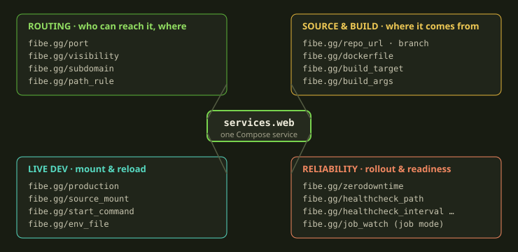
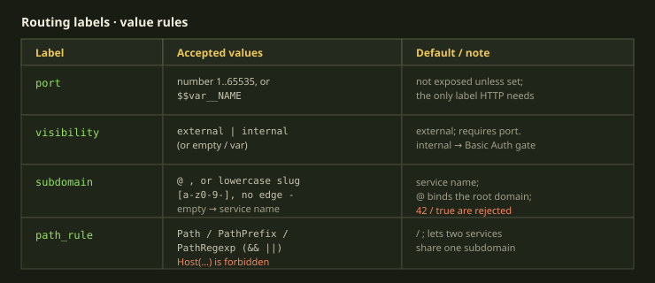
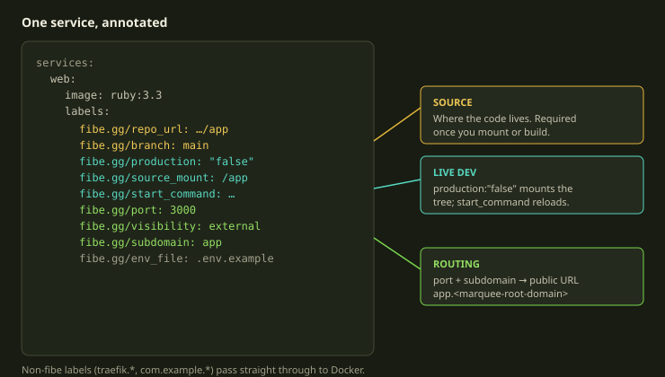
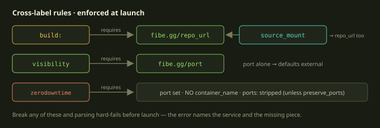

A Fibe template is a Docker Compose file with a sprinkling of labels. That's the whole trick. You don't learn a new config language — you annotate the Compose you already know, and the annotations all live under one namespace: `fibe.gg/*`. Set `fibe.gg/port: 3000` on a service and it gets a public HTTPS URL. Set `fibe.gg/production: "false"` and Fibe mounts your repo into the container so edits show up live. Twenty labels, four jobs.

The catch is that the namespace is strict. An unknown `fibe.gg/*` key isn't ignored — it's a hard parse error that names the offending service. That's deliberate (a typo'd `fibe.gg/prot` should fail loudly, not silently route nothing), but it means you want the exact spellings, the exact value rules, and the handful of "label X requires label Y" rules in front of you. This post is that lookup table, grouped the way you actually reach for them.

<!-- truncate -->

## How the namespace works

Two rules govern everything below.

First: **the prefix is `fibe.gg/`**, and only `fibe.gg/*` labels are interpreted by Fibe. Anything else on the service — `traefik.enable`, `com.example.owner`, your own bookkeeping labels — passes straight through to Docker untouched. So you can mix Fibe labels and ordinary Docker labels on the same service without conflict.

Second: **unknown `fibe.gg/*` keys fail parsing.** Not a warning, not a no-op — the runtime rejects the template with `Service '<name>': unknown label '<key>'`. This is the single most common way a hand-edited template fails, and it's a feature: misspell `fibe.gg/subdomain` as `fibe.gg/subdomian` and you find out immediately instead of wondering why your route landed on the default host.

There are two accepted shapes. **Map form** is preferred because it's easy to target with variable bindings later:

```yaml
services:
  web:
    labels:
      fibe.gg/port: 3000
      fibe.gg/visibility: external
      fibe.gg/subdomain: api
      traefik.enable: "true"   # non-fibe labels pass through
```

**Array form** is the legacy Compose style — each entry is a single `name=value` string:

```yaml
services:
  worker:
    labels:
      - fibe.gg/job_watch=true
      - com.example.owner=team
```

Both work; the same validation applies to each entry. Prefer the map form unless you have a reason not to.

The twenty labels fall into four families. Here's the whole namespace on one service:



## A note on booleans

Several labels are boolean-ish, and they have one sharp edge worth stating up front: **only the literal `true` counts as true.** Allowed values are `true`, `false`, a real YAML boolean (in map form), or an empty string. Not allowed: `yes`, `no`, `on`, `off`, `1`, `0`. Anything that isn't literally `true` is read as `false`.

Because YAML 1.1 has opinions about truthy words, the safe habit is to **quote boolean values as strings**:

```yaml
labels:
  fibe.gg/production: "true"
  fibe.gg/zerodowntime: "false"
```

That spelling is unambiguous across parsers and survives copy-paste. Get into the habit and you'll never debug a `production: yes` that silently meant `false`.

## Family 1: routing — who can reach the service, and where

Four labels decide whether a service is reachable over HTTP and at what address. Of these, **only `fibe.gg/port` is load-bearing** — set it and you get a URL; leave it off and the service isn't exposed at all (perfectly fine for a database or a background worker).

| Label | Value rule | Default |
| --- | --- | --- |
| `fibe.gg/port` | port `1..65535`, or `$$var__NAME` | not exposed |
| `fibe.gg/visibility` | `external` or `internal` | `external` |
| `fibe.gg/subdomain` | `@`, or a lowercase slug `^[a-z0-9]([a-z0-9-]*[a-z0-9])?$` | the service name |
| `fibe.gg/path_rule` | a `Path` / `PathPrefix` / `PathRegexp` matcher | `/` |

The precise value rules matter here more than anywhere else, so here they are as a quick-reference card:



### `fibe.gg/port`

The container port Traefik routes public traffic to. Set it whenever the service serves HTTP to a human. The schema accepts an empty string, a numeric string or integer, or a `$$var__NAME` reference; at runtime the value must satisfy `1 ≤ PORT ≤ 65535`.

```yaml
services:
  web:
    labels:
      fibe.gg/port: 3000
```

If you want the port to be launch-time configurable, don't inline a variable as the whole value — keep a concrete placeholder and bind the variable through a `path` (more on that at the end):

```yaml
services:
  web:
    labels:
      fibe.gg/port: "3000"   # local placeholder
x-fibe.gg:
  variables:
    PORT:
      name: Port
      default: "3000"
      path: services.web.labels.fibe.gg/port
```

### `fibe.gg/visibility`

`external` gives you a public HTTPS route through Traefik. `internal` uses the same routing but gates the route behind Basic Auth with the Playground's internal access credentials. The default is `external`, so you only set this when you want the gate.

One hard rule: **`fibe.gg/visibility` requires `fibe.gg/port`.** Setting visibility on a portless service is a parse error — there's no route to make external or internal. With a port and no visibility, you get `external` automatically.

```yaml
services:
  admin:
    labels:
      fibe.gg/port: 4000
      fibe.gg/visibility: internal   # behind Basic Auth
```

### `fibe.gg/subdomain`

Picks the host under your Marquee's root domain. Three forms:

- A **lowercase slug** — letters, digits, hyphens, no leading or trailing hyphen (`^[a-z0-9]([a-z0-9-]*[a-z0-9])?$`).
- **`@`** — bind the route at the root of the Marquee domain itself.
- **Empty string** — fall back to the default, which is the service name.

If you omit it entirely, the public host is `<service-name>.<marquee-root-domain>`.

:::caution
Scalar values are coerced to strings *before* validation, then checked against the slug regex. So `fibe.gg/subdomain: 42` becomes `"42"` and `fibe.gg/subdomain: true` becomes `"true"` — and a trailing hyphen like `bad-subdomain-` fails outright. If you mean the string `"42"`, fine; just know the coercion happens and the slug rules still apply. Quote it to be safe.
:::

```yaml
services:
  api:
    labels:
      fibe.gg/port: 3000
      fibe.gg/subdomain: api        # api.<root-domain>
  marketing:
    labels:
      fibe.gg/port: 8080
      fibe.gg/subdomain: "@"        # the root domain
```

### `fibe.gg/path_rule`

By default each service owns its subdomain at `/`. Reach for `path_rule` when **two services need to share one subdomain** — say an API and a websocket endpoint both living under `app.<root-domain>`. You give each one a Traefik path matcher.

Allowed matchers are exactly three: `Path`, `PathPrefix`, and `PathRegexp`. The value must contain at least one of them. You can combine matchers with `&&` and `||`:

```yaml
services:
  api:
    labels:
      fibe.gg/port: 3000
      fibe.gg/subdomain: app
      fibe.gg/path_rule: PathPrefix(`/api`)
  cable:
    labels:
      fibe.gg/port: 28080
      fibe.gg/subdomain: app
      fibe.gg/path_rule: Path(`/cable`) || Path(`/health`)
```

:::caution
Host-level matchers are **forbidden** in `path_rule`: `Host`, `HostRegexp`, `HostSNI`, `HostSNIRegexp`, `Headers`, `HeadersRegexp`, `Method`, `Query`, and `ClientIP` are all rejected. Fibe owns the host — that's how wildcard TLS and the Marquee domain stay coherent — so you only ever match on the path.
:::

## Family 2: source & build — where the service comes from

This family connects a service to a Git Prop and tells Fibe how to build it. The anchor label is `fibe.gg/repo_url`; the rest tune branch, Dockerfile, and build inputs.

| Label | Value rule | Default |
| --- | --- | --- |
| `fibe.gg/repo_url` | GitHub HTTPS URL, full `ssh://` URL, or configured Gitea URL | — |
| `fibe.gg/branch` | a Git ref name | repo default branch |
| `fibe.gg/dockerfile` | path relative to repo root | `Dockerfile` |
| `fibe.gg/build_target` | a Dockerfile stage name | unset |
| `fibe.gg/build_args` | comma-separated `KEY=value` pairs | unset |

### `fibe.gg/repo_url` and `fibe.gg/branch`

`repo_url` is where the code lives. Accepted forms are **GitHub HTTPS URLs, full `ssh://` URLs, and URLs under a configured Gitea host.** Note what's *not* accepted: the short scp-style SSH form `git@host:owner/repo.git` is rejected — use the full `ssh://` URL instead. Inline `$$var__NAME` interpolation is allowed and skips validation until compile time.

`branch` pins to a non-default ref; omit it to track the repo's default branch.

```yaml
services:
  web:
    build: .
    labels:
      fibe.gg/repo_url: https://github.com/owner/rails-app
      fibe.gg/branch: main
```

That `build: .` matters: **a Compose `build:` block requires `fibe.gg/repo_url`.** There's nothing to build without a source, so the runtime enforces it.

### `fibe.gg/dockerfile`, `fibe.gg/build_target`, `fibe.gg/build_args`

For anything beyond a root-level `Dockerfile`:

- **`fibe.gg/dockerfile`** points at a non-default Dockerfile path relative to the repo root.
- **`fibe.gg/build_target`** names the stage to build in a multi-stage Dockerfile — exactly Docker's `--target`.
- **`fibe.gg/build_args`** is comma-separated `KEY=value` pairs, parsed into a build-arg map. Whitespace around the commas is tolerated.

```yaml
services:
  web:
    build: .
    labels:
      fibe.gg/repo_url: https://github.com/owner/rails-app
      fibe.gg/dockerfile: docker/Dockerfile
      fibe.gg/build_target: production
      fibe.gg/build_args: "RAILS_ENV=production, NODE_VERSION=20"
```

## Family 3: live development — mount the tree, reload on save

This is the family that makes Fibe feel like a dev environment instead of a deploy target. The switch is `fibe.gg/production`.

| Label | Value rule | Default |
| --- | --- | --- |
| `fibe.gg/production` | `"true"` / `"false"` | unset |
| `fibe.gg/source_mount` | container path `^[A-Za-z0-9_./-]+$` | `/app` |
| `fibe.gg/start_command` | a shell command string | the image `CMD` |
| `fibe.gg/env_file` | path relative to repo root | `.env.example` |

### `fibe.gg/production`

`production: "true"` means *use the built image*. `production: "false"` means **dev mode**: Fibe mounts your repository into the container so edits on your machine show up live, and you pair it with `fibe.gg/start_command` set to your hot-reload command so the reload actually fires.

The two are a package deal — mounting source without a watch command gives you a stale process; a watch command without the mount has nothing to watch. Set them together:

```yaml
services:
  web:
    image: ruby:3.3
    working_dir: /app
    labels:
      fibe.gg/repo_url: https://github.com/owner/rails-app
      fibe.gg/production: "false"
      fibe.gg/source_mount: /app
      fibe.gg/start_command: bin/rails server -b 0.0.0.0 -p 3000
      fibe.gg/port: 3000
```

### `fibe.gg/source_mount` and `fibe.gg/start_command`

`source_mount` is the container path where the working tree gets mounted in dev mode. It defaults to `/app` and only applies to dynamic (source-backed) services — it's never invented for a static image-only service. It also **requires `fibe.gg/repo_url`**: there has to be a tree to mount.

`start_command` overrides the image's default command. In dev mode this is where your watch command goes. Common shapes by stack:

| Stack | `fibe.gg/start_command` |
| --- | --- |
| Rails | `bin/rails server -b 0.0.0.0` |
| Next.js | `next dev -H 0.0.0.0` |
| Vite | `vite --host 0.0.0.0` |
| FastAPI | `uvicorn app:main --reload --host 0.0.0.0` |

The common thread: bind to `0.0.0.0`, not `localhost`, so Traefik can reach the process inside the container.

### `fibe.gg/env_file`

Points at the env example file in your Prop, defaulting to `.env.example`. Fibe reads this file to **discover the env keys your service expects**, pre-fills them in the launch form, and injects the final values into the container's environment. Your code just reads ordinary environment variables — no Fibe-specific plumbing. Set this label only when your example file lives somewhere other than `.env.example`.

Here's the full dev-mode service, annotated:



## Family 4: reliability — rolling updates and readiness

By default a service updates restart-style: the old instance stops, the new one starts, there's a blip. When that blip is unacceptable, opt into zero-downtime rollouts.

| Label | Value rule | Default |
| --- | --- | --- |
| `fibe.gg/zerodowntime` | `"true"` / `"false"` | restart-style |
| `fibe.gg/healthcheck_path` | HTTP path starting with `/` | `/up` |
| `fibe.gg/healthcheck_interval` | duration `Nms` / `Ns` / `Nm` | `10s` |
| `fibe.gg/healthcheck_timeout` | duration | `5s` |
| `fibe.gg/healthcheck_retries` | positive integer `[1-9][0-9]*` | `3` |
| `fibe.gg/healthcheck_start_period` | duration | `30s` |

### `fibe.gg/zerodowntime`

Set `fibe.gg/zerodowntime: "true"` when the service is exposed, speaks HTTP, and can run more than one replica at once. Fibe then brings up a new replica, waits for it to pass its healthcheck, and only then drains the old one.

That power comes with **three hard requirements**, all enforced at launch:

1. `fibe.gg/port` must be set — there's no route to health-check otherwise.
2. The service must **not** define `container_name` — Fibe needs to run multiple replicas, and a fixed container name would collide.
3. The service must **not** define Compose `ports:` when `x-fibe.gg.metadata.preserve_ports: true` is set. Without that metadata opt-in, raw `ports:` are stripped before launch anyway.

```yaml
services:
  web:
    build: .
    labels:
      fibe.gg/repo_url: https://github.com/owner/app
      fibe.gg/port: 3000
      fibe.gg/zerodowntime: "true"
      fibe.gg/healthcheck_path: /healthz
      fibe.gg/healthcheck_interval: 5s
      fibe.gg/healthcheck_timeout: 2s
      fibe.gg/healthcheck_retries: 3
      fibe.gg/healthcheck_start_period: 20s
    # no container_name, no ports: — both would break the rollout
```

### The healthcheck labels

These are all **optional overrides**. When you turn on zero-downtime and leave them out, Fibe generates sensible defaults (path `/up`, interval `10s`, timeout `5s`, retries `3`, start period `30s`). Override them to match your service's reality.

Two rules of thumb when you do override:

- The durations use a tight regex — `^[0-9]+(?:ms|s|m)$`. So `500ms`, `10s`, `1m` are fine; `1h` and `2d` are not. Express longer windows in minutes.
- Keep **timeout shorter than interval**, and set **`start_period` to your real boot time**. A start period that's too short marks a slow-booting app unhealthy before it's even finished migrating.

### `fibe.gg/job_watch` — reliability's job-mode cousin

One more label belongs here by spirit even though it's about job mode, not rollouts. In a Trick (a one-shot job-mode run), `fibe.gg/job_watch: "true"` marks the service **whose exit defines the result of the run.** When that watched service exits, the Trick completes and its exit code becomes the Trick's outcome. Put it on the migration, the test run, the backup script — whatever service *is* the job.

```yaml
services:
  migrate:
    build: .
    labels:
      fibe.gg/repo_url: https://github.com/owner/app
      fibe.gg/start_command: bin/rails db:migrate
      fibe.gg/job_watch: "true"   # this service's exit = the Trick's result
```

## The cross-label rules, in one place

Most label failures aren't about a bad value — they're about a missing companion label. These dependencies aren't caught by simple per-label validation — they're cross-checks across the whole service, so they fire at launch with a message naming the service. Keep this picture in your head:



| If you set… | You must also have… | Why |
| --- | --- | --- |
| Compose `build:` | `fibe.gg/repo_url` | nothing to build without source |
| `fibe.gg/source_mount` | `fibe.gg/repo_url` | nothing to mount without a tree |
| `fibe.gg/visibility` | `fibe.gg/port` | no route to gate without a port |
| `fibe.gg/zerodowntime: "true"` | `fibe.gg/port`, no `container_name`, no conflicting `ports:` | replicas need a route and unique names |

## One label, launch-time configurable

Any label value can hold a `$$var__NAME` reference, but there's a right way and a last-resort way.

**Whole-value variables** — a configurable port, subdomain, or repo — should keep a concrete local placeholder and bind the variable through a `path` in the settings block. This keeps the template readable and lets the schema validate the placeholder:

```yaml
services:
  web:
    labels:
      fibe.gg/port: "3000"
      fibe.gg/subdomain: demo
x-fibe.gg:
  variables:
    PORT:
      name: Port
      default: "3000"
      path: services.web.labels.fibe.gg/port
    SUBDOMAIN:
      name: Subdomain
      default: demo
      path: services.web.labels.fibe.gg/subdomain
```

**Inline interpolation** is for *fragments* — when only part of a value varies, like a path prefix inside a `path_rule`:

```yaml
fibe.gg/path_rule: PathPrefix(`/$$var__PATH_PREFIX`)
```

:::tip
The variable in a `$$var__NAME` token must be declared under `x-fibe.gg.variables`, or compilation fails. Inline-everywhere is tempting but it makes templates harder to read and harder to validate — reach for `path` bindings first, and save inline for the genuine fragment cases.
:::

## Defaults you can rely on

You don't have to write every label. When unset, the runtime fills these in:

| Label | Filled with |
| --- | --- |
| `fibe.gg/dockerfile` | `Dockerfile` |
| `fibe.gg/env_file` | `.env.example` |
| `fibe.gg/source_mount` | `/app` (dynamic services only) |
| `fibe.gg/branch` | the repo's default branch |
| `fibe.gg/visibility` | `external` (when a port is set) |

And if your template imports from a source Prop with `x-fibe.gg.metadata.source_defaults: true`, Fibe also auto-fills `fibe.gg/repo_url` and `fibe.gg/branch` from the source binding on services that build or mount — so you often don't write `repo_url` at all.

## Rules of thumb

- **Spelling is load-bearing.** An unknown `fibe.gg/*` key is a hard error that names the service. When a template won't parse, suspect a typo'd label first.
- **`fibe.gg/port` is the one routing label that does work.** No port, no URL. Everything else (visibility, subdomain, path_rule) just refines the route a port creates.
- **Quote your booleans as strings,** and remember only literal `true` is true — `yes`/`1`/`on` all read as `false`.
- **Dev mode is two labels, not one:** `fibe.gg/production: "false"` plus a `fibe.gg/start_command` watch command. Bind to `0.0.0.0`.
- **Zero-downtime has prerequisites:** a port, no `container_name`, no stray `ports:`. The healthcheck labels are optional overrides on top of sane defaults; keep `timeout < interval` and start_period close to real boot time.
- **Most failures are missing companions, not bad values.** `build:`→`repo_url`, `source_mount`→`repo_url`, `visibility`→`port`. Learn the four cross-label rules and you'll launch on the first try.
- **For configurable values, prefer `path` bindings over inline `$$var__NAME`.** Save inline interpolation for fragments inside a larger value.

For the authoritative, regex-level value rules, the reference doc at [whats.fibe.gg](https://whats.fibe.gg) is the source of truth — but for day-to-day authoring, the four families above are the whole namespace.
