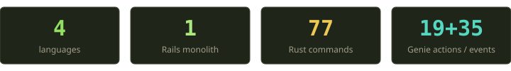
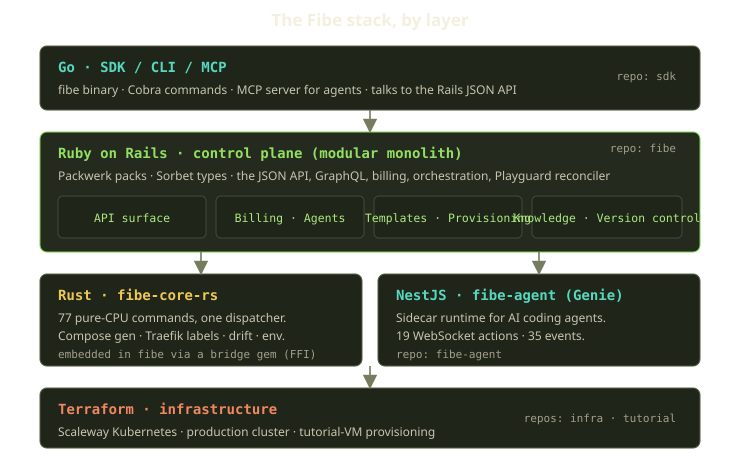
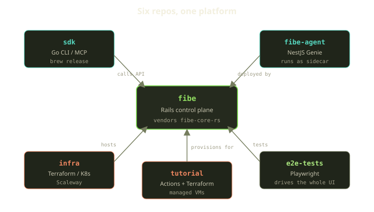

People assume four languages means four teams who couldn't agree, or four phases of a rewrite that never finished. Neither is true here. Fibe speaks Ruby, Rust, TypeScript, and Go on purpose, and each one is doing a job the others would do worse. The interesting part isn't the list — every grown-up system has a list. It's the *rule* that decides which language a given function lands in, and how boring we kept the seams between them.

This post is the honest version: what each piece is, why it exists, and the trade-offs we swallowed to get here. If you've ever stared at a monolith and wondered when to carve a piece off — and into what — this is one team's answer.

<!-- truncate -->

## The shape of the thing

Fibe runs developer environments on Docker. A **Player** owns a **Marquee** — a Docker host, either your own box over SSH or a VM we provision on Scaleway. On that Marquee we deploy **Playgrounds** (long-lived environments), **Tricks** (one-shot headless jobs), and **AgentChats** (AI coding agents we call Genies, running as sidecars). Everything is a Docker Compose project, routed by Traefik, and continuously healed by a reconciler. That's the product in two sentences.

The platform that makes all of that happen is layered, and each layer has a primary language.

Read it top to bottom:

- **Go** is the surface agents and humans touch — the `fibe` CLI and an MCP server.
- **Rails** is the brain. It's where the database lives, where authorization happens, where billing is decided, where deployments are orchestrated. A modular monolith, not a swarm of services.
- **Rust** is a calculator bolted to the side of Rails. Pure functions, no state, no I/O.
- **NestJS** is the Genie runtime — the live, stateful, WebSocket-y world of an AI agent talking to a browser.
- **Terraform** is the ground everything stands on: the Scaleway Kubernetes cluster and the tutorial-VM provisioning.

Now the why.

## Rails is the control plane, and we kept it a monolith

The center of gravity is a Ruby on Rails app. It owns the data, the API, the GraphQL endpoint, billing, provisioning, and the **Playguard** reconciler that wakes up every 60 seconds to drag reality back toward the desired state. If a decision needs to be *made* — can this Player deploy, is this Marquee funded, what does this Template compile to — Rails makes it.

It is a **modular monolith**, and we are not embarrassed about that. Internally it's carved into [Packwerk](https://github.com/Shopify/packwerk) packs with enforced boundaries, and those packs are stacked into a small number of dependency layers — application code at the top, then a workflow layer, a reusable-capability layer, and a foundation layer at the bottom. The inside has structure even though the outside is a single deployable.

The rule between layers is one-directional: a pack high in the stack can lean on the layers beneath it, but never sideways into a sibling's privates and never upward into a layer above it. Packwerk's privacy, visibility, and layer checkers run in CI and fail the build on a violation. We also forbid loose code at the repository root: every domain has to live in its own named pack — one for billing, one for agents, one for templates, one for provisioning, one for knowledge, one for version-control integrations, and so on. On top of that, [Sorbet](https://sorbet.org) gives us gradual static types where they earn their keep.

So why not split those packs into microservices? We get asked this a lot, usually by someone who's been burned by a distributed monolith and is now suspicious of *any* monolith. Fair. Here's our reasoning, with the trade-offs on the table:

- **The packs share a transaction.** Deploying a Playground writes rows, debits a wallet, and schedules orchestration in one consistent motion. Across services that's a saga with compensating actions and a new genre of bug: the half-committed deploy. In one process it's a database transaction that either happens or doesn't.
- **The boundaries still move.** Provisioning and billing rules change month to month. Boundaries that move are exactly the ones you do *not* want hardened into network calls and versioned contracts. Packwerk gives us a boundary we can refactor in an afternoon; an RPC contract is a boundary you renegotiate in a sprint.
- **We're not at the scale where the monolith hurts.** The classic reasons to split — independent scaling, isolated blast radius, separate release trains — haven't bitten us yet. We'd rather pay that tax when it's actually due than prepay it with interest.

The honest cost: a monolith is a single failure domain, the test suite is one big suite, and "just bump the dependency" can ripple further than you'd like. We accept all three. Packwerk keeps the ripples legible, and a fast suite keeps the feedback loop tight. The day a pack genuinely needs to scale on its own, it'll already have a clean seam to be lifted out through. That's the whole point of drawing the lines early even when you don't cut along them.

:::tip
A modular monolith is the option that keeps the *most* doors open. You get service-like boundaries without service-like operational cost, and extraction stays cheap because the seam already exists. Microservices are a one-way door you're paying for whether or not you walk through it.
:::

## fibe-core-rs: a calculator, not a service

Now the part people find surprising. Bolted onto the Rails app — vendored right inside the same repository rather than deployed somewhere else — is a Rust workspace called **fibe-core-rs**. It is not a microservice. It has no server, no socket, no database connection, no idea what time it is. It's a library of **77 pure-CPU commands** behind a single dispatcher, and Rails calls into it the way you'd call a particularly fast, particularly strict function.

The design is deliberately humble. Every computation is one small command with a dotted name and the same uniform shape: JSON in, JSON out. A single registry maps names to handlers, and every caller — the CLI, the Ruby side, the tests — goes through one entry point. You hand the dispatcher a command name and a blob of JSON; it hands you a blob of JSON back. There is no second way in, which is exactly what makes the boundary easy to reason about.

What lives in there is the stuff that's pure logic and has stopped changing. Roughly grouped, it covers:

| Area | What it computes |
|---|---|
| Compose | Turning a Template into a runnable Compose file, complete with the Traefik routing labels — and parsing those labels back out |
| Diff | Parsing Git hunks, and computing what actually changed between two Template versions |
| Playground | Whether the host has drifted from the desired state, and container health derived from raw Docker output |
| Env | Parsing `.env` files and merging global variables with per-service ones |
| Validate | Pure input validators for things like a Marquee's domain or a repository URL |

Notice the pattern. These are all functions of the form *bytes in, decision out*. Compiling a Template doesn't need the database. Detecting drift is a comparison between two structures someone else fetched. Parsing Traefik labels is a parser. None of it cares about *who* you are or *when* it's running — that's Rails' job, upstream.

How does Ruby reach Rust? Through a small bridge gem. In production it loads the Rust as a shared library over a stable C ABI — direct function calls, no fork, no socket. In local dev you can run it as a subprocess instead, which is slower but trivial to debug. Same dispatch contract either way; the Rails Dockerfile builds both artifacts so the image always has the fast native path available.

### Why bother extracting it at all

The skeptic's question: if it's just pure functions, why not leave them in Ruby? It was working, right?

Two reasons, and one of them is the headline.

**Speed where it's hot.** Compose compilation, label parsing, template diffing — these run on every deploy and every reconcile. Reconciliation alone fires every 60 seconds across every Playground. Rust does the CPU-bound parsing-and-generating an order of magnitude faster than the equivalent Ruby, and it does it without the GC pauses that make tail latencies twitchy. The Rust workspace ships [criterion](https://github.com/bheisler/criterion.rs) benchmarks for exactly these hot paths — the Compose parser, the label parser, the template compiler — so "is this actually faster" is a number, not a vibe.

**Pinning down behavior that had finally settled.** This is the part we'd underline. The Compose generator and drift detector are load-bearing — a subtle bug routes traffic to the wrong container or churns a healthy environment. Moving them into Rust means a compiler that refuses to let you ignore an error case, exhaustive matches, and no `nil` sneaking through three layers to explode at the worst time. The extraction itself was a forcing function: you cannot port a tangled, side-effect-laden method into a pure Rust function. You have to first *make* it pure. Half the value was the cleanup the rewrite demanded.

The trade-off is real and we name it honestly: a Ruby↔Rust boundary is a JSON serialization round-trip and a second toolchain in the build. That's not free. So we only pay it when **all** of these are true.

The rule reads almost like a koan: **Rust for the parts that have stopped surprising us; Rails for everything still alive.** If a function touches the database, does I/O, runs long, holds state, or makes an authorization call, it stays in Rails — no debate. Rust is reserved for pure, stateless, deterministic, CPU-bound logic whose behavior has stabilized enough to be worth freezing. The README for the workspace says it in plain English: keep new Rust work limited to stable, stateless, pure-logic helpers, and leave I/O, database state, authorization, and long-running orchestration in Rails.

:::note
"Stable" is doing real work in that sentence. We do not extract code into Rust to make it better. We extract it because it's already good, already settled, and now we want it fast and frozen. Premature extraction is just microservices in a trench coat — you've paid the boundary tax on something that's still changing weekly.
:::

## fibe-agent: the Genie runtime, where state lives on purpose

If fibe-core-rs is the stateless extreme, **fibe-agent** is the opposite end of the spectrum, and that's exactly why it's a separate runtime in a separate language.

A Genie is an AI coding agent running as a sidecar next to your environment. The whole experience is stateful and live: you type a message, the agent reasons, it streams tokens back, it calls tools, it asks you a clarifying question mid-task, it shows you an image, it sets the conversation title. That is a long-lived, bidirectional, event-soaked relationship — the precise opposite of a request/response API. It wants WebSockets and an event loop, which is Node's home turf. We built it in **NestJS**.

The protocol is small and explicit. There are **19 actions** a client can send and **35 events** the runtime can emit, and both lists live in one shared place so the runtime and the UI can never quietly disagree about the vocabulary.

The actions are the handful of things you can *do* to a live conversation: send a chat message, steer one mid-flight, interrupt the agent, answer a question it asked you, confirm or decline an action it wants to take, reset the conversation, and so on. The events are everything the runtime can *tell* you while it works: a chunk of streamed output, a tool call starting, a prompt asking you a question, a request to confirm a destructive step, a notice that the underlying Playground changed, an update to the list of sessions. Two small, closed vocabularies — one for what goes in, one for what comes out.

There's a nice asymmetry hiding in those numbers: nearly twice as many events as actions. That's the signature of a streaming agent. You say one thing — "send this message" — and the runtime narrates a whole episode back at you: reasoning starts, chunks stream, a tool fires, a file gets created, the agent pauses to ask you something, then it resumes. A REST endpoint cannot do that gracefully. A WebSocket runtime built around an event loop does it as its native idiom.

Here's the boundary that matters: **fibe-agent does not own anything durable about your account.** Conversations are persisted by the runtime so a session survives a reconnect, but CRUD on the agent itself — creating it, the runtime lifecycle, uploads, the canonical message store, duplication — is owned by the Rails agent API. The Genie is where the *live* state of an in-flight conversation lives; Rails is where the *truth* of your account lives. Two kinds of state, two homes, and a clear line between them. When in doubt, durable truth is Rails' and ephemeral liveness is the Genie's.

## The Go SDK: one binary, two front doors

The top layer is a Go program built on [Cobra](https://github.com/spf13/cobra), and it wears two hats from a single binary.

As a **CLI**, `fibe` is what you'd expect — subcommands for every resource, installable over Homebrew, with its own GitHub Actions pipeline that tests, builds, and releases the binary.

As an **MCP server**, the same binary exposes Fibe to AI agents over the [Model Context Protocol](https://modelcontextprotocol.io). And the reason that's a server and not "just shell out to the CLI for each call" is stated right in the source: launching the MCP server lets agents drive Fibe resources "without paying the fork+exec cost of invoking the CLI per operation." When an agent is firing dozens of tool calls, a fork-per-call adds up fast. A long-lived in-process server doesn't.

A couple of design choices we're happy with:

- **Tiered tool surface.** The server can advertise a small, curated core set of tools or the full catalog. Default to the curated set for agent clients and the tool list stays small and legible; the rest of the catalog stays registered and reachable on demand. Flood an agent with hundreds of tools and its tool-selection accuracy drops — a smaller advertised surface is a real quality lever, not just tidiness.
- **One dispatcher, one place for safety.** Every tool call — whether it's invoked directly or composed inside a pipeline — routes through a single dispatcher that enforces destructive-op gating, per-session auth, and idempotency. Safety lives in exactly one spot, which is the only number of spots you can actually keep correct.
- **Pipelines to cut round-trips.** A pipeline composes several tool calls in one shot, threading the output of one step into the input of the next and caching results per session. Agents are chatty; batching the predictable chains is the same instinct as the in-process server, one level up.

The deeper point: the Rails JSON API is the single source of truth for what Fibe can do. The SDK doesn't reimplement business logic — it's a well-mannered client. New capability shows up in Rails first; the CLI and MCP tools are striped over the same REST surface. That keeps the four languages from drifting into four subtly different definitions of what a Playground *is*.

## Four languages means four test suites — and that's fine

A reasonable worry about polyglot: doesn't every language multiply your testing burden? It does add suites. What it doesn't do, if you've drawn the boundaries right, is multiply the *hard* testing. Each language gets tested with the tool that fits it, and the pure stuff is the easiest to test of all.

Each repo has one command that runs its full suite, and each suite uses the idiom native to its language. Rails runs the whole battery — the unit and integration specs, plus the Packwerk, Sorbet, and lint gates — in a single check. The Genie runtime has its own Node-based CI command. The Go SDK has fast unit tests and a separate integration pass that runs against a live-ish API. And Playwright runs as its own end-to-end harness driving the real UI. Five repos, five entry points, no shared test runner pretending one language's tooling fits them all.

The shape of each suite mirrors the shape of the code it covers, and that's not a coincidence — it's the same decision rule paying a second dividend:

- **The Rust core is a joy to test** precisely because it's pure. No fixtures-of-fixtures, no database setup, no time-mocking, no network stubs. You feed the template compiler some bytes and assert on the bytes that come back. Each command carries unit and integration tests for the behavior reachable through it, and the hot paths have criterion benches so a performance regression shows up as a failing number, not a Friday-afternoon surprise. The thing we extracted *because* it had stopped changing is also the thing that's cheapest to pin down with tests. Stability compounds.
- **Rails carries the messy tests**, and that's correct — the messy behavior lives there. The product's source of truth is its spec tree, with companion coverage clustered where the real logic is: the Compose-compilation specs, the provisioning specs, the billing specs. When we ported logic into Rust, the Rails integration specs stayed as the *product* check; the Rust tests are the *unit* check underneath. Two layers, neither redundant.
- **Playwright is the backstop that doesn't care about languages at all.** It drives a browser against a fully wired-up system — Rails, Rust, the Genie, Traefik routing, all of it — and asserts that a human clicking through gets the right result. That's the one suite that proves the four languages actually agree with each other in production-shaped conditions, which is the only place the seams can betray you.

There's a quiet principle here. The more of your logic you can push into pure functions, the more of your test suite becomes the cheap, fast, deterministic kind. The expensive integration and end-to-end tests still exist — they have to — but they're a thinner layer on top, not the whole pyramid. Polyglot didn't make testing harder; the discipline that *made* it polyglot made most of the tests easier.

:::warning
The trap to avoid is testing the same behavior twice at the same altitude. After the Rust extraction we deliberately did *not* keep the old Ruby unit tests for compiled-away logic alongside new Rust ones — that's two tests guarding one behavior, and the day they disagree you've learned nothing except that you have a bug *somewhere*. Rust owns the unit check; Rails owns the integration check; Playwright owns the "does the human get the right thing" check. One behavior, tested once per altitude.
:::

## How the repos fit together

Four languages, six repos. Here's the wiring.

| Repo | Language | Role |
|---|---|---|
| `fibe` | Ruby (+ vendored Rust) | The control-plane monolith; vendors `fibe-core-rs` |
| `sdk` | Go | CLI and MCP server; released to Homebrew |
| `fibe-agent` | TypeScript / NestJS | The Genie sidecar runtime |
| `infra` | Terraform | Scaleway Kubernetes; the production cluster |
| `tutorial` | GitHub Actions + Terraform | Lifecycle of customer-provisioned tutorial VMs |
| `e2e-tests` | Playwright | End-to-end tests driving the real UI |

The arrows almost all point at `fibe`, which is the visual confirmation that it's the hub. The SDK *calls* its API. The agent is *deployed by* it as a sidecar. infra *hosts* it; tutorial *provisions for* it; Playwright *tests* it through the browser. Notably, the Rust core isn't a repo on that map at all — it lives *inside* `fibe` as a vendored workspace. We argued about that one. Splitting it into its own repo would have meant version-skew between the Ruby that calls it and the Rust it calls, plus a release dance on every change. Vendoring keeps them in lockstep: one commit changes the Ruby caller and the Rust callee together, one CI run checks both. For a library this tightly coupled to its only consumer, a separate repo would have been ceremony with no payoff.

## Walking one request through all four

The cleanest way to see the rule in action is to watch a single operation cross every language. Say an agent asks to deploy a Playground.

1. **Go** takes the agent's MCP tool call and turns it into an authenticated HTTP request to the Rails API. Its whole job is to be a clean, fast client.
2. **Rails** does the things only Rails can: checks authorization, runs the billing gate (an unfunded Marquee gets a `402` and stops right here), writes the rows, and orchestrates the deploy. This is the stateful, I/O-bound, decision-making core.
3. **Rust** gets handed the Template and the variables and compiles them — first into a runnable Compose file, then into the Traefik routing labels that go with it. Pure JSON in, pure JSON out, no awareness of the player or the request that triggered it.
4. **The Marquee** runs `docker compose up`; Traefik picks up the labels and routes traffic with a wildcard TLS cert.
5. If it's an AgentChat, the **NestJS Genie** comes up as a sidecar and the live conversation flows over WebSocket — actions in, events out, straight to the browser.
6. Quietly, in the background, **Playguard** keeps checking — every 60 seconds — that what's running matches what should be. The "did it drift" comparison is, again, a pure Rust function; deciding what to *do* about the drift is Rails.

Every language is doing the one thing it's best at and handing off cleanly at the seam. Nobody's reaching across a boundary to do someone else's job. That's not an accident of history — it's the decision rule, made visible.

## What we'd tell our past selves

A few things have held up well enough to be worth saying out loud.

- **Pick languages by the *shape* of the work, not by fashion.** Stateful and live wants Node and WebSockets. Pure and hot wants Rust. Decisions, data, and I/O want a mature web framework — Rails. A CLI-and-MCP front door wants a single static Go binary. The shape told us the language every time; we just had to listen.
- **A modular monolith buys you optionality.** Packwerk boundaries gave us most of the discipline of services with almost none of the operational tax, and every pack is pre-seamed for the day extraction is genuinely worth it. We have not regretted *not* splitting.
- **Extract for stability, not novelty.** The Rust core works because we only moved code that had stopped changing. The boundary tax is only worth paying on settled logic. Extracting something still in flux just relocates the churn and adds a serialization step to it.
- **Keep one source of truth.** The Rails JSON API defines what Fibe can do; the SDK is a client, not a fork of the logic. Four languages, one definition of a Playground. The moment two layers disagree about what a thing *is*, you've got two products wearing one name.

Four languages sounds like a lot until you notice none of them is optional and none of them is doing a job another could do better. The trick was never the polyglot part. It was the boring rule underneath it, applied without flinching: **stateful, I/O-bound, still-changing work goes to Rails; pure, stable, CPU-bound work goes to Rust; live conversations go to the Genie; the front door is Go.** Everything else is just keeping the seams honest.
