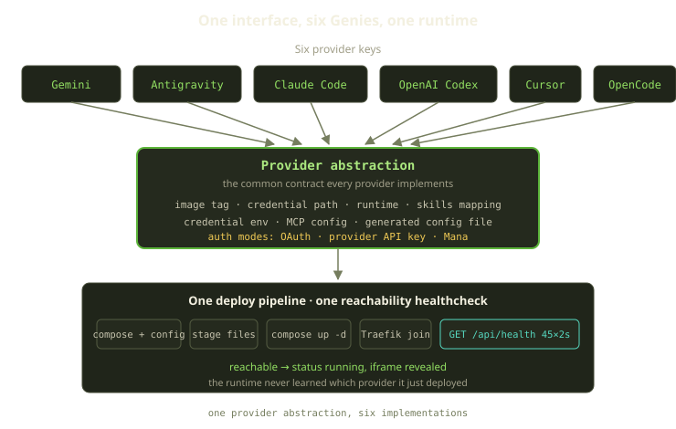
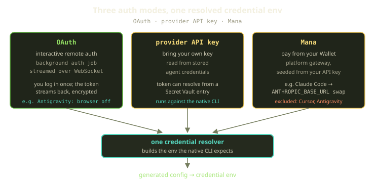
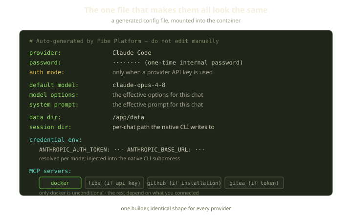

A Genie is an AI coding agent that lives next to your code. On Fibe you spin one up, it gets its own subdomain, and you talk to it in a pane in the browser. Behind that pane is a Docker Compose project running as a sidecar on your Marquee. The interesting part is that the same machinery runs Gemini, Antigravity, Claude Code, OpenAI Codex, Cursor, and OpenCode — six providers with six different CLIs, six different credential layouts, and six different opinions about how authentication should work — and the runtime that deploys them does not know, or care, which one it just shipped.

That last sentence is the whole design. When you can add a coding agent without touching the deploy pipeline, the reconciler, or the healthcheck, adding the seventh provider stops being a project and becomes an afternoon.

<!-- truncate -->

## The contract, not the agents

The temptation, early on, is to special-case. Claude Code wants creds in `~/.claude`. Codex insists on a `CODEX_HOME`. Gemini writes a settings file with an auth block. If you let those differences leak into the runtime, you end up with a "if this is Gemini, do that" branch sprinkled through your deploy code, and every new agent is a new set of branches in a dozen files.

We went the other way. There is exactly one place that knows the per-provider details — a single provider abstraction — and everything downstream consumes a uniform contract.

The platform recognizes six provider keys today: Gemini, Antigravity, Claude Code, OpenAI Codex, Cursor, and OpenCode. Each key resolves to a small config object: an image tag, a credential path, a runtime, and a skills mapping. That is the entire surface the rest of the system sees — a fixed, named list on one side, and a uniform shape on the other.

| Provider | Image | Credential path | Notable nuance |
|---|---|---|---|
| Gemini | `gemini-latest` | `~/.gemini` | personal OAuth or API key |
| Antigravity | `antigravity-latest` | `~/.gemini` | OAuth-code via remote auth; browser disabled |
| Claude Code | `claude-code-latest` | `~/.claude` | always exports env creds; Mana swaps the base URL |
| OpenAI Codex | `openai-codex-latest` | `~/.codex` | uses `CODEX_HOME` |
| Cursor | `cursor-latest` | `~/.cursor` | injects a Cursor rule file; no Mana |
| OpenCode | `opencode-latest` | `~/.local/share/opencode` | routes to OpenRouter / Anthropic / Gemini / OpenAI / DeepSeek |

The provider table is data, not control flow. Adding a row to it gets you most of the way to a working Genie; the runtime below the line never changes.

## Three ways to say "I'm allowed in"

Every provider has to answer one question before it can do anything useful: where does the credential come from? We boiled the answer down to three modes, carried as a flat list — OAuth, a provider API key, or Mana.

- **OAuth** — you authenticate interactively. The platform runs a background auth job, streams the back-and-forth over a live WebSocket, and the resulting token comes back encrypted at rest. This is the "log in with your account" path.
- **Provider API key** — bring your own key. We read it from the agent's stored credentials, or resolve a linked key out of the Secret Vault so the raw value never has to sit in plain config.
- **Mana** — you don't have a key, so you pay from your Wallet. The platform acts as a gateway, seeded from your Fibe API key. For Claude Code this is a clean trick: we hand the runtime an auth token and rewrite the Anthropic base URL to point at our gateway, so the unmodified Claude Code CLI bills through us without knowing it.

Two providers opt out of Mana entirely: Cursor and Antigravity. They authenticate through their own flows and have no gateway path, so the wallet mode simply isn't offered for them.

:::note
Whatever mode you pick, the resolution funnels through one place that produces the exact set of environment variables the native CLI expects. The runtime downstream consumes a generic map of variables; it doesn't branch on the mode.
:::

The auth *lifecycle* is shared too. It's a plain status field — no state-machine library, just a small set of allowed values and a few transitions between them. An agent moves through a handful of states: it starts out pending, becomes authenticated once a credential lands (regardless of which mode got it there), can slide to expired when a token's expiry passes and back to authenticated on re-auth, can be revoked (which wipes the stored credentials), and finally enters a deleting state where a background job tears down any chats before the record goes away. Six providers, one lifecycle.

## One file to make them look the same

When you start a chat, the deploy runs under a Redis lock with a 30-minute timeout, and the first thing it generates is a Compose project plus a small generated config file. That file is the bridge between "six different agents" and "one runtime." It's mounted into the container, and our NestJS agent runtime reads it to decide how to launch and authenticate the native CLI inside.

The shape is the same for every provider. A single generated YAML document carries a handful of fields:

- which provider this is, and a one-time internal password the runtime uses to talk to the chat;
- the default model and its options, plus the effective system prompt;
- the data and session directories the native CLI should write to;
- a credential-environment block — the resolved set of variables the native CLI expects, including (for Claude Code) the auth token and the rewritten base URL when Mana is in play;
- an MCP block describing which tool servers to wire up.

A few values are deliberately *not* in the file. The Fibe API key, the domain, and the agent and Marquee identifiers stay as individual environment variables, because the Go SDK/CLI baked into the image reads them directly. Everything else moved into the file. This was a real migration: the runtime used to receive one giant JSON settings blob as an environment variable, and pulling it into a mounted config got us out of shell-escaping hell and made the settings inspectable on the host.

The MCP block is worth a closer look, because it's the one place people assume more is guaranteed than actually is. Only the Docker MCP server is unconditional — it's always present. The Fibe server appears only when an API key is present; GitHub depends on a connected installation; Gitea depends on a token from your Props binding. The generated file for a freshly created agent with no integrations connected has exactly one MCP server in it, and that's correct.

## The same pipeline, the same healthcheck

Here's the payoff. Once the generated config exists, the deploy is provider-agnostic, step for step:

1. Render the Compose YAML and the generated config file.
2. Stage the agent's instructions file and any enabled skills, and re-download mounted files.
3. Sync DockerHub creds and hand back a Docker config.
4. `docker compose up -d --remove-orphans --force-recreate`.
5. Connect the project's network to Traefik.
6. Wait until reachable.

Step 6 is the same probe for all six providers: a plain `GET /api/health`, polled up to 45 times at 2-second intervals in production, with 2-second timeouts on each attempt.

The probe distinguishes a handful of outcomes — reachable, an SSL handshake error, a timeout, a refused connection, a DNS error, or otherwise unreachable — and the runtime treats those identically no matter what's inside the container. A reachable result flips the chat to running and reveals the iframe. An SSL handshake error becomes a "pending TLS" state and is explicitly *not* a failure, because a wildcard cert sometimes lands a beat after the container does. A timeout is a transient no-op; the reconcilers bail out on it rather than redeploying.

:::tip
The SSL carve-out is one of those small decisions that quietly eliminates a class of flapping. Traefik requests a `*.domain` wildcard via ZeroSSL (EAB) and acme-dns; for a few seconds after a fresh deploy the cert may not be installed yet. Treating that handshake error as "pending, not broken" means a perfectly healthy Genie never gets torn down for a TLS race it was always going to win.
:::

Everything after the deploy is shared too. The Playguard reconciler runs every 60 seconds, and for a running chat it only ever does one thing if something's wrong: enqueue a redeploy. There's a two-minute grace window — a chat that started up less than two minutes ago is left alone — and a missed healthcheck never stops or errors a running chat. The worst case is a re-run of the same provider-agnostic deploy. Drift gets repaired the same way: rotate an API key, change a mounted file, toggle a skill, and the chat re-stages its files, force-recreates, and re-attaches to Traefik. No provider branch anywhere in that loop.

## The nuances that didn't leak

The honest test of an abstraction is what it does with the awkward cases — the ones that *want* a special case. We have a few, and the discipline was to absorb them inside the provider abstraction rather than let them surface in the runtime.

- **Antigravity has no GUI to drive.** Its OAuth happens through our remote auth service as an authorization-code exchange, so the container ships with the browser turned off — a couple of environment variables point the "open a browser" hook at a no-op and blank out the display. That's a few entries in a provider config, not a conditional in the deploy job.
- **Gemini's auth lives in a file.** When you use a Gemini API key, we patch the generated settings file so its auth block selects the API-key type. The runtime doesn't know that happened; it just mounts the file.
- **Cursor wants a rule, not a prompt.** Its skills mapping drops a Cursor rule file into `~/.cursor/rules/`, using the same staging mechanism every provider uses for the instructions file and skills.
- **OpenCode is a meta-provider.** A single OpenCode agent can route to OpenRouter (the default), Anthropic, Gemini, OpenAI, or DeepSeek, plus custom endpoints. All of that is credential-environment routing, resolved before the generated config is written.

Each of these is exactly the kind of thing that, handled badly, metastasizes into the rest of the codebase. Handled inside the contract, they're four bullet points.

## What we learned

The thing we'd underline for anyone building a multi-provider agent platform: **draw the line once, and put the entire mess on one side of it.** Our line is the provider abstraction plus the generated config file. Above it, six CLIs with six personalities. Below it, one deploy pipeline, one reachability probe, one auth lifecycle, one reconciler.

- The runtime is provider-agnostic by construction, not by convention. There is no "if this is provider X" branch in the deploy path, so there's nowhere for provider-specific rot to accumulate.
- The auth modes — OAuth, a provider API key, and Mana — and the pending-through-revoked lifecycle are shared across all of them, which means features like Secret Vault resolution or wallet billing land for every provider at once.
- The genuinely provider-specific bits (a disabled browser, a patched settings file, a meta-router) are confined to the config layer, where they're small and visible.

Six providers behind one interface isn't the achievement. The achievement is that the seventh won't make this post any longer.
