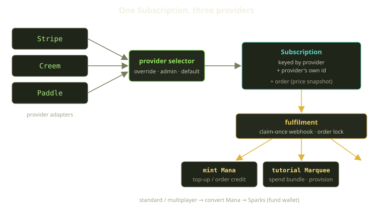
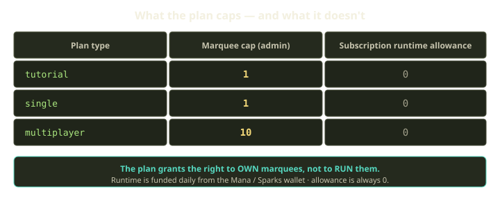

Most of our billing code does not know which payment provider charged the card. That is on purpose, and one of our better early decisions.

Fibe takes money through three processors — Stripe, Creem, and Paddle — but the rest of the platform sees exactly one thing: a subscription record and a paid order. The provider name is just a stored string. Everything downstream — minting Mana, provisioning a tutorial Marquee, converting to Sparks, the daily funding sweep that keeps your environment alive — reads from that neutral layer and never branches on "is this Stripe or Paddle." Here's how, and why it earns its keep.

<!-- truncate -->

## Why three providers at all

No single processor covers everyone we want to serve. Card networks, regional acquiring, supported countries, and — the big one — tax handling differ wildly. Paddle and Creem act as merchant of record where running our own tax compliance would be a multi-quarter project; Stripe gives us the most direct control and richest API. We wanted the freedom to pick per region — or flip a provider entirely during an outage or a pricing change we don't like — without a code change rippling through fulfilment.

The trap with multi-provider billing is letting the provider's shape leak — each one has its own webhook envelope, its own idea of a "subscription," its own event taxonomy. If fulfilment ever branches on the provider, you have three half-tested billing systems wearing a trenchcoat. So the first rule: **the seam is at the edge, and only at the edge.** Translate each provider into our vocabulary immediately, then never speak provider again.

## The neutral key

The whole abstraction hangs on one composite identity. A subscription mirrors whatever lives in the provider, keyed by the pair of the provider name and the provider's own subscription id — not the id alone, since two providers can hand us the same opaque string meaning two different things. Everything else — the plan, the status, the current billing period — lives on this one record regardless of who issued it, so downstream code reads a single uniform shape.

One bit of historical baggage: some columns still carry Stripe-flavored names, because Stripe was our first integration and the schema was named after it. Rather than risk a wide rename, we kept provider-neutral names at the application layer and let the older names sit underneath as aliases. Starting fresh? Name everything provider-agnostic on day one.

## Selecting a provider at checkout

Picking the provider is isolated in one small component that does nothing else. It resolves the choice in a strict precedence order and records *why* it landed where it did, so we can later audit why a checkout went to one processor over another. Three tiers, in order:

1. **Trusted override** — an explicit provider name from the caller, honored only when the caller has opted into trusting it. We don't let an arbitrary request choose where money flows; the override exists for internal, vetted paths.
2. **Admin setting** — the day-to-day knob: want all new checkouts on Creem next week? Flip it, no deploy.
3. **Default** — the configured fallback, when nothing else is set.

Whatever the selector returns is validated against a single catalog — the one place that knows the three concrete providers exist. It maps a name to its implementation and rejects anything it doesn't recognize, the *only* place we tolerate branching by provider name: a string in, an implementation out. Adding a fourth provider means implementing the shared interface and registering it there. Fulfilment, orders, the wallet, provisioning — all untouched.

## Orders snapshot the price

A rule that has saved us more than once: **prices are captured at purchase time, not read at fulfilment time.** When a checkout starts, we create an order in a pending-payment state and freeze the amount and currency into it. From then on, the order *is* the price; nothing recomputes it.

Why bother, when the webhook tells us the amount? Because a webhook can land minutes or hours after the order — retries, provider lag, our own downtime — and in that window a catalog price could change, so recomputing live could mint the wrong amount of Mana. The snapshot gives a stable contract: this order was for *this* amount. Fulfilment confirms the provider collected at least that, rather than re-deriving what it should have been.

That confirmation is a hard gate. Before any money is minted, fulfilment locks the order so two workers can't race it, validates the captured payment against the frozen snapshot, and refuses an underpayment. The sequence — lock, verify, mint — means an underpayment never reaches the minting step.

## Fulfil once, even when the webhook fires twice

Payment webhooks are at-least-once by nature. Every provider will eventually deliver the same event twice — and you must mint Mana exactly once anyway. So the first thing the webhook handler does is try to *claim* the event using the provider's own event id; the claim is recorded durably and scoped to the provider, so the same id arriving from two processors can never be mistaken for the same event — the neutral key again. The first delivery wins the claim and proceeds into fulfilment; the second finds the event already claimed and returns a clean no-op. That single guard turns at-least-once delivery into effectively exactly-once handling.

Idempotency is belt-and-suspenders below that line too. Every write to a wallet carries an idempotency key; if a write with that key already exists, the wallet returns the existing transaction instead of crediting twice. And the order lock keeps two concurrent workers from running fulfilment in parallel — a safety net beneath the claim-once fast path.

## What fulfilment actually does with the money

Minting Mana is step one; what happens next depends on the order kind. Mana is the tutorial-side internal currency, Sparks the standard runtime currency. Fulfilment fans out:

| Order kind | What fulfilment does |
|---|---|
| Mana top-up | a straight Mana credit to the wallet |
| Tutorial purchase | spend the Mana bundle, publish a provision-requested event, mark the environment paid through its term |
| Standard / multiplayer | convert Mana into Sparks to fund the runtime wallet |
| Recharge subscription | mint a fresh slug of Mana each billing period |

The tutorial path is the most fun. A paid tutorial checkout publishes a provision-requested event that provisions a tutorial Marquee — a Scaleway VM, Cloudflare DNS, an acme-dns registration, and a Traefik bootstrap that warms a `*.{domain}` wildcard certificate from ZeroSSL before the environment flips to active. None of that machinery cares which provider paid; it reacts to an internal event.

The standard path converts Mana into Sparks, deliberately one-way — a Mana debit and a Sparks credit inside a single transaction, so the two halves can never drift apart. Funding flows in, never back out to a card.

Recharge subscriptions are where the subscription record earns its name. With auto-recharge on, each billing period mints a fresh slug of Mana: the subscription is the durable thing the provider keeps charging, the wallet what gets topped up.

## The thing that surprises everyone: the plan doesn't fund runtime

This is the most common misread of our billing model. Ask the subscription how much *runtime* it entitles you to, and the answer is always zero. What it grants is the right to *own* marquees, capped by an administrator-set limit that varies by plan type — one for tutorial, one for single, ten for multiplayer. Those caps are ownership ceilings, silent on what runs.

So what keeps a Playground, a Trick, or an AgentChat alive? The **wallet**. Once a day, funding debits the day's cost from the Mana or Sparks wallet and pushes the Marquee's paid-through time to the end of the service-day. Runtime is entitled only while that time is in the future (super-admins aside). When the wallet runs dry, funding has nothing to debit, the paid-through time stops advancing, and a payment-required response — an HTTP 402 meaning "this Marquee isn't funded" — trips across every operation that touches the host.

:::note
**The plan caps how many marquees you may have; the wallet decides whether they run today.** Conflating those two axes would couple the subscription to live runtime in exactly the way we spent this whole post avoiding.
:::

It also decouples provider choice from runtime: switching a Player from Stripe to Paddle changes nothing about how their environments are funded, since funding reads the wallet — filled by a fulfilment that was provider-neutral two layers up.

## What we learned

A few patterns generalize beyond Fibe:

- **Push the provider seam to the very edge,** and key your mirror by provider plus provider id — opaque ids that collide as strings stay distinct without synthetic keys.
- **Snapshot prices at purchase, confirm at fulfilment.** A webhook is a delayed message from the past; a late delivery shouldn't mint against a price that has since moved.
- **Make fulfilment idempotent in layers** — claim-once as the fast path, per-write keys and the order lock as the net. At-least-once delivery isn't a maybe, it's a when.
- **Separate "may own" from "may run,"** so provider choice, plan limits, and runtime evolve independently.

Three providers, one subscription, and a billing core that has never needed to ask who charged the card. Like most good abstractions, the best sign it's working is how rarely anyone has to think about it.
