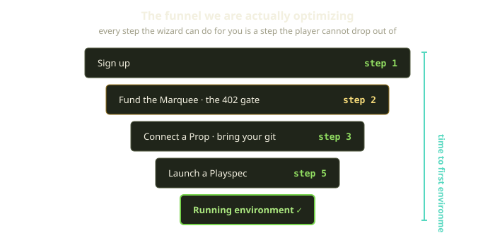
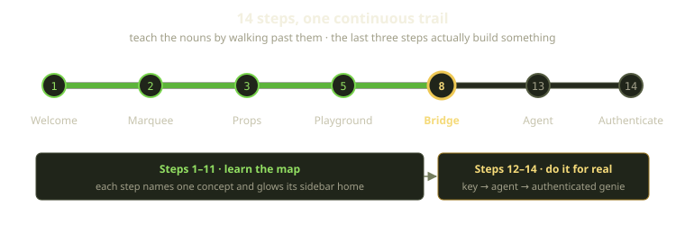
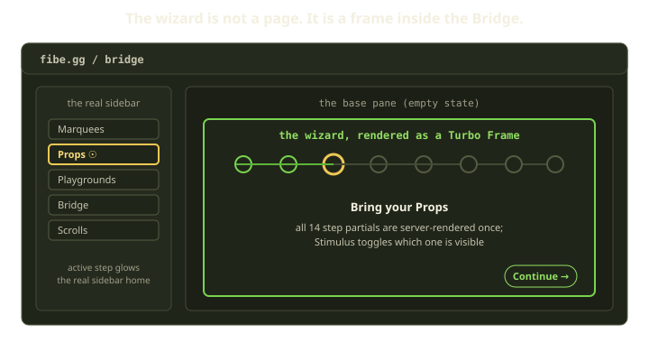

Fibe has a vocabulary problem, and we knew it the day we shipped. A new player signs up and within thirty seconds must hold a half-dozen made-up nouns in their head: Marquees, Props, Playspecs, Playgrounds, Tricks, Crumbs, the Bridge. None mean what they mean anywhere else — you cannot Google "what is a Marquee" and get our answer. The first time someone lands in the app, the dashboard is empty and every label is a word they have never seen, on a concept they do not have.

You can solve that with documentation. We tried. Nobody reads it. So we built an onboarding wizard that walks a brand-new player from a blank account to one real, running environment — teaching the nouns by doing, not reading, and never sending them to a manual.

<!-- truncate -->

## The two goals, and the tension between them

Onboarding for a conceptually rich platform pulls in two directions. The first goal is obvious: **reduce time to first environment.** A player who gets something running in their first session comes back; one who bounces off an empty dashboard does not. Every extra click and every form figured out alone is a leak in the funnel — and the early steps leak worst, where the player has invested and trusts least.

The second goal pulls against the first: **the player has to understand what they built.** A Fibe player owns infrastructure — a Marquee is a real Docker host, billed daily, that real Playgrounds run on. Whisk someone to a running environment without grasping what a Marquee or Prop is and you have a magic trick, not a mental model; next time, they are lost.

So the constraint: get to a running environment as fast as possible, *while* leaving the player able to draw the map afterward. Speed without comprehension is just churn deferred a session.

:::tip
The reframe that unlocked this: stop thinking of onboarding as "a tutorial that ends" and start thinking of it as "the empty state that happens to be guided." The wizard is not a flow you exit into the app — it *is* the app, with a guide beside you, dissolving as the empty state fills in.
:::

## Teaching the nouns by walking past them

The wizard is a fourteen-step trail: the first eleven tour, the last three build. The order is fixed and lives in exactly one place — a single ordered list mapping each step number to the content it renders. The progress bar and the content area both read from that list, so the two can never disagree, and re-ordering the tour is a one-line change rather than a hunt through the codebase.

The trail runs Welcome, then the eight product nouns a player has to hold — Marquee, Props, Playspecs, Playgrounds, Tricks, Crumbs, the Bridge, the Bazaar — then Scrolls and the player's profile, and finally the three steps that actually build: an API key, an Agent, and authentication.

Each early step names a single concept in two short sentences of plain language. The Marquee step says a Marquee is "the server stage where your Playgrounds and genies run"; the Props step says Props are "reusable repositories and source materials you bring into Playgrounds." Three rules shaped that copy.

**One concept per step.** We never introduce two nouns in the same breath. If a step needs a concept the player has not met, the ordering is wrong.

**Concrete over clever.** Half these features have whimsical names and we lean into the theme — but the *first* sentence a player reads is function, not lore. Flavor comes after.

**The continue button advances toward the goal.** The welcome step's label is "Enter Fibelands"; the Marquee step's is "Raise the Marquee." Every button is phrased as the next action, not a generic "next" — so the player feels they are moving toward something, not flipping pages.

### The glow that ties the lesson to the map

Here is the part we are proudest of. On each step, the wizard reaches into the real sidebar and makes the matching nav item glow — pairing each step with the sidebar item it teaches, finding that item in the live sidebar, and toggling a highlight class on it.

So on the "Bring your Props" step, the Props item lights up — anchored to where that concept lives once the wizard is gone, so the player learns the word *and* its address at once. By the time onboarding ends, every noun has glowed in its home; the sidebar is no longer a wall of jargon but a set of places they know.

The whole effect is a tiny lookup plus a class toggle — almost nothing in code, yet the highest-leverage thing in the flow, and the kind of detail that does not survive a "let's just ship the tutorial" sprint unless someone fights for it.

## It is a frame, not a page

The most important decision: the wizard is not its own page. It renders as a Turbo Frame inside the Bridge — our control surface — where the empty state would otherwise be.

The wizard "route" does almost nothing on its own. It checks that the player is allowed to onboard, then hands off to the Bridge, carrying along which step and which agent the player was looking at — the wizard is just a way of asking the Bridge to render itself in guided mode.

The Bridge embeds it with a single Turbo Frame in the base pane. The frame targets the top-level document so that finishing the tour navigates the whole page rather than swapping a fragment, and it replaces history entries as the player moves so the back button behaves. That is the entire integration: one frame, in the one place the empty state used to be.

Why this trouble instead of a standalone `/onboarding` page? Three reasons.

**The player is already home.** When the wizard finishes, there is no transition, no "you're all set, click here to enter the app." The frame is already inside the app, and the empty state fills in with the thing they just built. The seam between being onboarded and using the product never exists.

**The sidebar glow is free.** Because the wizard renders alongside the real sidebar in the real shell, lighting up a nav item is a plain DOM lookup. Its own page would have meant faking a sidebar — and a fake sidebar teaches a fake map.

**Server-rendered components, no SPA.** Our front end is a Rails monolith with server-rendered view components and Turbo, and the wizard is no exception — fourteen step partials composed into the Bridge. No separate bundle, no client-side router, no second source of truth for "what is a Marquee."

:::note
"Server-rendered" does not mean "a round-trip per click." All fourteen step partials render into the frame at once, each in a hidden container, and a small Stimulus controller decides which is visible. The trade-off — a heavier first paint for instant, offline-feeling transitions — is right for fourteen Continue clicks in a row.
:::

## The last three steps are the point

Steps twelve through fourteen are where the wizard stops talking and starts building.

| Step | Concept | What the wizard does for you |
|---|---|---|
| 12 | API key | Creates a real API key (defaulting the label to "Wizard Key" and full scopes if you do not narrow them) |
| 13 | Agent | Creates your first AI genie as a resource you own, inside a single transaction |
| 14 | Authenticate | Stores the genie's credentials so it can actually start working |

Creating the first agent is a real write, and it is all-or-nothing. Three things happen together: the Agent is created, it is linked to the player as something they own, and any files the player chose to mount are saved. A single transaction means they all land or none do — no half-made agent with no files, no files with no agent to belong to.

There is a small, sharp behavior at the end that we love. When you finish that first agent, the wizard checks whether it is the *only* agent you can see — and if so, jumps you straight to authentication instead of a generic landing spot. If you already have other agents, it lands you on the one you just made without forcing that step.

The same instinct shows up when a returning player lands on the Bridge with exactly one unauthenticated agent: rather than a generic empty state, the Bridge promotes them right back to the authenticate step — the one thing between them and a working setup — no re-walking the tour.

That is the philosophy in one redirect: the goal is not "complete the tutorial," it is "have a running environment."

## What we learned

A few things generalize beyond Fibe.

- **For a jargon-heavy product, onboarding is vocabulary acquisition.** Teach it like a language: one word at a time, each anchored to where it lives so the word has an address, not just a definition.
- **Make the tour part of the app, not a layer over it.** A tutorial floating over your product teaches a map of a different building.
- **The last steps should do, not describe.** The player does not finish knowing *about* Fibe; they finish *using* it.
- **Let people skip backward, and respect their motion settings.** Tiny branches are the difference between respecting a player and herding them.

The empty dashboard is still there underneath. We stand next to the player while it fills in, name each thing as it appears, and step away the moment they have something running. The best onboarding is the one you stop noticing — by then it has become the product.
