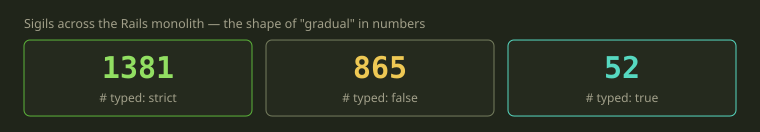
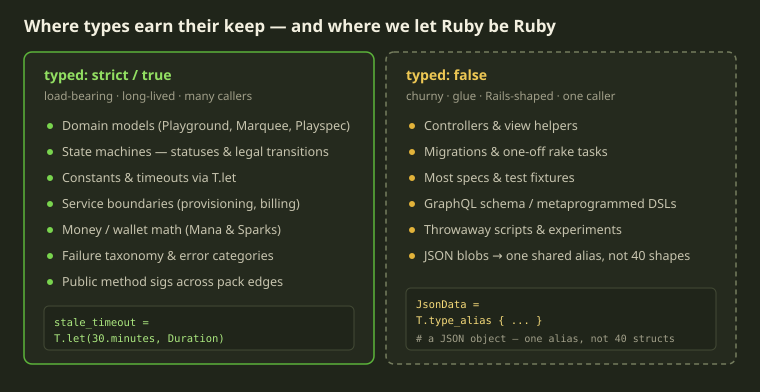
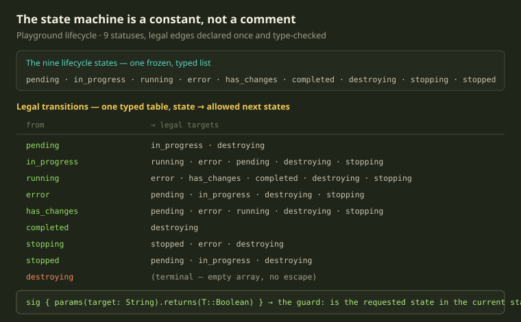

Fibe runs Docker development environments for people, and the brain of that is a Rails modular monolith. It decides when a Playground is healthy, when to tear one down, when a Wallet has run dry, and when a state transition is illegal and should be refused. That code is dynamic Ruby, and it is load-bearing in the most literal sense: get a state transition wrong and you destroy someone's running environment.

So we type it — but not all of it. Typing every line of a Rails app is a great way to spend a quarter and ship nothing. We type the parts where a wrong shape becomes a wrong outcome, and leave the rest dynamic. This post is about where that line is.

<!-- truncate -->

## The honest pitch for Sorbet

[Sorbet](https://sorbet.org) is gradual: every Ruby file carries a sigil comment — `# typed: false`, `# typed: true`, or `# typed: strict` — and the strictness is per-file. That single design decision is what makes it usable in a codebase that already exists: you don't convert an app to Sorbet, you turn the dial up on the files that deserve it. The shape of "gradual" in our monolith today:

Roughly 1,381 files at `# typed: strict`, 865 still at `# typed: false`, and a small band of 52 at `# typed: true`. That `false` column isn't debt we're ashamed of — much of it is migrations, glue, and code with one caller, where types would cost more than they'd catch. The rule, boring and effective: **type the load-bearing domain, leave the churn dynamic.**

:::note
A quick sigil cheat sheet. `# typed: false` only checks syntax and resolves constants. `# typed: true` checks calls and `sig` signatures but tolerates untyped code flowing through. `# typed: strict` requires every method, constant, and instance variable to have a declared type — which is why we reach for it on core models, so an untyped value can't sneak in unnoticed.
:::

## Constants that can't lie

Sorbet's highest-leverage trick for us isn't fancy generics — it's making constants honest. The model that represents one running environment is the most `# typed: strict` file we own, and the top of it reads less like Ruby and more like a specification. The class-level config — the default lifetime of an environment, the timeout after which a half-built environment is considered stale — is declared with `T.let`, pinning each constant to a type. A duration is declared a duration.

In plain Ruby, a constant is whatever the right-hand side evaluated to. We want that staleness timeout to be 30 minutes. Six months later somebody refactors a helper, the expression quietly returns an integer number of *seconds*, and now your "30 minute" timeout is 30 seconds — discovered in production, at 2am, by a reconciler that tore down a healthy environment. `T.let` makes that a compile-time error, and documents the unit so a reader knows it without running the code.

We do the same for the lookup maps that translate an internal step key into a human-facing progress label like `"Building Images"`, the strings a Player watches scroll by while their environment spins up. Each is typed as a hash from string to string, so you can't accidentally stuff a symbol key or a non-string label into a map the UI renders directly.

:::tip
If you adopt only one Sorbet habit, make it `T.let` on your important constants. It needs no `sig` plumbing and catches the genuinely scary bug: a value that's the wrong *type* but the right *truthiness*, so every test still passes.
:::

## The state machine is a constant, not a comment

A Playground moves through nine lifecycle states — pending, in progress, running, has-changes, completed, stopping, stopped, error, and destroying — and not every move is legal. A completed environment can only go to destroying; a destroying one is terminal, the row gets deleted, no coming back. Encode those rules wrong and you silently corrupt the lifecycle of a customer's environment.

So instead of leaving the rules in a comment or scattering them across a dozen `if` branches, we encode the whole transition table as a single typed constant: a frozen map from each state to the list of states it's allowed to move into, declared with `T.let` as a hash from string to an array of strings. The legal graph lives in exactly one place, and its shape is checked at build time.

The guard that consumes it is four lines, typed end to end: its `sig` says the target state is a string and the method returns a boolean. Pinning that argument to a string means you cannot pass a symbol like `:running` and have the check quietly return false because a symbol never equals the string `"running"` — Sorbet rejects the call at the boundary. And because the table is typed against the same string-keyed vocabulary the rest of the model uses, the table and the set of states can't drift apart without somebody noticing.

There's a subtlety worth being honest about — the kind of thing types *don't* solve. Not every real status change goes through that guard. A handful of recovery paths — the reconciler deciding a stopped environment is actually healthy again — write the new state directly, deliberately stepping around the table because they're reconciling against Docker's ground truth, not requesting a user-driven transition. Those writes are intentional and carry comments. Types guarantee the table is internally consistent; they can't stop a developer from going around it with raw SQL. For that you need a reviewer who knows the rule.

## Sigs as the contract at a service boundary

Fibe's monolith is organized into [Packwerk](https://github.com/Shopify/packwerk) packs — provisioning, templates, billing, shared kernel — each with an explicit public surface. Packwerk enforces *which* packs may call into a pack; Sorbet's `sig` annotations enforce *what shape* those calls take. When a creation step in the provisioning pipeline fails, the failure is routed through a method whose signature accepts our own structured creation error — not a generic `StandardError`, not an untyped exception. Hand it the wrong exception class and Sorbet objects before the error-handling code — the code you least want to be wrong — ever runs. And unlike a comment or a YARD `@param`, that contract can't fall out of date, because the build fails if it's wrong.

## Where we stop, and why that's deliberate

The discipline that makes Sorbet sustainable is knowing where to *stop*:

| We type it | We leave it dynamic | Why |
|---|---|---|
| Domain models, state machines | Controllers, view helpers | Models outlive a hundred request cycles; a controller is read once and rewritten |
| Money math (Mana / Sparks wallet) | Most specs and fixtures | A wrong type in billing is a refund; a wrong type in a spec is a red test |
| Public methods crossing pack edges | Private one-caller helpers | Boundary contracts have many callers; a private helper has one and you can see it |
| Constants and config via `T.let` | Migrations and one-off rake tasks | Constants are referenced everywhere forever; a migration runs once |
| The failure taxonomy that drives retries | Metaprogrammed DSLs (GraphQL schema) | Retry logic is safety-critical; heavy metaprogramming fights the type checker and loses |

The JSON case deserves its own note, because it's where most "type everything" projects go to die. Our environments are described by Templates and Playspecs, which carry arbitrary user-supplied configuration — nested, schemaless, genuinely dynamic. You *could* try to model every shape; we don't. We define one shared type alias with `T.type_alias` — a single name for "a JSON object whose values are raw JSON" — and use it everywhere we pass a config blob around. It states the only thing that's true and stable about that blob, without pretending we know an inner shape we don't. Encoding every Playspec variant as a struct would be a fiction, and a fiction is worse than honest dynamism. The `sig` instead goes on the boundary that *parses* a known field into a known type. Type the edge where ambiguity collapses into a real value, not the soup in the middle.

:::warning
The failure mode to avoid is dogma. Once a team adopts a type checker, there's a pull toward marking everything `strict` and treating `typed: false` as a moral failing. Resist it. A `# typed: false` migration that runs once and gets deleted isn't debt — it's correctly-scoped pragmatism. The cost of typing is real — sigs to write, RBI files to maintain, the type checker to fight when metaprogramming gets clever — so spend it where the payoff is.
:::

## What we'd tell another Rails team

The wins were never "we caught a `NoMethodError`" — they were constants that can't silently change type, a state machine consistent by construction, and contracts that can't go stale. If you're wondering whether Sorbet is worth it on a large dynamic codebase:

- **Start with constants, not methods.** `T.let` on your important class-level config is the highest ratio of safety to effort in the whole tool — an afternoon's work.
- **Type the nouns before the verbs.** Domain models and their invariants — statuses, transitions, money — earn types fastest; controllers and view glue earn them slowest, if ever.
- **Let `typed: false` be a real answer.** A codebase that's 40% `false` and 100% intentional about *which* 40% beats one that's uniformly `strict` and quietly miserable.

Static types in a dynamic language aren't a religion and aren't a betrayal of Ruby. They're a tool you point where being wrong is expensive, and put down everywhere else. For a platform whose job is keeping people's environments alive, that's the models, the money, and the state machine — and that's where Sorbet lives.
