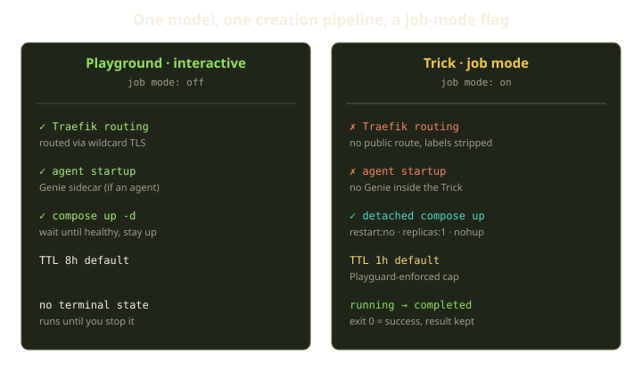
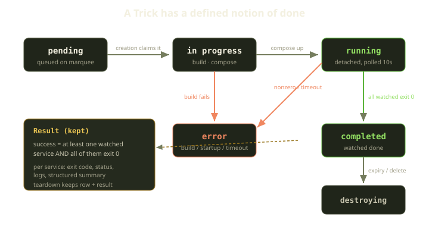
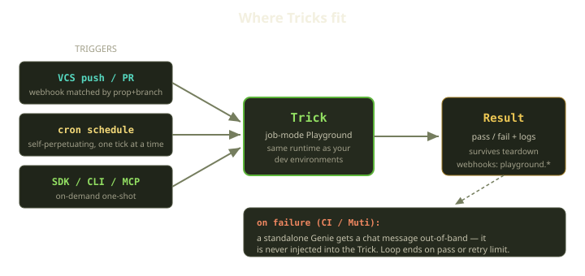

Most platforms ship a development environment and a CI system as two separate products. They drift. What worked in your dev container fails in CI for reasons nobody can reproduce, and you lose an afternoon discovering the CI runner is on a different base image, network, everything.

We didn't want two runtimes. A **Trick** is a Playground with one flag flipped — *job mode* — running the *exact same* environment engine, on the same Marquee, from the same Template. It has no UI to attach to and a defined notion of *done*: it runs, it exits, it records a result. If your tests pass in a Playground, they pass in a Trick — there's no second runtime to drift away from.

<!-- truncate -->

## A Trick is not a separate thing

There is no separate "Trick" type anywhere in the codebase — just a Playground whose Playspec carries a single boolean: job mode, on or off. Everything else — the model, the provisioning, the runtime — is shared; to operate on Tricks alone, we filter Playgrounds down to the ones in job mode. The one structural addition is that a Trick owns a result record, the entire point of the feature; we'll come back to it. First, what changes when the flag flips.



## Same pipeline, fewer steps

Both go through one creation pipeline — a single ordered list of provisioning steps. The job-mode differences are conditional skips on a couple of them, not a forked code path, which is a path that rots. New steps apply to both by default; you *opt out* for Tricks, which fails safe. The pipeline still does the shared work: clone the branch, authenticate to the registry, build the image, tear down anything stale, generate the Compose project.

Two steps get skipped in job mode:

**No Traefik.** A Trick has no public route — no browser to attach to, so no wildcard cert slot, no Traefik wiring. Generating the Compose project even strips the routing labels off the services so nothing tries to publish them.

**No Genie.** This one surprises people: a Trick does *not* carry an AI coding agent. The agent-startup step is skipped, so there's no Genie sidecar inside the job. The CI-fixing Genie people imagine on hearing "AI CI" is real, but it lives elsewhere.

Every other step is identical — a Trick is your environment, minus a front door and a chaperone.

### The launch is detached

An interactive Playground waits until services are healthy, because you're about to connect. A Trick doesn't — for a one-shot job, "exit" is a healthy outcome. So job mode sweeps away leftover containers, then launches the Compose project detached so the launcher returns immediately, writing breadcrumbs to disk — start time, combined logs, eventual exit code, process id — that the completion machinery reads later. No daemon holds the run open, just files on the Docker host.

Compose is pinned for one-shot semantics: no restart on exit, a single replica per service. A dev service that crashes should come back; a job step should *stay down* so we can see it failed. Creation then enqueues a completion job.

## A defined notion of done

This is where Tricks earn their keep. An interactive Playground runs until you stop it; a Trick must drive itself from *running* to *completed*, and getting that right is most of the work. A background completion job polls the running Trick every 10 seconds, up to 1440 polls — a roughly four-hour window before it marks the job timed out. Each poll asks one question: are the *watched* services done?



That word — **watched** — is doing a lot, because not every container is part of the job's outcome. Your test runner is; the Postgres it talks to is not — when the tests finish, the database is still happily running, and waiting for *that* to exit would wait forever. So a service opts in with a label:

```yaml
services:
  tests:
    labels:
      "fibe.gg/job_watch": "true"
```

A Trick is done when any watched service exited non-zero, all reached a terminal state, or one is blocked by a failed dependency. The success rule is deliberately strict: a job succeeds only if there was **at least one** watched result *and* **every** watched result exited zero. An empty watched set isn't success, it's a misconfigured job — and we'd rather fail loudly than green-check a Trick that never ran.

For each watched service we capture exit code, status, finished-at, and the last 5000 lines of logs (1000 for auxiliary services). Then teardown runs — with a twist: we bring the containers down but tell teardown *not* to delete the database record, so the Playground row and its result survive and your logs outlive the job that produced them. A completed Trick is terminal: it won't accept a lifetime extension or a rollout.

:::note
Marking a Trick completed is idempotent. A unique constraint guarantees one result per Playground, and a second attempt to record one is caught and treated as a no-op. Poll loops retry, so double-completion is a fact of distributed life — better a quiet no-op than a crash.
:::

## Scheduling and triggers

A Trick is a one-shot; the interesting part is what fires it. Three doors, all to the same runtime.



**VCS triggers.** A push or PR webhook arrives, we match it against job-mode Playspecs by prop and branch, then publish a trigger event. A background trigger job re-checks that the trigger is still enabled, confirms the Marquee is funded and launchable, and creates a pending Trick named for the Playspec and commit it's building. The standard not-funded gate applies: an unfunded Marquee gets a payment-required (402) response, so CI you don't pay to run doesn't run.

**Schedules.** There is no central cron table. A job-mode Playspec carrying a `schedule_config` re-enqueues its own next run: when the scheduled job fires, it parses the cron expression for the next due time and schedules a copy of itself to run then — perpetuating one tick at a time rather than via a global ticker. If it wakes within a few seconds of the due time it launches a Trick on the funded Marquee; otherwise it re-arms. Each run re-checks that the schedule is still enabled, so disabling one quietly stops it — a small, self-healing loop for nightly jobs.

**On demand.** The SDK, CLI, and MCP launch a Trick directly — ad-hoc batch work, a one-off migration check, anything you run once.

## How failures become fixes (out of band)

Now the Genie. When a CI Trick fails *and* the Playspec has a trigger agent configured, completion publishes a failure event, and a subscriber hands that failure to a standalone Agent — a separate Genie with its own chat. The tail of the job's logs goes into a configured prompt template, sent to that Agent as an ordinary chat message. One guard: if the Agent is busy mid-conversation, the notification doesn't barge in — it backs off on an exponential schedule (30s, 60s, 120s, 240s, and so on) until the Agent is idle enough to receive it.

The only thing that crosses the boundary is a message. The Genie reads it, edits code in its own environment, and pushes a commit — which arrives as a fresh push, triggering a fresh Trick with the retry counter bumped by one. The loop ends when a run passes or the counter hits the limit.

## What Playguard does and doesn't do

The Playguard reconciler sweeps every Marquee on a 60-second cadence, healing drift. For Tricks it deliberately does *less* — the reconcile pass excludes job-mode Playgrounds, so a Trick never gets pulled into:

- **git-dirty sync, branch pull, image prepull** — a Trick clones a specific commit; pulling new commits underneath a running job would be sabotage.
- **drift and rollout reconciliation** — a Trick should do its thing and stop, not be nudged toward a desired state.
- **error auto-recovery** — a failed CI Trick is *not* retried by Playguard. Retries belong to the CI loop, the only thing that knows the counter and limit.

A few behaviors still apply to every Playground, Trick or not:

| Behavior | Applies to Tricks? | Why |
|---|---|---|
| Stale-in-progress recovery (30m) | Yes | Re-arms the completion poll loop so an interrupted run resumes |
| Re-driving an in-flight teardown | Yes | Cleanup must always finish |
| Expiration / TTL enforcement | Yes | An over-running Trick gets deleted at its 1h cap |
| Orphan compose cleanup | Yes | Marquee-wide; leftover containers always get swept |

That first row keeps Tricks honest under failure: if the process driving creation dies mid-flight, Playguard notices a Trick stuck mid-provision and re-enqueues the completion poll, so the result still gets collected. The work on the Docker host doesn't care that a worker restarted.

## What we learned

The best feature here is the one we *didn't* build: a flag, a result object, and a poll loop on top of the dev-environment engine we already trusted gave us CI, scheduled jobs, and batch automation identical to dev. The principles that fell out: guard one pipeline instead of forking two, treat the result object as the feature, push reactivity (auto-fix, mutation curing) out-of-band so "AI CI" is emergent, and let the reconciler do less on one-shot work.

If you've ever shipped code that worked in dev and broke in CI, you know the cost of two runtimes. Tricks are our answer: there's only one.

