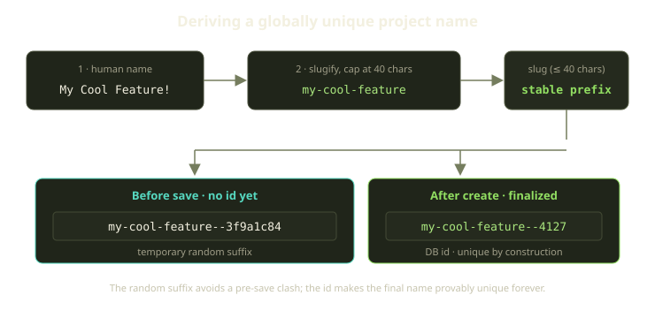
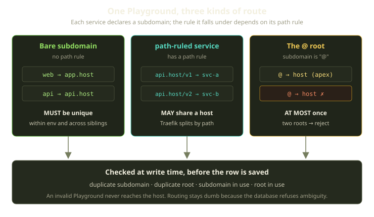
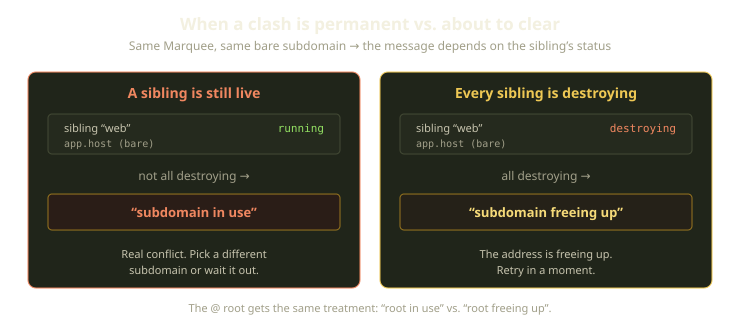

A Marquee is one Docker host. On it, a Player might run half a dozen Playgrounds at once — a couple of long-lived dev environments, a headless Trick chewing through a job, an AgentChat sidecar where a Genie is editing code. They share the same daemon, Traefik instance, range of host ports, and wildcard domain. And every one needs a URL that goes to exactly one place.

That's the whole problem: shared host, distinct addresses. Get it wrong and two environments fight over `app.your-host` or both grab host port 8080 — Traefik routes arbitrarily, or Docker refuses the second container, and the Player gets a confusing failure deep in the creation pipeline. Our answer is boring on purpose: we refuse to save an environment that would collide, before it touches the host. Validate at write time, routing stays dumb.

<!-- truncate -->

## The contract: ambiguity is a 422, not a 500

A Playground can be ambiguous about where it lives in two ways, and we treat both as data-validation failures, not runtime errors:

- **Names** — the on-disk project name, which is how Docker Compose, Traefik labels, and our own owner-markers all refer to the project on the host. Two projects sharing a name on one host is a disaster.
- **Routes** — the subdomains each service exposes and the host ports it maps. Two services answering on the same address is a quieter disaster: nothing crashes, you just get the wrong app.

Both are validated before the Playground is persisted. If a check fails, the record never saves and the Player gets a specific, recoverable message instead of a stack trace from `docker compose up`. Everything downstream — Playguard, Traefik, the creation pipeline — never handles the ambiguous case, because it can't exist. Names are simplest, so we start there.

## Naming: stable prefix, unique suffix

The on-disk project name has two jobs that pull in opposite directions: it should be **readable** — when you `docker compose ls` on a Marquee, you want to recognize your environment — and **globally unique**. We get both by deriving it in two stages.

Before the row has a database id, we build a placeholder: slugify the human-readable name (lowercase, dashes for spaces and punctuation), cap it at 40 characters, and append a short random suffix. So `"My Cool Feature!"` becomes `my-cool-feature` plus a suffix. That suffix exists for one reason: with no id yet, two environments created in the same instant with the same name would otherwise produce identical strings and trip the uniqueness check before either is saved.

Once the record has a database id, we finalize the name — same slugified prefix, but swapping the random suffix for the id itself. Now the suffix is unique by construction and small: `my-cool-feature--4127` is both legible and provably one-of-a-kind. And we don't just trust the derivation — the database enforces a uniqueness constraint as a backstop, so even a logic bug can't land two identical names on the same host.

:::tip
The random suffix is a transient stand-in for the id, not the source of uniqueness. If you ever see a `--3f9a1c84`-style hexadecimal suffix in the wild, it's a row that hasn't finalized yet.
:::

## Routing: three kinds of address, three different rules

Ports are easy: a host port is either taken or it isn't. Subdomains are subtler, because not every service that declares one wants its own host; some want to *share* one and split traffic by path. So we first define what counts as a clash.

Each service in a Playground can declare a subdomain and, optionally, a path rule — a path prefix it answers on. That combination sorts every route into one of three buckets.

### Bare subdomains must be unique

A **bare** subdomain is one with no path rule. It owns its host outright: `app.your-host` goes to this service and nothing else. Two bare services claiming the same subdomain is a genuine conflict — Traefik can't route one hostname to two backends. So they must be unique, within a Playground and across siblings on the Marquee.

The within-environment check is direct: gather the Playground's bare subdomains and compare the list against itself with duplicates removed. If anything was dropped, two services asked for the same hostname, and the Playground is rejected. Path-ruled services are deliberately excluded — which brings us to the second rule.

### Path-ruled services may share a host

A service that declares a path rule is saying "I don't need my own subdomain — route me by path on a shared one." `api.your-host/v1` to one service, `api.your-host/v2` to another: a single public hostname fronting several backends, which Traefik resolves deterministically because the path makes each route distinct. The path rule is exactly the gate that excludes a service from bare-uniqueness — and it's what makes the others worth having, since without it you couldn't build a path-fronted API on Fibe at all.

### The @ root, at most once

The special subdomain `@` means the apex — the bare domain itself, no prefix. There's exactly one apex, so a Playground may declare it at most once; a second claim is rejected with a duplicate-root error.

Here's the full picture of which rule applies to what:

| Service declares | Bucket | Uniqueness rule | Result if violated |
|---|---|---|---|
| A subdomain, no path rule | Bare | Unique in env **and** across siblings | rejected: duplicate / in-use subdomain |
| A subdomain **+** a path rule | Path-ruled | None — may share a host | (n/a) |
| The `@` apex, no path rule | Root | At most one per env; one across siblings | rejected: duplicate / in-use root |

## Cross-playground clashes, and the kind word for a dying sibling

The within-environment checks are the easy half. The interesting half is across siblings: the same bare subdomain is fine on two *different* Marquees, but a hard conflict on the *same* one. So a new Playground walks every other Playground on its Marquee, looking for overlap with its own bare subdomains. If somebody else is using one of ours, we have a clash — and the question is how loud to be about it.

A clash with a **running** sibling is permanent until someone acts: the address is genuinely taken. But a clash with a sibling that's already being destroyed is *temporary* — the address is about to free up. Telling a Player "subdomain in use, pick another" when the conflict clears itself in seconds is needlessly harsh. So we ask whether *every* clashing sibling is terminating.

If they all are, we still reject — but with a gentler "terminating" message (the same softening applies to the `@` apex). It's still a validation failure, but one that carries a different meaning: *this will work if you try again in a moment.* It turns "you can't" into "not yet."

:::note
The "all terminating" check is strict on purpose: if even one clashing sibling is still running, we fall back to the hard "in use" message — softening a real conflict would just send the Player into a retry loop that never succeeds.
:::

## Ports: same idea, one sharp exception

Host port mappings follow the same write-time philosophy with one twist. Two siblings can't map the same host port — `8080` goes to one container, and Docker refuses the second. So we collect every host port this Playground wants, intersect it against each sibling on the Marquee, and reject with a message naming the conflicting port and the sibling that holds it.

The twist is that we skip any sibling in the errored state. An errored sibling isn't holding its ports — its containers aren't running, so the host port is free in practice. Counting it would block a valid new environment because of a dead one not yet cleaned up.

Note the asymmetry with subdomains: the clash check considers *all* siblings (softening for the ones being destroyed), while the port check *excludes* errored ones. A subdomain is a logical claim, contested as long as the row asserts it; a host port is a physical resource an errored container has already released. We model each the way it behaves on the host.

## What we learned

One decision runs through all of this: **push uniqueness to write time, and keep the runtime dumb.** Traefik doesn't arbitrate subdomain disputes and the pipeline doesn't handle "what if this port is taken," because the validations guaranteed neither case can occur. Playguard, our 60-second reconciler, never reconciles two environments fighting over an address — that pair couldn't have been saved.

A few principles fall out of that, and generalize:

- **Make ambiguity unrepresentable.** A name that could collide isn't a bug we handle later — it's a state the model refuses to enter.
- **Model the resource, not the row.** Subdomains and ports look alike but behave differently — one a logical claim, the other a physical allocation — so a terminating sibling and an errored sibling are treated differently.
- **A softer error is still an error.** The "terminating" message lets nothing invalid through; it just tells the truth about *when* the conflict clears.

None of this is glamorous — a handful of validations and a two-stage string. But it's why a Player can run a fleet of environments on one host and never think about addressing at all, which is exactly how it should feel.

