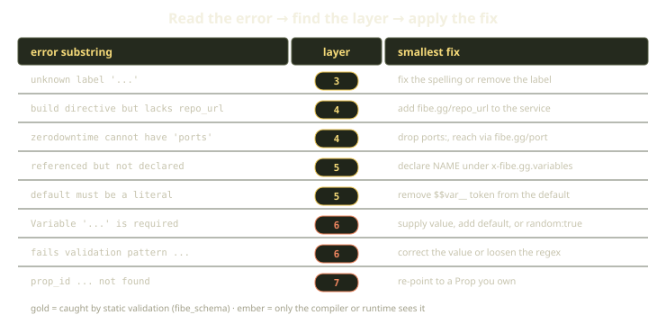

Here is the thing nobody tells you about template errors: most of them are easy once you know *who* is complaining. Fibe doesn't validate your template in one big pass. It runs a series of layers, each one authoritative for a narrow scope, each one with its own vocabulary. A YAML parser and a launch API say "this is wrong" in completely different dialects. If you can read an error and instantly think "ah, that's the schema layer" or "that's the compiler, not the schema," you stop guessing and start fixing.

This guide walks the layers in order, shows you the exact class of mistake each one catches, and gives you the smallest change that makes it green. The theme throughout: Fibe fails fast and fails specifically, and the earlier a layer catches your problem, the cheaper it is to fix.

<!-- truncate -->

## Why layers at all

A Fibe Template is a Docker Compose file plus a handful of `fibe.gg/*` labels and an `x-fibe.gg` block. By the time that document becomes a running Playground or a one-shot Trick on your Marquee, it has been parsed, shape-checked, schema-checked, cross-checked, variable-resolved, compiled, and finally handed to a runtime that talks to real resources. Each of those is a different kind of check with a different kind of failure.

Bundling them into one monolithic "is this valid?" call would be a disservice. You'd get a single pass/fail and no idea where to look. Instead, each layer is the authority for its own scope and nothing else. The YAML parser knows nothing about `fibe.gg/port`. The schema knows the label exists and its value must look like a port, but it has no opinion on whether the Marquee you're launching to already has that subdomain taken. That's the runtime's job, and it can't even be asked until launch time.

The single most important consequence: **a higher layer passing tells you nothing about the layers below it.** Schema-valid is not compile-valid. Compile-valid is not launch-valid. Never read "schema passed" as "this will run."


## The layers, in order

There are seven layers (plus a sub-layer of warnings). Here's the whole stack at a glance before we walk through each.

| # | Layer | Catches | How you reach it |
|---|---|---|---|
| 1 | YAML syntax | indentation, quotes, tabs | any tool taking `compose_yaml` |
| 2 | Compose shape | root mapping, `services:` key | same |
| 3 | Template schema | unknown labels, per-label regex | `fibe_schema` validate |
| 4 | Label semantics | cross-label rules | `fibe_schema` validate |
| 5 | Template variables | declared-vs-referenced, regex | `fibe_schema` validate |
| 6 | Template compiler | required-but-missing, value vs pattern | `fibe_templates_change` preview |
| 7 | Runtime API | resource existence, repo auth, conflicts | `fibe_launch` for real |

Layers 1 through 5 are all reachable from one static call. Layer 6 needs a compile (a preview). Layer 7 needs a real launch against a real Marquee. The gap between "what we can check offline" and "what only happens for real" is exactly the gap between layer 5 and layer 6 — so that's the gap worth understanding best.

:::tip
Validation reports *all* the errors it can find in the early layers, not just the first one. So a single `fibe_schema` call can hand you a whole list of schema and variable problems at once. Fix them as a batch, re-run, repeat.
:::

### [1] YAML syntax — parse the document

This is the most boring layer and the one you'll hit the most while editing by hand. It catches bad indentation, unclosed quotes, and the classic tab-versus-space mistake. There's nothing Fibe-specific here; it's the YAML parser refusing to turn your text into a document.

The fix is almost always mechanical. The one that bites people: YAML 1.1 treats `yes`, `no`, `on`, and `off` as booleans. That doesn't fail *here* — it parses fine — but it sets up a failure two layers down, which is why you'll see us harp on quoting boolean strings.

### [2] Compose shape — is this even Compose?

Once the bytes parse, Fibe checks the document is shaped like Compose: the root has to be a mapping, it has to have a `services:` key, and each service's value has to itself be a mapping. Errors here read like `Template body must be a YAML mapping` or `Service '<name>' must be an object`.

You usually hit this from a copy-paste accident — a stray top-level list, or a service whose body got flattened to a string.

### [3] Template schema — the label whitelist and the regexes

Now we're in Fibe territory. The public Fibe Compose schema enforces two big things:

1. **The `fibe.gg/*` label whitelist.** There are 20 supported labels. Any `fibe.gg/`-prefixed key that isn't one of them is a hard error: `Service '<n>': unknown label '<key>'`.
2. **Per-label value regexes.** `port` must be empty, a number in `1..65535`, or a `$$var__NAME`. `visibility` must be empty, `internal`, `external`, or a variable. `subdomain` must match the slug regex `^[a-z0-9]([a-z0-9-]*[a-z0-9])?$` (or `@`, or empty). `path_rule` must contain `Path`, `PathPrefix`, or `PathRegexp` and must *not* contain host/header/method matchers. Durations must match `^[0-9]+(ms|s|m)$`. Booleans must be `true` or `false`.

It also checks the shape of your `x-fibe.gg` block: variable keys must match `^[A-Za-z0-9_]+$`, a `validation` must be wrapped in `/.../`, a `trigger_config.event_type` must be `push` or `pull_request`, and so on.

What this layer does *not* know: whether your `repo_url` points at a real, authorized provider; whether any referenced resource exists; or the cross-label rules below. Those are someone else's job.

The whitelist deserves its own callout, because it changes how you think about typos.


In most config systems, a misspelled key is silently ignored — your setting just doesn't take effect, and you spend an afternoon wondering why. Inside the `fibe.gg/` namespace, that can't happen. The whitelist is the feature. A misspelled `fibe.gg/prot` is rejected loudly at layer 3, long before you've spent a Spark launching it.

:::caution
The whitelist applies **only** to the `fibe.gg/` prefix. Labels like `traefik.enable: "true"` or `com.acme.owner: team` pass straight through to Docker untouched — Fibe doesn't validate them and doesn't strip them. So if you typo a `traefik.*` label, *that* will fail silently, the old-fashioned way. The strictness is scoped to Fibe's own namespace.
:::

### [4] Label semantics — the rules one label can't express

Some constraints span two labels, and a per-key schema regex can't see across keys. That's this layer. The cross-label rules:

- A Compose `build:` block requires `fibe.gg/repo_url`. Without it: `Service '<n>' has a build directive but lacks a fibe.gg/repo_url label`.
- `fibe.gg/source_mount` requires `fibe.gg/repo_url` too: `Service '<n>' has source_mount but no repo_url`.
- `fibe.gg/zerodowntime: "true"` requires a `fibe.gg/port` (rolling updates are for routed services), and the service must not have a `container_name:` (replicas can't share a pinned name), and must not carry raw Compose `ports:` when `x-fibe.gg.metadata.preserve_ports: true` (host-port pinning is incompatible with rolling replicas).
- `fibe.gg/repo_url` must be a GitHub HTTPS URL, a full `ssh://` URL, or a configured Gitea host. The short `git@host:path` scp-style form fails here.

This layer also emits *warnings* rather than errors in some cases — for instance, a static service with no `image:` and no `build:`, or raw `ports:` that will be stripped by default. Warnings don't block you; they're Fibe telling you what it's about to do so you're not surprised at runtime.

### [5] Template variables — declared, referenced, resolvable

This layer reconciles your variable *declarations* (`x-fibe.gg.variables.<NAME>`) against your variable *references* (`$$var__NAME` inline, or `path`/`paths` bindings). The errors are precise, and each maps to a specific mistake:

- **Referenced but never declared** — you wrote `$$var__X` but never declared `X`.
- **Declared but never used** — you declared a variable but never referenced it and gave it no `path`/`paths`.
- **No display name** — a variable is missing its human-readable `name`.
- **Validation not wrapped in slashes** — a `validation` isn't wrapped in `/.../`.
- **Validation regex won't parse** — the body inside `/.../` isn't a valid regular expression.
- **Template token in a default** — a `default` contains `$$var__*`, `$$random__*`, or `$$root_domain`. Defaults must be literals; they are not recursively expanded.
- **Path points at a non-existent service** — a `path`/`paths` entry targets `services.<name>` where `<name>` isn't a service. (Missing *leaves* under an existing service are allowed — they get created. A missing service *root* is almost always a typo.)

There's also a warning when an entire YAML node is exactly `$$var__NAME`. It works, but Fibe nudges you toward `path`/`paths` instead, because that preserves local Compose parity (your file still has a real placeholder value you can `docker compose up` with).

### [5b] Managed-env warnings

A small sub-layer: Compose validation warns when a service's `environment:` defines a Fibe-managed env key, or a `FIBE_SERVICES_*_PATH`. It does *not* warn on your own app names like `FIBE_DB_PASS`. These are warnings, not errors — but heed them, because shadowing a platform key can quietly change behavior at runtime.

### [6] Template compiler — where substitution actually happens

Everything above is structural. This is the first layer that *runs your values*. The compiler performs the substitution work — it's the layer that actually produces the final, compiled Compose YAML — and in doing so it catches three things the schema fundamentally cannot:

- `Variable '<key>' is required` — the variable is `required: true`, you supplied no value, there's no `default`, and it's not `random`. The schema sees a perfectly well-formed declaration; only the compiler knows you didn't fill it in.
- `Variable '<key>' fails validation pattern <pattern>` — you supplied a value, but it doesn't match the variable's regex.
- `Variable '<key>' path '<path>' could not be written` — a `path` binding tried to land on a non-traversable shape (a scalar where it expected a mapping, say).

This is the most common source of "but it passed validation!" confusion. A `required: true` variable with no default is *schema-valid*. It only fails when the compiler tries to resolve it and finds nothing. That's why the next section's golden rule exists.

### [7] Runtime API — real resources, real conflicts

The final layer talks to the actual world. You reach it through a real `fibe_launch`, a preview, an import via `fibe_resource_mutate`, or the UI. It catches:

- `trigger_config.prop_id` / `marquee_id` / `schedule_config.marquee_id` not found or not owned by you.
- `trigger_config.repo_url` not authorized — no installed GitHub App, no Gitea token.
- Source defaults that can't be applied because the template was imported from a Prop that no longer exists.
- Conflicts at launch — e.g. the subdomain you chose is already taken at that Marquee. This *only* surfaces at launch; nothing earlier can know it.

## Read the error, find the layer, apply the fix

Here's the workflow that ties it together. When a template is red, don't randomly poke at it. Run the loop.


1. **Validate first.** Run the static check and read the message. Don't launch to find out what's wrong — launching costs you a real run.

   ```http
   fibe_schema(
     resource: "compose",
     operation: "validate",
     payload: { "compose_yaml": "<your template>" }
   )
   ```

2. **Find the layer from the wording.** `unknown label` is layer 3. `has a build directive but lacks` is layer 4. `referenced but not declared` is layer 5. `is required` or `fails validation pattern` is layer 6. `not found` (for a Prop or Marquee) is layer 7. The vocabulary tells you who's talking.

3. **Apply the smallest fix that satisfies that layer.** Don't over-correct. If the schema wants a lowercase `external`, give it lowercase `external` — don't also start rewriting your ports.

4. **Preview-compile, then launch.** Once the static check is green, run a preview to exercise the compiler (layer 6):

   ```http
   fibe_templates_change(mode: "preview", ...)
   ```

   Only when the preview compiles should you launch for real. Remember: `fibe_launch` has **no dry-run** — calling it launches. Validate and preview are your dry-runs.



## A worked before/after

Let's debug a real one. You've converted a Compose file and you launch. It fails. Here's the starting template:

```yaml
services:
  web:
    build: .
    labels:
      fibe.gg/port: 3000
      fibe.gg/visibility: External
      fibe.gg/zerodowntime: yes
    container_name: my-web
x-fibe.gg:
  variables:
    TAG:
      name: "Image tag"
      required: true
      default: "api-$$var__SUBDOMAIN"
```

Run `fibe_schema` validate and you get a stack of errors at once. Walk them by layer:

- **Layer 3:** `fibe.gg/visibility: External` — capital `E`. The schema regex is case-sensitive; only lowercase `internal`/`external` are accepted.
- **Layer 3:** `fibe.gg/zerodowntime: yes` — `yes` is a YAML 1.1 boolean, not the literal string `true`. Boolean labels accept only `true`/`false`.
- **Layer 4:** `build: .` with no `fibe.gg/repo_url` — a build directive needs a repo URL.
- **Layer 4:** `fibe.gg/zerodowntime` with a `container_name:` — replicas can't share a pinned name.
- **Layer 5:** `default: "api-$$var__SUBDOMAIN"` — a default containing a template token. Defaults must be literals.

Five problems, one validation pass. Here's the corrected template:

```yaml
services:
  web:
    build: .
    labels:
      fibe.gg/repo_url: https://github.com/acme/web
      fibe.gg/port: 3000
      fibe.gg/visibility: external
      fibe.gg/zerodowntime: "true"
x-fibe.gg:
  variables:
    TAG:
      name: "Image tag"
      required: true
      default: "latest"
```

We added the `repo_url`, lowercased `external`, quoted `"true"`, dropped the `container_name:`, and made the default a literal. Note one thing we did *not* do: we didn't try to make `TAG` derive from a subdomain. Defaults aren't templates. If you need a derived public value, declare an explicit variable with a literal default and bind it with `path:`. Compose one value from another in your *bindings*, never in a `default`.

Now this is schema-clean. But `TAG` is `required: true` with a default of `"latest"`, so the compiler is satisfied. Run a preview to be sure, then launch.

## A couple of runtime gotchas that aren't validation errors

Not every problem raises a hard error. Some are inferred behaviors that quietly change what happens. Worth knowing because they look like bugs:

- **`${VAR}` survives into the output.** If you wrote a Compose-native `${VAR}` and nothing set it, Compose leaves the literal `${VAR}` in place. Fibe doesn't fill these from the launcher. Use the `$$var__VAR` form and declare it instead. (The exception: in a Trick run, `${VAR}` *is* filled from your Job ENV entries and the built-in `FIBE_*` run variables — so if that's what you meant, define the Job ENV entry rather than converting.)
- **A Trick runs forever.** Job mode watches the exit code of a watched service. If that service started a dev server or an idle loop, it never exits, and the run hits the four-hour ceiling and errors. Use a command that finishes when the work is done.
- **A long-running app reset to one replica.** You accidentally put the service into job mode. Job mode forces `restart: "no"` and `replicas: 1` on every service. Take the service out of job mode if it's meant to stay up.
- **502 from the public URL, but it works inside the container.** Your app is binding `localhost` instead of `0.0.0.0`. Traefik can't reach a loopback-only listener. This isn't a template error at all — it's an app-binding error — but it's the single most common "my template is broken" report that isn't a template problem.

## Rules of thumb

- **Validate before you launch.** `fibe_schema` validate is free and catches layers 1–5 in one pass. `fibe_launch` is not free and has no dry-run.
- **Schema-valid is not compile-valid.** A `required: true` variable with no default passes the schema and fails the compiler. Always run a preview.
- **Read the verb in the error.** `unknown label` → schema. `lacks a repo_url` → label semantics. `referenced but not declared` → variables. `is required` → compiler. `not found` → runtime. The wording is the layer.
- **Fix the earliest layer first.** Lower layers can't even run until the ones above pass, so a layer-6 error may evaporate once you fix the layer-3 typo feeding it.
- **Quote your booleans.** `"true"` and `"false"`, never `yes`/`no`/`on`/`off`. YAML 1.1 will turn the bare words into booleans that the label parser rejects.
- **Defaults are literals.** No `$$var__*`, no `$$random__*`, no `$$root_domain` inside a `default`. Derive values with `path`/`paths` bindings instead.
- **The whitelist is your friend.** A typo'd `fibe.gg/` key fails loudly at layer 3. A typo'd non-`fibe.gg/` key fails silently the old way. Trust the namespace; double-check everything outside it.

Internalize the layer map once and template debugging stops being archaeology. You read the message, you know who said it, and you know exactly which knob to turn. For the full per-message lookup, the reference docs at [whats.fibe.gg](https://whats.fibe.gg) keep the canonical list — but most of the time, the loop above is all you need.
