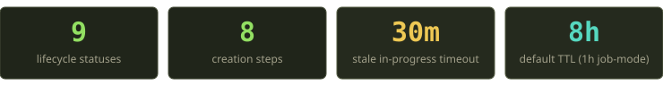
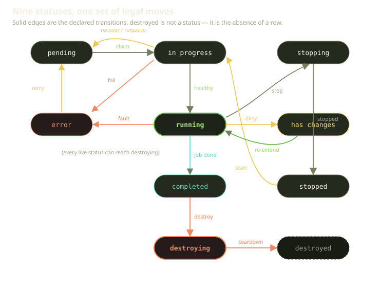
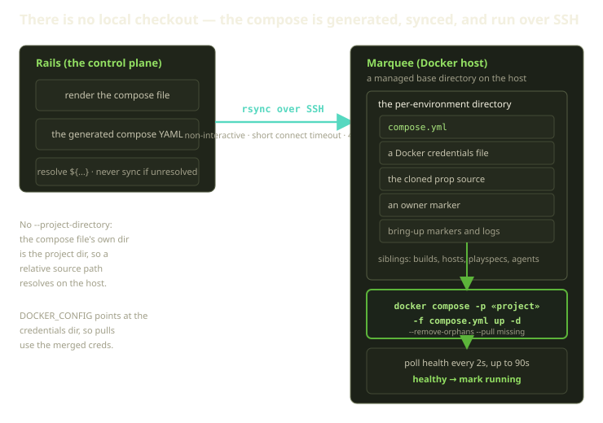

You click "create," and a few seconds later there's a URL that serves your app. In between, a surprising amount happens — most of it on a machine you've never logged into. A Playground on Fibe isn't a container we start. It's a small, ordered ritual: claim a database row, clone source onto a remote host, merge registry credentials, build an image, render a compose file from a template, ship it over SSH, and only then run `docker compose up` — on the Marquee, not on us.

This post walks that ritual end to end. Eight steps, nine statuses, one set of legal transitions, and a fair amount of paranoia about what happens when a step fails halfway through. If you've ever wondered what "in progress" actually means while the spinner spins, this is the tour.

<!-- truncate -->



## The mental model, and the thing it gets wrong

If you've used Docker Compose, you have an intuition for what's about to happen: there's a `compose.yml` in a repo, you `cd` into the repo root, you type `docker compose up`. That intuition is mostly wrong here, and it's worth correcting up front because everything else follows from it.

There is no local checkout. Fibe never runs `docker compose` in a directory it `git clone`d. The compose file is **generated** — rendered from your Template's Playspec plus your settings — and then **synced** to the Marquee (the Docker host you own) and run **there**, over SSH, with an explicit project name and an explicit compose file:

```bash
docker compose -p <project> -f <compose-file> up -d \
  --remove-orphans --pull missing
```

That compose file lives in a per-environment directory on the host. The "repo root" your services mount from is a managed clone we placed in a subdirectory beside it. The compose project is the directory the compose file lives in, because we deliberately don't pass `--project-directory` — so a relative path in your compose resolves against the host, not against anything on our side.

That single design decision — generate here, run there — is why the creation pipeline has the shape it does. A lot of the steps exist purely to get the right bytes onto the right host before the daemon ever sees them.

## Nine statuses and the moves between them

Before the pipeline, the state machine. A Playground is always in exactly one of nine statuses: pending, in progress, running, error, has-changes, completed, destroying, stopping, and stopped.

There's a tenth thing people expect to see — "destroyed" — and it isn't there on purpose. A destroyed Playground isn't a status; it's the absence of a database row. When the teardown job finishes, the row is gone. "Destroyed" is what you call the empty space.

Every legal move between these statuses is declared in exactly one place — a single table of allowed transitions — and a guard reads that table before any normal transition fires. There's nothing scattered: if a move isn't in the table, the ordinary code paths won't make it.



A few things are load-bearing here:

- **Destroying has no exits.** Once a Playground is being torn down, it has exactly one future: gone. Maintenance, rollout, and restart all explicitly bail if the record is destroying. There's no clever recovery, because there's nothing left to recover.
- **Completed only goes to destroying.** A finished job-mode run (a Trick) is terminal-ish: it sticks around so you can read its result, then it expires.
- **Recovery deliberately cheats.** A few moves — recovering an interrupted in-progress run back to pending, or marking a failure as an error — are written so they bypass the transition table entirely. That's not an accident. Recovery paths run when the normal machinery has already failed or been interrupted; making them ask the guard for permission would be asking the broken thing to bless its own repair.

:::note
A handful of "transitions" you'll see in monitoring — running back to stopped, error to running, stopped to running — aren't in the allowed-transitions table at all. They're written directly by the Docker-truth reconciler when it observes that reality and the database disagree. The state machine governs *intent*; the reconciler governs *observed truth*. Keeping those two vocabularies separate is what stops a flaky daemon from corrupting your status history.
:::

## The pipeline: eight steps, one job

Creation starts when a Playground is pending and the creation job claims it. "Claims" is precise: the job takes a row lock, reloads, and flips the status from pending to in-progress. If the row isn't pending anymore by the time the job runs — someone else grabbed it, or it got cancelled — the job returns and does nothing. This is the first place a distributed system would otherwise step on its own feet, and the lock is the cheap fix.

One small correction to a thing people assume: claiming the row clears the current step name rather than setting it to the first step. The step name is written by the step itself, a beat later. So a freshly-claimed Playground is in-progress with no step for a fraction of a second. Don't read meaning into that gap.

Then the eight steps run, in order. Each one announces itself before doing any work — it writes its step name to the database and publishes an event first, then runs. That's why the UI can show you "Building image…" in real time: the step name *is* the progress bar.


The eight steps, in order, are: start the front-door router, clone the source, set up registry auth, build the image, run any pre-start teardown, generate the compose file, start the agent sidecar, and bring the stack up. Two of those — the router and the agent — are conditional: they're skipped in job mode, and the agent step also only runs when an agent is actually attached. When the run is a job-mode Trick, a final follow-up is queued to watch for its one-shot exit. Let's take the steps one at a time, because the interesting decisions are in the details.

### 1. Start the front door

Traefik is the reverse proxy that routes each subdomain on your Marquee to the right container, terminating TLS with a wildcard cert (ZeroSSL EAB credentials plus acme-dns let it request a wildcard cert without per-subdomain validation). Before we deploy anything that wants a route, we make sure the router is actually running on the host.

This step is **skipped entirely in job mode**. A Trick is a headless one-shot — nobody's going to open it in a browser, so it doesn't need a route, so it doesn't need Traefik. Skipping the step isn't an optimization; it's an admission that the step is meaningless for that workload.

### 2. Get the source onto the host

This is the first step that touches the remote filesystem. It syncs your Prop's source — the player-owned Git binding, whether that's managed Gitea, GitHub OAuth, or a GitHub App — into a per-environment directory on the Marquee.

The notable design choice here is failure classification. A clone failure is a **user error**, not an infrastructure error. If your branch doesn't exist, or the repo is gone, or credentials are wrong, retrying won't help — the world is the way it is. So clone failures are tagged as the user's fault, and the failure classifier hard-excludes them from the retryable set. The Playground goes to error and stays there until you fix the repo and retry. We don't burn a retry budget on a problem only you can solve.

### 3. Merge credentials, never platform tokens

To pull private images, the host needs registry credentials. This step builds a Docker config file next to the compose file and merges two sources: the Marquee's own registry auths and the Playspec's. When they collide on the same registry, the **explicit Playspec credentials win** — it's a merge, not a strict precedence tree.

For GHCR specifically, the credential chain is your Prop's GitHub identity: a personal access token, then the player's OAuth token, then a GitHub App installation token. Notably absent: any Fibe platform token. We never use our own credentials to pull *your* images. If your Prop can't see an image, neither can your Playground — which is exactly the property you want.

:::tip
This step is conditional in the self-healing layer. The reconciler only probes and repairs the credentials file when auth is actually required. So on a fully public stack, the *absence* of a credentials file isn't drift — it's correct. A lot of false alarms get avoided by treating "doesn't need auth" as a first-class state.
:::

### 4. Build, or be smart about not building

If a valid image already exists, we reuse it. If not, the build runs on the host via a staged build script.

The clever part is what happens when a build fails *during a rollout of a live environment*. Naively, a failed rebuild would tear down a perfectly good running Playground to replace it with nothing. Instead, we keep the Playground in its previous status and flag it as owing a rebuild. Your live environment keeps serving traffic on the old image; the system remembers it owes you a rebuild and tries again later. A failed deploy shouldn't be an outage.

### 5. Clean the slate

Templates can declare a teardown block — work that should run before the new stack comes up. This step applies it. It's short, and most of the time it does nothing, but it's the hook that lets a Template say "before you start me, undo this."

### 6. Render the file we'll actually run

Now we generate the compose YAML. It starts from the Playspec's augmented compose template, strips the Fibe-internal keys, and runs an ordered chain of injectors: environment, build config, static images and commands, ports, TLS, volumes, labels, platform constraints — and finally placeholder resolution.

This is the step where unresolved placeholders go to die. If the rendered compose still contains a `${...}` token that nothing resolved, we fail the step right here and **never sync it to the host**. The rule is simple and absolute: a compose file with a dangling variable is not a compose file, and we will not hand the daemon something we know is broken. Better to fail loudly here than to debug a cryptic Docker error on a host you can't see.

### 7. Start the agent — only if there's a Genie

If your Playground has an AI coding agent (a "Genie") attached, and you're not in job mode, this step handles its startup wiring. The Genie runs as a sidecar — its own service in the same compose project — with its base mounts (the Docker socket, the host working directory, and a named data volume) and an async healthcheck that deliberately *doesn't* block creation. We don't want a slow-starting agent to hold up your actual environment. No agent, or job mode? The step is skipped, the same way the router step is.

### 8. The moment it becomes real

This is the one that matters. By now the host has everything: source, credentials, a built image, a rendered compose file. The final sequence re-validates, writes and syncs the compose (with an owner marker and a verify), reconfigures auth, pulls missing images, and ensures the source mounts and build contexts and config files all exist on disk — repairing any that went missing — before it actually runs `docker compose up`.



For a standard Playground, after the stack is up we **wait for it to be healthy** — polling its health every 2 seconds for up to 90 seconds. Only when health passes do we mark it running: that clears any error state, flips the status to running, records when the stack was last applied, wipes the current step name, and enqueues a follow-up job to reconcile against Docker's view of the world.

That health gate is the readiness contract. "Running" doesn't mean "the container started." It means "the container started *and* answered." If your service never gets healthy within 90 seconds, you get a health-wait timeout, not a green checkmark.

Job mode and agent mode skip the health wait — a Trick is detached behind `nohup` (we just need it to *launch* within 30 seconds, then it reports its own exit), and a Genie's health is intentionally non-blocking. But here's a correction worth making, because it's a common misreading: job mode still reaches running the same way everything else does. It doesn't get a *different* terminal state — it gets running, *and additionally* enqueues a completion watcher for the one-shot exit. Both modes also queue the state-reconcile job. The "instead" framing you might assume is wrong; it's "and also."

## When a step fails

Eight steps, each of which can fail, on a host that can disappear mid-flight. Failure handling isn't a footnote here — it's most of the engineering. The pipeline sorts every failure into one of three buckets, and the bucket decides what happens next.

| Failure kind | Examples | Routing |
|---|---|---|
| **Temporary infrastructure** | connection refused, lost connection, timed out, network failure, worker shutting down | requeue to pending, re-run by the creation job |
| **User error** | clone failed, build failed, unresolved placeholders, bring-up failed | mark as error, stays visible in error |
| **Disk full** | "no space left on device" | friendly message, mark as error, stays visible |

The first bucket is the forgiving one. A transport hiccup — the Marquee briefly unreachable, a worker getting recycled mid-job — isn't your fault and isn't permanent. Those failures are matched against a set of known-transient stderr signatures, and SSH/rsync transport timeouts are now classified structurally at the point where commands are executed rather than by string-matching after the fact. The Playground is quietly pushed back to pending (bypassing the transition table, as recovery does), and a fresh creation job picks it up. You may never even notice.

The second bucket is the honest one. If you asked for a branch that doesn't exist, no amount of retrying conjures it into being. We surface the error, we keep the Playground visible in error, and we wait for you. The classifier explicitly refuses to treat clone failures as retryable — that exclusion is load-bearing, because the alternative is an environment that spins forever on a problem only you can fix.

Anything we can't classify — an exception that's neither known-transient nor a recognized user fault — falls through to a generic handler that re-raises, letting Sidekiq's own retry machinery take a swing. We'd rather a genuinely unknown error get retried than get silently swallowed.

:::warning
One sharp edge worth naming: a *temporary* failure that happens to occur during the clone step can still land as an error and stay stuck, because clone failures are hard-excluded from the retryable set. It takes a healing reconciler — the Playguard, or the startup-recovery job — or a manual retry to move it. We know about this one; it's the price of treating clone failures as user errors by default, and we think that's the right default. But it's a real corner.
:::

## The two timeouts that keep things honest

Two numbers do a lot of quiet work.

The first is a 30-minute staleness timeout. A Playground stuck in progress for half an hour almost certainly belongs to a job that died — a worker that crashed, a host that vanished mid-step. The Playguard reconciler, running every 60 seconds against each launchable Marquee, notices stale in-progress rows and recovers them back to pending so creation can be re-attempted. Crucially, it only does this when no creation job is actively working the row and a live Sidekiq worker doesn't own it — it checks for *activity*, not for remote state. A complementary startup-recovery job runs on the same cadence with a tighter 2-minute grace for orphans, skipping any row a live worker still owns. Belt and suspenders, both polling.

The second is the TTL: 8 hours by default, 1 hour for job-mode Tricks. Every Playguard cycle enforces expirations. An expired Playground that's clean gets torn down — containers down, volumes removed unless it's a persistent stateful environment. An expired Playground that's *dirty* — has uncommitted work — is never silently destroyed. Instead it transitions to has-changes, we log an audit entry, and it becomes re-extendable. The invariant is blunt and we like it that way: **we do not throw away your uncommitted work to reclaim a host.**

## One stateful Playground at a time

A small but important constraint, because it surprises people. If a Playspec asks for persistent volumes — a stateful environment with named volumes that survive restarts — then you can have **at most one** active Playground from that Playspec at a time.

"Active" here means any non-terminal state: pending, in progress, running, has-changes, destroying, or stopping. Try to create a second one and you get a validation error before anything is deployed. The reasoning is concrete: two live environments sharing the same persistent volumes would race each other's writes, and "your data is now whatever won the last race" is not a feature. Job-mode runs sidestep this with a different mechanism — they serialize at claim time, FIFO, so a queue of Tricks against the same stateful Playspec runs one after another instead of being rejected.

## Who gets a route, and who gets a 503

The pipeline ends at "running," but "running" and "reachable" aren't the same question. Routing is decided separately, by service discovery, and it's worth understanding because it's where a lot of "my Playground is up but the URL is dead" confusion gets resolved.

Every lifecycle transition schedules a Traefik route refresh — a maintenance-routes job ultimately tells Traefik to apply the right configuration. Three outcomes are possible for any given service:

- **A live route.** The service is exposed and the Playground is healthy, so Traefik routes traffic straight to the container. This is the happy path.
- **A maintenance route.** The service has *explicitly* opted into maintenance. Traefik installs a router with a deliberately enormous priority — far above any real route — that points at a small error-page service and returns a `503`. The priority is the whole trick: a maintenance router always wins the match, so even if a stale real route lingers, the 503 takes precedence.
- **No route at all.** The Playground is destroying, or it's job mode (a Trick has no exposed services), or there simply are no exposed services. Nothing to route, so nothing is installed.

The subtle correctness rule lives in the difference between the second and third outcomes. During a rollout we record an automatic-maintenance allowlist and trigger a route refresh — but that allowlist on its own is *not* a router source. A service only gets a maintenance 503 router if maintenance is **explicitly enabled** for it. The allowlist is bookkeeping; the explicit flag is the switch. We have specs that assert exactly this: rollout-allowlisted services do not get routers without explicit maintenance. It's an easy place to accidentally serve a 503 to traffic that should have 404'd, and the explicit-flag requirement is what keeps that from happening.

So when a healthy Playground's URL is dead, the answer is almost always "that service isn't exposed," not "the container isn't up." The status told you the container is up. Routing is a different sentence.

## Docker's truth versus the database's intent

Everything above describes what Fibe *intends*. But the Marquee is a real machine, and real machines do things behind your back — a container OOM-kills, the daemon restarts, someone SSHes in and runs `docker rm` because they were debugging at 2am. The database can't know any of that until it looks. So it looks, constantly, and reconciles.

The reconciler inspects the project with `docker compose ps`, parses the JSON, and compares observed reality against the recorded status. The single most important property of this code is what it does when it *can't* see clearly: if the inspection failed — daemon unreachable, CLI unavailable — it returns early and changes nothing. The drift detector does the same, choosing to take no action on a failed inspection. This is the rule that keeps a network blip from becoming a data-loss event: **we are never destructive on a blind or unavailable Docker.** No teardown, no status change, no "I couldn't reach it so it must be gone." Absence of evidence is not evidence of absence, and the reconciler is built around exactly that humility.

When it *can* see clearly, it heals in both directions:

- A Playground the database thinks is pending, stopped, or recoverably errored — but whose containers are actually healthy and whose host files are present — gets recovered to running, with its failure state cleared. The world came good; the record catches up.
- A Playground the database thinks is running — but whose project is gone or whose containers are all stopped — gets marked stopped (for a non-job environment) by a direct write. Reality moved; the record follows.

That second case is one of the out-of-table writes we mentioned earlier. Running back to stopped isn't a declared transition, because it isn't an *intent* — nobody decided to stop it. It's an *observation*, and observations bypass the intent machinery on purpose. There's a deliberate asymmetry, too: a cleanly-stopped, non-job Playground is left alone rather than yanked back to running. If you stopped it on purpose, the reconciler respects that. It heals drift; it doesn't fight you.

The Playguard ties all of this together on its 60-second cadence. Each cycle, per launchable Marquee, it probes Docker *first* — bailing if the daemon's unavailable, quarantining a host only after five consecutive strikes and never while there are live agent sessions on it — then renews its distributed lock between phases and walks the work: sync git-dirty status, pull branches, refresh credentials, pull images, enforce expirations, and reconcile each Playground. The lock is held in Redis for 15 minutes so two cycles can't stomp each other, and it caps itself at three full recreations per cycle so a bad Marquee can't trigger a stampede. It is, in the most literal sense, the thing that keeps your environment running while you're not looking.

## What we learned building this

A few things have held up, and they generalize past Fibe.

- **Make the status enum tell the truth, and make "gone" not a status.** Modeling "destroyed" as an absent row instead of a terminal value removed a whole category of "is it really destroyed or just marked destroyed?" bugs. The cleanest state is the one that doesn't exist.
- **Separate intent from observation.** The allowed-transitions table is what the system *means* to do. The Docker reconciler writing status directly, outside that table, is what the system *observes*. Conflating them would let a flaky daemon rewrite history; keeping them apart lets the reconciler heal without lying.
- **Classify failures by who can fix them, not by where they happened.** "Temporary infra → retry, user error → surface and wait" is a better axis than step-by-step error codes. The retry budget exists for problems retrying can solve; everything else should reach a human fast.
- **Never destroy uncommitted work to satisfy a timer.** The dirty-expiration path — transition to has-changes instead of tearing down — has saved more user work than any feature we shipped that quarter. Reclaiming a host is never worth losing your morning's edits.
- **The step name is the progress bar.** Writing each step's name before its work runs, and publishing an event, meant the UI got real progress for free. The observability wasn't bolted on; it fell out of the structure.

Eight steps, nine statuses, two timeouts, one stubborn rule about your data. That's a Playground — from a declared blueprint to a healthy URL, mostly on a machine you've never seen, and built to survive that machine occasionally disappearing.
