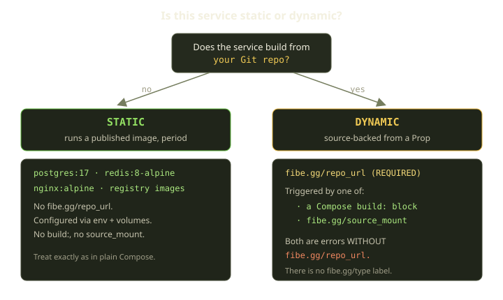
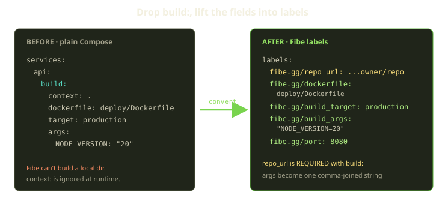
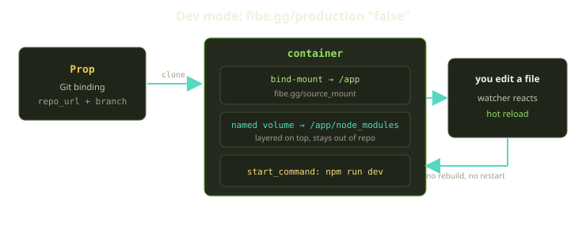
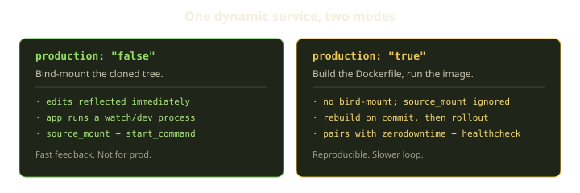

Every service in a Fibe template is one of exactly two kinds, and the difference decides everything downstream: whether Fibe clones a repo, whether it runs a build, whether you can edit a file and watch the page reload, and whether a typo in a label hard-fails your launch. The kinds are **static** (runs a published image) and **dynamic** (source-backed — Fibe clones, builds, or mounts a Git repo). Most templates are a mix: a dynamic app service in front of a couple of static dependencies.

Here's the part people get wrong: the kind isn't something you declare. There is no `fibe.gg/type` label. Fibe *derives* it from the labels you set. Get the signals right and the classifier does the rest; get them subtly wrong and you'll see errors like `Service 'web' has a build directive but lacks a fibe.gg/repo_url label`. This guide walks the dividing line, then shows you how to wire each kind with real YAML you can copy.

<!-- truncate -->

## The dividing line

A service is **dynamic when `fibe.gg/repo_url` is set and resolves to a Prop** (your Git binding — managed Gitea, GitHub OAuth, or a GitHub App). Otherwise it's **static** and just runs the image you name.

Two other signals *imply* a dynamic service, and both are hard errors on their own:

1. A Compose `build:` block exists.
2. The `fibe.gg/source_mount` label is set.

Either of those without `fibe.gg/repo_url` is rejected by the validator. The mental model: `build:` and `source_mount` describe *what to do with source*, so they're meaningless until you've said *where the source is*. `fibe.gg/repo_url` is the anchor; the rest hang off it.



### Choose static when

- You consume a published image: `postgres:17`, `redis:8-alpine`, `nginx:alpine`, `node:24-slim`, or an app image you've already pushed to a registry.
- The app is configured purely through env vars and mounted volumes.
- You don't want Fibe to clone or sync source.
- The image already contains the runtime command (or you override it with Compose `command:`).

### Choose dynamic when

- The app lives in a Git repo and you want Fibe to clone, build, or mount it.
- You want hot-reload by mounting the working tree.
- You want Fibe to manage build → image → rollout from a `Dockerfile` in the repo.
- You want the same Playspec to be reusable across branches.

:::tip
The single best heuristic: **does this service *contain your code*?** If yes, it's dynamic. If it's an off-the-shelf component you'd `docker pull` and forget about, it's static. A Postgres next to your Rails app is static even though "the app uses Postgres" — the database isn't built from your repo.
:::

## Static services need no Fibe build labels

This is the easy half, and it stays easy. A static service in a Fibe template looks exactly like it would in any `docker-compose.yml`. You pick an image, set env, mount volumes, and you're done. The only Fibe labels you might add are routing ones (`fibe.gg/port`, `fibe.gg/visibility`) — and only if the service serves HTTP to humans.

```yaml
services:
  db:
    image: postgres:17
    environment:
      POSTGRES_PASSWORD: $$secret__DB_PASSWORD
    volumes:
      - pg_data:/var/lib/postgresql/data
  redis:
    image: redis:8-alpine

volumes:
  pg_data:
```

No `fibe.gg/repo_url`, no `build:`, no `source_mount`. Fibe pulls the images and runs them. That's the whole story for dependencies, and it stays the whole story even inside a source-backed template — your Postgres, Redis, MinIO, MailHog, or Gitea sidecars are static no matter how dynamic the app in front of them is.

:::caution
The most common static/dynamic mistake is setting `fibe.gg/repo_url` on a dependency because "the app uses it." The label means *this service IS built from that repo* — never set it on Postgres, Redis, or any off-the-shelf component. Doing so tells Fibe to clone your app repo into the database container, which is never what you want.
:::

## Dynamic, part one: converting a Compose `build:`

Now the interesting half. Say you have an existing project with a `build:` block. On Fibe, the runtime owns clone + build, so you drop most of `build:` and lift the relevant fields into `fibe.gg/*` labels.



Here's the field-by-field mapping:

| Compose `build:` field | Fibe label / behavior |
|---|---|
| `build:` exists | **Add `fibe.gg/repo_url`** — required; the schema validator rejects a build without it |
| `build: .` / `context: .` | Build context becomes the cloned repo path automatically |
| `context: subdir/` | Not preserved — use `fibe.gg/dockerfile: subdir/Dockerfile` and make the Dockerfile work from the repo root |
| `dockerfile: Dockerfile.dev` | `fibe.gg/dockerfile: Dockerfile.dev` |
| `target: production` | `fibe.gg/build_target: production` |
| `args: { K: v, K2: v2 }` | `fibe.gg/build_args: "K=v,K2=v2"` (one comma-separated string) |

The big conceptual shift: **`build.context` is irrelevant on Fibe.** The context is always the cloned repo root. Fibe is not `docker compose build` against a local directory — the source has to be a remote VCS URL the platform can clone. If your Dockerfile lives in a subdirectory, you point `fibe.gg/dockerfile` at it (`deploy/Dockerfile`, `apps/web/Dockerfile`), but the Dockerfile's `COPY` paths must still resolve from the repo root.

### Worked example: multi-stage build with args

Take a typical multi-stage API service:

```yaml
# BEFORE — plain Compose
services:
  api:
    build:
      context: .
      dockerfile: deploy/Dockerfile
      target: production
      args:
        NODE_VERSION: "20"
        BUILD_ENV: production
    ports:
      - "8080:8080"
```

The Fibe version drops `build:`, names the repo, and flattens everything into labels:

```yaml
# AFTER — Fibe dynamic service
services:
  api:
    labels:
      fibe.gg/repo_url: https://github.com/owner/repo
      fibe.gg/dockerfile: deploy/Dockerfile
      fibe.gg/build_target: production
      fibe.gg/build_args: "NODE_VERSION=20,BUILD_ENV=production"
      fibe.gg/port: 8080
      fibe.gg/visibility: external
      fibe.gg/production: "true"
```

A few things to internalize here.

**`fibe.gg/build_target` is a single string** — the name of a Dockerfile stage. Your Dockerfile must contain a matching `FROM ... AS production`. If you leave it off, Docker builds the final stage (its normal default). A typo here fails the build with a "stage not found" error, so it's worth a quick `grep AS Dockerfile` before you launch.

**`fibe.gg/build_args` is a comma-separated string**, not a YAML map. The parser splits on `,`, then splits each part on the first `=`. Whitespace is trimmed, empty keys are skipped, empty values are kept. So `"K1=,K2=value, K3 = v3 "` becomes `{ K1: "", K2: "value", K3: "v3" }`. And because the first `=` is the separator, `K=foo=bar` safely parses to `{ K: "foo=bar" }`.

:::caution
There is **no escape syntax** for commas in build-arg values. `fibe.gg/build_args: "ALLOWED_HOSTS=a.com,b.com"` parses as two broken args, not one. If a value must contain a comma, encode it out-of-band (base64, URL-encoding) and decode in the Dockerfile. Also remember Docker silently ignores a `--build-arg` whose `ARG NAME` doesn't appear in the stage that uses it — and each multi-stage stage needs its own `ARG` directive.
:::

### Keep `build:` or delete it?

You don't always have to delete the `build:` block. There's a useful nuance:

- **Keep `build:`** when the template must *also* run with a plain local `docker compose up`. Fibe rewrites the runtime build context to the cloned repo path and uses your `fibe.gg/*` labels for the Dockerfile, target, and args. The `build:` block stays as local-Compose parity.
- **Delete `build:`** when the template is Fibe-only, or when the service is a source-only helper that shouldn't trigger a build at all.

What you should *not* do is replace a real buildable app service with an `image:` placeholder just to shorten the template. If the service builds your app, let it build.

### Making the repo launch-configurable

If you want the launcher to pick the repository and branch instead of hardcoding them, bind the labels to template variables. Inline interpolation tokens like `$$var__REPO_URL` work in label values, or you can use the `path:` form to point a variable straight at a label:

```yaml
services:
  web:
    labels:
      fibe.gg/repo_url: https://github.com/owner/repo
      fibe.gg/branch: main
      fibe.gg/dockerfile: Dockerfile
      fibe.gg/port: 3000
      fibe.gg/visibility: external

x-fibe.gg:
  variables:
    REPO_URL:
      name: "Repository URL"
      required: true
      default: "https://github.com/owner/repo"
      path: services.web.labels.fibe.gg/repo_url
    BRANCH:
      name: "Branch"
      required: true
      default: "main"
      path: services.web.labels.fibe.gg/branch
```

One trap worth calling out: the repo URL must be cloneable as Fibe expects it. Use `https://github.com/...`, a configured Gitea URL, or a full `ssh://` URL. The scp-style shorthand `git@github.com:owner/repo.git` is *not* accepted and fails the clone.

## Dynamic, part two: live-development mode with source mounts

Building on every commit is correct for production, but it's a miserable inner loop when you're actively coding. That's what `fibe.gg/source_mount` is for: instead of building an image, Fibe **bind-mounts the cloned repo into the container**, and your edits show up inside the container immediately. Pair it with a watch/dev process and you get hot reload on a remote Marquee that feels local.



Four labels carry dev mode:

| Label | Value |
|---|---|
| `fibe.gg/repo_url` | Git repo URL — required; a source mount can't exist without a repo |
| `fibe.gg/source_mount` | absolute path inside the container; defaults to `/app` |
| `fibe.gg/production` | `"false"` — the source-mounted mode |
| `fibe.gg/start_command` | the **dev/watch** command, not a production build |

Note `fibe.gg/source_mount` defaults to `/app`, so you only set it explicitly when the app expects a different working directory. And `fibe.gg/production` defaults to behaving like development for source-mounted setups — but set it to `"false"` explicitly anyway, because it makes the template's intent obvious to the next reader.

### Worked example: a Vite SPA in dev mode

```yaml
services:
  web:
    image: node:24
    working_dir: /app
    volumes:
      - web_node_modules:/app/node_modules
    labels:
      fibe.gg/repo_url: https://github.com/owner/repo
      fibe.gg/source_mount: /app
      fibe.gg/start_command: npm run dev -- --host 0.0.0.0
      fibe.gg/port: 5173
      fibe.gg/visibility: external
      fibe.gg/production: "false"

volumes:
  web_node_modules:
```

There's real subtlety packed into that snippet.

**Why an `image:` and not a `build:`?** In dev mode you're not building anything — you're mounting source into a container that already has the language runtime. So pick a base image with the runtime you need (`node:24-slim`, `python:3.12`, `ruby:3.3`, `golang:1.23`, or `alpine:3.21` for tiny helpers) and skip `build:` entirely. Avoid `:latest`.

**Why the `node_modules` named volume?** This is the part that bites everyone. You bind-mount the repo at `/app`, but `node_modules` is gitignored and isn't in the repo. Without intervention, the mount would shadow it and the app would have no dependencies. The fix is to layer a named volume at `/app/node_modules` — bind mounts and named volumes coexist at distinct paths, so the container gets its `node_modules` while the repo on disk stays clean. The same pattern applies to `__pycache__`, `tmp`, and other container-only dirs. The Python equivalent mounts a `pip_cache` volume and installs in the start command:

```yaml
services:
  web:
    image: python:3.12
    working_dir: /app
    volumes:
      - pip_cache:/root/.cache/pip
    labels:
      fibe.gg/repo_url: https://github.com/owner/repo
      fibe.gg/source_mount: /app
      fibe.gg/start_command: sh -c "pip install -r requirements.txt && uvicorn app:main --host 0.0.0.0 --reload"
      fibe.gg/port: 8000
      fibe.gg/visibility: external
      fibe.gg/production: "false"

volumes:
  pip_cache:
```

### What the app has to do

The mount only helps if the app cooperates. The dev process must:

1. **Bind on `0.0.0.0`**, never localhost — otherwise Traefik can't reach it.
2. **Run an actual watch/dev process** — Vite, `webpack-dev-server`, nodemon, Rails `bin/dev`, `flask --debug run`, `uvicorn --reload`.
3. **Listen on the port from `fibe.gg/port`.**
4. **Allow the public Fibe host** if the framework validates `Host:` headers.
5. **Watch the mounted path** — some watchers miss events across a bind mount and need polling (`CHOKIDAR_USEPOLLING=true` for Node).

That fourth point trips up Vite specifically. Vite 6+ validates the `Host:` header, so behind Fibe/Traefik you'll get a `403 Invalid Host header` until you tell it to trust the host:

```js
// vite.config.js
export default {
  server: {
    host: '0.0.0.0',
    allowedHosts: true,        // or: ['my-subdomain.<root-domain>']
  },
};
```

For SPA dev templates this isn't optional — leave it out and the page never loads.

Here's a quick framework-to-command reference so you don't have to guess the right `fibe.gg/start_command`:

| Framework | `fibe.gg/start_command` |
|---|---|
| Rails (with bin/dev) | `bin/dev` |
| Rails (plain) | `bin/rails server -b 0.0.0.0` |
| Next.js dev | `npm run dev -- -H 0.0.0.0` |
| Vite SPA | `npm run dev -- --host 0.0.0.0` |
| Django dev | `python manage.py runserver 0.0.0.0:8000` |
| FastAPI uvicorn | `uvicorn app:main --host 0.0.0.0 --reload` |
| Go (air) | `air -c .air.toml` |

:::caution
The single most common source-mount failure is a `fibe.gg/start_command` that **builds and exits** — like `npm run build`. The container does its build, the process ends, and Fibe sees the service stop. Source mount needs a long-running watch process. If you actually want a built artifact, you're in production mode, not dev mode.
:::

## Dev vs production: the same service, two modes

A dynamic service runs in one of two modes, and `fibe.gg/production` is the toggle. This is worth seeing side by side because the trade-off is the entire reason both exist.



| | `production: "false"` (dev) | `production: "true"` (prod) |
|---|---|---|
| Source handling | Bind-mounts the cloned tree | Builds the Dockerfile, runs the image |
| `fibe.gg/source_mount` | Active | Ignored |
| Inner loop | Edit → watcher reloads, no rebuild | Commit → rebuild → rollout |
| Reproducibility | Lower (live tree) | Higher (immutable image) |
| Pairs with | A watch/dev command | `fibe.gg/zerodowntime` + healthcheck labels |
| Best for | Active development, demos you tweak | Stable deployments |

In production mode, `fibe.gg/source_mount` is simply ignored — the container uses the image's own filesystem. You can flip a single service between the two by parameterizing the label, which is great for a template that should serve both audiences:

```yaml
services:
  web:
    image: node:24
    labels:
      fibe.gg/repo_url: https://github.com/owner/repo
      fibe.gg/source_mount: /app
      fibe.gg/start_command: npm run dev
      fibe.gg/port: 3000
      fibe.gg/visibility: external
      fibe.gg/production: "false"

x-fibe.gg:
  variables:
    PRODUCTION:
      name: "Production mode (built image)"
      default: "false"
      path: services.web.labels.fibe.gg/production
```

One honest caveat: source mount + `fibe.gg/zerodowntime` technically works but is conceptually odd. Zero-downtime is about rolling *builds*; source mount is about editing a *live tree*. Pick one. Likewise, languages that compile-on-save with a slow rebuild (Rust, Java) get little from source mount — you're better off in production mode with a separate watcher-and-rebuild job.

## The source-only helper pattern

There's one more dynamic shape worth knowing, because it's where people over-engineer. Sometimes a service exists *only* to make a repository's source available to another service — it runs no application code itself. It's still dynamic (it has `fibe.gg/repo_url`), but it should use a tiny runner image and **no `build:`**:

```yaml
services:
  dependency-source:
    image: alpine:3.21
    command: ["sh", "-c", "true"]
    restart: "no"
    labels:
      fibe.gg/repo_url: https://github.com/owner/dependency
      fibe.gg/source_mount: /source/dependency
      fibe.gg/production: "false"
```

The temptation is to add `build:` "to make it dynamic." Don't — `fibe.gg/repo_url` already makes it dynamic, and adding `build:` switches it into a build workflow that can make Fibe try to *build* a repository you only meant to clone and mount.

## A complete mixed template

Putting it together, here's what a realistic source-backed template looks like — one dynamic app, two static dependencies:

```yaml
services:
  web:                                    # dynamic — built from your repo
    image: ghcr.io/owner/repo:latest      # base image while the build runs
    labels:
      fibe.gg/repo_url: https://github.com/owner/repo
      fibe.gg/branch: main
      fibe.gg/dockerfile: Dockerfile
      fibe.gg/build_target: production
      fibe.gg/build_args: "RUBY_VERSION=3.3,RAILS_ENV=production"
      fibe.gg/production: "true"
      fibe.gg/port: 3000
      fibe.gg/visibility: external
  db:                                     # static
    image: postgres:17
    environment:
      POSTGRES_PASSWORD: $$secret__DB_PASSWORD
    volumes:
      - pg_data:/var/lib/postgresql/data
  redis:                                  # static
    image: redis:8-alpine

volumes:
  pg_data:
```

The `web` service is dynamic because of `fibe.gg/repo_url`; `db` and `redis` are static because they have none. That's the whole classification, sitting right there in the labels.

## Rules of thumb

- **One question decides it:** does this service contain *your* code? Yes → dynamic. Off-the-shelf component → static.
- **`fibe.gg/repo_url` is the anchor.** Both `build:` and `fibe.gg/source_mount` are hard errors without it.
- **Never put `fibe.gg/repo_url` on a dependency.** Postgres, Redis, and friends stay static even in a source-backed template.
- **Converting a `build:`:** lift `dockerfile` → `fibe.gg/dockerfile`, `target` → `fibe.gg/build_target`, `args` → `fibe.gg/build_args` (comma-separated `K=v` string, no comma escaping). The `context` is always the repo root, so it's dropped.
- **Keep `build:` only for local-Compose parity;** delete it for Fibe-only templates and source-only helpers.
- **Dev mode = `production: "false"` + `source_mount` + a watch command.** Bind on `0.0.0.0`, keep `node_modules` in a named volume, and trust the host for Vite.
- **Production mode = `production: "true"`** builds the Dockerfile and ignores the source mount. Pair it with zero-downtime + healthcheck labels.
- **Don't `npm run build` as a start command** in dev mode — the container exits. Use the watch/dev process instead.

Pick the kind that matches what the service *is*, set the handful of labels that match the kind, and Fibe takes it from there — clone, build, mount, route, and roll out. For the full label reference, the recipes for [build-to-repo-url conversion](https://whats.fibe.gg/reference/recipe-build-to-repo-url), [source mounts](https://whats.fibe.gg/reference/recipe-source-mount), and [build args and targets](https://whats.fibe.gg/reference/recipe-build-args-and-target) go deeper on the edge cases.
