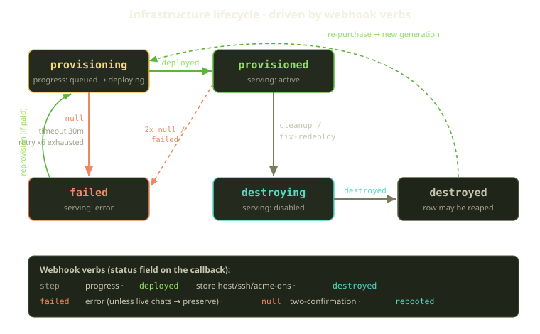
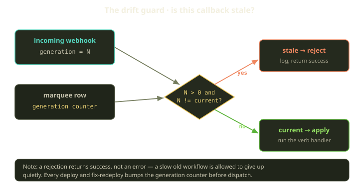
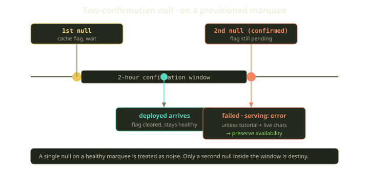

A Player buys a tutorial plan. Somewhere out in GitHub Actions, a Terraform workflow spins up a Scaleway VM, wires up Cloudflare DNS, registers an acme-dns account, and reports back over HTTP. We don't poll it, and we don't hold a connection open for the eight minutes it takes — we wait for it to call us, and when it does, we have to decide in a few milliseconds whether to believe it.

That last part is the whole problem. The workflow is out of band, eventually consistent, and occasionally late. A deploy you kicked off ten minutes ago might still be running when you've given up and started a fresh one — and when that slow old workflow finally phones home, trusting it clobbers the newer environment with its stale view of the world. This post is about the machinery — generations, a drift guard, a two-confirmation null — that lets us listen to an untrusted, asynchronous system without getting burned.

<!-- truncate -->

## A Marquee has two state axes, not one

Quick refresher on the nouns. A **Marquee** is a Player's Docker host. For bring-your-own hosts you hand us SSH credentials and you're done. For tutorial plans, Fibe auto-provisions a VM — *that* path runs through Terraform.

A Marquee carries two independent state axes. One is its **serving status** — whether the host can take traffic at all, sitting somewhere between active, disabled, and errored. The other is its **infrastructure lifecycle** — where the underlying VM is in its arc: provisioning, provisioned, destroying, destroyed, or failed. They move mostly together but not always, and the gap between them is where the interesting bugs live. A BYO Marquee has no infrastructure lifecycle at all; everything below is the tutorial-provisioning story.

A finer-grained progress field drives the UI's little spinner — a coarse step counter that walks from queued, through the VM coming up and SSH being configured, to TLS being provisioned and the app deploying. It exists only so the progress bar has something to animate.

## The webhook verbs

The Terraform workflow talks to one endpoint and varies a single field — a verb the handler dispatches on. The whole vocabulary, roughly in the order things happen:

| Verb | What it means | What we do |
|---|---|---|
| `step` | progress ping | advance the progress counter (queued &#8594; deploying) |
| `deployed` | VM is up and reachable | store host/port/user/SSH key + acme-dns creds, bootstrap Traefik |
| `destroyed` | infra is gone | mark the lifecycle destroyed, tear down playgrounds, maybe reap the row |
| `failed` | the workflow blew up | move the Marquee to failed / errored — unless live chats say otherwise |
| `null` | plan reports no infrastructure | depends entirely on current state (see below) |
| `rebooted` | host came back from a reboot | reset the progress counter |

The happy path is short. A handful of `step` pings walk the progress bar forward, then `deployed` lands with the connection details — host, port, user, SSH key, free domain, acme-dns credentials — stored on the row. A background job then brings Traefik up and warms a wildcard cert; once a real HTTPS probe verifies, the Marquee flips to active and provisioned. That bootstrap is its own story — here we care about the callbacks.

## Generations: the part that actually matters

Before any of that, the callback proves it's our workflow with a Bearer token, checked with a constant-time comparison so a naive byte-by-byte compare can't leak the secret one character at a time through timing. But authentication only tells you the caller is legitimate. It says nothing about whether the caller is *current* — and in an asynchronous system, "legitimate but stale" is the dangerous case.

Picture it. You dispatch deploy #1; it's slow — maybe Scaleway is having a moment. A Player hits the **fix-redeploy** button, which destroys the half-built infra and dispatches deploy #2 against the same Marquee row. Now two authenticated workflows are alive, both holding valid tokens. Deploy #2 finishes first and the environment goes healthy. Then deploy #1 limps across the line and reports `deployed` — with the IP, SSH key, and domain of a VM we already threw away. Trust it, and you've pointed a live Marquee at dead infrastructure.

The fix is a monotonic counter — a *generation* — stored on the Marquee row. We bump it on every dispatch, *before* the workflow starts. So deploy #1 runs under generation 4; the fix-redeploy that supersedes it bumps the row to 5 and dispatches deploy #2 under generation 5. The counter only ever climbs, once per attempt.

The generation rides along in the workflow inputs, so every callback echoes back the generation it was born under. The handler compares that against the generation on the row and rejects the callback if they differ — a mismatch means the caller belongs to a dispatch we've already moved past. Each rejection is logged with both numbers, so the stale-callback story is reconstructable after the fact.

:::tip
A rejected callback returns **success**, not an error. That's deliberate. The stale workflow isn't broken — it's just late, and returning an error would make it retry, fail its run, or page someone. We want it to report in, get a polite "thanks, we're good," and stop. The drift guard isn't a wall; it's a no-op with a paper trail.
:::

The same check guards `step`, not just `deployed`. A stale progress ping is harmless on its own, but letting it rewind the bar to "creating the VM" while the real environment is already live would be a confusing little lie in the UI.

The guard only fires when the incoming generation is positive *and* different. A generation of zero — an old workflow predating the field — is treated as unversioned and not rejected on this basis: better to fail open than reject a callback we can't classify. The fields that truly can't change underneath a running environment are locked separately at the model layer.

## null: the verb that means "I'm not sure"

Most verbs are unambiguous. `deployed` means it's up; `destroyed` means it's gone. `null` is the odd one: the plan looked and found *no infrastructure* — which means two completely different things depending on where we think we are.

If the Marquee is still provisioning, a `null` plan is good news, sort of: the build never produced anything, so there's nothing to wait for. We don't sit on the 30-minute timeout; we fail fast — the lifecycle moves straight to failed, the progress counter resets, and the callback returns success. One honest `null` while still provisioning is conclusive.

But if the Marquee is provisioned — already live, serving a Player — a `null` plan is alarming: the infrastructure under a running environment has vanished. The catch is that Terraform plans against cloud APIs aren't perfectly reliable narrators. A transient Scaleway hiccup, an eventual-consistency lag, a read against a region mid-blip — any of these can make a healthy VM momentarily look absent. Tear it down every time one plan gets confused, and *we're* the unreliable narrator.

So on a provisioned Marquee, one `null` is not enough. We require two. The first writes a short-lived flag and returns success — a deliberate pause to wait for a second opinion rather than act on the first scare. The flag lives for two hours; if a `deployed` (or any healthy signal) shows up before it expires, we clear it and the scare is forgotten. Only a *second* `null`, inside the window with the flag still pending, counts as a confirmed disappearance — and even then a final availability check stands between it and a teardown.

### Even a confirmed null can be overruled

There's one more guard in front of the downgrade, and it's the most product-shaped decision in the whole flow. Before a confirmed `null` (or a `failed` webhook) can move a Marquee into the errored state, we ask the control plane whether it's worth protecting. If it vetoes, the callback returns success and nothing is torn down.

The veto fires when the Marquee is a tutorial host, currently active and provisioned, and still has live, reachable AgentChats. In plain terms: a Player is mid-session with a Genie coding agent, and the only thing telling us to nuke the box is a plan that may well be wrong. We side with the Player — log the drift, keep the lights on, and let the slower reconciliation loops sort out the truth.

:::warning
This is the one place where the webhook *doesn't* get the final say. A `null` or `failed` callback cannot tear down a tutorial Marquee that still has live reachable chats — observed control-plane reality outranks a possibly-stale plan.
:::

So the bare arrow you'd draw — "`failed` &#8594; errored" — is really "`failed` &#8594; errored, unless live chats, in which case preserve." That asterisk is load-bearing.

## When the workflow never calls at all

Generations and the two-confirmation null handle callbacks that *arrive*. The nastier failure is the callback that never comes — a GitHub Actions run that dies mid-flight, a network partition, a workflow that hangs — and the Marquee just sits in `provisioning` or `destroying` forever. Two safety nets cover this.

The first re-tries. A background sweep finds tutorial Marquees stuck past a short stale threshold and re-dispatches the workflow, backing off on each attempt — one minute, then two, four, eight, sixteen, and finally thirty. A merely-slow host gets several nudges before we give up; a genuinely dead one isn't hammered on a tight loop. After six tries we stop: the lifecycle goes to failed, the serving status to errored, and the retry and progress counters are cleared. Past six, the absence of a callback is itself the verdict.

The second is blunt: a 30-minute provisioning timeout. Any Marquee provisioning longer than that is, as far as we're concerned, dead, and a periodic sweep moves it to failed regardless of what the absent webhook would have said. The retry job tries to *rescue* a stuck environment; the timeout *gives up* on one — one optimistic, one final.

## What ties it together

The pattern repeats at every layer. The system we're listening to is external, asynchronous, and only eventually consistent, so at no single point do we let one message be the whole truth: generations make every callback prove it belongs to the *current* attempt, two-confirmation null makes a destructive plan corroborate itself, preserve-availability lets a live chat overrule even a confirmed-bad signal, and the retry cap plus the 30-minute timeout make the absence of any callback a terminal state too.

None of these is clever in isolation — a counter, a cache flag, a retry cap, a scope. The design is in the posture. The instinct to fight is making webhooks authoritative because they *feel* authoritative — authenticated, from your own infra, carrying real data. But "from our own infra" and "currently correct" are different properties, and conflating them is how you point a live environment at a dead VM. Authentication answers *who*; generations answer *when*. And the right number of confirmations isn't always one: `step` we trust instantly, while a destructive `null` on a live host earns a second opinion, a two-hour window, and a check against what the Player is doing right now. Calibrating that was most of the actual engineering. The verbs were the easy part.
