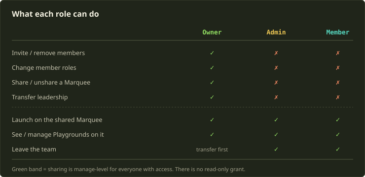
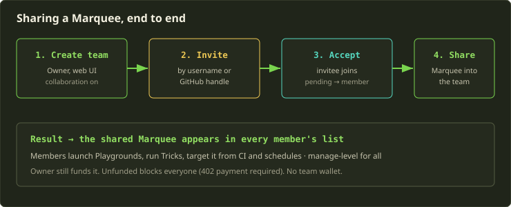
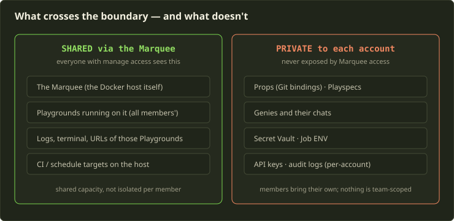
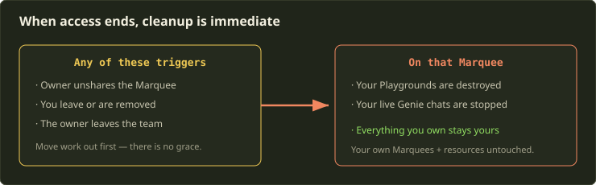

You bought the beefy box. You funded the Marquee. And now three teammates are pinging you in Slack asking why they can't launch the staging stack on it. The honest answer for a long time was "you can't, it's mine" — and that's a silly place for a tool that runs Docker hosts to be.

Teams fix that. The model is deliberately small: a Team lets you share one thing — a [Marquee](https://whats.fibe.gg/concepts/marquees/) — with other people, and the people you share it with launch on it as if it were their own. No team wallet, no read-only tier, no labyrinth of per-resource ACLs. This guide walks you through creating a team, inviting people, picking roles, and sharing a Marquee — and, just as importantly, what stays private and what disappears the moment access ends. The boundaries are where people get surprised, so we'll spend real time there.

<!-- truncate -->

## The mental model: a team shares a host, not an account

Before any clicking, get one idea straight, because everything else falls out of it.

A Marquee is the unit of sharing. When you share a Marquee into a team, accepted members get **manage-level** access to that host. The shared Marquee shows up in their list right next to their own, and it works everywhere a Marquee is selectable: creating Playgrounds, launching templates, pointing CI at it, scheduling Tricks against it. From a member's seat, your host is just another host they can deploy onto.

What a team is *not*: it is not a shared account, not a shared wallet, and not a shared pile of secrets. Your Props, your Genies, your Secret Vault, your API keys — none of that rides along with the Marquee. Members bring their own. The team grant is narrow on purpose: it shares **capacity**, not your identity.

:::note
Team management today is **web-only**. You create and manage teams from the Teams page in the app. There's no public API, CLI, or MCP surface for managing teams themselves. But — and this is the important part — accepted Marquee access *is* honored everywhere a Marquee normally works, including the CLI and MCP. You manage the team in the browser; you use the shared host from your terminal.
:::

One setup note before you start: creating teams may require collaboration to be enabled on your account first, under [Feature Preferences](https://whats.fibe.gg/advanced/features/). Accepting an invitation and using a Marquee that's been shared *with* you both work without it — so the person funding and sharing flips the switch, and everyone they invite just gets on with it.

## Roles, and who should have which

There are three role values. They split cleanly into "runs the team" and "uses the team."

- **Owner** — the person who created the team. Invites and removes members, changes member roles, transfers leadership, and shares or unshares Marquees. There is exactly one owner.
- **Admin** — uses shared Marquees and can leave the team. That's it. Despite the name, Admin is **not** a membership-management grant today — an Admin can't invite people or change roles. Think of it as a label you can hang on a trusted member, not a second tier of control.
- **Member** — accepts the invitation, uses shared Marquees, and can leave the team. Can't invite or change membership.

The thing that trips people up: only the **owner** can share resources into the team, and only the owner can manage who's in it. Admin and Member are functionally the same when it comes to *using* the team — both launch on shared Marquees, both see the Playgrounds running there, both can walk away whenever they want.



So when do you reach for Admin over Member? Honestly, today it's mostly signaling — you're marking someone as senior or trusted without granting them anything extra. Here's how we'd assign:

| Role | Give it to | They can | They cannot |
|---|---|---|---|
| Owner | The person who funds the Marquee | Everything: invite, remove, set roles, share/unshare, transfer | (n/a — single owner) |
| Admin | A trusted lead you want to flag as senior | Use shared Marquees, manage Playgrounds on them, leave | Invite, remove, change roles, share |
| Member | Everyone else on the team | Use shared Marquees, manage Playgrounds on them, leave | Invite, remove, change roles, share |

:::tip
Don't over-think Admin vs Member. Since neither grants management today, pick based on what you want the role to *communicate*, and assign Owner to whoever owns the billing relationship — because funding lives with the owner and can't be split.
:::

Ownership is special. The creator is the owner, and ownership only moves through **Transfer leadership** — it's never handed out by an invite or a role edit. If you're the owner and you want to leave, you have to transfer leadership to another accepted member first; that member is promoted to Owner and you drop to Admin. And a team can only be deleted once everyone else has left or been removed. So the owner is a load-bearing role: plan for succession before you need it.

## Walkthrough: stand up a team and share a Marquee

Here's the whole arc, start to finish.



### 1. Create the team

From the Teams page, create a team. If the option isn't there, flip on collaboration under Feature Preferences first. You're now the owner.

### 2. Invite people by handle

You invite by **username or GitHub handle**. Two details worth knowing:

- An invitation stays **pending** until the person accepts or declines, and pending invites **don't expire** on their own. No 7-day timeout to babysit.
- You can invite someone who hasn't signed up for Fibe yet. The invitation attaches to their account when they register with that username — so onboarding a new hire and adding them to the team can happen in either order.

If someone declines, you're not blocked — a declined invitation doesn't prevent a fresh one, so you can re-invite after they sort out whatever made them decline.

### 3. They accept

The invitee accepts from their own account. At that point they're a Member (or Admin, if you assign it). Accepting and using a shared Marquee don't require the collaboration preference on *their* account — only the owner needs it on.

### 4. Share the Marquee

This is the actual sharing action, and it's owner-only. From the team page, share the Marquee into the team. Remember: there's no read-only option in the dialog. Sharing **is** manage-level. If you share it, every accepted member can manage it.

### 5. Everyone launches

The shared Marquee now appears in each member's Marquee list. They select it like any other host and launch. From the CLI, that's just a normal launch against a Marquee they can now see:

```bash
# A teammate launching on the shared host — same command as for their own Marquee
fibe playground launch \
  --playspec web-staging \
  --marquee acme-staging-box
```

Nothing special in the command. The Marquee resolves because the share granted them access through the normal Marquee scope. If they're driving automation with a team-scoped API key, the same rule holds — the key resolves the Marquees the team grants it, and nothing it isn't entitled to. (More on key scoping below.)

## The boundaries: what's shared vs what's private

This is the section to read twice. Most "wait, why can my teammate see this?" and "why *can't* they see this?" moments live here.



**Playgrounds on a shared Marquee are shared in practice.** This is the one that surprises people. The host is shared *capacity*, not isolated cubicles. Everyone who can manage the Marquee can see and manage every Playground running on it — yours, theirs, all of it. Logs, terminal, URLs included. That's the point of a shared host: the team operates the box together. But it does mean you shouldn't treat a shared Marquee as a private sandbox.

**Everything else is not implicitly shared.** A shared Marquee does **not** expose the owner's private resources. Members still need their own Playspecs, Props, Genies, and Secrets to launch their own work. Your Genie chats stay yours. Your Secret Vault stays yours. There are no team-scoped Secrets, no team-scoped API keys, and no team-scoped audit logs — those are all per-account, and team membership doesn't change them.

**Names can collide, because the host is shared.** Two members on the same Marquee are now sharing one namespace:

- **Subdomains are unique per Marquee** across everyone's Playgrounds. If a teammate already grabbed `app.your-domain`, you can't.
- **Raw host ports collide** only when a template explicitly opts into preserving Compose `ports:`, or when a launch supplies explicit port mappings. By default Fibe strips local-only Compose host bindings, so most templates won't fight over ports. If you've got a template that pins `ports: ["5432:5432"]`, two people launching it on the same shared host will conflict — that's a template choice, not a Fibe surprise.

:::caution
A shared Marquee is shared capacity. Before you put a long-lived, sensitive Playground on a team host, remember every team member with access can open its terminal and read its logs. If something genuinely needs to be private to you, keep it on a Marquee you haven't shared.
:::

### Funding stays with the owner

There is no team wallet. The owner funds the Marquee, and the funding rules apply to everyone equally — an unfunded Marquee blocks the owner and every member alike with a `402` payment-required response. So if the box goes dark, it goes dark for the whole team at once. Keep the [Mana/Sparks balance](https://whats.fibe.gg/concepts/billing/) topped up the same way you would for a solo host; the only difference is more people notice when you don't.

## API keys and team resources

If your team automates against the shared host — CI pipelines, scheduled Tricks, agents — you'll be using API keys, and the resolution rule is worth stating plainly: a key resolves the resources its owner is entitled to. A teammate's key, used against the shared Marquee, works because the team grant gave that teammate Marquee access through the normal `marquees:*` scopes. It will not magically reach resources the team doesn't share, because the team only shares the Marquee.

Scope keys narrowly, exactly as you would solo. A CI key that launches on the shared host needs little more than launch and the relevant Marquee/Playground scopes:

```bash
# A tightly scoped key for CI that launches on the shared Marquee
fibe key create \
  --name "acme-ci-staging" \
  --scopes launch:write,playgrounds:write,marquees:read
```

Avoid full-access wildcard keys for team automation — they exist for administrator-level cases, not as a default. And remember the raw token is shown **only at creation time**, so capture it into your CI secret store immediately.

:::note
Creating and managing API keys is a sensitive action — Fibe asks you to re-confirm your second factor (sudo mode), and that confirmation lasts 15 minutes before it prompts again. Same goes for managing Secret Vault entries and webhooks. None of this changes for teams; security stays per-account. See [Security & Sessions](https://whats.fibe.gg/advanced/security/).
:::

## When sharing ends: cleanup is immediate

The flip side of "easy to share" is "cleanup is real." When any of these happen —

- the owner **unshares** the Marquee,
- you **leave** or are **removed** from the team, or
- the **owner leaves** the team

— access ends, and on that Marquee:

- your **Playgrounds are destroyed**, and
- your **live Genie chats on it are stopped**.



There's no grace window described here, so the rule is simple: **move any work you need before sharing ends.** Push the branch, export the data, snapshot whatever matters. If you're the owner about to unshare, give people a heads-up first — destruction is the contract, not a bug.

The reassuring half: you keep everything you own. Leaving a team only ends access to what was shared. Your own Marquees and your own resources are completely untouched. Revocation cleans up the *shared* access and the things that depended on it — and nothing else. That clean teardown is exactly why the model can stay this simple: there's no tangle of partial permissions to unwind, because the only thing that was ever granted was the Marquee.

One account-deletion footnote, since it follows the same logic: deleting your account makes you automatically leave every team you're a member of. But teams you *own* are not cleaned up for you — transfer leadership or delete the team first, or you'll orphan it.

## Honest notes on the v1 contract

A few things to set expectations, because pretending otherwise helps nobody:

- **Sharing is owner-only.** Members can't share their own Marquees into the team today. The owner shares; everyone else uses.
- **The Marquee is the only shareable resource.** You can't share a template, a Prop, or a Secret into a team. Everything except the host stays personal.
- **There's no read-only grant.** Access is manage-level or nothing. If you need someone to merely *look*, that's not a thing the share dialog offers — design around it.
- **Management is web-only.** No team API yet. Use the Teams page for setup; use the normal surfaces (CLI, MCP, browser) for the shared host once access is granted.

None of this is a wall you'll hit often, but it's better to know the shape of the box before you build inside it.

## Rules of thumb

- **The Marquee is the unit of sharing.** Think "I'm lending the team my host," not "I'm adding them to my account."
- **Share = manage, for everyone.** No read-only. If you wouldn't give someone terminal access to the box, don't share it to a team they're in.
- **Owner owns funding and membership.** Assign Owner to whoever holds the billing relationship, and plan a leadership transfer before that person ever needs to leave.
- **Admin ≈ Member today.** Both use the team; neither manages it. Pick the label for signaling, not for control.
- **Private stays private.** Props, Genies, Secrets, Job ENV, API keys, and audit logs never ride along with a shared Marquee. Members bring their own.
- **Shared host = shared namespace.** Watch for subdomain collisions, and check templates that pin Compose `ports:` before two people launch them side by side.
- **Cleanup is immediate and total.** When access ends, your Playgrounds on that host are destroyed and live Genie chats stop. Move your work out first.
- **Scope team automation keys narrowly.** A key resolves only what its owner is entitled to; lean on that instead of wildcard keys.

Teams on Fibe are intentionally a small feature — one shared resource, three roles, a clean teardown. That smallness is a feature: there's very little to misconfigure, and almost nothing to forget to revoke. Stand one up, share the box, and let your team launch.
