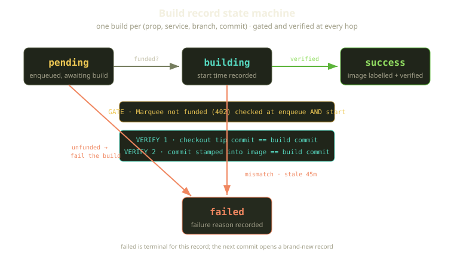
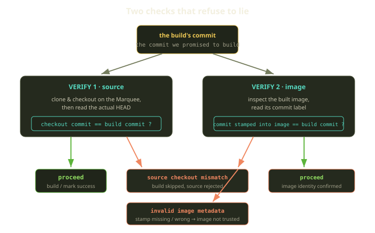
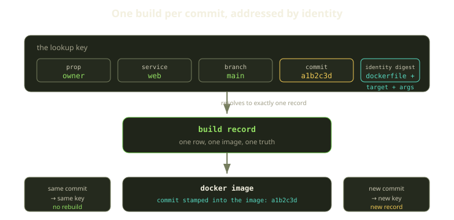

Here is a bug that does not look like a bug. You push a commit, a build kicks off, it goes green, your environment comes up. Everything works. Except the image inside it was built from a *different* commit than the one you pushed — a stale checkout, a cached layer, a race between two builds for the same branch. Nothing errored. The dashboard says success. And you spend an afternoon debugging code that was never actually deployed.

That class of failure — a build confidently wrong about what it produced — is the one we decided never to ship to a Player. So Fibe's image builds follow one stubborn rule: a build must be deterministic and honest about which commit it produced. This post is about how each build record enforces that, and the two checks that will fail a build rather than let it lie.

<!-- truncate -->

## What a build record is

On Fibe, every Docker image build is a row in the database. One record represents exactly one image build for a unique combination of **prop, service, branch, and commit**. (A *Prop* is a Player's Git binding — managed Gitea, GitHub OAuth, or a GitHub App — the source of truth for code.)

The record is a small state machine with four states, and no more: a build is born **pending**, moves to **building** when a worker picks it up, and lands on either **success** or **failed**. The interesting part is not the states — it is the gates between them.

Two things guard the path from pending to success:

1. A **funding gate** that runs twice — once when the build is enqueued, once when the worker starts.
2. Two **verification checks** during the build: the checked-out source must match the commit, and the resulting image must match the commit.

If any fails, the record goes to failed with a recorded reason, and that is terminal. The next commit opens a brand-new record — we never resurrect a failed build. A build is a statement about one specific commit, and you do not get to edit the past.

## The funding gate, checked twice

Fibe is a Docker-based dev-environment platform. A Player owns a *Marquee* (a Docker host) that must be funded daily out of a Mana/Sparks wallet. If it is not funded, nothing on it runs — every runtime operation is gated behind a single entitlement check that returns a `402`, the payment-required response, with a clear "Marquee not funded" reason. Builds are a runtime operation, so they are gated too.

What is worth dwelling on is that we check the gate **twice** — once at enqueue time, and again inside the worker when it actually starts the build. The first check decides whether a build is worth scheduling at all; the second re-asks the same question at the moment compute is about to be spent.

Why both? Because real wall-clock time passes between "we decided to build this" and "a worker has a slot," and a Marquee can run out of funding in that window. Checking only at enqueue would let a build funded *then* run against a Marquee not funded *now* — burning compute the Player did not pay for. The second check is correctness, not paranoia. When it fails, the job marks the record failed with the original not-funded reason preserved, so the Player sees *why* in the UI instead of a generic build error.

:::note
The gate is the same entitlement check that guards roughly a hundred call sites across the platform — controllers, channels, SSH and Docker executors, agent chats. Builds are not special; they inherit the same "is this Marquee allowed to work right now?" question everything else asks.
:::

There is also a continuous sweep — a recurring job runs every 30 seconds and re-enqueues anything stuck. It picks up two cohorts: builds that have gone stale (more on those below), and builds still sitting in pending, oldest first. Because every re-enqueue runs back through the same funding gate, the sweep doubles as a janitor: a pending build on an unfunded Marquee gets failed cleanly instead of lingering forever. No build is allowed to be eternally optimistic.

## Verification: the part that refuses to lie

The funding gate decides whether a build is *allowed* to run. The two verification checks decide whether it is *telling the truth*. This is the heart of it.

### Check 1 — the checkout must match the commit

Before we build anything, we clone and check out the Prop's source onto the Marquee, on the build's branch. Then — the bit that matters — we read the *actual* commit at the tip of that checkout and compare it to the commit the record says it is building. If the two are equal, we proceed. If they are not, we stop: the build is failed before a single layer is built, and the failure records both the expected and the actual commit so the mismatch is debuggable at a glance.

This catches the "stale checkout" failure we opened with. Branches move: between the moment a record is created for commit `a1b2c3d` and the moment the worker clones, someone may have force-pushed or the branch advanced. We refuse to build "whatever happens to be at the tip of `main` right now" and call it the build for `a1b2c3d`. The commit in the record is the contract; if the working tree does not honor it, the build does not happen, and the failure is filed under a source-checkout-mismatch reason so anyone reading the record later knows exactly what went wrong.

### Check 2 — the image must match the commit

Passing check 1 means the *source* was right; check 2 confirms the *output* is right. We bake the commit into every image as a label at build time — a small, tamper-evident stamp that travels with the image. After the build, we inspect the finished image, read that label back, and compare it to the build's commit.

If the stamped commit does not equal the build's commit, the image is not trusted, and the build fails under an invalid-image-metadata reason. The orchestrator is blunt about it: *"Build image does not contain expected commit metadata."* An image whose stamp is missing or wrong could be a cached layer from another build, a partial build, or simply not the artifact we asked for — and we will not hand any of those to a Player as if they were the real thing.

This closes the loop. Check 1 verifies the *input* commit; check 2 verifies the *output* image carries that same commit as its stamp. An image without the right stamp is, as far as Fibe is concerned, of unknown provenance — and unknown provenance is a failure, not a warning.

| Check | What it compares | Why it fails a build |
|---|---|---|
| Source | checkout tip commit equals the build's commit | source checkout mismatch — wrong code |
| Image | the commit stamped into the image equals the build's commit | invalid image metadata — wrong or unknown artifact |
| Funding | Marquee funded at both enqueue and start | not funded — `402`, payment required |
| Stale | building for longer than 45 minutes | timeout — work abandoned mid-build |

## One build per commit, addressed by identity

The "one build per commit" rule needs a way to *recognize* the same build twice, so we never run two builds for the same thing nor confuse two for different things. The answer is a content-addressed key.

A build is keyed by its prop, its branch, and a build-identity digest. The digest is not just the commit — it folds in everything that would change the resulting image: the path to the Dockerfile, the build target, and the build arguments. Hash those together with the commit and you get one stable fingerprint per distinct image.

So two services at the same commit but with different build arguments or a different Dockerfile target get different identities — because they genuinely produce different images. Conversely, the same commit with the same inputs resolves to the same record, so we reuse a known-good image instead of rebuilding it. The commit stamped into the image and the commit in the record are two ends of the same identity; check 2 just asserts they agree.

This is what makes builds *deterministic* in the way that matters operationally: the same inputs always map to the same image, and a different image always implies different inputs.

## Stale builds don't get to hang around

What about a build that starts and then the worker dies, or the network partitions mid-`docker build`? A record stuck in the building state with no one tending it is a lie of a different kind — it claims work is in progress when none is. We bound that with a timeout: any build that has been in the building state for longer than 45 minutes is considered stale.

The recurring sweep recovers it: marked failed with a timeout reason and a message that says exactly that — *"stuck in building state for over 45 minutes."* No human pages required; the system reconciles toward the truth on its own, the same way the rest of Fibe's runtime is continuously healed.

:::tip
The two janitorial behaviors share one mechanism. The 30-second sweep re-enqueues both *stale* and *pending* builds: stale ones get failed for timeout, pending ones on an unfunded Marquee get failed for funding. One loop, two kinds of honesty.
:::

## What we learned

The throughline is one design stance: **a build is a claim about one specific commit, and the system should make that claim hard to falsify.**

- **Key builds by commit, not branch.** Branches move; commits don't. The content-addressed identity built from prop, service, branch, and commit gives you "one build per commit" almost for free, and makes reuse safe instead of risky.
- **Verify both ends.** Matching the checkout to the commit catches stale source; matching the image's stamped commit catches stale *output*. You need both — a green build that ran the wrong code is worse than a red one.
- **Gate at decision time *and* execution time.** The funding check runs twice because the world changes between enqueue and start. Idempotent re-checks are cheap; a build burning an unfunded Marquee's compute is not.
- **Make the janitor a side effect, not a special case.** Stale recovery and unfunded-pending cleanup fall out of the same 30-second loop that runs the real path's gates — no separate, untested cleanup code to rot.
- **Be conservative about what you recreate.** When a new image lands, we only flag clean, long-lived, non-production environments as out of date. A missed recreation is a stale env the Player can rebuild; a wrong one is destroyed work. Optimize for the cheaper mistake.

None of this is exotic. It is mostly the discipline of writing down, in code, the thing everyone *assumes* — "the image is built from the commit it says" — and refusing to take it on faith. The build gate turns that assumption into a checked invariant that fails loudly, with a reason and a category, instead of handing you a confident lie. That is the feature: a build that knows when it is wrong is worth ten that are usually right.
