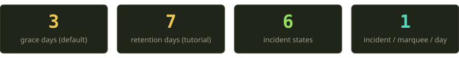
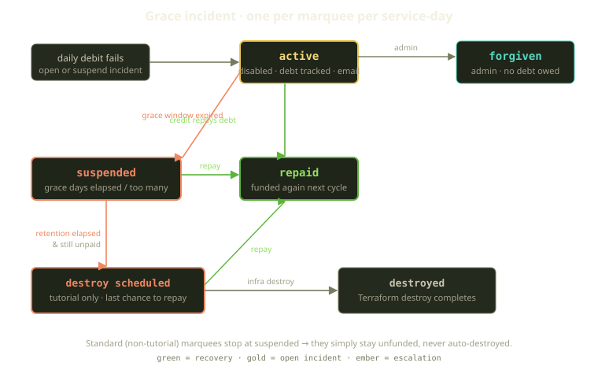

Every billing system has a moment it would rather not talk about: the one where the money stops. The card expires, the wallet empties, the trial ends — and now you have an environment that costs real money to keep alive and a customer no longer paying for it. The naive answer is brutal and tempting: tear it down, move on.

We didn't want to build that. Fibe funds a Marquee — your Docker host — out of a daily wallet, and when a day can't be funded, the system enters a deliberate, recoverable sequence rather than a guillotine. This post is about that sequence: the grace incident, the three-day window, the seven-day retention, and the invariant we cared about most — **starting grace never marks your billing as paid, and a suspended-but-unrepaid environment can never slip back to "active."**

<!-- truncate -->

## The funding loop, briefly

Grace sits underneath the daily funding cadence. Every five minutes a sweep job tries to fund each Marquee that requested today's service-day. It skips any that didn't request service today, skips any already paid for today (idempotent on purpose, so a Marquee can never be charged twice for the same day), and otherwise debits the wallet — Mana for tutorial Marquees, Sparks for standard ones — and marks the day paid.

When the debit succeeds, the paid-through time advances to the end of the service-day and the runtime entitlement gate opens. That gate is a single not-funded check — a `402`, payment-required response — guarding roughly a hundred call sites across controllers, jobs, channels, and the SSH and Docker executors: the one thing standing between "your wallet has money" and "your containers are allowed to do work." When the debit *fails*, the wallet refuses to go negative, and the sweep hands the Marquee to the grace machinery rather than let it run free.

:::note
The wallet can **never** be driven negative. The row is locked pessimistically and an "insufficient balance" error is raised before any write that would push it below zero. Grace is not "let the balance go red and chase it later" — it's an explicit, tracked debt that lives in its own table.
:::

## One incident per marquee per day

The unit of grace is a grace incident: a single unfunded service-day, recording how much was owed and in which currency, when the grace window ends, how much has been repaid, and what state it's in.

The model has one structural rule that does a surprising amount of work: a database uniqueness constraint allowing at most one incident per Marquee per service-day. That's why a Marquee that fails funding at 9:00 and gets re-swept at 9:05 and 9:10 doesn't open three incidents and fire three "your environment is paused" emails. The first sweep opens the incident, sends one notification, and disables the runtime; every later sweep that day just finds the existing row — no new charge, no new email, no double-counting toward your incident limit. A constraint, rather than a "we'll remember to check," is why a lapsed payment can't email you four times in an hour.

## The state machine

An incident moves through six states — *active*, *repaid*, *suspended*, *destroy scheduled*, *destroyed*, and *forgiven* — and the transitions are where the humane-ness lives:

| State | What it means | How you got here |
|---|---|---|
| active | The grace window is open. Runtime is disabled, debt is tracked, you've been emailed. | First unfunded sweep of the day. |
| repaid | The debt is fully paid off. The next sweep funds the Marquee again — no "reactivate" button. | Any positive wallet credit, applied automatically, oldest incident first, in the matching currency (Mana for tutorial, Sparks for standard). |
| suspended | The grace window elapsed (or you hit too many incidents). Runtime stays off. | The grace days passed, or — past a two-incident allowance — the incident opened **already suspended**. |
| destroy scheduled | Tutorial only. Retention has elapsed and infra destruction is requested. Still repayable. | The retention deadline passed and the debt is still open. |
| destroyed | The Terraform destroy completed. | The infra-destroy workflow finished. |
| forgiven | An admin wrote off the debt. Nothing owed. | Manual admin action. |

### active: disabled, but not paid

The most important thing about the active state is what it *doesn't* do. When grace starts, we set the Marquee to disabled and leave the paid-through time exactly where it was. Nothing in the grace path ever pushes it forward — and that's the load-bearing invariant from the top: the funding gate asks "is the paid-through time still in the future?", so a Marquee in grace still fails it. The containers stay stopped; you are not running on credit you haven't paid for.

It would have been *so* easy to extend the paid-through time through the grace window — but then grace would look identical to a funded day at all hundred gate call sites, giving away runtime with no record of the debt. Grace is generous about *time* and strict about *entitlement* — keep those separate, or your billing system quietly becomes a free tier.

### active &#8594; suspended: two ways in

A grace window doesn't stay open forever. A deadline is set when the incident opens — its open time plus the grace days — and a sweep suspends any active incident past its deadline. Keep lapsing and we stop extending the courtesy: past a two-incident allowance, the next incident opens already suspended, no grace window at all. Both defaults — three grace days, two incidents — are settings, tunable without a deploy.

## What suspension actually destroys (and what it doesn't)

This is the fork that surprises people: **suspension behaves differently for tutorial Marquees and standard Marquees.**

A suspended standard Marquee — a player's own Scaleway VM or bring-your-own SSH host — simply *stays unfunded*: runtime off, debt tracked, and that's it. We never auto-destroy one. It's your host, and Fibe will not reach into infrastructure you own and tear it down because a wallet ran dry. Pay the debt and it comes back; don't, and it idles.

Tutorial Marquees are different, because *we* provisioned and pay Scaleway for them, and letting an abandoned tutorial VM run forever is just us lighting money on fire. So suspension starts a second, longer clock: a destruction deadline is stamped onto the incident, the retention days into the future. That's a **seven-day retention window** by default. For a full week the infrastructure is untouched — your code, your volumes, your work, all still there and just stopped — seven more days to repay, on top of the three grace days.

Ten days, end to end, from the first missed payment to anything irreversible. The runway is intentional: people lose access for boring reasons — an expired card, a forgotten auto-recharge, a vacation — and a few extra days cost almost nothing next to deleting someone's project.

## destroy scheduled: still your last chance

When retention elapses, a sweep picks up suspended tutorial incidents whose destruction deadline has passed. The whole step runs under a lock on the incident and re-reads the world before doing anything irreversible: it confirms the incident is still suspended, the Marquee is still a tutorial one, and — crucially — bails out if billing has gone active again. That last check is the seatbelt: because the step holds a lock, a repayment racing the destruction sweep can't both win — and if the repayment goes first, destruction never happens.

Only if every check holds does the sweep move the incident to destroy-scheduled, send the "your environment is scheduled for destruction" email, and publish the event that drives a Terraform destroy workflow. The infrastructure walks from "destroying" to "destroyed," and the incident lands in its terminal state — the only fully irreversible step in the sequence, behind ten days, three emails, and four separate "did they pay yet?" checks.

## The invariants we refused to break

When you build something this forgiving, the danger isn't being too harsh — it's being *accidentally too lenient*, leaking runtime through a crack in the state machine. A few invariants hold it together, and we test them like they're load-bearing, because they are. No grace transition moves the paid-through time, so an in-grace Marquee fails the funding gate like an unfunded one. The sweep won't re-activate a suspended-and-unrepaid incident while the debt is open — the debit just fails again. And the uniqueness constraint makes the no-double-charge, no-double-email behavior structural rather than aspirational.

One more, the subtle one: **same-day reactivation is blocked.** Suspended for non-payment today? You can't manually reactivate on the *same service-day* while the debt is unrepaid — you pay it, you don't toggle a button to dodge it.

One piece of advice for anyone designing the same thing: model the debt as an explicit row with its own state machine, make the forgiving path automatic and the destructive path slow, and treat your own infra and the customer's differently. Auto-destroying a VM we pay for is housekeeping; auto-destroying a player's own host is a violation.

The result is a system where running out of money is an inconvenience you can recover from for a week and a half, not a catastrophe that happens while you're asleep. When the money goes wrong, the worst outcome should be "your environment is paused" — never "your work is gone."
