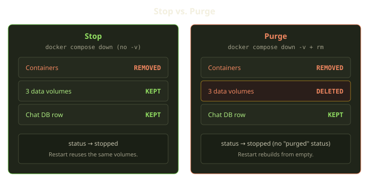

Here is the support ticket we never want to receive: "I stopped my Genie to save money over the weekend, and when I came back, everything it had learned about my codebase was gone."

For an AI coding agent, that's the worst possible failure. The agent's value compounds over time — its working state, its history, the files it wrote, the config it tuned — and all of it lives on disk, in Docker volumes, not in the container. So we drew a hard line early: **stopping a Genie must never touch its data.** Only one explicit, confirmed action deletes it. This post is about that contract and the small amount of code that makes "stop" and "delete" genuinely different.

<!-- truncate -->



## Two records, and where the value actually lives

A Genie is two distinct records, and the distinction matters here more than anywhere else. An **Agent** is the durable config — your provider, your encrypted credentials, your skills, your MCP wiring, your quotas. An **AgentChat** is one live instance of that Agent on one Marquee: a single Docker Compose project with a unique slot and its own project name. The AgentChat is what gets deployed, healed, stopped, and restarted. Its status is one of exactly four plain values — pending, running, error, or stopped. There's no state-machine library behind it; it's just a string, and the small set of allowed values is fixed.

Notice what isn't in that set: there's no "purged" status, and no "deleted" one. That absence is deliberate, and we'll come back to it.

But the thing worth protecting is none of those four statuses — it's the volume. When the compose project is generated, the agent's working directory is backed by a named Docker volume. The name we choose for that volume is the entire trick: it's derived from the **Agent** — the durable config record — and nothing else. Not the chat, not the slot, not the Marquee.

That one decision makes preservation possible. Containers are disposable; you rebuild them from the compose file in seconds. The volume is the only thing carrying the agent's accumulated state forward, and because its name is stable across the Agent's whole life, any future chat for that Agent reattaches the same disk. Stop the chat, start it again next week, and the agent picks up where it left off — same files, same memory.

:::tip
A useful mental model: the container is the *body*, the volume is the *brain*. Stopping a Genie puts it to sleep — we don't get to perform a lobotomy just because someone clicked "Stop."
:::

## Stop: `down`, no `-v`

When a user stops a chat — or billing or a Marquee outage quiesces it — the runtime runs exactly one command against the chat's compose project:

```shell
docker compose -p <project> -f <compose-file> down --remove-orphans
```

That's it. `docker compose down --remove-orphans`. No `-v`. In Docker, `down` removes containers and the default network but leaves named volumes alone. The `-v` flag — "and also delete the volumes" — is conspicuously, intentionally absent. After teardown the chat's status flips to stopped; the record, the volumes, and the slot all stay. Everything the agent built is still on disk.

That's why "stop" is cheap and reversible. Restart re-runs the deploy pipeline against the **same** compose project and volume name, so the new containers come up bound to the old disk. From the user's side the agent woke up; from Docker's side, the data never moved.

## Three volumes, not one

When we *do* delete, we delete three volumes, not one. Each agent gets a small, fixed set of persistent volumes — one for its working data and two for build-time caches — and they're treated as a single group.


Only the first — the **data** volume — is irreplaceable. The other two, a Node dependency cache and a build cache, are dev-only: dependency installs and build artifacts that exist purely to make later runs faster. Blow them away and the next run rebuilds them, a little slower. But all three are named off the stable agent identity, all three survive a stop, and all three are removed together when (and only when) we purge. We treat them as one preservation set so there's exactly one rule to reason about.

| | Containers | Data volume | Cache volumes | Chat record | Status after |
|---|---|---|---|---|---|
| **Stop / quiesce** | removed | kept | kept | kept | stopped |
| **Marquee maintenance** | kept | kept | kept | kept | unchanged |
| **Purge** | removed | **deleted** | **deleted** | kept | stopped |
| **Orphan reaper** (no record) | removed | deleted | deleted | n/a | n/a |

## Quiesce: the dangerous case, handled

The contract gets tested hardest not when a user clicks "Stop," but when a Marquee goes away underneath a running chat — billing lapses, the host gets disabled, Terraform reports the infrastructure as gone. That's exactly when a naive implementation reaches for the heavy cleanup and torches the volumes too. We don't.

When a Marquee transitions to unavailable, the change to its record triggers a hook that quiesces its live chats — but it's carefully gated, and the gates are the whole point.


First, a false-signal guard. Before doing anything, the runtime probes the chats on that Marquee: if any of them is *still answering* its health endpoint, the quiesce short-circuits and nothing is touched. A control-plane hiccup that makes a Marquee *look* dead should never knock out a chat that's still serving traffic. Reachability beats paperwork.

Only when there's genuinely no reachable chat, the Marquee is non-operational, and live chats exist does the quiesce fire — through the **same** preserving path: a remote stop, which is `down` with no `-v`. It then flips each chat to stopped and records a human-readable reason so the user can see why. The reason string captures the Marquee's reported status and the state of its underlying infrastructure, e.g. "Marquee became unavailable" with the relevant status details attached — enough context for someone reading the chat later to understand that the host disappeared, not that anything went wrong with their agent.

Same contract, harder circumstances: the Marquee fell over, the chat stopped, and not one byte of the agent's state was deleted. When it comes back, the chat reactivates against the same compose project and volume.

:::note
Marquee *maintenance* is gentler still: it only runs `docker image prune` and a `docker container prune` for stopped containers older than an hour. No `compose down`, no volume operation at all — maintenance can't delete data even by accident, because the code to do so isn't on that path.
:::

## Purge: the one door, and you have to mean it

So how *do* you delete an agent's data? Exactly one path for a chat that still has a record behind it, and it's loud about being destructive. Purge is the only place the `-v` flag shows up. It runs the full teardown:

```shell
docker compose -p <project> -f <compose-file> down --remove-orphans -v
```

and then, separately, removes each of the agent's persistent volumes by name:

```shell
docker volume rm -f <volume-name>
```

The double cleanup is belt-and-suspenders on purpose. `down -v` should remove the volumes, but we *also* explicitly `docker volume rm -f` each one by name — because `down -v` only removes volumes Docker still considers attached, and a rename, an orphaned reference, or a half-finished prior teardown could leave a stale data volume lurking. Purge means purge, no matter how the project state drifted. Finally it cleans up the compose files left behind on the host.

Now the part people misread. Before any of that destruction runs, purge does one more thing: it checks that the Marquee is actually entitled to runtime billing, so the operation can't fire on an unfunded Marquee mid-cleanup. Then it tears everything down. And after all that destruction, look at what it does to the chat's record.

The status becomes stopped. **Not** "purged" — that status doesn't exist. The volumes are gone, the record remains, and from the status alone a purged chat is indistinguishable from a politely stopped one. The difference is entirely on disk: one has its volumes, one doesn't. Surprising at first, but it's the right model. "Purged" isn't a *state* a chat lives in; it's a *thing that happened* to its data. The record keeps living in the stopped state so the slot, name, and history stay coherent — purge removes the data, not the identity.

Every other lifecycle event — a user stop, a billing quiesce, a Marquee-unavailable transition, a docker-maintenance sweep, a Playguard health scan — was deliberately routed through the preserving teardown path. None carry `-v`; we confirmed it by grepping for the flag and finding it in exactly one place. So the scary failure mode is structurally impossible, not merely unlikely: you can't accidentally delete your agent's memory by stopping it, because the code that stops it does not contain the instruction to delete.

## The one honest asterisk: the orphan reaper

There's exactly one other place that runs `down -v`, and honesty demands we name it. A recurring **orphan reaper** runs every five minutes and cleans up compose projects on a Marquee that have **no corresponding record** in our database:

```shell
docker compose -p <project> down -v --remove-orphans
```

This isn't a hole in the contract — it's the floor under it. The reaper's skip rule is purely structural: if a compose project has a chat record of *any* status, it's excluded, full stop. No reachability probing, no judgment calls; it just asks "does a record exist?" So the universe splits cleanly: chats with records are preserved by everything except an explicit purge; truly abandoned projects with no record are swept. No overlap, no gap.

Stated precisely: **for any chat that still has a record behind it, purge is the only thing that deletes its data.**

## What we learned

Two ideas carried the design: name volumes after the durable thing, so "stop then restart" reattaches the same disk; and make the dangerous operation rare and loud, so safety you can grep for beats safety you have to remember.

Stop is not delete. It sounds obvious written down. Making it obvious in the code, so no future change can quietly blur the line, was the actual work — and it's why that support ticket stays hypothetical.
