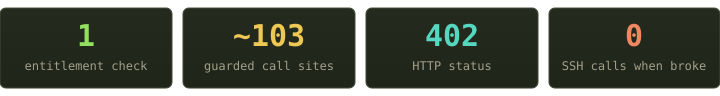
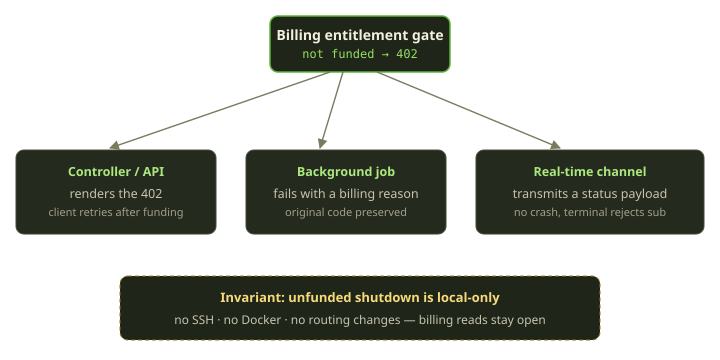

Every platform that rents compute eventually asks the same question in a hundred different places: *is this allowed to run right now?* On Fibe, "right now" means **funded** — a Marquee that has paid for the current service-day. We answer that question with exactly one check and one HTTP status, and we route the consequences differently depending on who's asking.

This is the story of the not-funded gate — a single `402` that sits in front of roughly a hundred call sites.

<!-- truncate -->

## The check is boring on purpose

A Marquee is the Docker host that your Playgrounds, Tricks, and AgentChats run on. Funding it is a daily affair: a small debit from your Wallet extends the paid-through time to the end of the service-day. The entitlement check is deliberately the dumbest thing in the building. It asks a single question: is the paid-through time still in the future (with a bypass for staff)? That's the whole test.

Notice what's *not* there. It does not ask whether Docker is healthy, whether SSH is reachable, or whether the VM still exists. Funding is a question about money and time, nothing else. Health is a completely separate question, answered by a completely separate check — one that *combines* "is it funded?" with "is the agent runtime up?", "is SSH reachable?", and "do we have a root domain?" before it will let a chat session launch.

Keeping these two orthogonal is one of those decisions that looks pedantic on day one and saves you on day ninety. "Unfunded" and "unhealthy" demand completely different responses, and conflating them means you can never cleanly reason about either. A funded host can still be broken; a perfectly healthy host can still be out of money. We never want one answer standing in for the other.

## One gate, raised everywhere

The gate itself is a single tiny piece of code with one job. When a Marquee isn't entitled, it raises a typed error that already carries its own machine-readable code and its own HTTP status — a `402` that means, unambiguously, *this Marquee has not paid for today.* Callers don't have to interpret a string or guess; the failure announces exactly what it is and how an HTTP client should treat it.

That single guard — plus the controller-level variant that protects request handlers — shows up in about **103 places** across some 43 files: controllers, background jobs, real-time channels, and every SSH / rsync / Docker executor. The number is almost beside the point. The point is that there is *one* answer to "are we allowed to spend host resources," and it's impossible to start real work without passing through it.

:::tip Why `402 Payment Required`
`402` was reserved in the original HTTP spec and left mostly unused for decades. It's perfect here: it's unambiguous, it's not `401` (you're authenticated) and not `403` (you're allowed — you just haven't paid for today). Clients can branch on it without parsing prose.
:::

## Same error, four different consequences

A raised exception is only half the design. The interesting part is what each *caller* does with it. The same not-funded `402` lands in four very different places:

| Caller | What it does with the 402 | Why |
|---|---|---|
| Controller / API | Renders the `402` straight to the client | Humans and SDKs branch on a clean status code |
| Background job (create / start / build) | Fails the job with a *billing* reason, preserving the original code | The record stays inspectable; the *reason* survives the failure |
| Real-time log channel | Transmits a status payload to the browser | A live tail shouldn't explode because billing lapsed |
| SSH terminal channel | Rejects the subscription with a status | Same idea — degrade, don't crash |

The thread tying these together: **the error code is never lost.** Whether it surfaces as an HTTP response, a stored failure reason, or a WebSocket frame, the consuming surface can always tell *why* — and "you need to top up" is a very different remediation from "something broke."

## The part we're quietly proud of

Here's the design choice that took the longest to get right. When a Marquee runs out of funding, the "quiesce" — our word for parking everything cleanly — is **local-only**. We do not SSH in. We do not talk to Docker. We do not touch Traefik routing.

What the unfunded shutdown is actually allowed to do is short and entirely confined to our own side of the wire: flip the Marquee into a quota-disabled state, mark each affected Playground as failed for a *billing* reason, run the small amount of local bookkeeping that quiesces the agent runtime, and write an audit record so the stop is explained. That's it. The list of things it must *not* do is the more important half: no SSH, no rsync, no Docker calls, no route refresh.

Why so restrained? Because the most likely reason a host is *also* unreachable at the exact moment funding lapses is that something is already wrong out there — a flaky VM, a DNS hiccup, a Docker daemon mid-restart. The last thing you want is a billing event triggering a storm of failing SSH calls into a host that's having a bad day. Funding is a control-plane fact; enforcing it should be a control-plane action.

And funding *reads* are never gated. You can always open the billing UI, see your balance, and top up — even when every runtime surface is closed. Locking someone out of the one screen that lets them fix the problem would be a special kind of cruel.

## What it buys us

Three properties fall out of this for free:

- **Auditability.** Every unfunded stop leaves an audit record, so "why did my environment go down at 2am?" has a one-query answer.
- **Recoverability.** Because nothing was destroyed — persistent volumes intact, records intact, just flipped to an error state for a *billing* reason — a single top-up plus the next Playguard cycle brings everything back. Funding is a pause button, not a delete button.
- **One place to reason about money.** When we add a new runtime surface, the checklist has exactly one item: *call the gate.* Parity is trivial to audit because there's only one thing to be at parity with.

The whole pattern is maybe two hundred lines of Ruby. But it encodes a worldview: separate "can you pay" from "is it healthy," make the consequence fit the caller, and never let a billing decision reach for a network socket. Boring check, careful blast radius. That's the trade we'd make again.

*Got a billing edge case you're curious about — grace incidents, the Mana→Sparks conversion, the service-day timezone gotcha? Tell us and we'll dig into it in a follow-up.*
