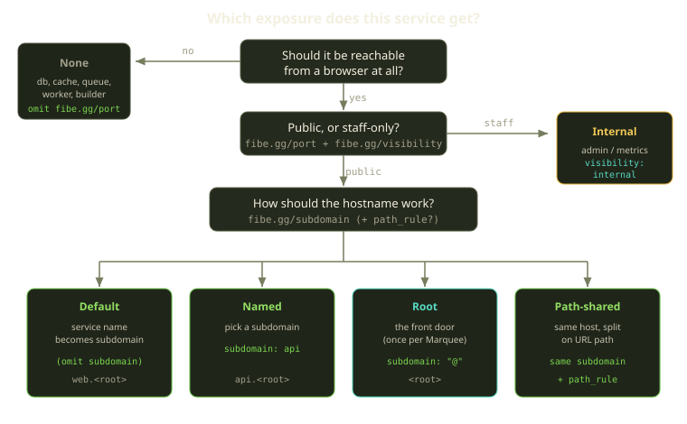
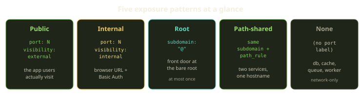
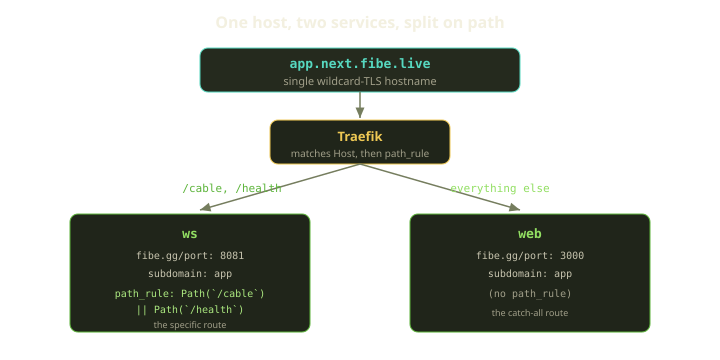

Every Compose file you bring to Fibe has the same hidden decision baked into it, one service at a time: *who gets to reach this thing?* On your laptop you answered it by sprinkling `ports:` entries around until `docker compose up` let you hit the app in a browser. That habit does not survive contact with a real host. On Fibe, host ports are not how anything becomes reachable, and a `ports:` line that you think is exposing your app is quietly being stripped before launch.

The good news is that the decision is small and mechanical once you can see it. There are exactly five outcomes for any service — **public**, **internal**, **root**, **path-shared**, or **none** — and they're selected by two or three labels in the `fibe.gg/*` namespace. This guide walks the decision in order, shows the YAML for each pattern, and calls out the gotchas that bite people the first time (the bare-subdomain collision, the at-most-one-`@` rule, and why `localhost` binds are invisible). By the end you'll be able to look at any Compose service and know, in about five seconds, which of the five it is.

<!-- truncate -->

## The mental model: Traefik routes, not Docker

On a Marquee, a reverse proxy named **Traefik** owns the front door. It holds the wildcard TLS certificate for the Marquee's root domain, and it decides which incoming request goes to which container based on the request's `Host` header and URL path. Your containers never talk to the internet directly — Traefik does, and it forwards.

That single fact explains everything that follows. You don't *publish a port*; you *describe a route*, and Fibe wires Traefik to it. The description is a label:

- `fibe.gg/port` — the **container** port your app listens on. Not a host port. This is the one label that turns routing on.
- `fibe.gg/visibility` — `external` (public) or `internal` (Basic-Auth-gated). Defaults to `external` when omitted.
- `fibe.gg/subdomain` — the leftmost label of the hostname. Defaults to the service name.
- `fibe.gg/path_rule` — an optional path matcher so two services can share one hostname.

No `fibe.gg/port` means no route. The service still runs, still has a name on the Compose network, and other containers can still reach it — it just has no door to the outside. That's not a limitation; for a database it's exactly right.



## Step 1: Should this be reachable at all?

Start here, because the most common mistake is exposing things that have no business being exposed. Walk your services and sort them into "needs a browser URL" and "doesn't."

| Service kind | Reachable from a browser? | Label |
|---|---|---|
| Public web app (Rails, Next, Vite, Django) | yes | `fibe.gg/port` + `fibe.gg/visibility: external` |
| Internal admin / metrics / status page | yes, staff only | `fibe.gg/port` + `fibe.gg/visibility: internal` |
| Background worker (Sidekiq, RQ, Celery) | no | omit `fibe.gg/port` |
| Database / cache / queue (Postgres, Redis) | no | omit `fibe.gg/port` |
| Build-time helper (migrate, setup, notify) | no | omit `fibe.gg/port` |
| WebSocket server talked to by a public web service | no* | omit, unless it shares the public host via `path_rule` |

The default for everything that isn't a human-facing HTTP surface is **none**. A worker doesn't accept HTTP. A database speaks its own protocol on its own port to other containers, not to browsers. The instinct to add a port "so I can reach it" is the laptop habit talking — on Fibe, the containers reach each other over the Compose `default` network by service name (`db`, `redis`, `web-for-anycable`), and you debug from your laptop by exec-ing into the container, not by opening a host port.

:::tip
If you find yourself wanting `fibe.gg/port` on a database "just to connect with psql from my machine," stop. That's a one-off debugging need, not a routing need. Use the Playground's debug exec to get a shell in the container and run `psql` there. A routed database port is a standing exposure of your data; don't make it permanent for a momentary convenience.
:::

## Step 2: Public or internal?

Once a service *is* reachable, the next fork is who's allowed in. Both options produce an HTTPS URL on the Marquee's domain; the difference is the gate in front of it.

```yaml
services:
  web:
    labels:
      fibe.gg/port: 3000
      fibe.gg/visibility: external      # public HTTPS, no Fibe-added auth

  sidekiq-web:
    labels:
      fibe.gg/port: 9292
      fibe.gg/visibility: internal      # public HTTPS + Basic Auth
      fibe.gg/subdomain: jobs
```

- **`external`** is for the app your users actually visit. Traefik serves it at `https://<subdomain>.<root>` with wildcard TLS and adds no authentication of its own — your app handles login if it has one.
- **`internal`** is for things that need a browser URL but shouldn't be public: Sidekiq's dashboard, RailsAdmin, Grafana, pgAdmin. Same routing, but Fibe wraps the route in Basic Auth using the Playground's own internal-access credentials (username `playground`, with a generated password you'll find on the Playground's details page). It's a fast, zero-config way to keep an admin console off the open internet without standing up your own auth.

If you omit `fibe.gg/visibility` entirely, you get `external`. That default is deliberate — the common case is a public web app — but it means *forgetting* the label on an admin console leaves it wide open. Be explicit on anything sensitive.

:::caution
`fibe.gg/visibility: internal` is not "private to the network." It's "public route, Basic-Auth gate." The URL still exists and still resolves on the internet; anyone who reaches it gets a password prompt. If you want a service that is genuinely unreachable from outside, that's the **none** pattern — omit `fibe.gg/port` — not `internal`.
:::

## Step 3: Pick the hostname

For every `external` (and `internal`) service, you now choose its hostname. The subdomain is the leftmost label; the Marquee owns the rest.

| `fibe.gg/subdomain` | Resulting host | When |
|---|---|---|
| omitted | `<service-name>.<root>` | you're fine with the service name as the URL |
| `api` | `api.<root>` | you want a specific name |
| `"@"` | `<root>` (bare root) | this is the front door |
| variable-driven | resolved at launch | the same template ships to many Marquees |

The subdomain must match `^[a-z0-9]([a-z0-9-]*[a-z0-9])?$` — lowercase alphanumerics and hyphens, no leading or trailing hyphen, no underscores. `MyApp`, `-staging`, and `my_app` all fail; use `myapp`, `staging`, and `my-app`.

### Default routing

The laziest correct choice. Name your service well and let it become the hostname:

```yaml
services:
  web:
    labels:
      fibe.gg/port: 3000
      fibe.gg/visibility: external
      # no subdomain → web.<root>
```

### Named subdomain

When the service name isn't the URL you want, override it:

```yaml
services:
  backend:
    labels:
      fibe.gg/port: 8080
      fibe.gg/visibility: external
      fibe.gg/subdomain: api          # api.<root>, not backend.<root>
```

### Root: the front door

Use `"@"` when this service should answer at the Marquee's bare root domain — the URL a user types with no subdomain prefix. This is the "front door" pattern: the template *is* the app on this Marquee, and you want a clean `https://my-app.example.com` instead of `https://web.my-app.example.com`.

```yaml
services:
  web:
    labels:
      fibe.gg/port: 3000
      fibe.gg/visibility: external
      fibe.gg/subdomain: "@"          # the root itself
```

Two things to internalize about `@`:

1. **Quote it.** Bare `@` at the start of a YAML value can be misparsed as a directive marker. Always write `fibe.gg/subdomain: "@"`.
2. **At most one per Marquee, per path.** Only one service can own the root for a given path rule. If two services on the same Marquee both claim `"@"` with no disambiguating path, the conflict surfaces at launch — you'll be told, not silently routed to whichever Traefik saw first.

### Variable-driven subdomain

If one template gets launched onto many Marquees, hardcoding the subdomain is wrong. Parameterize it with a launch variable bound to the label's node. Prefer `path:` binding over inline interpolation for whole-label values — it keeps a concrete default in the Compose file so the same file still runs locally:

```yaml
services:
  web:
    labels:
      fibe.gg/port: 3000
      fibe.gg/visibility: external
      fibe.gg/subdomain: demo                 # concrete local default

x-fibe.gg:
  variables:
    SUBDOMAIN:
      name: "Subdomain"
      required: true
      default: "demo"
      validation: "/^[a-z0-9][a-z0-9-]*[a-z0-9]$/"
      path: services.web.labels.fibe.gg/subdomain
```

Note: Compose-style `${VAR:-default}` is **not** valid inside `fibe.gg/*` labels. Use the variable system, not shell-style interpolation, for these labels.



## Step 4: Sharing one hostname with `path_rule`

Sometimes two services genuinely belong on the same hostname, split by URL path. The canonical case is a web app plus a WebSocket server: the browser loads the app from `app.<root>` and opens its live connection to `app.<root>/cable`. Same origin, two containers.

You express this by giving both services the **same subdomain** and adding `fibe.gg/path_rule` to the *specific* one. The service without a path rule is the **catch-all**; the service with one wins for the paths it names.

```yaml
services:
  web:                                  # catch-all — everything else
    labels:
      fibe.gg/port: 3000
      fibe.gg/visibility: external
      fibe.gg/subdomain: app
      # no path_rule

  ws:                                   # specific — only these paths
    labels:
      fibe.gg/port: 8081
      fibe.gg/visibility: external
      fibe.gg/subdomain: app
      fibe.gg/path_rule: Path(`/cable`) || Path(`/health`)

x-fibe.gg:
  variables:
    SUBDOMAIN:
      name: Subdomain
      default: app
      paths:
        - services.web.labels.fibe.gg/subdomain
        - services.ws.labels.fibe.gg/subdomain
```

`https://app.<root>/cable` and `/health` go to `ws`; everything else goes to `web`. Traefik prefers the more specific rule, so the catch-all only catches what the specific rule didn't.

That last block deserves attention: both services must carry the *same* subdomain value, so when you parameterize it, use one variable with a **`paths:`** list (plural) that updates both labels at once. Bind them separately and they will drift the moment someone changes one — and a mismatched subdomain pair means the two services land on two different hosts and the path sharing silently stops working.



### What `path_rule` is allowed to say

Fibe owns the `Host` part of every route — that's how it guarantees TLS and the Marquee's domain layout. So `path_rule` may use **only** path matchers:

```yaml
fibe.gg/path_rule: Path(`/exact`)                     # exactly /exact
fibe.gg/path_rule: PathPrefix(`/api`)                 # /api and /api/anything
fibe.gg/path_rule: PathRegexp(`/v[0-9]+/legacy/.*`)   # regex on the path
fibe.gg/path_rule: Path(`/cable`) || Path(`/health`)  # boolean OR
```

These are the only three matchers — `Path`, `PathPrefix`, `PathRegexp` — combinable with `&&` and `||`. The runtime parser rejects anything else with a clear message: `must only contain path matchers, not Host/Headers/Method/Query/ClientIP`. So `Host`, `HostRegexp`, `Headers`, `Method`, `Query`, and `ClientIP` are all out. If you need method-based or header-based routing, do it inside your app, not in the label.

| Matcher | Matches | Doesn't match |
|---|---|---|
| `` Path(`/api`) `` | `/api` only | `/api/users` |
| `` PathPrefix(`/api`) `` | `/api`, `/api/users` | `/apiv2` is matched (prefix!) |
| `` PathRegexp(`/v[0-9]+`) `` | `/v1`, `/v2` | `/version` |

Two more rules worth burning in:

- **Always use backticks** around the path literal — `` Path(`/api`) ``. Single or double quotes are ambiguous with YAML and JSON and aren't valid Traefik syntax.
- **Make the rules disjoint.** Two services with overlapping `path_rule` values will flap — Traefik picks one and the behavior is unstable. The catch-all/specific split is the clean shape: one service names its paths, the other names none.

## Step 5: Verify the app actually listens on `0.0.0.0`

This one isn't a label — it's the most common reason a perfectly correct exposure config still 404s. A container's `localhost` is its own loopback, unreachable from Traefik on the Compose network. The app **must** bind `0.0.0.0`.

| Framework | Correct bind |
|---|---|
| Rails | `bin/rails server -b 0.0.0.0` |
| Node / Express | `app.listen(PORT, '0.0.0.0')` |
| Next.js | `next dev -H 0.0.0.0` |
| Vite | `vite --host 0.0.0.0` |
| Django dev | `python manage.py runserver 0.0.0.0:8000` |
| FastAPI / uvicorn | `uvicorn app:main --host 0.0.0.0` |
| Flask dev | `flask run --host 0.0.0.0` |

Vite 6+ has an extra trap: even bound to `0.0.0.0`, it rejects the request with `Invalid Host header` unless you also set `server.allowedHosts: true` (or list the explicit Fibe host) in `vite.config`. If the route resolves but the page is broken, check that first.

If routing looks right but you get connection-refused or 404, confirm the bind from inside the container: `docker exec <c> ss -ltnp` should show `0.0.0.0:<port>`, not `127.0.0.1:<port>`.

## The big one: stop using host `ports:`

Here's the habit to unlearn. Compose `ports:` publishes a container port to a *host* port. On Fibe, that does not create a public route — Traefik does, from `fibe.gg/port`. Fibe **strips raw host bindings by default** before launch, so a stray `ports:` line is harmless but also useless for exposure.

You can keep `ports:` purely as a local-dev convenience — the same file runs under plain `docker compose up` on your laptop, and Fibe ignores the bindings. What you should not do is rely on them for reachability, or force them on with `preserve_ports: true` to pin a host port. Preserved ports bypass Traefik entirely, which means:

- no TLS,
- no public URL on the Marquee's root domain,
- and a hard conflict with zero-downtime rollout (`fibe.gg/zerodowntime: "true"`) — the validator rejects a zerodowntime service that still has `ports:` when `preserve_ports: true`, because the two ideas are incompatible.


The conversion is mechanical. Read the **container** port — the rightmost number in a `host:container` mapping — and turn it into a label:

```yaml
# BEFORE — laptop habit
services:
  web:
    image: ghcr.io/owner/app:latest
    ports:
      - "3000:3000"

# AFTER — Fibe-routed
services:
  web:
    image: ghcr.io/owner/app:latest
    ports:
      - "3000:3000"        # harmless local-dev convenience; Fibe strips it
    labels:
      fibe.gg/port: 3000   # the container port → routed through Traefik
      fibe.gg/visibility: external
```

If a service publishes several ports, only one can be the routed HTTP surface per `fibe.gg/port`. Route the one humans hit; leave the rest unrouted and reach them over the Compose network. A metrics endpoint on `9090` doesn't need a public URL — another container hits it as `app:9090` directly.

```yaml
# app exposes HTTP on 8080 and Prometheus metrics on 9090
services:
  app:
    image: my-app
    labels:
      fibe.gg/port: 8080         # route the human-facing HTTP
      fibe.gg/visibility: external
    # 9090 stays internal: reachable as app:9090 inside the network
```

And the database — the service people most often want to "just expose":

```yaml
# BEFORE
services:
  db:
    image: postgres:17
    ports:
      - "5432:5432"   # "so I can connect from my laptop"

# AFTER
services:
  db:
    image: postgres:17
    ports:
      - "5432:5432"   # optional local-only; Fibe strips it
    # no labels — reachable as "db:5432" inside the Compose network
```

Your app finds Postgres at `db:5432` over the network with no exposure at all. When you personally need `psql` from your laptop, exec into the container instead of standing up a permanent routed port to your data.

## Where do credentials go?

Exposure decides *who can reach* a service; it does not handle *secrets the service needs*. Don't smuggle credentials into labels or `ports:`. They belong in one of three places: a **launch variable** (configured when the Playground starts), the **Secret Vault** (for values shared across launches), or **Job ENV** for job-mode runs. Keep that boundary clean — routing labels describe routes, not secrets.

## Rules of thumb

- **Default to none.** If it isn't a browser-facing HTTP surface, it gets no `fibe.gg/port`. Workers, databases, caches, queues, and build helpers all talk over the Compose network by service name.
- **`fibe.gg/port` is the container port, never a host port.** Read the rightmost number of any `host:container` mapping.
- **Be explicit with `visibility` on anything sensitive.** Omitting it means `external` — fine for a public app, dangerous for an admin console. Use `internal` for staff tools to get a Basic-Auth gate for free.
- **`internal` ≠ private.** It's a public route with a password prompt. For truly unreachable, use **none**.
- **One `"@"` per Marquee, and quote it.** The front door is a single service; collisions fail at launch.
- **Share a host with the catch-all/specific split.** Same subdomain on both, `path_rule` on the specific one, and bind a shared subdomain with one `paths:` variable so they can't drift.
- **`path_rule` is path-only.** `Path`, `PathPrefix`, `PathRegexp`, in backticks, combined with `&&`/`||`. Fibe owns `Host`.
- **Bind `0.0.0.0`.** A correct route to a `localhost`-bound app is a 404.
- **Never rely on `ports:` for exposure.** Fibe strips them; `preserve_ports: true` bypasses TLS, the public URL, and zero-downtime rollout.

Get these eight habits into your fingers and exposure stops being a thing you debug and becomes a thing you declare. Read the [exposure reference](https://whats.fibe.gg/reference/decide-exposure-strategy) when you need the exact schema, and reach for the [Fibe CLI and templates](https://github.com/fibegg) when you're ready to ship one to the Bazaar.
