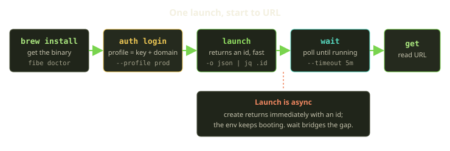
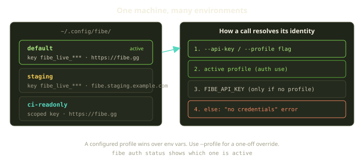
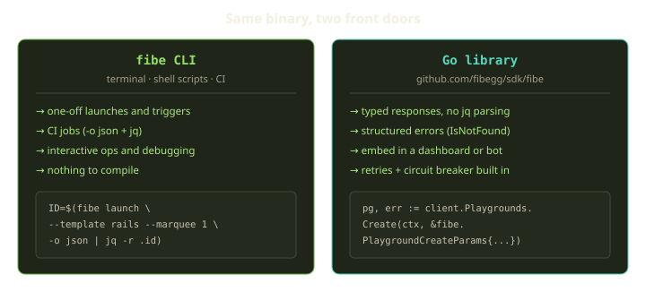

The browser is great for poking at a Playground. But the moment you want a launch to happen *on push*, or you want to spin up the same environment fifty times in a load test, or you want a Slack bot that reports which of your Playgrounds are unhealthy — you want the terminal. That's what the `fibe` CLI is for, and underneath it, a Go library you can embed directly in your own programs.

The nice part: it's one binary. The same executable you `brew install` is the CLI, the Go dependency, and an MCP server for AI agents. Same auth, same resource model, same retry logic. This guide walks you from `brew install` to a fully scripted launch — install, authenticate with profiles, fire a launch, wait for it to come up, and read its URL — then shows when to drop down into the Go library instead.

<!-- truncate -->

## The mental model in one paragraph

The SDK is a *client*. It doesn't run your containers — it tells Fibe what to do, the same way the web UI does. You point it at a [Marquee](https://whats.fibe.gg/concepts/marquees/) (your Docker host), hand it a Template or a repo, and it creates a Playground or triggers a Trick. Everything you can do in the browser, you can do from `fibe <resource> <action> [flags]`. That command shape is the whole CLI; once you've internalized it, the rest is just discovering which resources exist.



## Step 1: Install the binary

On macOS or Linux, Homebrew is the path of least resistance:

```bash
brew install --cask fibegg/sdk/fibe

# or, two-step if you prefer:
brew tap fibegg/sdk
brew install --cask fibe
```

That keeps you on the latest release; `brew upgrade --cask fibe` later. If you have a Go toolchain, `go install github.com/fibegg/sdk/cmd/fibe@latest` drops it into `$(go env GOBIN)` — just make sure that's on your `PATH`, and pin to a tag (`@v1.2.3`) for reproducible CI rather than `@latest`.

No Homebrew, no Go? Grab a release binary. The asset names embed the version, so there's no stable "latest" URL — resolve the newest tag first. The GitHub CLI makes that a one-liner, which is exactly what you'll want in CI:

```bash
gh release download --repo fibegg/sdk --pattern '*_linux_amd64.tar.gz' --output - | tar xz
sudo mv fibe /usr/local/bin/
fibe version
```

Whatever path you took, your first command is the same:

```bash
fibe version
fibe doctor
```

`fibe doctor` is the self-check you'll come back to whenever something feels off. It verifies connectivity to the Fibe API, the validity of any cached credentials, and basic environment sanity. Green means go. Red means the output is telling you exactly what's wrong — no API key, wrong domain, network, expired token.

:::tip
The command tree is wide, so turn on shell completion now and save yourself a lot of `--help`. For zsh: `fibe completion zsh > "${fpath[1]}/_fibe"`. After that, `fibe pl<Tab>` completes to `fibe playgrounds`, flags and all.
:::

## Step 2: Authenticate — and prefer profiles over raw keys

Every call the SDK makes carries an API key. There are two ways to get one onto your machine, and the choice maps cleanly to *where* the code runs.

On a personal machine, use the browser device-code flow. It mints a key for you so there's nothing to copy around:

```bash
fibe auth login
```

The CLI prints a short code, opens your browser to a Fibe URL, you confirm the code, and the resulting key lands in a profile on disk. The code expires after 15 minutes — if you dawdle, the CLI stops polling and you just run `fibe auth login` again.

If you *already* have a key (minted from your account's API keys page), store it directly:

```bash
fibe login --api-key "fibe_live_yourkeyhere"
```

This validates the key against `/api/me` and saves it to your profile, ready immediately. That's the right move for a key you intend to reuse.

### Why profiles, not bare keys

A **profile** is a named bundle of `{api_key, domain}`. That second field is the reason profiles matter: it's not just *who* you are, it's *which Fibe* you're talking to. Keep one profile per environment and switching between them is a single command instead of a re-login.



```bash
fibe auth list                            # show profile names
fibe auth use staging                     # switch the active profile
fibe auth status                          # who am I, which profile, which domain
fibe --profile staging playgrounds list   # one-off override, doesn't change active
fibe auth logout                          # forget the active profile (also revokes its key server-side)
```

A typical layout, set up once:

```bash
fibe auth login --profile staging --domain https://fibe.staging.example.com
fibe auth login --profile prod    --domain https://fibe.gg

fibe auth use staging
fibe playgrounds list                     # against staging

fibe --profile prod playgrounds list      # one-off against prod
```

Three profiles cover most people: a `default` for your main account, a `staging` pointing at a non-production deployment, and a `ci-readonly` holding a restricted key for scripted reads.

### Credentials on disk

Profiles live under `~/.config/fibe/` (or `$XDG_CONFIG_HOME/fibe/`). Two files:

| File | Contents | Mode |
| --- | --- | --- |
| `credentials.json` | API keys — the secret stuff | `0600` (dir `0700`) |
| `config.json` | Profile names, domains, which is active | `0644` |

Treat `credentials.json` like an SSH private key: never commit it, never paste it into a chat. If you copy it to another machine, keep those modes. The Go library and MCP server read the same files when they run on the same machine — so a profile you set up once is shared across all three modes.

### CI is different: use an env var, skip the profile

In CI there's no profile on disk and no browser. Set `FIBE_API_KEY` instead:

```yaml
- name: Trigger nightly trick
  env:
    FIBE_API_KEY: ${{ secrets.FIBE_API_KEY }}
  run: |
    fibe tricks trigger --playspec 42
```

The resolution order is worth committing to memory, because it explains a confusing class of "why is it hitting the wrong account" bugs. The CLI looks, in order: the `--api-key` / `--profile` flag → the active profile → the `FIBE_API_KEY` env var **only when no profile is configured** → otherwise it fails with a clear "no credentials" error. The domain resolves the same way (`--domain` flag → profile domain → `FIBE_DOMAIN` only when no profile exists → `fibe.gg`).

:::caution
Once *any* profile is configured on a machine, the active profile wins and `FIBE_API_KEY` / `FIBE_DOMAIN` are ignored unless you pass explicit flags. So setting `FIBE_API_KEY` on your laptop where you've already run `fibe auth login` does nothing. The env vars are fallbacks for environments with no profile — which is exactly CI and containers. `fibe auth status` reports any env vars it's ignoring, and `fibe doctor` prints exactly what it picked.
:::

One more thing about CI keys: mint a **scoped, expiring** one. Don't reuse your personal key for automation — a leaked automation key has a much bigger blast radius.

```bash
fibe api-keys create --label "ci-deploy" --scope launch:write --expires-at 2026-01-01T00:00:00Z
```

## Step 3: The command shape

Everything is `fibe <resource> <action> [flags]`. A few global flags apply everywhere and you'll use them constantly:

| Flag | Purpose |
| --- | --- |
| `-o, --output <fmt>` | `table` (default), `json`, `yaml`. Env: `FIBE_OUTPUT`. |
| `--only <field,field>` | Filter fields in JSON/YAML output. |
| `-f, --from-file <path>` | Load a JSON/YAML payload from a file, or `-` for stdin. |
| `--profile <name>` / `--domain <url>` / `--api-key <key>` | Per-call identity overrides. |
| `--explain-errors` | Structured error output: code, HTTP status, request ID, validation details. |
| `--debug` | Verbose HTTP logging. |

Two details about output that save real debugging time:

**Exit codes are deliberately dumb.** It's `0` on success, `1` on *any* error — there are no per-failure-type codes. If your script needs to branch on *why* something failed (a missing variable vs. an unreachable repo vs. an unfunded Marquee), don't switch on the exit code. Pass `--explain-errors` and parse the structured output.

**List output is an envelope, not a bare array.** A `list -o json` gives you `{ "Data": [...], "Meta": {...} }`. Reach into `.Data`:

```bash
fibe playgrounds list -o json | jq '.Data[].id'
fibe playgrounds list -o json --only id,name,status
```

### Launch and resources

For Playgrounds (long-running environments), the `pg` shorthand works everywhere `playgrounds` does. You can patch launch-time service config without writing a JSON file by repeating `--service SERVICE.FIELD=VALUE`:

```bash
fibe pg create --name demo --playspec starter --marquee next \
  --service web.subdomain=demo \
  --service web.exposure_port=3000 \
  --service web.exposure_visibility=external \
  --service web.env_vars.RAILS_ENV=production
```

`--playspec` and `--marquee` accept IDs or names. Supported service fields include `subdomain`, `exposure_port`, `exposure_visibility`, `path_rule`, `start_command`, `image`, `env_vars.KEY`, and a handful of `git_config.*` keys. Service names containing dots and `port_mappings` aren't expressible in this flag — use `-f` JSON/YAML for those — and when both `-f` and `--service` are present, the service flags win.

For a one-shot path from a catalog Template, repo, or existing Playspec straight to a running Playground, there's `fibe launch`:

```bash
fibe launch --template rails --marquee next --name my-app
fibe launch owner/repo --marquee 1                          # from a repo's fibe.yml
fibe launch https://github.com/owner/repo --ref main --file deploy/fibe.yml
```

The repo forms need a connected GitHub App (`fibe github apps connect`) even for public repos, because Fibe fetches the config server-side.

:::note
Every launch, trigger, restart, log stream, or schedule needs the target Marquee to be **funded**. An unpaid Marquee is rejected with a `402` payment-required response carrying a clear "not funded" reason — if a launch bounces that way, it's a billing issue, not a config one.
:::

Tricks (one-shot jobs — tests, migrations, backups, cron) follow the same shape:

```bash
fibe tricks trigger --playspec 42 [--marquee next] [--name nightly] [--env-overrides KEY=value]
fibe tricks get <id>
fibe tricks logs <id>
fibe tricks rerun <id>
```

A trick's behavior comes from its job-mode Playspec; its credentials come from Job ENV. Use `--env-overrides` for one-off per-run values; anything that should survive across runs belongs in Job ENV (`fibe job-env set KEY=value`) or in the Playspec itself.

## Step 4: Launch is async — so wait, don't guess

Here's the gotcha that trips up every first script. `create` and `launch` return *fast*. They hand you back an ID and a record while the environment is still pulling images and booting. If your next line assumes the URL is live, you'll race the boot and lose.

The fix is `fibe wait`, which polls a resource until it reaches a status (or your timeout fires):

```bash
fibe wait playground 12 --status running --timeout 5m
fibe wait trick 99 --status completed --timeout 1h
```

So the actual end-to-end "launch and get me a working URL" script threads those together — launch, grab the ID with `jq`, wait, then fetch the URL:

```bash
#!/usr/bin/env bash
set -euo pipefail

# 1. Launch from a template; capture the JSON record.
PG=$(fibe launch --template rails --marquee next --name demo -o json)
ID=$(echo "$PG" | jq -r '.id')
echo "launched playground $ID, waiting for it to come up..."

# 2. Block until it's actually reachable (or bail after 5 minutes).
fibe wait playground "$ID" --status running --timeout 5m

# 3. Now the URL is live — read it back.
fibe playgrounds get "$ID" -o json --only id,name,status | jq .
fibe playgrounds status "$ID"
```

That ordering — *launch → wait → read* — is the single most important habit for scripting Fibe. Everything async-shaped follows it.

### A worked CI example

Putting auth, async, and error-handling together: a GitHub Actions job that triggers a deploy Trick on push to `main`, waits for it, and dumps logs only if it fails.

```yaml
name: Deploy to staging
on:
  push:
    branches: [main]

jobs:
  deploy:
    runs-on: ubuntu-latest
    env:
      FIBE_API_KEY: ${{ secrets.FIBE_API_KEY }}
    steps:
      - name: Install fibe
        env:
          GH_TOKEN: ${{ github.token }}
        run: |
          gh release download --repo fibegg/sdk --pattern '*_linux_amd64.tar.gz' --output - | tar xz
          sudo mv fibe /usr/local/bin/

      - name: Pass the branch to the job
        run: fibe job-env set BRANCH=${{ github.ref_name }}

      - name: Trigger deploy trick
        id: deploy
        run: |
          set -e
          OUT=$(fibe tricks trigger --playspec 42 -o json)
          echo "trick_id=$(echo "$OUT" | jq -r '.id')" >> $GITHUB_OUTPUT

      - name: Wait for completion
        run: fibe wait trick ${{ steps.deploy.outputs.trick_id }} --status completed --timeout 30m

      - name: Get logs on failure
        if: failure()
        run: fibe tricks logs ${{ steps.deploy.outputs.trick_id }}
```

Note the `FIBE_API_KEY` env var instead of a profile (there's no profile on a runner), the *trigger → capture id → wait* shape, and the `if: failure()` log dump. The key here needs `launch:write` to trigger the run; keep its other scopes to the minimum the workflow reads, and give it a short expiry.

## Multi-step work: `fibe_pipeline`

When an *AI agent* drives Fibe over MCP, round-tripping each call separately is expensive. `fibe_pipeline` runs several tool calls in sequence and threads results between them with JSONPath, so launch-then-wait becomes one atomic plan:

```jsonc
{
  "tool": "fibe_pipeline",
  "args": {
    "steps": [
      { "id": "make_pg", "tool": "fibe_launch",
        "args": { "repository_url": "me/auth-service", "github_ref": "main", "marquee_id_or_name": 1 } },
      { "id": "wait_ready", "tool": "fibe_playgrounds_wait",
        "args": { "id_or_name": "$.make_pg.playground_id", "status": "running", "timeout": "5m" } }
    ],
    "return": "$.make_pg"
  }
}
```

Pipelines support `parallel: [...]` blocks and `for_each: ...` over an array, and results are cached for 5 minutes (`fibe_pipeline_result` looks one up by ID). In a shell script you'd just write the launch-and-wait sequence inline as above; the pipeline tool exists so an LLM can express the same plan in a single call.

## Step 5: When to embed the Go library instead

The CLI with `-o json` and a little `jq` carries you a long way. Reach for the Go library when you need *typed* responses, structured error handling, or you're embedding Fibe deep in another product — a dashboard, a Slack bot, a backup tool.



| | fibe CLI | Go library |
| --- | --- | --- |
| Best for | one-off ops, shell, CI | embedding, custom tools |
| Output | text / JSON you parse | typed structs |
| Errors | exit `1` + `--explain-errors` | `IsNotFound(err)`, `RequestID(err)`, … |
| Retries / breaker | built in | built in (breaker opt-in) |
| Setup cost | none | a Go build |

Construction mirrors the CLI's auth: pass `WithAPIKey`, or let it read the same `~/.config/fibe/` profile when you don't:

```go
client := fibe.NewClient(
    fibe.WithAPIKey(os.Getenv("FIBE_API_KEY")),
    fibe.WithDomain("https://fibe.gg"),   // optional
    fibe.WithTimeout(30*time.Second),     // 30s is the default
)
```

Resource managers hang off the client (`client.Playgrounds`, `client.Tricks`, `client.Agents`, …) and mirror the REST shape. The same *launch → wait → read* dance, typed:

```go
ctx := context.Background()

pg, err := client.Playgrounds.Create(ctx, &fibe.PlaygroundCreateParams{
    Name:              "demo",
    PlayspecID:        42,
    MarqueeIdentifier: "1",
})
if err != nil { log.Fatal(err) }

// Wait until reachable: poll every 3s, give up after 5m.
if _, err := client.Playgrounds.WaitForStatus(ctx, pg.ID, "running", 5*time.Minute, 3*time.Second); err != nil {
    log.Fatal(err)
}

// Stream logs.
for line := range client.Playgrounds.LogsStream(ctx, pg.ID, "web", nil) {
    fmt.Println(line.Text)
}
```

You get robustness for free, and it's worth knowing the defaults so you can tune them:

- **Automatic retry** on transient errors (429, 500, 502, 503, 504): up to 3 retries with exponential backoff and full jitter; a `Retry-After` header overrides the computed delay. Network timeouts and cancelled contexts are **not** retried — they return immediately.
- **Idempotency keys** for safe re-tries: `ctx = fibe.WithIdempotencyKey(ctx, fibe.NewIdempotencyKey())` and the platform replays the cached response for 24 hours. Without one, two `Create` calls create two resources.
- **Circuit breaker** (opt-in in the library): `fibe.WithCircuitBreaker(...)` opens after 5 consecutive failures so you don't hammer a sick API.
- **Structured errors**: ask `IsNotFound(err)` or `IsRateLimited(err)` instead of string-matching.

For a CI runner that should fail fast, tighten the policy:

```go
client := fibe.NewClient(
    fibe.WithAPIKey(key),
    fibe.WithMaxRetries(1),
    fibe.WithRetryDelay(200*time.Millisecond, 2*time.Second),
)
```

And you can test code that calls the SDK without a real Fibe — the `github.com/fibegg/sdk/fibetest` package ships an in-process mock server with per-route interceptors, so your tests run offline.

## Rules of thumb

- **Memorize the shape:** `fibe <resource> <action> [flags]`. The `pg` and `agent` shorthands save keystrokes.
- **Profiles on laptops, env vars in CI.** A configured profile wins over `FIBE_API_KEY` — so the env var only does anything where no profile exists. That asymmetry is the source of most "wrong account" surprises.
- **Launch is async. Always `fibe wait`** before you read a URL or assert success. The pattern is *launch → wait → read*, every time.
- **`-o json` + `.Data` + `jq`** is your scripting Swiss army knife. Remember it's an envelope, not a bare array.
- **Don't branch on exit codes** — they're `0`/`1` only. Use `--explain-errors` and parse the structured output when you need the *why*.
- **Scope and expire CI keys.** Never automate with your personal-account key; `launch:write` plus minimal read scopes plus a short `--expires-at`.
- **A `402` not-funded response** is a billing signal, not a config bug — the host needs Mana.
- **Drop into Go** when you want typed structs, `IsNotFound`-style error handling, or to embed Fibe in your own product. Otherwise the CLI is plenty.

Start with `fibe doctor`, set up two profiles, and script your first *launch → wait → URL*. From there the whole platform is one command tree away.
