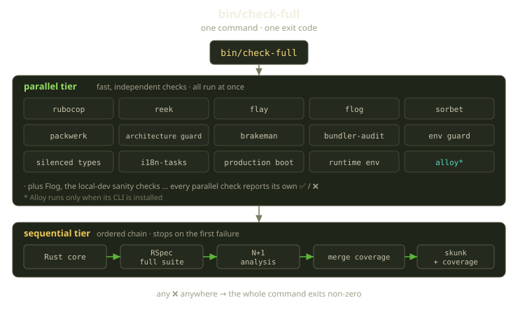
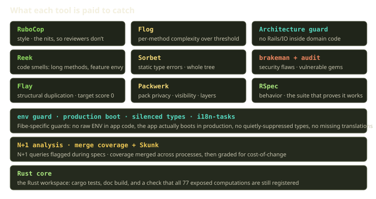

There is exactly one thing you need to know before opening a pull request against the Fibe Rails app: run `bin/check-full`. Not "run RuboCop, then Sorbet, then remember the architecture script, then the specs, oh and did you regenerate coverage?" Just the one command. If it's green, your change is ready for human eyes. If it's red, it tells you precisely what to fix.

That simplicity is the point — and it matters even more now that coding agents draft so many of our changes. This is the story of our canonical quality gate: what's inside it, and why it's one command instead of a checklist.

<!-- truncate -->


## One command, or twelve things you'll forget

Every codebase accumulates checks. RuboCop early, then a type checker, then someone gets burned by a cross-pack dependency and writes an architecture script. Then a security scanner, a duplication detector, an i18n linter. Each reasonable on its own.

The failure mode is what happens to the *instructions*. They drift into a `CONTRIBUTING.md` that nobody reads, or into tribal knowledge — "oh, you also have to run the boundary check." New contributors miss a step, experienced ones skip the slow one "just this once," agents run whatever they were last told to. By the time CI catches the gap, you've paid for a round-trip: push, wait, fail, fix, push again.

So we collapsed it. One entry point, `bin/check-full`, the same gate locally and in CI, no second list. If a check matters enough to block a merge, it lives inside that command; if not, it doesn't block.

:::tip
A quality gate is only canonical if it's the *only* gate. The moment there's an "and also run this other thing" step, you've reintroduced every problem you were trying to solve.
:::

## What's actually inside

`bin/check-full` is a thin shell wrapper around a small Ruby runner. The wrapper decides *what* to run and *in what order*; the runner runs it and rolls up one exit code. The configuration is just two lists of step names handed to the runner: one list for the checks that can run all at once, and one for the checks that have to run in sequence. That's the entire orchestration — no plugin system, no config DSL, just two ordered lists and a runner that knows how to execute them.

Two tiers, and the split is intentional. The first tier is everything fast and independent: linters, the type checker, security scanners, boundary checks. They don't share state, so they run at once across threads — most of your feedback comes from here, quickly.

The second tier is an *ordered chain* that stops on the first failure: the expensive, stateful stuff — the Rust core tests, the full RSpec suite, N+1 analysis, then the coverage steps that read what the specs just produced. Sequencing here is correctness, not a limitation: coverage merging reads what the spec run writes, and Skunk grades the merged result. The chain enforces the order.



The runner is about eighty lines of Ruby, and the interesting part is how little it does. Each named step resolves to a small executable, runs in its own subprocess, and prints a green `✅ SUCCESS` line or a loud `❌ FAILED` block with the failing output inline. Running each check in a separate process is what lets the fast tier fan out across threads and keeps one tool's crash from taking down the rest of the run.

The sequential tier walks its list in order and breaks the moment a step returns a non-zero exit, so a failing spec run never wastes minutes grading coverage that was never going to be valid. At the end, if any step failed, the whole command exits 1. That single number is the contract every caller relies on — human, CI, or agent.

## What each tool is paid to catch

A good gate isn't one giant blob — it's a set of specialists, each catching a different *class* of problem. Overlap is waste, gaps are bugs.



| Check | Catches | Why it's here |
|---|---|---|
| **RuboCop** | Style and formatting | So review comments are never "add a space here" |
| **Reek** | Code smells (long methods, feature envy) | Catches design rot before it compounds |
| **Flay** | Structural duplication | We fail at the first non-zero score — copy-paste is a design signal |
| **Flog** | Per-method complexity | Methods over the score threshold get flagged before they metastasize |
| **Sorbet** | Static type errors | Type-checks the whole tree on every run |
| **Packwerk** | Pack privacy, visibility, and layer boundaries | Keeps the modular monolith actually modular |
| **Architecture guard** | Forbidden patterns in domain code | The Fibe-specific rules Packwerk can't express |
| **Brakeman + bundler-audit** | Security flaws and vulnerable gems | The boring checks you're glad you had |
| **RSpec** | Behavior | The suite that proves the thing works |

A few deserve a closer look — they're where Fibe's own opinions show up.

### Architecture: the rules Packwerk can't express

Packwerk enforces *who can call whom* across our packs, but it doesn't know that a pure-domain object should never reach for the wall clock or a network library. Our architecture guard does — it scans each layer's source for a forbidden vocabulary, and the rules read like "things that turn pure logic into a testing nightmare." The list is organized by layer, and the deeper, purer layers get the strictest list.

In the domain layer — the innermost, where the core business logic lives — the guard refuses to see any of the usual sources of impurity: reads of the wall clock, calls into the database, anything that generates randomness, the payment SDK, raw HTTP clients, the cache, the API client we use to talk to GitHub, and the verbs that enqueue background jobs or hand work off to the Rust core. The application and public layers above it get their own, progressively looser lists, because they're allowed to do more.

The domain layer is the strictest: no clock, no randomness, no payment SDK, no HTTP. The point isn't dogma — domain code that can't touch any of those is trivially testable and portable, and exactly the kind we can lift into Rust later. The guard also forbids two structural anti-patterns we've been bitten by: no catch-all public directory at the repository root, and no "mega-facade" single entry-point file that fronts a whole pack — both become god-objects that everything routes through.

### The env and boot guards: Fibe-specific by design

These two exist because of how Fibe is configured — a gate growing teeth in response to real incidents.

The first guards how configuration is read. It forbids reaching into raw environment variables anywhere in Rails-loaded code; configuration goes through a single credentials accessor instead, so a misconfiguration surfaces loudly at boot rather than at 2 a.m. when some far-off code path quietly hits a `nil`. A small allowlist covers the handful of files that have to run before Rails exists; everything else goes through the front door.

The second is our favorite, because it catches a bug class nothing else can: code that's fine in development and explodes the first time it loads in production. It boots the whole application in the production environment with throwaway credentials and a fake cloud-storage endpoint, and just... checks that it comes up. A development-only constant that gets eager-loaded, a missing production initializer — it turns "found out at deploy" into "found out on the branch."

### The Rust core: keeping the two halves in sync

Fibe is a Rails monolith with a Rust core holding the pure-CPU, stateless pieces — Compose parsing, validators, diffing, Playground drift logic. That split works only if the boundary between the two stays trustworthy, so the gate does two things in this step. First it runs the Rust core's own test suite and doc build, the way `cargo` does for any Rust workspace. Then it asserts the cross-language contract directly: it asks the Rust core to enumerate everything it exposes and checks that the count is exactly what the Rails side expects — 77 distinct computations at the time of writing.

Every computation in the Rust core is registered under a stable name that the Rails side can call by. Add or remove one without meaning to, and that count drifts and the gate fails. A crude single integer, but a perfect tripwire for "did the Rails side and the Rust side quietly disagree about what exists?"

## What a green run looks like

A passing run is a calm column of checkmarks with timings; a failing run drops you straight into the offending output:

```text
✅ SUCCESS: rubocop (8s)
✅ SUCCESS: sorbet (14s)
✅ SUCCESS: packwerk (6s)
✅ SUCCESS: architecture (2s)
✅ SUCCESS: env guard (1s)
✅ SUCCESS: production boot (11s)
========================================
❌ FAILED: flay (3s)
Matches found in :call (mass = 116)
  the credit path, line 42
  the debit path, line 39
Total score (lower is better) = 116
```

There it is. Not "something failed in CI, go dig through logs" — the exact two files with the duplicated structure, named for you, on your machine, in seconds. Flay only flags that the two paths rhyme enough to be a smell; the fix is almost never to reach for a `rubocop:disable`-style suppression, it's to ask why two sibling operations grew the same shape and whether they should share it.

## Why this matters more in the agent era

A canonical quality gate was always nice for humans. For coding agents, it's load-bearing.

An agent making a change has no instinct for "the part you also have to run." It has a command and an exit code. Give it a clean entry point and a precise pass/fail, and it iterates to green on its own: change, run, read the failure, fix, repeat. Give it a scattered checklist instead, and it runs whatever subset it was told about, misses the boundary check, and hands you a PR that fails CI — the exact round-trip we were trying to delete, now automated. We didn't design `bin/check-full` for automation; we made it honest and complete, and automation came along for free.

:::note
There's a focused mode that narrows the spec run to just the files you point it at — and, because partial coverage from a partial run is meaningless, it automatically skips the coverage steps that only make sense on a full run. Handy when you're iterating on one file and want fast specs without lying to yourself about coverage.
:::

## The discipline underneath

A gate is just a script. What makes it work is the team agreement around it — two habits.

The first is **never merge red, and never go green by cheating.** A suppressed cop, a `# typed: false` to dodge Sorbet, a spec marked pending to pass — each is a small loan against the codebase's future. We even have a dedicated check that hunts for one flavor of this: types quietly silenced to make the type checker happy. The gate makes the easy path the honest one.

The second is the **scout rule**: leave any area you touch slightly better than you found it. Because style, smells, and duplication are enforced uniformly, "better" has a concrete, shared definition — small improvements ride along in normal PRs instead of waiting for a cleanup sprint that never comes.

The best compliment a quality gate can get is that nobody thinks about it. You run `bin/check-full`, it's green, you open the PR, and the reviewer spends their attention on whether your *logic* is right — not on a space before a brace. One command doing the boring work, so humans can do the interesting work.

