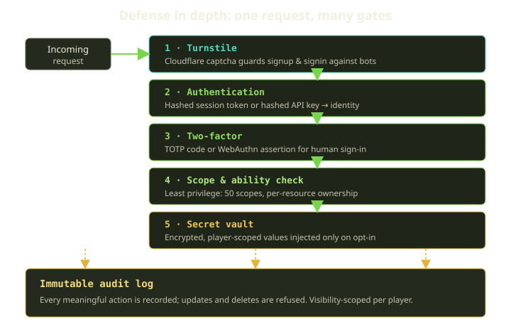
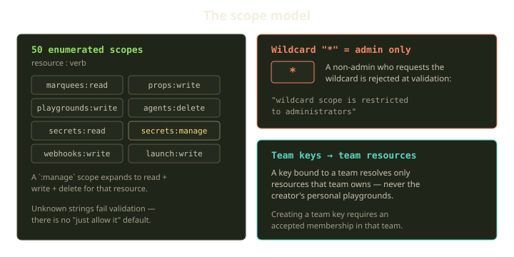
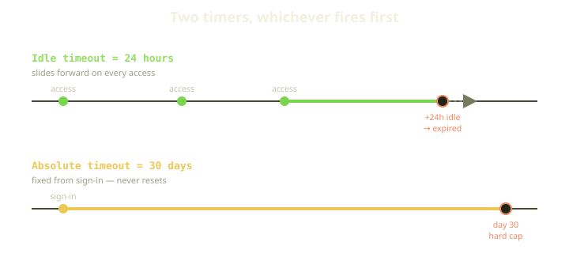

Fibe hands every Player a Docker host and lets agents, CLIs, and browsers spin up real environments on it. That is a lot of power to lend out over an API, and the whole platform leans on a small set of identity primitives doing their job quietly: a key that can only do what it says, a session that actually expires, a vault that never hands back a plaintext it didn't have to, and a log nobody can rewrite after the fact.

None of this is glamorous, and that's the point — it's the part of the system we want boring and correct.

<!-- truncate -->

## The shape of the thing

Security at Fibe isn't one feature. It's five layers a request passes through, each assuming the others might fail: a bot past the captcha still hits authentication; a stolen API key still hits scope checks; a key with the right scope still has to *own* the resource it reaches for. Underneath all of it sits the audit log, catching what happened no matter which layer made the call.

Let's walk up the stack.

## API keys: 50 scopes and not one wildcard you didn't earn

An API key is a scoped, hashed token belonging to a Player (and optionally a Team). When you create one you don't get "access to Fibe" — you get a specific list of scopes, and the key can do those and nothing else. Scopes are a closed, predefined set, not free-form strings you invent at request time. There are exactly **50**, each a `resource:verb` pair: `marquees:read`, `props:write`, `playgrounds:delete`, `secrets:read`, `webhooks:write`, and so on across every resource Fibe exposes.

That the set is closed is the whole trick. An unknown scope fails validation rather than being quietly ignored: ask for a scope that isn't on the list (and isn't the wildcard) and the key simply won't save. Validating against a fixed enumeration instead of accepting arbitrary strings kills a whole category of typo-and-silently-grant-everything bugs — the kind where a misspelled scope gets waved through and a key ends up with more, or less, than anyone intended.

A handful of *manage* scopes expand: holding `secrets:manage` is shorthand for read, write, and delete on secrets, and the same pattern applies to marquees, Job ENV, conversations, and memories. The expansion is a fixed mapping from each manage scope to its concrete verbs, so it can never resolve to a verb that doesn't exist.

### The wildcard is a different animal

There is exactly one scope that means "everything": `*`. It's load-bearing for internal admin tooling, and the one scope an ordinary Player can never mint. If you're not an administrator and your scope list includes it, the record is rejected outright — the key never comes into existence, and the rejection carries a plain message that the wildcard is reserved for administrators.

This is least privilege with teeth: the dangerous capability is a hard validation that fires before the key exists, not a feature flag or a "please don't" comment. A normal account cannot talk its way to the wildcard, because there is no code path that lets it.

### Team keys see only what the team owns

Keys can belong to a Team, and a team key is deliberately myopic. The platform builds its owned-resource set from the *team's* resources — never the creating player's personal ones — and only after confirming the creator is an accepted member of that team.

So a developer can hand out a CI key scoped to `playgrounds:write` that launches the team's environments while staying blind to that developer's private playgrounds. Ownership and scope are separate questions, and a key has to pass both.

### Hash, don't store

Here's the part we care about most: we never store the API token. It's shown to you exactly once at creation; what we persist is a hash. Authentication re-hashes the presented token — a fast prefix lookup, then a constant-time comparison against the digest. The plaintext lives in your secret manager, not ours.

:::tip
"Hash, don't store" is the rule for any credential you don't need to read back — session tokens, API keys, recovery codes. If your database leaks, the attacker gets digests, not live credentials.
:::

## Sessions that actually expire

Browser sign-ins get the same hash-don't-store treatment. A session carries a hashed token, never the raw one: a random value is generated once at sign-in, hashed with SHA-256, and only the digest is persisted. Every later request presents the raw token, we re-hash it, and the digest is what authenticates you. The raw token lives in your browser; what's in our database can't be replayed if it leaks.

Expiry is the interesting choice. Most systems have *an* expiry; Fibe has two, and a session is dead the moment either one trips. A session checks both an idle window and an absolute ceiling on every request, and if it's past either limit it's treated as expired no matter what the other says.

The **idle timeout** slides: use the session and the 24-hour clock resets from your last access; walk away for a day and it's gone. The **absolute timeout** does not — measured from the moment you signed in, it caps the session at 30 days no matter how active you are, so a quietly leaked token can't live forever.

One more wrinkle: sensitive actions can require a fresh *sudo* elevation. A session remembers when you last re-proved yourself, and that elevation is only considered active for about 15 minutes afterward — so even inside a valid 30-day session, the scary operations ask you to prove it's still you.

| Limit | Resets on use? | Measured from | Protects against |
|---|---|---|---|
| Idle (24h) | yes | last access | abandoned/forgotten sessions |
| Absolute (30d) | no | sign-in | long-lived leaked tokens |
| Sudo (~15m) | yes | last elevation | replay on sensitive actions mid-session |

## Two-factor that means it

A password is one factor and we treat it as such. Fibe supports two second factors, both driven from the single-page app over GraphQL. **TOTP** is the authenticator-app flow: setup hands you a secret and a QR code SVG to scan into your authenticator, and the second factor is only switched on after you type back a valid code that proves the scan worked. Turning it on without first proving a working code is impossible by design — the "enabled" flag and a verified code are set in the same step.

Two things happen the instant 2FA turns on. You're issued one-time **recovery codes** — your escape hatch if you lose the authenticator — and the event is written to the audit log and emailed to you, exactly the paper trail and out-of-band warning an account change like this deserves.

**WebAuthn** is the passkey / hardware-key path, and the stronger of the two. A registered credential stores its external id, **public key**, and a signature counter — never anything secret. The device signs a challenge with a private key that never leaves it, and we verify against the public key we hold. There's nothing on our side worth stealing — the whole point of asymmetric auth.

That signature counter isn't decoration. WebAuthn authenticators increment a counter every time they sign, and we keep the last value we saw. The expectation is simple: the counter only ever goes up. If a sign-in arrives with a counter that has gone backwards or stalled, that's the fingerprint of a cloned authenticator — one of the few ways hardware keys go wrong — and it's exactly the anomaly the counter exists to surface.

Before any of this, **Cloudflare Turnstile** sits in front of signup and signin. Most attacks on auth are just volume — credential stuffing, throwaway-account farms — and a captcha invisible to real humans takes the automated version off the table before it reaches login.

## The secret vault

Players need real secrets in their environments: a database URL, a third-party API token, an SSH key. So Fibe keeps an encrypted, player-scoped vault. Each secret belongs to a single Player. Its name is validated to an identifier-safe shape — letters, digits, dashes, and underscores only, so it can be handed cleanly to a container as an environment variable — and its value is encrypted at rest before it ever touches the database.

The value is capped in size and only injected into runtimes that opt into it. This is the one place we deliberately *can* read a secret back: the whole job of the vault is to hand the value to a container the Player asked us to. We hash keys and sessions because we never read them back; here we encrypt because injecting the value *is* the job. Encryption, not hashing, is the right tool precisely because the value has to come out the other end intact.

Two details keep the vault honest. The default API serialization returns a secret's key and description but **not** its value — you ask for it explicitly, through a separate path, so it never leaks into a list response. And every create, update, and delete is audited and can fan out over webhooks.

## The immutable audit log

Everything above writes to the same place, and that place can't be edited. Fibe runs one unified audit log for the whole platform, and immutability is enforced at the data layer rather than left to discipline. The records reject writes by construction: any attempt to update an audit row raises an error and aborts, and the same goes for any attempt to delete one. There is no "edit log entry" path anywhere, even an accidental one.

You cannot update an audit row, and you cannot destroy one — try, and the write is refused. The trail is tamper-evident by construction: with no code path that rewrites history, a gap or an inconsistency is itself a signal that something is wrong, because nothing legitimate could have produced it.

Writes are asynchronous so logging never slows the triggering request, and the "who did this, over which channel" context — Player vs. System vs. Playguard, UI vs. API vs. webhook — is filled in automatically from the surrounding request rather than by hand at every call site. The recorded actions are a controlled vocabulary too, drawn from a fixed list — a secret created, an API key destroyed, a session revoked, and dozens more — so the log reads consistently and can be filtered and reasoned about, instead of being a soup of ad-hoc free-text strings.

The log is also **visibility-scoped**. You don't see the whole platform's history — you see rows where you were the actor, where you own the resource, or where the resource *is* you. That filter is applied at the query level, so the trail is trustworthy and shareable at once: nobody, including us, edits it after the fact, and we can show you your own history without exposing anyone else's.

## What we learned

The throughline is small and stubborn: least privilege over convenience, hash what you don't need to read back, two timers instead of one, immutability made a property not a promise, and every layer built to assume the others fail. None of these are clever. That's the point. The security model you want is the one you can explain in an afternoon and trust on a bad day.
