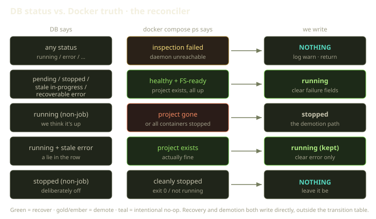
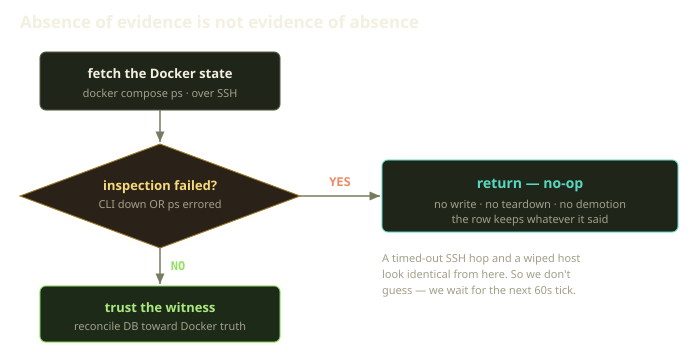
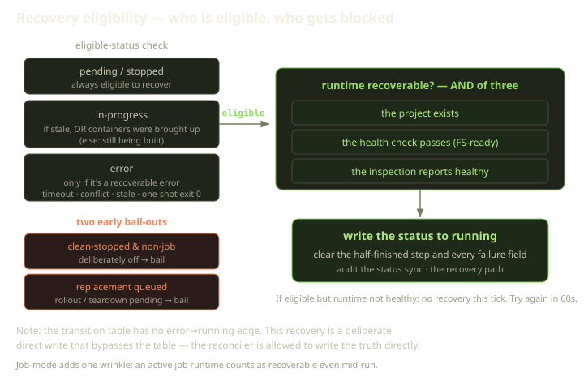

There are two stories about what your Playground is doing. One lives in Postgres — a status that says running, error, or stopped. The other lives on a Docker host we don't own, reachable only over SSH, and you read it by running `docker compose ps`. Most of the time they agree; the interesting engineering is all about what happens when they don't.

This is a post about one reconciler and the small set of rules it uses to decide which story is true. The headline rule is easy to say and weirdly hard to honor: **trust the daemon as the source of truth — but only when you can actually see it.** A Playground on a host that clearly threw its containers away should be marked stopped; one on a host that simply didn't answer our SSH knock should be left exactly as it is. Telling those two apart is the whole job.

<!-- truncate -->



## The setup

A quick orientation. On Fibe a Playground is a Docker Compose project that runs on a **Marquee** — the Player's own Docker host, maybe a Scaleway VM we provisioned, maybe a box under someone's desk over SSH. We don't run the daemon or own the kernel; every observation of the container's real state is a network round-trip away, and the network can lie by going quiet.

The declared status is just a field on the Playground record. A Playground can sit in any of nine states, but only five matter here: pending, in-progress, running, error, and stopped. Normal lifecycle moves are governed by a transition table that lists which jumps are legal; the reconciler doesn't always respect it, deliberately — more on that below. The observed state comes from a single command over SSH:

```bash
docker compose -p «project» ps -a --format json
```

That JSON gets parsed into a structured snapshot — which services exist, which are healthy, which drifted — and the reconciler compares it to what the record claims.

## Rule zero: if you can't see, don't act

Before any comparison happens, there is a gate that does nothing but refuse — the most important logic in the whole flow. It loads the Playground, fetches the Docker state, and asks one question first: did the inspection even succeed? If it didn't, the reconciler logs a warning and returns immediately. No write, no teardown, no status change — the record keeps whatever it said a minute ago. Only past that gate does any reconciliation happen.

An inspection is treated as failed in exactly two cases: the Docker CLI wasn't available on the host at all, or `docker compose ps` came back with a non-zero exit and an error on stderr. Either one means we never got a trustworthy answer, so we don't pretend we did.



A timed-out SSH connection, a crashed daemon, and a reimaged host all produce the same empty, failed inspection — **the same observation, from where we sit** — yet for two of the three the environment is fine. Treat that as "the containers are gone" and you mark a healthy Playground stopped because a packet dropped. Acting on blind data costs you unboundedly; waiting costs you sixty seconds.

:::tip
This is the operational form of an old epistemics line: **absence of evidence is not evidence of absence.** A reconciler that conflates "I observed nothing running" with "I failed to observe" eats your work the first time the network hiccups.
:::

There's no retry loop or backoff here; the retrying is external. Playguard runs the reconciler again on its next 60-second pass until the host answers, so "do nothing now, look again soon" is the strategy.

## Rule one: a healthy host can pull you back to running

Now the happy direction. The inspection succeeded and Docker says the project exists and every container is up and healthy — but the record says pending, stopped, a stuck in-progress, or a recoverable error. The runtime recovered faster than our bookkeeping; the reconciler promotes the record to running and wipes any stale failure off it. That's two questions stacked.

First, **is this status eligible for recovery?** The rules read like a chain of reasoning, and the order matters:

- **Cleanly stopped, and not a job?** Bail. A clean exit on a long-lived environment means a human *meant* to stop it; we don't resurrect that. (A job is the one exception, which we'll get to.)
- **An error?** Only recover the *recoverable* kind — a transient timeout, a slot conflict, a stale build, a one-shot that exited cleanly. A permanent failure stays an error.
- **Pending or in-progress with a replacement already queued?** Bail. A pending rollout or teardown is a deliberate replacement in flight; don't snap the record to running underneath it.
- **In-progress?** Recover if it's *stale* — creation hung past its window — or if it already reached the point where the containers were brought up and we simply never recorded success. Otherwise it's mid-build; leave it alone.

The second question, asked only if the status is eligible: **does the runtime actually support recovery?** This is an unforgiving AND of three conditions, and all three must hold. The project must exist. A health check — covering both the host filesystem and containers that are actually serving — must pass. And the inspection snapshot itself must report healthy. A project that exists but isn't serving, or serves but has a half-provisioned filesystem, does not qualify.

Only when all three pass do we write. And the write does two things at once: it sets the status to running *and* clears every leftover failure field in the same stroke — the half-finished creation step, the error message, the error step, the stored failure details. A genuinely running Playground has no business carrying the corpse of a healed failure; recovery means the record tells the truth *completely*. Every such write also drops an audit entry recording the move from the old status to running, so it's never silent.



:::note
**Job-mode has one extra door.** For a one-shot Trick, an active job runtime also counts as recoverable — if any container is created, running, starting, or healthy, the job is in flight even before a full health check passes, so a batch job mid-work isn't judged by the "is the web server serving" bar.
:::

## Rule two: a missing project pulls you down to stopped

The mirror image, and the one case where the reconciler may demote you: the record says running, but Docker says the project is gone, or every container has stopped.

Three guards, each load-bearing, and all three must hold before a demotion is allowed. It must not be a job — a finished one-shot job that exits is a *success*, routed to job completion, not a stop. It must currently be running — we only demote from the status that claims to be up. And the observation has to back it: the project is gone, or every container is at rest.

That last clause is pickier than you'd guess. A container counts as stopped only if it is literally in a stopped state, or it exited with code 0 (or with no code at all). A non-zero exit is *not* a clean stop — that's a crash, a different problem with a different owner (the failure classifier, not this branch). "Stopped" means "at rest," not "fell over." And this whole rule fires only because rule zero already passed: we reached the host, got a clean `docker compose ps` answer, and it said the containers are gone — evidence, not absence of evidence.

## Rule three: a stale lie gets cleaned without a demotion

The subtlest case, and the one we like best. The record says running, the project exists and is fine — but a stale Compose-failure blob is still stapled to it from a past hiccup that's since resolved. The status is right; the *baggage* isn't.

The check is narrow on purpose: the Playground must currently be running, it must still be carrying that old failure blob, and the project must still exist. When all of that holds and the runtime is recoverable, we make a surgical write — clear the failure fields, **keep the status exactly where it is.** The status is never part of this update; only the dead error gets swept away, and an audit entry notes the cleanup.

A lesser version would "helpfully" bounce the Playground through error and back, or trigger a rollout to "fix" something that isn't broken — turning a cosmetic inconsistency into a real outage. The right move is minimal: runtime healthy, status right, sweep up the dead error and touch nothing else.

## The honest part: these writes break the rules on purpose

Fibe's lifecycle has a declared transition table of legal moves — yet the reconciler just wrote error&#8594;running and running&#8594;stopped, neither of which is an edge in it. These writes go straight to the record and **bypass the transition guard entirely.**

| What happened | In the table? | How it's written |
|---|---|---|
| pending / stopped &#8594; running | no | direct write |
| stale in-progress &#8594; running | yes | direct write |
| error &#8594; running | **no** | direct write |
| running &#8594; stopped | **no** | direct write |
| clear stale error, keep running | n/a (no status change) | direct write |

The table governs *intentional* lifecycle moves — what a user, a creation job, or a rollout may do. The reconciler isn't making one; it's correcting the record to match observed reality. The table is stale, not the world. Two safeguards make the bypass defensible: every write emits an audit entry — one verb for a status sync, another for an error cleanup — so the move is never silent, and every write is gated behind rule zero plus the three-way runtime-recoverable AND. Adding those edges to the table instead would legitimize the moves for *every* caller, including ones without the daemon's word.

## What we learned

The five rules collapse into one disposition: the reconciler is biased, hard, toward **inaction under uncertainty and minimal action under certainty** — the discipline is in the refusals, the bail-outs that outnumber the writes. The reconciler keeps the database honest about a daemon it can't fully see, and knows when to keep its hands off. A Playground costs real money to run and real work to fill with state, so the most expensive mistake a reconciler can make isn't being a minute late to notice something stopped — it's being instantly wrong about something that was fine.
