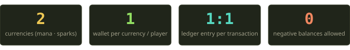
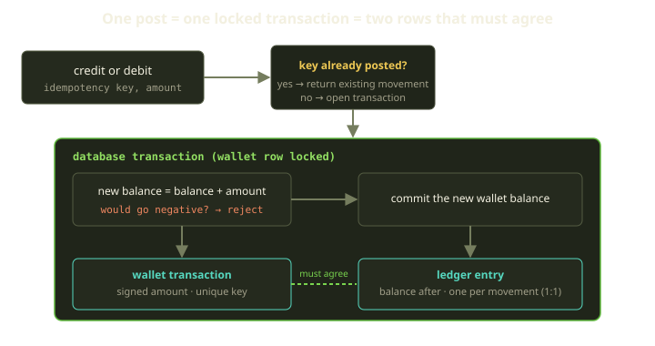
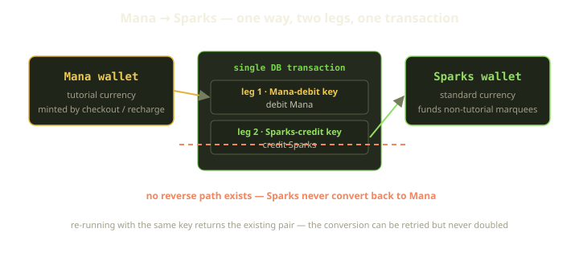
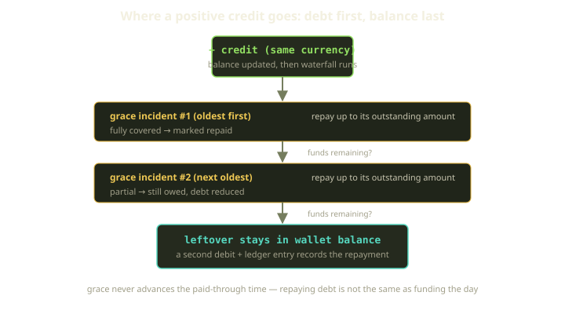
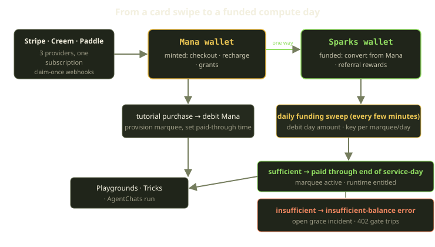

Every Fibe environment costs money to keep alive. A Marquee is a real Docker host with a real VM bill behind it, and the only thing standing between "your agent is coding" and "nothing runs" is whether the wallet had enough in it this morning. That makes the wallet the most boring-looking and least forgiving piece of the platform. It is not allowed to lose a credit, double-charge a day, or — the cardinal sin of any money system — let a balance drift negative.

This is the story of how we built that wallet: two currencies, a double-entry ledger where every movement is mirrored exactly once, pessimistic locks, and idempotency keys so aggressive that the same operation can be retried a hundred times and still only happen once. None of it is clever. That is the point. In billing, clever is a liability; the goal is a system whose invariants are so tight that the failure modes simply do not exist.

<!-- truncate -->

## Two currencies, and why

Fibe meters compute in two currencies. Not because two is a fun number, but because the two products behave differently and we did not want one balance pretending to be both.

**Mana** is the tutorial currency. It is what you get when you check out, recharge, or receive a grant — the raw, minted money that enters the system from the outside. **Sparks** is the standard currency that funds everyday, non-tutorial Marquees. The split lets us reason about "money that just came in" separately from "money committed to running your standard environments," and it lets the conversion between them be a deliberate, one-directional act rather than an accounting accident.

A wallet is scoped tightly: there is **exactly one wallet per currency per Player**, and that uniqueness is a database constraint, not a convention. You cannot end up with two Mana wallets racing each other into existence — the unique index refuses the second one before any application code gets a vote. Which currency a given Marquee draws from is decided centrally — tutorial Marquees pull Mana, everything else pulls Sparks — so the spending side never has to guess which wallet to hit.

:::note
Balances are integers. No floats, ever. Floating-point money is how you end up explaining to someone why their balance is `0.000000001` short. Every amount in the wallet is a signed integer, and every validation insists on whole numbers — there is no path through the system that can store a fractional credit.
:::

## The one rule: a balance never goes negative

If you take away one thing, take this. The wallet physically cannot represent a negative balance. Not "should not" — cannot. Every credit and debit funnels through a single chokepoint, and that chokepoint refuses to commit anything that would push the balance below zero.

The mechanics are deliberately small. Inside one database transaction, the wallet row is locked, the proposed new balance is computed as the current balance plus the (signed) amount, and if that result would be negative the whole transaction is aborted with an insufficient-balance error before anything is written. Only if the new balance is zero or positive does the wallet update commit, alongside the rows that record the movement.

Two things are doing the heavy lifting here.

First, the wallet row is taken under a **pessimistic row lock** before the balance is read. Optimistic concurrency — read, compute, hope nobody changed it underneath you — is fine for a comment count. It is not fine for money. If two debits land at the same instant and both read a balance of 100, optimistic checks can let both through and leave you at -50. The pessimistic lock serializes them: the second debit waits, re-reads the balance the first one wrote, and then makes its decision against reality.

Second, the negative check happens **inside the same transaction as the write**. The check and the commit are atomic. There is no window between "I verified there was enough" and "I spent it" for another writer to sneak in.

The blast radius of that one guarantee is enormous. Daily funding can debit the wallet without a pre-flight balance check, because the debit itself is the check — if the wallet cannot cover the day, the debit raises an insufficient-balance error and the funding code catches it and opens a grace incident instead. The conversion path, the grace-repayment path, every spender — none of them re-implement "do we have enough money." They all lean on the same wall.

## Double entry: one transaction, one ledger entry, a recorded running total

A running balance is a convenience. It is also a single number that, if it is ever wrong, you cannot debug, because the number itself does not remember how it got there. So the balance is not the source of truth. The **ledger** is.

Every single movement writes two rows in lockstep. The first is the transaction record: the signed amount, the idempotency key, the kind of movement, and an optional link to the order that triggered it. The second is the matching ledger entry: the same movement again, plus one extra field that earns its keep — the wallet balance immediately after this entry posted. Both rows are written in the same transaction as the balance update, so all three either happen together or not at all.

The 1:1 relationship is not a convention we politely follow. It is enforced at the database level: a unique constraint links each transaction to **exactly one** ledger entry. You cannot post a movement and forget to ledger it, and you cannot ledger the same movement twice. A validation also rejects zero-amount entries, so there are no no-op rows cluttering the trail — every line in the ledger represents real money moving.

Why bother recording the post-entry balance when you could just sum the entries? Because it turns auditing from a computation into a comparison. To check the wallet's integrity you do not re-add the entire history; you read the latest ledger entry, look at the running total it recorded, and compare it to the wallet's stored balance. They must agree. If they ever disagree, something wrote the balance outside the one chokepoint — and now you have a concrete, falsifiable invariant you can assert in tests and monitor in production, instead of a vague hope that the arithmetic worked out.

| Invariant | Enforced by |
|---|---|
| One wallet per currency per player | a unique index over (player, currency) |
| Balance is always a non-negative integer | the negative check inside the locked chokepoint |
| Every movement has exactly one ledger entry | a unique constraint linking transaction to entry |
| Ledger entry records the post-entry balance | written in the same transaction as the balance update |
| Every post is replay-safe | a unique idempotency key plus return-the-existing-row |

## Idempotency: the same operation, no matter how many times

Distributed systems retry. A Sidekiq job times out and runs again. A payment provider sends the same webhook twice because it did not see your `200` fast enough. A user double-clicks. In a money system, "the network made us run this twice" must never mean "we charged you twice."

The defense is an idempotency key on every post. Before the chokepoint does anything expensive, it looks for a transaction that already carries that key. The amount must be non-zero and the key must be present — both are rejected up front — and then the lookup runs. If a transaction with that key already exists, the existing one is returned immediately, with no new movement of any kind.

If the key has been seen, you get the **existing** transaction back — same record, same effect, no second post. The caller does not need to know whether this was the first call or the fifth. It asked for "this specific operation," and it got it, exactly once.

There is a belt *and* suspenders here. The early lookup handles the common case cheaply. But two retries can race past that check at the same instant and both try to insert — so the idempotency key is also unique at the database level. When the loser of that race trips the unique constraint on insert, the code does not blow up; it catches the conflict, re-fetches the row the winner just wrote, and returns *that*. Either path, you converge on one transaction. The only way both paths can fail is if the row genuinely is not there, in which case the original error is re-raised rather than swallowed.

:::tip
The shape of an idempotency key is part of the design, not an afterthought. Daily funding keys its debit on the marquee, the service-day, and the fact that it is a funding charge — one key per marquee per day. So even if the funding sweep runs five times in a morning, there is precisely one charge per marquee per day, by construction. The key *is* the business rule.
:::

## Minting Mana, then converting one way to Sparks

Mana enters the system from three doors: a checkout (you bought a bundle), a recharge (an auto-renew subscription mints a period's worth each cycle), and grants. All three are just credits to the Mana wallet — same chokepoint, same idempotency, same ledger.

Sparks enter differently. There is no "buy Sparks" door. Sparks are funded by **converting Mana**, and that conversion goes one direction only.

A conversion is **two legs in one transaction**: a debit from Mana and a credit to Sparks. Each leg gets its own idempotency key, derived from a single base key by tagging one as the Mana-debit leg and the other as the Sparks-credit leg. Before opening the transaction, the conversion checks whether both legs already exist under their derived keys; if they do, it returns the existing pair unchanged. Otherwise it runs both legs inside one transaction so they commit together or not at all. You can never burn Mana without minting the matching Sparks, and the conversion as a whole is replayable — re-run it with the same base key and you get the existing pair back, never a second drain of the Mana wallet.

And there is no reverse. We never built a Sparks-to-Mana conversion, and that absence is deliberate. Mana is the entry point; Sparks is the committed spend. Allowing money to flow backward would mean reasoning about round-trips, refund loops, and "wait, which currency is this really" — complexity we bought our way out of by simply not building the door. The one-way arrow is a feature.

## Where a credit actually lands: the grace waterfall

Here is the part that surprises people. When you credit a wallet, the money does not simply sit in the balance. A positive credit first goes to pay down debt.

When a Marquee can't be funded for a day, the system opens a **grace incident** that records the unpaid amount instead of letting the balance go negative (it can't, remember). That incident is a debt. So the next time real money arrives in the same currency, the wallet runs a repayment pass before the credit gets to relax in the balance.

The repayment pass walks the player's unrepaid grace incidents in that currency, **oldest first**, and pours the incoming credit into them one at a time. Each incident takes the smaller of "what it still owes" and "what credit is left," its outstanding amount shrinks by that much, and an incident that ends up fully covered is marked repaid. The loop stops the moment the credit runs out. Two filters make this safe: only unrepaid incidents are considered, and only ones in the same currency — Mana credits repay Mana debts, Sparks repay Sparks, and you never accidentally cross-fund. Whatever is left after the debts are cleared stays in the wallet, and the repayment itself is written as its own debit plus ledger entry, so the trail shows exactly how the incoming credit was split.

:::warning
Repaying grace debt is **not** the same as funding the day. Grace repayment clears what you owe; it never advances the paid-through time. A Marquee with all its debts repaid is square with us, but it is still not funded for *today* until the next funding cycle debits the day and pushes the paid-through time forward. Two different clocks. Keeping them separate is what stops "I paid off my debt" from being silently confused with "my environment is running."
:::

## Spending the day: funding and the 402 gate

The spend side is a recurring sweep. Every few minutes the funding sweep walks the Marquees that have requested today, debits the day's amount from the right wallet, keyed on that marquee and that service-day, and on success extends the paid-through time to the end of the service-day and marks the Marquee active.

Two early skips guard the front of the funding routine: it returns immediately if the Marquee did not request the day, and again if the day is already paid (the paid-through time already reaches the end of the service-day). Combined with the per-day idempotency key, that is three independent reasons a duplicate sweep cannot double-charge — the request check, the already-paid check, and the unique key. Belt, suspenders, and a second belt.

When the wallet can't cover it, the debit raises an insufficient-balance error, funding catches it, and instead of a charge you get a grace incident — which is exactly the debt the credit waterfall later repays. Downstream, an unfunded Marquee fails the runtime entitlement gate: any attempt to run a Playground, Trick, or AgentChat against it gets a `402` payment-required response that says, in effect, this Marquee is not funded. The wallet decides, daily, whether the lights stay on.

## How money gets in: checkout, orders, and claim-once webhooks

Everything above assumes the money is already in the wallet. It is worth slowing down on how it gets there, because the inbound path is where the same idempotency instinct shows up one layer higher — at the order and the provider event, not just the wallet post.

A checkout does not mint anything on its own. It first creates an order in a pending-payment state, and that order **snapshots the bundle pricing at purchase time**. This matters more than it looks: prices change, promotions expire, bundles get re-costed — but the amount we will eventually validate the payment against is the amount that was true the moment the player clicked buy, frozen onto the order. The wallet never has to ask "what does this bundle cost today"; it asks "what did this order say it cost," and the order remembers.

The order sits in that pending-payment state until the provider tells us the money actually arrived — and providers are no more trustworthy about delivering-exactly-once than any other distributed system. Stripe, Creem, and Paddle will all happily re-send the same webhook if they did not see our `200` fast enough. So before any fulfilment runs, the event is **claimed exactly once per provider event id**. The claim is an atomic insert against a uniqueness constraint on that event id: the first delivery wins the claim and proceeds, and any re-delivery claims nothing and returns immediately without doing a thing.

That is the wallet's lookup-by-key move, lifted up to the webhook boundary. A re-delivered notification claims nothing, returns early, and mints zero extra Mana. The idempotency key on the wallet post is the second wall; this is the first.

Fulfilment is deliberately paranoid in the same shape as the wallet chokepoint. It takes a pessimistic row lock on the order so two concurrent fulfilments of the same order serialize instead of racing, then validates the paid amount against the snapshot before crediting anything. If the amount paid is short of what the snapshot says it should be, fulfilment raises rather than mints — underpayment is not allowed to quietly become a smaller credit. Only once the lock is held and the amount checks out does the Mana credit run, and that is a plain wallet credit: same chokepoint, same idempotency key, same ledger row as every other movement in the system.

From the minted Mana, the order's kind decides where it goes. A **tutorial checkout** does three things in one fulfilment: it debits the tutorial bundle out of the Mana wallet, publishes a provision-requested event so the planner can stand up the VM, and sets the paid-through time so the freshly-provisioned Marquee is funded for its first window. A **standard or multiplayer checkout** instead converts the Mana to Sparks through the one-way conversion described earlier — the money lands in the currency that funds non-tutorial Marquees. A **Mana top-up** order is the simplest of all: it just credits Mana and stops, leaving the balance sitting there for whatever the player funds next. And an **auto-recharge subscription** never touches the checkout path at all — each cycle it mints a period's worth of Mana directly, which is the same credit by a different door.

Every one of those branches bottoms out in the same primitive. The order layer adds two new guarantees — snapshot pricing and claim-once events — but the actual money movement is still a keyed, locked, ledgered post. We did not build a second money system for inbound funds; we wrapped the existing one in an order that remembers the price and an event that can only be cashed once.

## Plans don't fund runtime — wallets do

A reasonable assumption, looking at this from the outside, is that buying a subscription is what keeps your Marquees running. It is not, and the gap between those two ideas is one of the cleaner decisions in the billing model.

A subscription's runtime allowance is **zero**. Not "small" — zero. The plan grants no runtime at all. Runtime is funded entirely by the wallet, debited daily, exactly as the funding sweep describes. What the plan actually controls is a different axis: **admin caps on how many Marquees of each kind you are allowed to have** — one tutorial, one single, ten multiplayer. The plan answers "how many environments may exist." The wallet answers "which of them is paid for today." Those are different questions, and we refused to let one pretend to answer the other.

The payoff is that nothing about your plan can keep an unfunded Marquee alive. There is no "well, they're on the Pro tier, so let it run" branch hiding in the runtime gate — because the plan was never wired into funding in the first place. The only thing that bypasses the funding gate is super-admin, and even that is enforced in two places that must agree: the in-memory check the application uses for a single Marquee, and the SQL scope the funding sweep queries with in bulk. Both carry the same super-admin exemption, so the per-request check and the database sweep can never disagree about who is exempt.

Why decouple it this way? Because the alternative — letting the plan grant some amount of runtime — immediately drags you into reconciling two sources of funding. If the plan funds three days and the wallet funds the rest, every funding decision now has to ask "did the plan already cover this day?" and every refund has to unwind plan-granted time differently from wallet-granted time. By making the plan's runtime allowance zero, there is exactly one thing that funds runtime, and it is the wallet, and it is checked daily against the paid-through time. "What you can create" and "what is running right now" stay in separate boxes, and neither box has to know how the other works.

## A movement, traced end to end

Abstractions are easier to trust once you have watched real numbers go through them. So here is a single credit, followed all the way down into the ledger.

Start with a player whose Sparks wallet balance is `0`. They have one unrepaid grace incident — a missed funding day left them owing `300` Sparks, recorded as debt rather than allowed to push the balance negative (which, remember, is impossible). Then a referral reward arrives: a `500` Sparks credit.

Because it is a positive same-currency credit, the wallet runs the grace waterfall before the money is allowed to settle in the balance. There is exactly one outstanding incident, the oldest (and only) debt of `300`, so the repayment pass takes the smaller of `300` and `500` — that is `300` — off the credit to clear it, marks that incident repaid, and lets the remaining `200` land in the wallet. The trail this leaves is explicit:

| Order | Movement | Amount | Entry type | Balance after |
|---|---|---:|---|---:|
| 1 | referral reward | `+500` | credit | `500` |
| 2 | grace repayment | `-300` | debit | `200` |

The incident's outstanding amount goes from `300` to `0` and its status flips to repaid. The wallet balance ends at `200`, and the latest ledger entry records a balance-after of `200` — they agree, which is the whole point of recording the post-entry balance at all. If you wanted to audit this player, you would not re-sum their history; you would read that last `200` and compare it to the stored balance.

Now the part people miss. The player is square with us — they owe nothing — but their Marquee is **not** funded for today. Repaying grace debt clears what you owed; it never advances the paid-through time. The `200` sitting in the wallet is just balance; turning it into a funded day still requires the next funding cycle to run, debit the day's amount, and push the paid-through time forward. The debt clock and the funding clock are separate, and paying down one does not wind the other. "I paid off my debt" and "my environment is running" remain two different sentences — which is exactly the confusion the separation was built to prevent.

## The surrounding cast

A wallet does not live alone. A few neighbors round out the picture, and they all hang off the same primitives:

- **Three payment providers, one subscription.** Checkout can run through Stripe, Creem, or Paddle, but they all resolve to a single provider-neutral subscription. The billing core never branches on "which provider" once the money is in; it just sees Mana arriving. Provider webhooks are claimed once per event, so a provider re-delivering the same notification mints nothing extra — the same idempotency instinct, one layer up.
- **Referrals reward Sparks.** Refer someone and the reward lands as a Sparks credit. Because it is a positive credit, it flows through the same grace waterfall as any other — your referral bonus can quietly pay down a debt before it sits in your balance.
- **Runes grant beta access.** Distinct from the wallet entirely: a Rune is an invitation code that unlocks beta access when redeemed. Worth naming because people conflate "codes" with "credits" — Runes are not money, they are a door.

## What we learned

The wallet is the part of Fibe we would least like to debug at 3 a.m., which is precisely why we spent the effort to make sure we never have to. A few principles earned their keep:

- **Make the bad state unrepresentable.** We did not write careful code that avoids negative balances; we wrote a single chokepoint that *refuses* them, inside a lock, inside a transaction. Correctness you can point at beats correctness you have to trust.
- **Idempotency is a property of the key, not the caller.** Once every post is keyed and every key is unique at the database level, retries stop being scary. The whole platform above the wallet — Sidekiq jobs, webhook handlers, the funding sweep — gets to be sloppy about running twice, because the wallet is not.
- **Keep the ledger, not just the number.** The running balance is a cache. The ledger, with the post-entry balance on every entry, is the truth, and having both means integrity is a one-line comparison instead of a forensic project.
- **Refuse to build the reverse door.** No Sparks-to-Mana conversion, no negative balances, no out-of-band balance writes. Every feature we did not build is a class of bug we will never chase.

Boring on purpose. In billing, that is the highest compliment.
