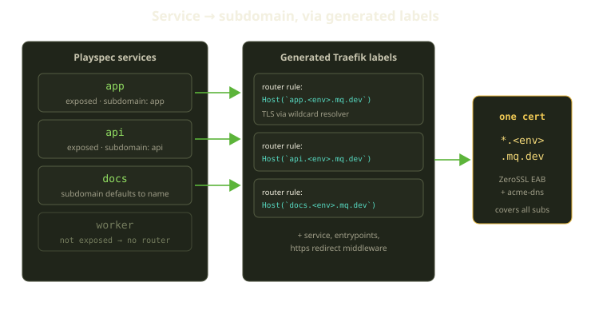
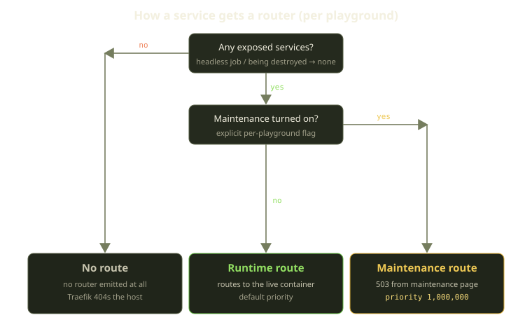
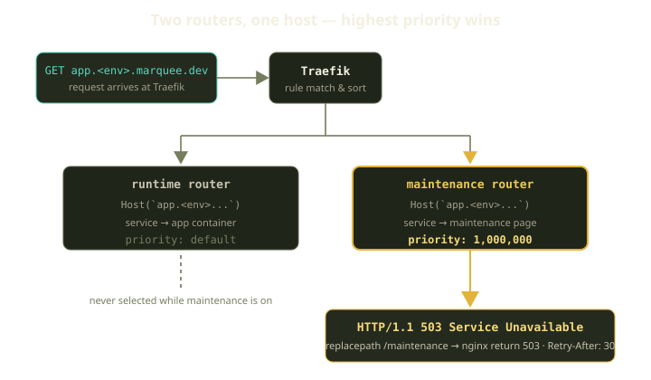

Every Fibe environment is a little pile of Docker containers on someone's machine, and the platform's job is to make that pile feel like a website: `app.your-env.your-marquee.dev` should resolve, terminate TLS, and land on the right container. When the environment is mid-rebuild with nothing healthy to land on, the URL should show a 503 that says "this is coming back," not a browser's "can't connect" screen.

That last part is where the interesting engineering lives. The happy path is solved; the hard question is the unhappy path: how do you serve a maintenance page from a router that has to *beat* the one that would otherwise serve the broken app, without playing whack-a-mole tearing routers down and back up? Our answer is a maintenance router with `priority: 1_000_000` — blunt, exactly right, and the subject of this post.

<!-- truncate -->

## The setup: one Traefik per Marquee

A quick vocabulary refresher. A **Player** owns a **Marquee** — a Docker host, either your own SSH box or an auto-provisioned VM. On it, Fibe deploys **Playgrounds** (long-lived environments), **Tricks** (one-shot headless jobs), and **AgentChats** (Genie coding sidecars), each its own Docker-Compose project. **Traefik** is the single reverse proxy in front of all of them.

Traefik's killer feature for us is that it's *label-driven*. Instead of writing a config file per service and reloading, you annotate containers with labels; Traefik watches the Docker socket, and routers appear and disappear as containers come and go — which maps beautifully onto environments that churn constantly. So the whole routing layer reduces to one question per service: **what labels do we stamp on this container?**

## Services become subdomains

A Playground is described by a Template, which compiles to a Playspec listing the environment's services. Some are exposed to the web; some (a worker, a queue consumer) are not. For each *exposed* service, Fibe emits a Traefik router whose rule is a `Host(...)` match built from a subdomain. The subdomain is resolved by a short precedence chain: an explicit per-playground setting wins first, then a `fibe.gg/subdomain` label on the container, then a subdomain declared in the service's own exposure block, and if none of those is present, the service name itself becomes the subdomain.

That subdomain gets prefixed onto the environment's host. Each environment lives under its own host segment, so a service named `app` produces something like `Host(app.<env>.marquee-domain)` and `api` becomes `api.<env>...`. The root `@` matches the bare host with no prefix. The unexposed `worker` gets nothing — Traefik never learns it exists.

Two constraints make this safe on a shared Marquee:

- **Only *bare* subdomains must be unique.** Two services can share a host if they differ by a `PathPrefix` (so `app.<env>` for the SPA and `app.<env>/api` for the backend is legal); the root `@` may appear at most once. We validate this at Playground creation, so a clash surfaces as a friendly "duplicate subdomains" validation error up front instead of two routers fighting over a hostname later.
- **Host ports can't collide across siblings.** If another Playground on the Marquee already binds host port 5432, yours can't — though siblings already in an error state are ignored, so a broken environment can't hold a port hostage.

### One certificate to cover them all

Every one of those subdomains needs valid TLS, and you do **not** want a certificate per service per environment — you'd hammer the CA, blow through rate limits, and add latency to first requests.

So we don't. Traefik requests a single **wildcard** cert, `` *.<env>.<marquee-domain> ``, covering every current and future subdomain under that environment. Wildcards require a DNS-01 challenge (you can't do HTTP-01 for `*`): **ZeroSSL** as the CA via EAB (external account binding) credentials, and **acme-dns** to answer the challenge without giving Traefik write access to your real DNS zone. Each generated router simply names this one resolver, so every subdomain it matches is served under the same wildcard certificate.

One challenge, one cert, N subdomains. Add a service to the Playspec tomorrow and it's already covered: the expensive resource is the certificate, not the router, so the marginal cost of a new subdomain is zero.

## Three routing outcomes

Generating labels for a healthy environment is the easy 90%. This post exists for the other 10%: an environment that *isn't* serving traffic right now — building, mid-rollout, or expired with uncommitted changes we refuse to throw away. Routing each service resolves to one of three outcomes.

**Runtime route** — the normal case. The service is exposed and the playground isn't in maintenance, so we emit a router at default priority pointing at the live container.

**Maintenance route** — the playground has maintenance turned on, so for each exposed service we emit a *second* router on the same host rule, pointing at a shared maintenance-page service instead of the app. This is the 503 router with the absurd priority.

**No route** — no router at all. Correct for headless playgrounds running in job mode (a Trick runs to completion with no exposed services) and anything in the middle of being destroyed. Nothing to route to, so Traefik never knows the host exists.

The decision is deliberately conservative: an environment being torn down emits no maintenance router at all, because the last thing you want is a stale 503 router lingering after its containers are gone. No route is the clean default. A service only earns a maintenance router when maintenance has been turned on *explicitly* for that playground.

:::note
A rollout can record an "automatic maintenance" allowlist of the services it's about to disrupt, and that triggers a route refresh — but the allowlist alone does **not** create maintenance routers; only the explicit maintenance flag does. Allowlisted rollout services are never routed to the maintenance page on their own. Implicit routing bites you at 2am.
:::

## The priority-one-million trick

Now the fun part. When maintenance is on, the same hostname — say `app.<env>...` — has **two** routers matching it: the runtime router (pointing at the broken, building, or missing container) and the maintenance router (pointing at the maintenance-page service). Traefik resolves overlapping matches by priority, so we give the maintenance router one nothing else will reach. Its host rule is identical to the runtime router's, it points at the shared maintenance-page service rather than the app, and it carries a priority of `1_000_000`.

`1_000_000` isn't a number we tuned — it's one we picked so we'd *never have to tune it*. Traefik's default priority is derived from rule length, so real routers land in the tens or low hundreds; a million is "infinity" for practical purposes.

### Why not just delete the runtime router?

The obvious alternative — "when an environment goes unhealthy, remove its routers and add a maintenance router" — is worse in every way that matters. Tearing routers down makes your routing state a *diff* you must apply correctly under churn. If a reconciler fires mid-transition you can end up with a host matching *zero* routers (hard 404, as if the environment vanished) or briefly matching the runtime router again (connection-refused to a dead container) — routing becomes stateful and racy, exactly what you don't want in the layer that decides whether users see your product.

The override flips that. Both routers exist for as long as the environment does, and the outcome is deterministic regardless of ordering: flag on, the million wins; flag off, the runtime router serves. It's the difference between carefully removing the obstacle and putting a wall in front of it.

### What the 503 actually is

The maintenance-page service is a tiny nginx container Fibe rsyncs onto the Marquee — static HTML plus a config. A path-rewriting middleware collapses every matched request, whatever it asked for, onto a single maintenance location, where nginx answers with a deliberate 503. That location does three things: it returns a `503` rather than the default `200`, it attaches a `Retry-After: 30` response header, and it adds an `X-Fibe-Maintenance` header so our own tooling can tell "intentional maintenance" apart from "actually down."

So whatever path the user requested — `/`, `/api/users`, a deep link — they get the same branded page: a real `503`, a `Retry-After: 30` hint, and that maintenance header. Cache headers are `no-store` so a browser never pins the 503 after recovery.

That status code matters more than it looks. A 503 with `Retry-After` is the honest answer to "the service exists but isn't ready": search engines won't deindex you, monitoring won't page as if the host fell off the internet, and SPAs that retry on 503 recover on their own. A blank connection failure communicates none of it.

## Lifecycle transitions schedule route refreshes

Labels are generated, but *when* do they get re-applied? A Playground moves through a handful of lifecycle states — it can be pending, building, running, errored, holding uncommitted changes, completed, stopping, stopped, or being destroyed — and the transitions between them are what matter for routing. Each relevant transition schedules a maintenance-route refresh, tagged with a human-readable reason like "playground entered running" or "playground entered destroying" so the eventual log line explains itself.

The refresh enqueues a single background job that does one narrow thing: rebuild the maintenance-page routers for the whole Marquee, *without touching any application service's labels*. Runtime routers are owned by the containers; maintenance routers are owned by this job — so the job can't accidentally knock a healthy app offline.

It's also defensive about contention: applying Traefik config takes a lock, and if the job can't acquire it, it reschedules itself a few seconds later rather than failing. Lock contention is expected on a busy Marquee, so a missed lock is a "try again shortly," not an error.

And like everything that touches a Marquee, it's gated on funding. The Marquee has to be currently entitled to run before any reconciliation happens; an unfunded Marquee gets a payment-required (`402`) response instead. We don't reconcile routes nobody's paying to run.

Transitions aren't the only thing keeping routes honest. The **Playguard** reconciler sweeps every Marquee every 60 seconds as a backstop: if a refresh got dropped, or a host bounced and came back, the next cycle re-converges the routes. Transitions make routing responsive; Playguard makes it eventually correct.

## What we learned

A few things held up well enough that we'd reach for them again:

- **Generate routes, don't manage them.** The less state you hand-maintain, the fewer ways routing can be wrong.
- **Prefer an override to a teardown.** When you can turn a racy operation into a single idempotent boolean, do it.
- **Make "not ready" a first-class response.** A real 503 with `Retry-After` lets clients, crawlers, and monitoring tell a deliberate pause apart from an outage.
- **Amortize the expensive thing.** Routers are cheap; certificates are not.
- **Two reconciliation tiers.** Transitions give fast, reasoned refreshes; a 60-second sweep gives eventual correctness when one slips.

None of this is exotic — Traefik used honestly, a number large enough to mean "always," and a refusal to let routing become stateful. The trick isn't the million; it's deciding you'd rather build a wall than choreograph a teardown.
