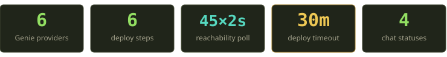
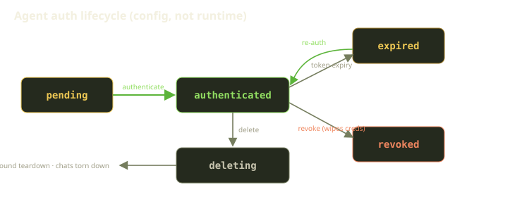
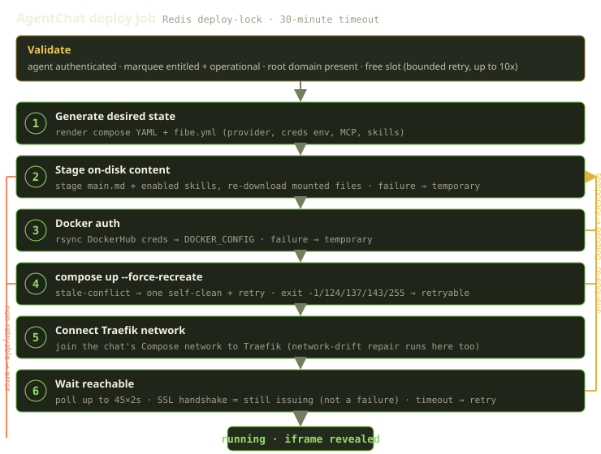
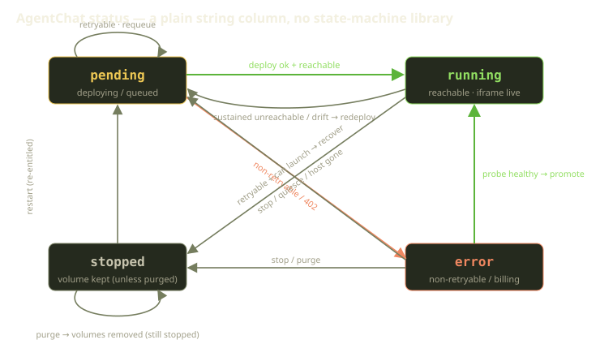
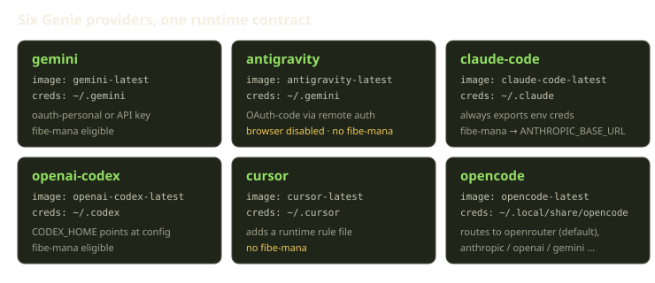

A user clicks "Start" on a Genie. Forty seconds later there's a Claude Code agent running in a container on their Marquee, reachable over TLS at a stable subdomain, talking to their repo through MCP, with their skills and main prompt already staged on disk. If the container later falls over, something notices within a minute and quietly puts it back.

That whole arc — from a config row in Postgres to a self-healing sidecar — is one job, one Redis lock, six steps, and a surprising amount of opinion about what counts as a *failure*. This post is a walk through the AgentChat deploy pipeline: what we build, in what order, which steps are allowed to fail and retry, and the one design decision that quietly shaped everything else — that a missed health check is not a reason to kill anything.

<!-- truncate -->



## Two nouns: the Agent and the AgentChat

The first thing to get straight is that "your Genie" is actually two records, and they have very different jobs.

An **Agent** is persistent config. It's the durable thing you set up once: which provider you want (Gemini, Antigravity, Claude Code, OpenAI Codex, Cursor, or OpenCode), your encrypted credentials, your enabled skills, your MCP wiring, the files you want mounted in, and your resource quotas. Every credential field — the stored credential blob, the API key, and the provider settings — is encrypted at rest, with a fallback decryption path so a key rotation never strands an existing secret. An Agent has its own lifecycle, and it's an *auth* lifecycle, not a deploy one. It moves through five states: pending, authenticated, expired, revoked, and deleting.

You create it pending; you authenticate it (via OAuth, a provider API key, or fibe-mana) and it becomes authenticated; a token can lapse to expired and you re-auth back to authenticated; you can revoke it, which wipes the stored credentials; and you can delete it, which moves it to deleting while the chats get torn down in the background. That's the whole config side.



There's a subtle but important distinction in what "usable" means: an Agent is only usable when it's authenticated **and** the token hasn't expired (no expiry recorded, or the expiry is in the future). That's the check every start, restart, and redeploy re-runs — config that *was* valid yesterday isn't trusted to still be valid at deploy time.

An **AgentChat** is the runtime side — one *live instance* of that Agent on one Marquee. Concretely it's a single Docker Compose project, with a unique slot and its own Compose project name on that host. Where the Agent's statuses are about credentials, the AgentChat's four statuses are about whether the thing is actually up. A chat can be pending, running, error, or stopped.

One nice property of this split: one authenticated Agent can back many chats — one per Marquee — and starting reuses the existing one rather than spawning duplicates. Under the hood, "start" looks up an existing chat for that agent-and-Marquee pair (or builds a fresh one) and a reuse query returns any running or pending chat already in flight for the agent. The user-facing invariant is simpler to say than to enforce: **at most one live chat per (agent, marquee).** You don't get a pile of zombie containers because you double-clicked.

:::note
There's no state-machine library here. A chat's status is a plain, validated string column. Transitions are just ordinary updates scattered across the deploy job, the controller, and the reconciler — which sounds chaotic until you realize it means every transition is searchable in the codebase and there's no DSL standing between you and the truth. We lean on the database for the hard guarantees instead: unique indexes covering each Marquee's slots, each Marquee's Compose project names, and the one-chat-per-agent-per-Marquee rule. The database, not application code, is what makes a duplicate impossible.
:::

## What "Start" actually kicks off

Starting a chat enqueues a background deploy job. Everything interesting happens inside two guards.

The first is a **Redis deploy-lock** keyed on the chat id, so two start jobs for the same chat can't stomp on each other. It's a classic "set if not exists, with an expiry" lock, and there's a scan of the background-job queue on top of it for good measure. The second is a hard **30-minute timeout** wrapping the whole pipeline, so a wedged deploy can't hold the lock forever. The lock and the timeout together bound both *who* can deploy and *how long* a single attempt is allowed to run.

Before any Docker happens, there's a validation gate. It is deliberately boring and it is deliberately first. It checks four things:

- the Agent is authenticated
- the Marquee is runtime-entitled — billing is funded, with no payment-required (HTTP 402) block — **and** operationally up
- the Marquee has a root domain (no domain, no route, no point)
- a free slot can be allocated, with bounded retry

That last one is more interesting than it looks. Slots are how a chat gets a *stable, human name*. Each chat claims the lowest free slot on its Marquee, and the slot maps through a fixed table to a name — `aladdin`, `jafar`, `genie`, `jasmine`, `merlin`, and so on. The name becomes the subdomain and the Compose project name (`genie-merlin`), and because the slot is allocated under database unique constraints, two chats racing for the same slot is resolved by catching the uniqueness violation and retrying — up to ten times — rather than by a lock. The database is the arbiter; the retry loop just keeps asking politely.

## The pipeline: six steps, two exits

Past the guard, the deploy is six steps. Five of them build state on the remote host; the sixth one *waits* — and the waiting is where most of the design lives.



### Step 1 — Generate the desired state

Step one renders two artifacts: the Compose YAML and a `fibe.yml`. The YAML is the container shape — image tag for the provider, volumes, Traefik labels, the health check. The `fibe.yml` is the agent's runtime config — provider, password, model options, the `credentialEnv` block, and the MCP server list. This is the *declared desired state*; everything downstream either realizes it or repairs drift back toward it. We persist the exact rendered YAML on the chat record so the precise bytes we deployed are always recoverable after the fact.

### Step 2 — Stage the on-disk content

Step two writes the things the agent reads from disk rather than from env: the `main.md` system prompt, every enabled skill file, and a fresh re-download of each mounted file (one download per file). It runs on *every* deploy — there's no "skip if unchanged" fast path here, which is the whole point of how we do drift repair (more below). If a file fails to stage, that's a **temporary** failure: it normalizes to a retryable deploy error, not a dead chat.

### Step 3 — Docker auth

We copy DockerHub credentials onto the host over rsync and point the next step at them, so it can pull private images. Same failure policy: if that copy fails, it's temporary and retryable.

### Step 4 — `compose up --force-recreate`

The actual lift:

```bash
docker compose -p genie-merlin -f <remote> up -d --remove-orphans --force-recreate
```

`--force-recreate` is intentional — we want the container rebuilt from the freshly-staged state, not reused from whatever was there before. Two things make this step robust:

- **Stale-container conflicts self-clean once.** If `up` fails because an old container is squatting on the name, we run one cleanup pass and retry exactly once. Not a loop — one shot — because a *persistent* conflict is a real problem worth surfacing, not worth spinning on.
- **Process-death exit codes are treated as transient.** SSH dropped, the command got `SIGKILL`/`SIGTERM`, the timeout sentinel fired — codes `-1`, `124`, `137`, `143`, `255` are all classified as retryable. None of those tell you the *deploy* is wrong; they tell you the *attempt* got interrupted.

### Step 5 — Connect the Traefik network

We join the chat's own Compose network to the shared Traefik network so the router can actually see the container. Traefik does wildcard TLS for the Marquee via ZeroSSL EAB credentials plus acme-dns — one `*.{domain}` cert covers every genie subdomain, so there's no per-name certificate dance. This step also doubles as network-drift repair: if a container somehow got detached from Traefik, the next deploy silently re-attaches it.

### Step 6 — Wait until reachable

Everything above can succeed and the agent can still be unreachable for a minute, because routing on a busy host lags container health. So the last step polls the agent's `/api/health` from *outside* — up to **45 attempts, 2 seconds apart** in production. (Dev mode is more patient at 180 attempts; busy hosts and slow first pulls.)

Here's the decision that matters most in the whole pipeline: **an SSL handshake error during this poll is treated as "still issuing," not as a failure.** A genie can be perfectly alive while ZeroSSL is still finishing the handshake path for its subdomain. Treating that as a deploy failure would mean failing deploys for a *cert-issuing* state that resolves itself. So we don't. If the poll exhausts on a genuine non-SSL unreachable, *that's* a temporary reachability error and we go back and retry.

When the poll comes back healthy, we flip the chat to running, stamp the start time, clear any prior error, record the image metadata, and reveal the iframe. There's one subtle guard at the finish line: if the chat was stopped *while* the deploy was in flight (a user hit stop mid-deploy), we don't promote it — we tear it down and bail. The user's intent wins over the in-flight job.

## Temporary versus terminal: when does a chat go to `error`?

This is the part we'd push back on if a reviewer tried to simplify it. The deploy distinguishes two failure classes, and the distinction is the difference between a chat that heals itself and one that needs a human.

A failure is **temporary** (→ back to pending, recovery flagged, start job re-enqueued) when it's one of:

- a process-death/SSH/timeout exit code (`-1`/`124`/`137`/`143`/`255`)
- a stale-container conflict — an old container still squatting on the name
- a file-staging, compose, or reachability hiccup

A failure is **terminal** (→ error) only when it's genuinely non-retryable — irrecoverable credentials, or a billing block. The canonical terminal case is a Marquee that isn't funded: the funding check answers with a payment-required (HTTP 402) response, we record that into the chat's error detail and stop, because no amount of retrying conjures funding.

The deciding logic is one line of intent: if the deploy error is marked retryable, the chat goes back to pending; otherwise it goes to error. And crucially, the *default* classification is non-retryable — so a *new* kind of failure we haven't explicitly marked retryable lands in error rather than silently spinning forever. That bias is deliberate. Better a visible error than an invisible retry storm.



The self-heal edge is our favourite. A chat in the error state that is *actually reachable* — say it errored on a transient blip but the container is fine — gets **promoted back to running** the moment a probe comes back healthy, either by the status-poll endpoint the browser hits or by Playguard's reconciler. The chat doesn't stay broken because of a stale status; reality wins.

:::tip
Worth being precise about how an error chat *looks* before it's promoted: the server initially renders an error banner with Retry/Stop, not the iframe. It becomes iframe-viewable only after a `/api/health` probe comes back healthy and the poll flips it to running. "Viewable" and "shows the iframe" are two different states, and the gap between them is exactly one successful probe.
:::

## The six providers, one runtime contract

All of this would be a lot more code if each provider had its own deploy path. They don't. A single provider mapping reduces every provider to four things — an image tag, a credential path, an env-builder, and a skills mapping — and the pipeline above is provider-agnostic. The differences live in config, not in control flow.



| Provider | Image | Creds path | Notable |
|---|---|---|---|
| `gemini` | `gemini-latest` | `~/.gemini` | oauth-personal or API key; fibe-mana eligible |
| `antigravity` | `antigravity-latest` | `~/.gemini` | OAuth-code via remote auth; **browser disabled**, no fibe-mana |
| `claude-code` | `claude-code-latest` | `~/.claude` | always exports env creds; fibe-mana sets `ANTHROPIC_BASE_URL` |
| `openai-codex` | `openai-codex-latest` | `~/.codex` | `CODEX_HOME` points at the config |
| `cursor` | `cursor-latest` | `~/.cursor` | adds a runtime rule file; no fibe-mana |
| `opencode` | `opencode-latest` | `~/.local/share/opencode` | routes to openrouter (default), anthropic, openai, gemini, deepseek, ... |

Three auth modes feed all of them: **OAuth** (an interactive remote-auth flow brokered over a WebSocket so the browser and the container can complete the handshake together), a **provider API key** (which can resolve from a linked Secret Vault entry rather than being pasted in), and **fibe-mana** (a platform gateway seeded from the player's own platform API key). Two providers — `cursor` and `antigravity` — opt out of fibe-mana entirely; for them the credential env returns empty in mana mode.

A small honesty note on MCP, because the diagram in our internal docs used to overstate it: of the MCP servers we wire up, only **docker** is unconditional. The **fibe** server is added only when an API key is present; **github** depends on installation ids; **gitea** depends on a token. So the genie always has Docker tooling; the rest of the MCP surface depends on what you've connected.

## Reachability is a classifier, not a boolean

The external health probe (`GET /api/health`, 2-second open and read timeouts) doesn't return up/down. It returns one of six outcomes, and *each one means something different* to the reconciler.


| Outcome | Meaning | What the reconciler does |
|---|---|---|
| Healthy | up and viewable | stay running; clear any stale recovery message |
| SSL handshake error | cert still issuing | surface "still issuing"; **never** a failure |
| Probe timeout | didn't answer in 2s | **IGNORED** — transient no-op, reconcilers return early |
| Connection refused | nothing listening | recoverable, *if past the grace window* |
| DNS failure | name didn't resolve | recoverable, *if past the grace window* |
| Unreachable | anything else (incl. non-2xx) | recoverable, *if past the grace window* |

Two of these earn their own callout.

The SSL handshake error is non-recoverable *by design*. The recovery check refuses to act on both a healthy result and an in-handshake one, because a chat mid-handshake is a chat that's about to be fine. Redeploying it would just restart the clock.

The probe timeout is the one people get wrong. It's tempting to lump it in with the other "bad" results, but both of the running-chat reconcilers bail out the instant they see a timeout — it's treated as a transient blink, not a redeploy trigger. A single slow probe on a loaded host is not evidence that anything is broken.

And the recoverable trio only acts *after* a grace window of two minutes. A chat that started 30 seconds ago is *allowed* to be briefly unreachable while it finishes coming up: recovery is considered "due" only when the chat has no recorded start time yet, or started more than two minutes ago. Only a sustained failure on a chat older than two minutes earns a redeploy: mark it for redeploy, drop it back to pending, enqueue a start. The container's own Compose health check (which restarts on failure up to ten times) handles the fast in-container recovery; the external probe handles the slow "is it actually routable from the world" recovery. Two layers, two timescales.

The invariant that ties it together: **a missed health check never stops or errors a running chat.** Every reconcile path can only ever enqueue a redeploy; none of them flips a chat to stopped or error from a probe result. If your editor is open on a genie and a health probe blinks, your session does not vanish. That single rule is why the whole thing feels stable to use.

## Drift repair is just "deploy again"

Because step two re-stages files on every deploy and step four force-recreates, we never wrote a bespoke "apply this one change" path. Drift repair *is* a redeploy. Three sources trigger one:

- **Mounted-file change** → enqueue a redeploy
- **Skills change** → same redeploy path
- **API key rotation** → a redeploy, fired automatically the moment the key is saved

Each one stamps a recovery reason and a "redeploy" recovery action onto the chat, then enqueues the start job — which re-stages files, force-recreates, and re-attaches Traefik. The interesting nuance: stamping drift does *not* immediately flip the chat to pending. The chat stays running while the redeploy is queued; it only reaches pending if the subsequent deploy hits a retryable failure. From the user's side the genie keeps working while it quietly reconciles underneath. There's also a separate orphan reaper that, every 5 minutes, finds Compose projects with no matching database row and tears them down volumes-and-all — but it skips any project that *has* a chat row, of any status, so a live chat's data is never collateral.

## The hardest bug: not killing things that are actually fine

The flip side of "heal aggressively" is "don't react to a false alarm," and the nastiest version of that is at the Marquee level. If the platform decides a *host* is gone, the natural thing to do is quiesce everything on it. But host-level failure signals are noisy — the host's Terraform state can momentarily read as empty during a refresh, drift detection can misfire, a Docker infrastructure probe can come back unhealthy on a momentary hiccup. Acting on every one of those would stop live, working agents for no reason.

So before a Marquee is "declared unavailable" and its chats quiesced, there's a gate: is *any* chat on it practically reachable? The check is exactly as literal as it sounds — it walks the host's chats and asks each one's external probe whether it answers healthy, and stops at the first one that does.

If even one chat answers `/api/health` healthy, the "host is gone" signal is **ignored** — the Marquee stays active and the chats are left untouched. A host that's serving traffic is, by definition, not gone, whatever Terraform thinks this second. Only when *no* chat is practically reachable, the Marquee is genuinely non-operational, and there are live chats, do we quiesce: each chat moves to stopped with a human-readable reason string recording the status and Terraform state at the time. There's no special "declared unavailable" flag anywhere in the system — just the reachability gate and a stopped chat carrying a reason.

Playguard's quarantine path has the same reflex. If the Docker probe comes back unhealthy but there are open agent-chat sessions, quarantine is *skipped* — we write an audit entry noting the skip and leave the Marquee active to preserve chat access, rather than quarantining a host people are actively using. The bias, again: a probe is evidence, not a verdict.

## Double-deploy protection, three layers deep

Because users click buttons twice and reconcilers fire on a schedule, "Start" gets called more than once for the same chat all the time. Three independent mechanisms keep that safe:

1. **The Redis deploy-lock.** A "set if not exists, with an expiry" key on the chat id means only one deploy holds the lock at a time; its expiry is the deploy timeout plus a minute of slack so it always outlives the work it guards.
2. **A background-queue scan.** Before enqueuing, we check whether a start job is already queued or running for this chat, so we don't pile duplicates into the queue in the first place.
3. **A redundant-stamp no-op.** When a reconciler tries to re-stamp the exact same failure details that are already on the chat, we recognize it as a no-op rather than churning the record.

None of these alone is sufficient — the lock handles concurrency, the scan handles queue hygiene, the no-op handles idempotent re-marking — but together they make "Start" something you can call as often as you like.

## Stop, quiesce, purge — and the one thing that deletes data

State lives in a per-agent Docker volume. Most things that look scary don't touch it:

| Action | What happens to the volume |
|---|---|
| User stop | compose down with **no** volume removal — preserved |
| Billing quiesce / Marquee down | mark stopped, maybe remote-stop — preserved |
| Docker maintenance | image/container prune only — preserved |
| Reactivation / restart | same Compose project, same volume — reused |
| **User purge (confirmed)** | full teardown: compose down *with* volume removal — **deleted** |

The honest version of the invariant: for a chat that still has a database row, **purge is the only path that deletes its data volume.** (The orphan reaper also removes volumes, but only for projects with *no* row.) And a full teardown actually removes three volumes, not one — the agent's data volume plus the two dev build caches that ride alongside it. Restart, quiesce, and maintenance all leave your work exactly where it was; you have to explicitly confirm a purge to lose it.

## What we learned

A few things have held up well enough that we'd build them the same way again:

- **Make the failure taxonomy explicit and bias toward "temporary."** Almost everything that goes wrong during a deploy is a transient interruption, not a wrong configuration. Classifying process-death exit codes, stale-container conflicts, and reachability blips as retryable — and reserving the error state for genuinely terminal causes like an unfunded Marquee — is what lets chats heal without paging anyone.
- **Don't treat "I couldn't reach it right now" as "it's broken."** The six-way reachability classifier, the "still issuing" carve-out for in-flight certs, the probe-timeout no-op, and the 2-minute grace window all exist to *resist* overreacting. The strongest invariant in the system — a missed probe never kills a running chat — is a restraint, not a feature.
- **Let the database arbitrate races, and make idempotency cheap.** Unique indexes plus a bounded retry beat hand-rolled locking for slot allocation; a Redis deploy-lock plus a find-or-build lookup keeps "Start" idempotent without a coordination layer.
- **One deploy path, many providers.** Pushing all six providers' differences into config — image, credential path, env-builder, skills — instead of branching the control flow is why adding the next provider is a config change, not a new pipeline.
- **A reachable thing is not gone, whatever the control plane thinks.** The single highest-leverage check in the whole system is "does any chat answer `/api/health` healthy?" — and the willingness to override a host-failure signal when the answer is yes. The platform's opinion loses to a successful probe, every time.

A coding agent running next to your code is a genuinely useful thing to have. Making it *boring to operate* — start it, trust it to come back, and only lose data when you say so — turned out to be mostly about being disciplined regarding what we let count as a failure.
