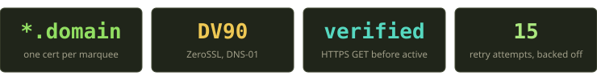
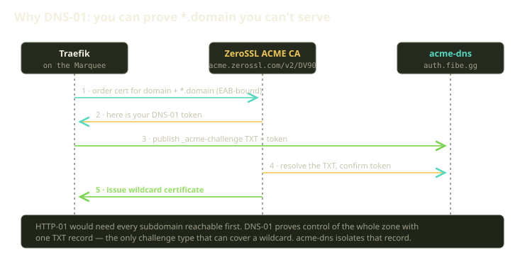
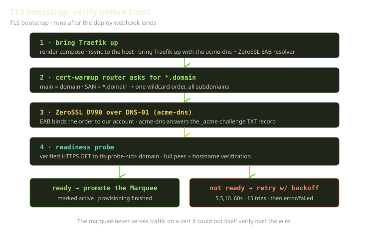

A tutorial Marquee is a single Docker host that serves a small zoo of subdomains: one per Playground, one per service inside a Playground, one for each AgentChat sidecar, plus a few for routing and error pages. They appear and disappear as you work — you can't enumerate them up front, so you can't mint a cert per name. You need one wildcard cert, `*.domain`, the moment the box comes online — no humans in the loop.

That sounds like a one-liner in a Traefik config. It is not. A *publicly trusted* wildcard cert means proving you control the whole DNS zone, on a brand-new VM, before a single browser has connected — then not lying to yourself about whether it worked. This is the story of that chain: ZeroSSL with External Account Binding, acme-dns for DNS-01, a cert-warmup router, and a readiness probe that refuses to declare victory on faith.

<!-- truncate -->



## The shape of the problem

When a Player buys a tutorial plan, Terraform spins up a Scaleway VM, writes the Cloudflare DNS records (a wildcard alongside the apex, so `anything.domain` resolves to the host), and registers an acme-dns account for the box. Once the host is ready, the provisioning workflow calls a deploy webhook into our Rails monolith. The webhook stores the connection details — host, SSH credentials, the free domain, the acme-dns account — and kicks off the TLS bootstrap.

At that instant the Marquee is in deliberate limbo: it has a public IP and a DNS name, but TLS is still in flight, so it isn't active and the runtime and routing layers won't touch it yet. A Marquee moves through provisioning, then disabled, then active — promoted only once it can serve HTTPS. Everything between here and active is TLS.

## Step one: bring Traefik up pointed at ZeroSSL

The bootstrap step renders a Docker Compose project, rsyncs it to the host, and brings Traefik up. The interesting bits are in the resolver — we call ours `letsencrypt`, a historical name, but the CA is ZeroSSL:

```bash
--certificatesresolvers.letsencrypt.acme.email=${ACME_EMAIL}
--certificatesresolvers.letsencrypt.acme.storage=/letsencrypt/acme.json
--certificatesresolvers.letsencrypt.acme.dnschallenge=true
--certificatesresolvers.letsencrypt.acme.dnschallenge.provider=acme-dns
--certificatesresolvers.letsencrypt.acme.caServer=https://acme.zerossl.com/v2/DV90
--certificatesresolvers.letsencrypt.acme.eab.kid=${ZEROSSL_EAB_KID}
--certificatesresolvers.letsencrypt.acme.eab.hmacEncoded=${ZEROSSL_EAB_HMAC}
```

Two things deserve a pause.

**`caServer` points at ZeroSSL's `DV90` endpoint.** ACME is a protocol, not a vendor — Let's Encrypt popularized it, but ZeroSSL speaks the same dialect. `DV90` is its 90-day domain-validated profile: same flow Traefik knows, different CA.

**EAB is the part people trip over.** Let's Encrypt lets any client request a cert anonymously. ZeroSSL, like most ACME CAs, requires *External Account Binding*: before placing orders, your client must bind itself to a ZeroSSL account using a key ID (`eab.kid`) and an HMAC-encoded secret (`eab.hmacEncoded`). Without it, ZeroSSL rejects `newAccount` and Traefik never reaches the challenge.

Both values live in our application credentials, never on the box, and we inject them only when both are present — if either is missing, we skip the EAB and CA-server flags entirely. A resolver pointed at ZeroSSL's endpoint but missing its account binding is worse than none: it fails late and cryptically instead of early and obviously. The EAB flags also carry `caServer`, so the compose rendering deliberately *doesn't* set it again — set it twice and you get a cert from the wrong CA at 2am.

## Step two: ask for the wildcard, explicitly

Here's a Traefik subtlety that costs people a day. Traefik fetches a cert for whatever a router matches, so `Host(\`app.domain\`)` gets a cert for `app.domain`, not `*.domain`. To get a wildcard you must ask by name, via `tls.domains` — so we attach a tiny **cert-warmup router**:

```yaml
traefik.http.routers.cert-warmup.rule: "Host(`domain`)"
traefik.http.routers.cert-warmup.entrypoints: "websecure"
traefik.http.routers.cert-warmup.tls: "true"
traefik.http.routers.cert-warmup.tls.certresolver: "letsencrypt"
traefik.http.routers.cert-warmup.tls.domains[0].main: "domain"
traefik.http.routers.cert-warmup.tls.domains[0].sans: "*.domain"
traefik.http.routers.cert-warmup.service: "error-pages@docker"
traefik.http.routers.cert-warmup.priority: "2"
```

`main = domain`, `sans = *.domain` — one order, the apex plus every subdomain under it. Pointed at our error-pages service at low priority, it never steals real traffic; it exists purely to make Traefik order the wildcard the instant it boots, not lazily on the first request to a not-yet-existent subdomain.

## Step three: DNS-01, because wildcards leave no choice

ACME offers a few ways to prove you control a name. The common one, HTTP-01, serves a token at `http://name/.well-known/...` for the CA to fetch. That works for `app.domain` — but not `*.domain`, since no single URL represents "every possible subdomain." A wildcard can only be validated by **DNS-01**: publish a CA-issued token as a TXT record at `_acme-challenge.domain`, and control of the record proves control of the zone.



DNS-01 has a sharp edge: something must write a TXT record into your DNS, automatically, on demand. The blunt way is to hand Traefik an API token for your whole DNS provider — a credential that can edit every record in the zone, on a VM a stranger is about to run untrusted code on. Bad trade.

That's where **acme-dns** comes in: a tiny purpose-built DNS server that does one thing — hold the `_acme-challenge` TXT record. Each Marquee gets its own Terraform-provisioned acme-dns account (username, password, and a `fulldomain` the challenge CNAMEs to). Our apex `_acme-challenge` is a static CNAME into acme-dns, so Traefik authenticates with that one account and updates that one record. Even if the box is fully compromised, the worst an attacker can do is set their own challenge token — blast radius: one TXT record.

```bash
ACME_DNS_API_BASE=https://auth.fibe.gg   # default; per-marquee creds come from the deploy webhook
ACME_DNS_STORAGE_PATH=/acme-dns/acme-dns.json
```

That completes the chain in the diagram above: an EAB-bound order, a DNS-01 token written to acme-dns, ZeroSSL resolving the TXT and issuing the cert. Only then can Traefik serve HTTPS across the apex and every subdomain.

## Step four: verify before trust

This is the part we're proudest of, and the cheapest code in the pipeline.

Everything up to now is asynchronous, on a remote box we don't fully control: the ACME order can be pending, the TXT record propagating, acme-dns mid-restart; Traefik can report a stored cert the world can't validate yet. Promote on "Traefik reports itself up" and the Player's first sight is a browser security warning. So we check: from our own infrastructure, a real HTTPS request to a probe subdomain only the wildcard could answer — a per-Marquee name of the form `tls-probe-<id>.domain`.

The probe is a handful of lines; what earns its keep is full peer *and* hostname verification against the same trust store a real browser uses. It succeeds only if a public CA chain validates *and* the cert genuinely covers that subdomain — exactly the verdict we want to predict. A self-signed cert, the wrong CA, an expired cert, a name mismatch, a half-issued wildcard — each raises an error we catch, log, and treat as "not ready yet." A short timeout keeps a wedged box from hanging the check. A clean response means the wildcard is genuinely live on the wire.

Only then do we promote the Marquee — mark it active, record provisioning finished, clear the in-flight TLS step.

The principle generalizes beyond TLS: **don't trust a state transition you can verify with one cheap probe.** "The resolver is configured" is a hope; "a verified client got a green padlock" is a fact.

## When it isn't ready yet (it often isn't)

On a fresh box the probe usually fails the first few times — DNS-01 propagation and ACME order completion take a while. The bootstrap waits it out on an exponential-ish schedule: roughly `[5, 5, 10, 10, 15, 15, 30, 30, 30, 60, 60, 60, 60, 60, 60]` seconds between tries — fifteen attempts, about nine minutes of patience. One wrinkle: on the fourth attempt we *restart* Traefik rather than only ensuring it's running.

That's a scar-tissue decision. Usually patience wins, but occasionally Traefik wedges in a bad ACME state that only a clean restart clears. Restart on every poll and you keep tearing down an order seconds from completing; never restart and the rare wedged box stays stuck forever. One nudge, where waiting has clearly stopped helping, is the compromise.

If all fifteen are exhausted, we stop pretending: the Marquee lands in an error state with provisioning marked failed. A box that failed loudly and can be re-provisioned beats one that limps into active throwing cert warnings forever.



## The whole chain, in one table

| Stage | What happens | Where it lives |
|---|---|---|
| Bring-up | Render compose, rsync to the host, bring Traefik up | TLS bootstrap |
| Resolver | acme-dns DNS-01 + ZeroSSL EAB resolver, CA server set to the `DV90` endpoint | compose rendering |
| Order | cert-warmup router asks for the apex as `main` plus `*.domain` as a SAN | compose labels |
| Challenge | TXT written to the per-Marquee acme-dns account; ZeroSSL resolves it | acme-dns + ZeroSSL |
| Verify | Verified HTTPS GET to `tls-probe-<id>.domain`, full peer + hostname verification | readiness probe |
| Promote | Marquee marked active, provisioning marked finished, TLS step cleared | TLS bootstrap |
| Backoff | 15 attempts (5–60s), restart Traefik on attempt 4, then fail loudly | TLS bootstrap |

## What we learned

Three things travel beyond TLS. Wildcards force DNS automation — plan for it from day one. Scope challenge credentials tightly, so a compromised VM can't rewrite your zone. And verify before you trust, then fail loudly when patience runs out — a cheap probe at the boundary catches the whole class of "looked fine, wasn't" bugs.

The payoff: a Player buys a plan, walks away for a coffee, and comes back to a green padlock on every subdomain their environment will ever spawn — without anyone touching a cert, and without us calling a box "ready" when it wasn't.
