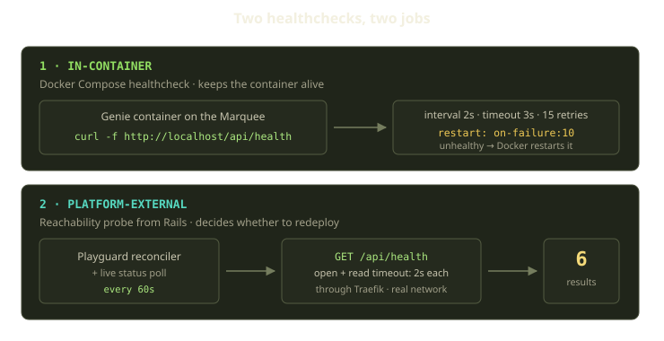
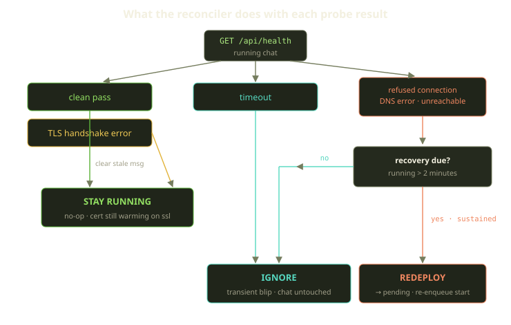
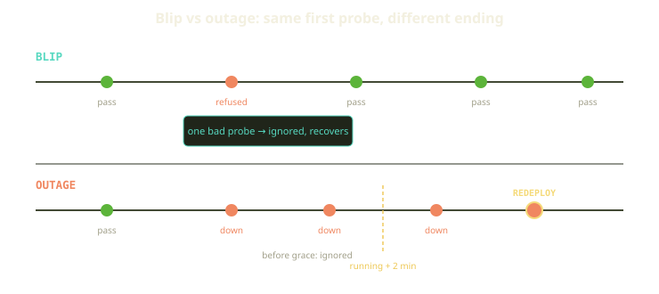

Every monitoring system hits the same fork: a check just failed — act, or wait? Act too eagerly and you turn a 400ms hiccup into a full redeploy, with a user staring at a "deploying…" spinner for nothing. Wait too long and a genuinely dead environment sits there, unreachable, getting the benefit of the doubt.

On Fibe, the watched things are AgentChats — the "Genie" coding agents that run as Docker sidecars on a Player's Marquee. They're long-lived, they sit behind Traefik with wildcard TLS, and people are actively typing into them, so a false redeploy is a visible interruption. We don't have one healthcheck; we have two, and most of the effort went not into detecting failure but into deciding which failures are worth reacting to.

<!-- truncate -->

## Two healthchecks, two completely different jobs

The word "healthcheck" suggests a single signal. Our two run at different layers, on different clocks, answering different questions, and conflating them is the fastest way to misunderstand the system.



### Healthcheck #1: the in-container compose healthcheck

This one lives inside the Genie container, baked into the generated Docker Compose project:

```yaml
healthcheck:
  test: ["CMD", "curl", "-f", "http://localhost:8080/api/health"]
  interval: 2s
  timeout: 3s
  retries: 15
  start_period: 30s
restart: "on-failure:10"
```

It curls `/api/health` on `localhost` every two seconds. Its job is narrow and local: keep the process inside the container alive. If the agent process wedges, Docker notices and the on-failure restart policy brings it back up to ten times — a closed loop the platform doesn't watch.

That `start_period: 30s` matters. Agent runtimes are not instant; the container can report "starting" for half a minute before this check counts against it. Give processes room to boot before you judge them — a theme that repeats one layer up.

### Healthcheck #2: the platform-external reachability probe

The second healthcheck runs from Rails, not inside the container, and asks a harder question: *can a user actually reach this thing right now?* That's not "is the process alive." A process can be healthy while Traefik hasn't attached the route, the wildcard cert is still warming, DNS is briefly confused, or the host is momentarily saturated — the in-container check reports green through all of it. The external probe sees the world the way a browser does: through the real network, through Traefik.

The probe is deliberately simple. It opens an HTTP connection to the chat's public URL — over TLS when the URL is `https` — with two-second open and read timeouts, and asks for `/api/health`. A 2xx response is a clean pass; everything else is a failure. The interesting part is *how* it fails.

Rather than collapse every failure into a single "down," the probe classifies it into six outcomes: a clean pass; a TLS handshake error; a timeout (opened, or the read started, but never finished inside the two-second window); a refused connection (something actively rejected the socket); a DNS error (the name didn't resolve); and a catch-all unreachable for anything else, including a non-2xx response or a missing URL. It returns a *taxonomy* rather than a boolean because each kind deserves a different reaction. Flattening them to "down" throws away exactly what we need to avoid overreacting.

## The six results, and what the reconciler does with each

The reconciler runs as part of Playguard, which sweeps every Marquee on a 60-second cadence — and the same logic runs on the live status-poll the browser hits while a chat pane is open. A chat is re-evaluated on the background sweep *and* whenever a user looks at it.



The branches, in the order the reconciler checks them — because the order *is* the policy:

### A clean pass → stay running, and clear the scar tissue

The happy path does one thing beyond "do nothing": if a previous scare left a stale recovery message — a chat marked for redeploy that came back on its own — we clear it. A recovered chat shouldn't keep wearing the error from the moment it stumbled. Self-healing should leave no scar.

### A TLS handshake error → explicitly **not** a failure

A deliberate carve-out, and a good example of domain knowledge beating generic monitoring. When a Genie subdomain first comes up, Traefik requests a wildcard TLS cert (ZeroSSL EAB credentials plus acme-dns let it ask for one covering the whole wildcard domain). During that handshake the probe gets a TLS error — container and route are fine, the cert is warming.

So a TLS handshake error is classified as **non-recoverable**: a chat is only a candidate for recovery if it's running, its Marquee can launch chats, and the probe came back as something other than a pass or a TLS error — and even then, only past its grace window. A warming cert never clears that bar; user-facing, it surfaces as a "pending TLS" state, not an error. Redeploying over an unissued cert is overreacting by definition.

### A timeout → ignore it. Just ignore it.

A timeout is a no-op, and that carries more design judgment than any other branch in the reconciler. It's the most common false alarm in any networked health probe: a busy host, a neighboring container hogging the CPU during a compose-up, a garbage-collection pause landing right when our two-second read window closed. None of these mean the environment is broken. So we made a bet: **for a long-lived interactive environment, a false redeploy is worse than a slow heal.** If the agent is genuinely down, the *next* probe — 60 seconds later, or the moment the user's pane polls — comes back decisive. A single timeout only buys the chance to be wrong.

:::tip
Treat "slow to respond" and "actively refusing connections" as the same event and you'll redeploy healthy systems. One is a host under load; the other is a process that isn't listening.
:::

### A refused connection, a DNS error, or an outright unreachable → maybe, if it's sustained

These three are the decisive failures: nothing listening on the port, a name that doesn't resolve, or the catch-all for everything else. They warrant action — but even a decisive failure clears one more gate first.

## The two-minute grace window

The gate is time. A chat is only due for recovery once it has been running for at least two minutes (or has no recorded start time at all); anything younger is inside its grace window, and the reconciler bails before it even probes. The reasoning mirrors the container's 30-second start period, scaled up to external routing — Traefik attachment, cert issuance, agent warm-up. Two minutes is the budget for a fresh environment to come alive before we'll call it dead, so a decisive failure inside that window is ignored exactly like a timeout.

Only when a chat is *both* past its grace window *and* returning a decisive failure does the reconciler commit: it records a redeploy recovery action, moves the chat back toward pending, and re-enqueues a start. That start re-runs the full deploy pipeline — re-stage files, force a clean container recreate, re-attach Traefik — so the environment comes back through the *same* path a first deploy takes. No special "recovery" code to rot apart from the deploy logic.

One invariant is the whole safety story in a sentence: **a missed healthcheck never stops or errors a running chat.** The reconciler's only lever is "enqueue a redeploy"; the worst a probe can do is schedule a restart, never destroy.

## Blip vs outage, on a timeline

A **blip** — pass, one refused connection, pass — never crosses the grace line; an **outage** — pass, then down, down, down — stays decisive past the window and triggers a redeploy. We pay that cost only on a *real* outage, never on noise.



The same policy as a table — the decision tree flattened:

| Probe result | Past grace window? | Reconciler action |
|---|---|---|
| Clean pass | n/a | Stay running, clear stale recovery message |
| TLS handshake error | n/a | Stay running (pending TLS, cert warming) |
| Timeout | n/a | Ignore — transient no-op |
| Refused / DNS error / unreachable | no | Ignore — still in grace |
| Refused / DNS error / unreachable | yes | Mark for redeploy, re-enqueue start |

Three of the five rows are "do nothing." That ratio is not an accident — it's the point.

## What we learned

One transferable idea: **the hard part of a healthcheck is not detection, it's discrimination.** Detecting failure is a try/rescue block; deciding whether the failure is worth acting on is where the reliability lives. A few principles fell out of building this:

1. **Return a taxonomy, not a boolean.** A warming cert, a busy host, and a dead process are three different events; a boolean forces you to react to all of them identically, which means reacting to none well.
2. **Give every system a grace period before you judge it.** Thirty seconds for the container, two minutes for the platform. The number scales with how messy the layer is; the principle doesn't.
3. **When false positives hurt users, bias toward inaction.** The blast radius here is a human mid-conversation with a coding agent. A slow heal is recoverable; a fast reaction to a phantom failure is self-inflicted — and real failures announce themselves more than once.
4. **Make recovery reuse the normal path.** Redeploy runs the same deploy pipeline as a first launch — no parallel "recovery mode" code to drift out of sync with reality.

A missed healthcheck means nothing; sustained unreachability means redeploy. Two healthchecks, six result codes, one two-minute window — arranged so the answer to "should we act?" is, most of the time, a confident *not yet*.
