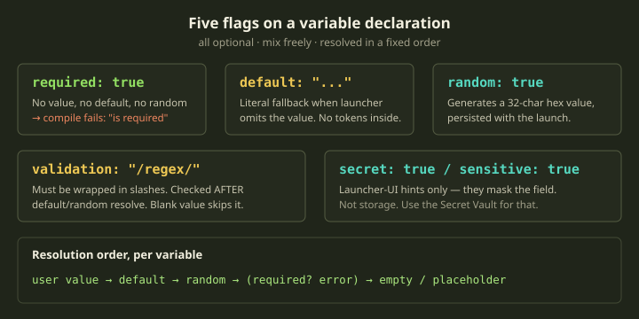
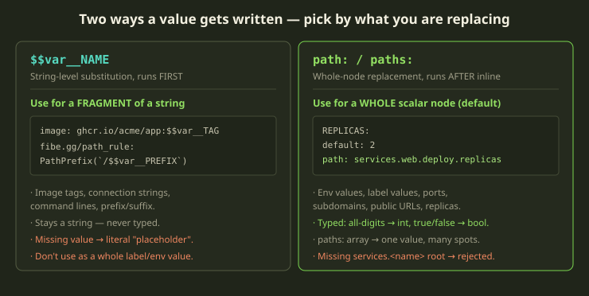
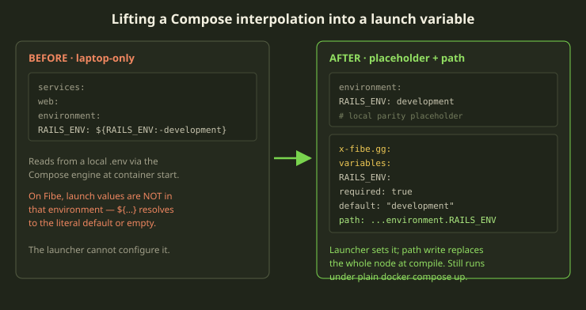

A template that only ever runs one way is just a Compose file with extra ceremony. The whole point of publishing to the Bazaar — or even sharing a template across two Marquees — is that the next person fills in their own subdomain, their own image tag, their own database password, and gets a working environment without editing your YAML. That is what template variables are for.

The catch is that variables in Fibe are not Compose's `${VAR}` interpolation. They are a separate compile-time layer with its own declaration block, its own substitution rules, and its own ways to fail. Get the mental model right and they are boring and reliable. Get it wrong and you ship a template that compiles to an empty string in production, or hard-fails on launch with a cryptic error. This guide is the version we wish someone had handed us: how to declare variables, where the values can land, and which mistakes actually bite.

<!-- truncate -->

## The shape of a declaration

Everything starts in one place: a top-level `x-fibe.gg.variables` block. Each key under it is one variable. The fields are all optional, and you mix them to describe behavior.

```yaml
x-fibe.gg:
  variables:
    SUBDOMAIN:
      name: "Subdomain"
      required: true
      default: "demo"
      validation: "/^[a-z][a-z0-9-]*$/"
      path: services.web.labels.fibe.gg/subdomain
```

The variable name (`SUBDOMAIN`) must match `^[A-Za-z0-9_]+$`. Uppercase is the convention, though mixed case is technically allowed. That name is what you reuse everywhere the variable appears.

Here is what each field actually does at compile time:

| Field | Effect |
|---|---|
| `name` | Human label shown in the launcher. If it is null or empty, compilation errors out for a missing name. |
| `required: true` | If there is no user value, no `default`, and no `random`, compilation fails with `Variable '<key>' is required`. |
| `default: <value>` | Literal fallback used when the launcher omits a value. Must be a plain literal — no tokens. |
| `random: true` | If no user value is supplied, generates a stable 32-character lowercase hex value. |
| `validation: "/regex/"` | Must be wrapped in slashes. Pattern is checked after defaults and randoms resolve. |
| `secret` / `sensitive` | Launcher-UI hints that mask the field. They are not storage. |
| `path` / `paths` | Bind the value to a location (or several) inside the template body. |



That last column of the diagram — the resolution order — is the single most useful thing to internalize. For every variable, Fibe walks the same ladder:

1. A user-supplied value from launch input (or stored launch values).
2. The `default`, if it is non-empty.
3. A `random: true` generated value.
4. If none of those and `required: true`, a compile error.
5. Otherwise: an empty string for a `path` binding, or the literal text `placeholder` for an inline reference.

:::note
The order matters for one subtle interaction: when a variable is both `required: true` and `random: true`, the random generation runs **before** the required check. So a missing input never errors — it just gets generated. That is exactly what you want for a database password.
:::

## The five flags, in practice

### `required` vs `default`

These two are easy to confuse because they look like opposites, but they compose. Think of `required` as "will we let launch proceed without a real value" and `default` as "what do we fall back to."

```yaml
# Must be supplied by the launcher — no escape hatch
APP_NAME:
  name: "App name"
  required: true

# Required, but has a default — never actually blocks a launch
APP_NAME:
  name: "App name"
  required: true
  default: "demo"

# Optional — empty if the launcher skips it
APP_NAME:
  name: "App name"
```

The middle one trips people up. `required: true` with a `default` will never fail the required check, because step 2 of the ladder satisfies it. If you genuinely want to force the launcher to make a decision, drop the default.

### `default` literals only — no derived values

This is the rule we see broken most often. Defaults are **literal values**. You cannot reference another variable, a random, or the root domain inside a default:

```yaml
# WRONG — validation rejects all of these
PUBLIC_URL:
  default: "https://$$var__SUBDOMAIN.$$root_domain"   # nested token
DB_URL:
  default: "postgres://user:$$var__DB_PASSWORD@db/app"  # nested token
```

Defaults are not recursively expanded, and the validator rejects `$$var__*`, `$$random__*`, and `$$root_domain` inside them. If you need a derived public URL, declare it as its own explicit variable with a `path` binding — even if that means the launcher sees a second field that looks redundant. Duplicate-looking inputs beat a template that silently ships a broken URL.

### `random` keeps generated values out of the template text

`random: true` is how you get a secret without ever writing one into the file. The launcher does not prompt for it; Fibe generates a 32-character hex value at compile, and — this is the important part — **persists it with the launch**. Subsequent compiles reuse the same value, so your database password does not reset every time the environment redeploys.

```yaml
x-fibe.gg:
  variables:
    DB_PASSWORD:
      name: "Database password"
      required: true
      random: true
      secret: true
      paths:
        - services.web.environment.DB_PASS
        - services.db.environment.POSTGRES_PASSWORD
```

One generated value, written to both the app and the database. The web service and the postgres service agree because they read the same declared variable.

:::caution
`secret: true` and `sensitive: true` are *only* launcher-UI hints — they mask the input field so a shoulder-surfer does not read it off the screen. They do not encrypt anything or store it anywhere durable. For long-lived credentials that outlive a single launch, use the Secret Vault, or supply the value as a launch variable or Job ENV. Marking a field `secret` is not a substitute for any of those.
:::

### `validation` catches bad input before it reaches a container

A regex wrapped in slashes constrains what the launcher can type. It runs *after* default and random resolution, and a blank value skips it entirely (so an optional empty field is fine).

```yaml
SUBDOMAIN:
  name: "Subdomain"
  required: true
  default: "demo"
  validation: "/^[a-z0-9][a-z0-9-]*[a-z0-9]$/"

PORT:
  name: "Port"
  default: "3000"
  validation: "/^[0-9]+$/"

EMAIL:
  name: "Admin email"
  required: true
  validation: "/^[^@]+@[^@]+\\.[a-z]{2,}$/"
```

The wrapper is enforced: `validation` must be either an empty string or begin *and* end with `/`. A bare `^[0-9]+$` without the slashes is a declaration error, not a pattern. Validation is your cheapest defense — a malformed subdomain caught at launch is a one-line fix; the same value caught by Traefik failing to route at 3am is not.

## Where a value can land: inline tokens vs whole-node paths

Declaring a variable is half the job. The other half is telling Fibe *where* the value goes. There are exactly two mechanisms, and choosing the right one is most of the skill.



### Inline: `$$var__NAME`

`$$var__NAME` is string-level substitution. Fibe reads the raw template body as text, swaps every `$$var__NAME` for the resolved value, and *then* re-parses the YAML. Because it happens at the text level, it works anywhere — but its job is to fill in a **fragment** of a larger string.

```yaml
services:
  web:
    image: ghcr.io/acme/app:$$var__TAG
    environment:
      DATABASE_URL: "postgres://user:$$var__DB_PASSWORD@db:5432/app"
    labels:
      fibe.gg/visibility: external
      fibe.gg/path_rule: PathPrefix(`/$$var__PATH_PREFIX`)
```

Image tags, connection strings, command lines, label values with a prefix or suffix — these are the legitimate uses. The value stays a string; inline never types it as an integer or boolean. And if a variable has no value and no default and is not random, an inline reference falls back to the literal text `placeholder`, which will happily ship to a container. That is a bug waiting to happen, which is why inline is the *fragment* tool, not the default tool.

:::caution
Do not author `$$random__NAME`. Older templates contain it, but it is **not substituted at compile time** — the literal text `$$random__NAME` survives into the compiled file. The validator only recognizes it for the unused-variable check, nothing more. Always write `$$var__NAME` and let `random: true` on the declaration do the generating.
:::

### Whole-node: `path:` / `paths:`

This is the primary mechanism. A `path` is a dotted reference to a location in the template; the entire node at that location is replaced with the resolved value, *after* inline substitution has run.

```yaml
x-fibe.gg:
  variables:
    REPLICAS:
      name: "Web replicas"
      default: 2
      path: services.web.deploy.replicas
    DEBUG:
      name: "Debug mode"
      default: false
      paths:
        - services.web.environment.DEBUG
        - services.worker.environment.DEBUG
    SUBDOMAIN:
      name: "Subdomain"
      default: app
      path: services.web.labels.fibe.gg/subdomain
```

Two things make `path` the better default for whole values. First, it is **typed**: an all-digit value writes as an integer, `true`/`false` in any case writes as a boolean, and everything else writes as a string. So `REPLICAS` lands as the integer `2`, not the string `"2"` — which is what `deploy.replicas` actually needs. Second, `paths:` (the array form) writes one value to many destinations, so the same password reaches four services with a single declaration.

Here is the decision in one table:

| You are replacing... | Use | Example |
|---|---|---|
| A whole env value, label value, replica count, or public URL | `path:` / `paths:` | `path: services.web.labels.fibe.gg/port` |
| A fragment inside a larger string | `$$var__NAME` | `image: registry/app:$$var__TAG` |
| The same value in several places | `paths:` array | one password, four services |
| An existing Compose `${VAR}` whole-node ref | placeholder + `path:` | keep `RAILS_ENV: development`, add a path |

### Path syntax gotchas

A `path` is dotted notation into the template body. Most paths are intuitive — `services.web.environment.RAILS_ENV` — but three things catch people:

- **Array indices are their own segment.** Write `services.web.command.[2]` (or `services.web.command.2`). A bracket glued to the key, like `command[2]`, is read as a literal key named `command[2]`, not an index.
- **Dotted label keys need a placeholder first.** A key like `fibe.gg/subdomain` is matched as a single label key *only when that label already exists* under `labels:`. If you point a path at a `fibe.gg/*` label that is not in the file, the path writer treats the dots as nested map segments and invents a little `fibe` → `gg/subdomain` map instead of the label you wanted. So put the label in the Compose file first with a placeholder value, then bind to it.
- **Missing service roots are rejected; missing leaves are created.** A path aimed at a `services.<name>` root that does not exist fails validation. But a missing leaf *under* an existing service is created for you. Always check your paths against the template's real structure — a path-write failure comes back as a compile error.

```yaml
# The label must exist for the path to bind to it
services:
  web:
    labels:
      fibe.gg/subdomain: app        # concrete placeholder — keep it
      fibe.gg/port: 3000            # local parity, overwritten at compile

x-fibe.gg:
  variables:
    SUBDOMAIN:
      name: "Subdomain"
      default: app
      path: services.web.labels.fibe.gg/subdomain
```

## Extracting `${VAR}` from an existing Compose file

The most common reason you reach for variables is converting a real `docker-compose.yml` into a Fibe template. That file is full of `${VAR}` and `${VAR:-default}` interpolations that worked off a local `.env`. On Fibe, those launch values are **not** in the Compose engine's environment, so `${VAR:-development}` resolves to the literal default (or empty) — not to anything the launcher typed.

The fix is mechanical: for every `${VAR...}`, declare a variable, keep a concrete placeholder so the file still runs under plain `docker compose up`, and add a `path` binding so the launch value overwrites that node at compile.



Here is the worked before/after:

```yaml
# BEFORE — laptop-only
services:
  web:
    environment:
      RAILS_ENV: ${RAILS_ENV:-development}
      DB_PASSWORD: ${DB_PASSWORD}
```

```yaml
# AFTER — launcher-configurable, still runs locally
services:
  web:
    environment:
      RAILS_ENV: development        # placeholder, overridden by path binding
      DB_PASSWORD: ""               # placeholder

x-fibe.gg:
  variables:
    RAILS_ENV:
      name: "Rails environment"
      required: true
      default: "development"
      paths:
        - services.web.environment.RAILS_ENV
    DB_PASSWORD:
      name: "Database password"
      required: true
      random: true
      paths:
        - services.web.environment.DB_PASSWORD
        - services.db.environment.POSTGRES_PASSWORD
```

The step-by-step we follow on every conversion:

1. **Grep the input** for `${...}` and list every variable name.
2. For each one, ask: *should the launcher set this?* Yes for app config, secrets, and hostnames. No for static infrastructure.
3. For each "yes," add an `x-fibe.gg.variables` entry.
4. Choose the binding: whole node → `path`/`paths`; fragment → `$$var__NAME`.
5. Rewrite or keep the original occurrence to match.

:::tip
Do **not** extract everything. Internal service hostnames (`db`, `redis`, `pgbouncer`) are fixed by Compose service names. Static infrastructure constants (`POOL_MODE: transaction`, `RAILS_LOG_TO_STDOUT: "1"`, `POSTGRES_HOST_AUTH_METHOD: trust`) never change across launches. Hardcode those. Every variable you declare is a field the launcher has to think about — keep the list to things that genuinely vary.
:::

## `$$root_domain`, the one token you don't declare

There is exactly one special inline token you never put in `variables`: `$$root_domain`. Fibe always replaces it with the launching Marquee's root domain (something like `next.fibe.live`). Use it only as a fragment where a fully-qualified public host cannot be expressed with explicit variables:

```yaml
services:
  app:
    environment:
      CALLBACK_URL: "https://api.$$root_domain/callback"
```

For a whole env value that is a public URL, prefer an explicit variable with a literal default and a `path` binding. It is more verbose, but it is configurable per launch and it is the form that survives being imported onto a different Marquee.

## The launch-time experience

When someone launches your template, Fibe reads the declarations and builds the prompt. Each variable with a `name` becomes a field. `required` ones without a default block submission until filled. `default` ones pre-populate. `validation` rejects bad input inline. `secret`/`sensitive` fields are masked. `random` variables don't appear at all — they are generated silently.

So a tight declaration block is also a tidy launch form. Sloppy declarations — a missing `name`, a default that should have been required, a secret left unmasked — all surface as a worse experience for whoever launches your template.

## Failure modes, and what they look like

This is the section to bookmark. Every one of these is a real compile-time or runtime check.

| Symptom | Cause | Fix |
|---|---|---|
| `Variable '<key>' is required` | `required: true`, no value, no default, not random | Supply a value, add a `default`, or set `random: true` |
| Undeclared-variable error | `$$var__X` with no `x-fibe.gg.variables.X` | Declare `X` |
| Unused-variable error | Variable declared but never referenced inline and no `path`/`paths` | Reference it, bind it, or remove it |
| Missing-name error | `name` is null or empty | Give it a `name` |
| `fails validation pattern` | Resolved value doesn't match `validation` | Fix the value or loosen the regex |
| Path write fails / rejected root | `path` aims at a missing `services.<name>` | Point it at a real service |
| Literal `placeholder` in output | Inline ref with no value, no default, no random | Add a default, make it random, or bind via `path` |
| A label became a nested `fibe` map | Path bound to a `fibe.gg/*` label that wasn't in the file | Add the label with a placeholder first |

The two that cost the most time are the silent ones at the bottom. A `placeholder` string shipping to a container, or a `fibe.gg/subdomain` label that quietly turned into a nested map, both *compile fine* — they just produce a broken environment. Both come straight from skipping the "keep a concrete placeholder" rule. When in doubt, leave a real value in the Compose body and let the `path` write overwrite it.

## Rules of thumb

- **`path`/`paths` is the default; inline is the exception.** Reach for `$$var__NAME` only when the value is genuinely a fragment of a bigger string.
- **Keep a concrete placeholder for every path target.** It preserves local `docker compose up` parity and prevents the silent "nested map" and "placeholder string" bugs.
- **`required` without a `default` is how you force a decision.** Add a default and the required check never fires.
- **Defaults are literals.** No `$$var__`, no `$$random__`, no `$$root_domain` inside them — declare a separate path-bound variable for derived values.
- **Use `random: true` for every secret you generate.** Never author `$$random__NAME`; it is not substituted and the literal text leaks.
- **Validate cheap, fail early.** A slash-wrapped regex at launch is far cheaper than a routing failure in production.
- **Don't extract static infrastructure.** Internal hostnames and fixed constants get hardcoded; only genuinely varying values become variables.

Get those seven right and template variables stop being a source of 3am surprises. They become what they should be: the seam where someone else's environment meets your YAML, cleanly, every time.
