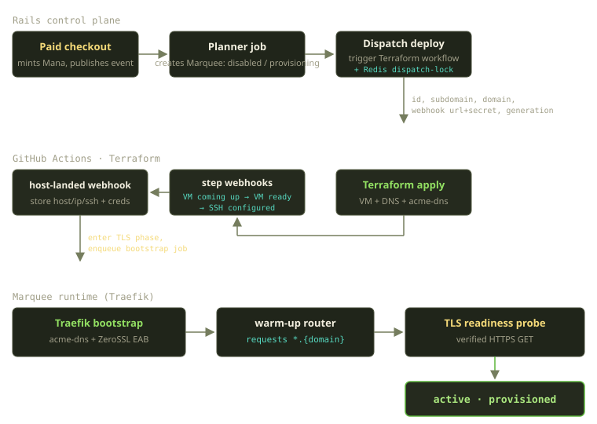
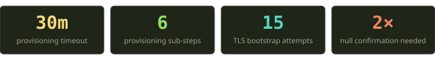
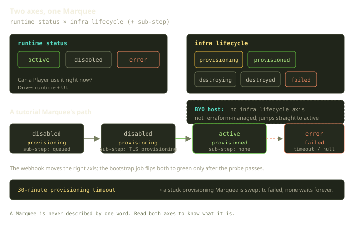
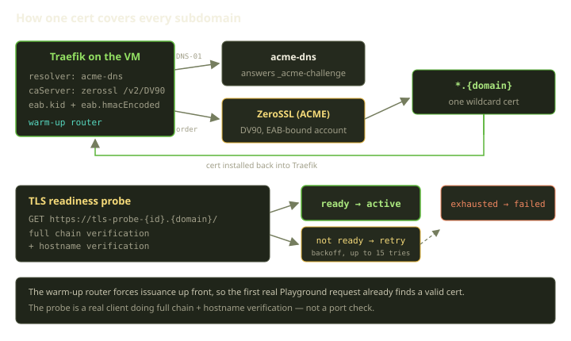

A Player clicks "buy" on a tutorial bundle. A minute or two later they have a real Docker host on the public internet, reachable at a domain that already serves a valid HTTPS certificate for every subdomain it will ever use. No certificate warnings, no "give it five minutes for DNS to propagate," no SSH keys to paste. It just works.

That last clause is doing a lot of work. Between the checkout and the green light, a payment becomes an event, an event becomes a database row, a row dispatches a GitHub Actions workflow, Terraform conjures a VM and a fistful of DNS records, a series of webhooks walk the row through six discrete steps, and finally a background job coaxes Traefik into talking ACME with ZeroSSL until a wildcard cert exists and a real HTTPS client can verify it. If any of those steps stalls, the row doesn't sit in limbo forever — it has a clock on it. This is the story of that path, and of the small pile of state we keep so that "it just works" stays true even when a cloud API has a bad day.

<!-- truncate -->



## The thing we're provisioning

A bit of vocabulary first, because the nouns matter and we'll use them precisely.

A **Marquee** is a Docker host. A **Player** owns one. On top of a Marquee live **Playgrounds** (long-lived dev environments), **Tricks** (headless one-shot jobs), and **AgentChats** (the "Genie" coding agents that run as sidecars) — all of them Docker Compose projects, routed by Traefik, healed by a reconciler called Playguard.

There are two ways to get a Marquee. You can **bring your own host** — hand us an SSH endpoint and we store it — or you can let Fibe auto-provision a tutorial VM on Scaleway. This post is almost entirely about the second path, because it's the one with the moving parts. We'll come back to bring-your-own at the end; it's interesting precisely because of everything it *skips*.

:::note
A Marquee only runs while it's funded. Billing tops up a Mana/Sparks wallet daily, and an unfunded Marquee trips a payment-required gate — a plain HTTP 402 — before anything is deployed onto it. Provisioning gets you a host; funding keeps it alive. This post is about getting the host.
:::



## Step 0: a payment becomes a row

When a tutorial checkout is paid, billing does two things that matter here. It mints Mana into the Player's wallet, and it publishes a domain event onto the internal event bus announcing that a tutorial Marquee has been requested. We deliberately don't provision inline inside the payment webhook. Payment fulfilment should be fast, idempotent, and boring; provisioning is slow, external, and occasionally exciting. Decoupling them with an event means a flaky Scaleway API can never wedge a Stripe webhook.

A planner job picks up the event. Its first instinct is to *not* create anything new: if the Player already has an active or previously-destroyed tutorial Marquee, it reuses that record. Re-provisioning a destroyed Marquee is cheaper and less surprising than spawning a parallel one, and it keeps the Player's mental model intact — they bought "a tutorial environment," not "their third tutorial environment this month." Reuse also sidesteps a quieter problem: orphaned records. Every Marquee we create is something we're then obligated to track, fund, and eventually tear down. The fewer we mint, the less there is to leak. Only when there's nothing to reuse does the planner create a fresh Marquee, and it creates it in a very specific shape.

A brand-new tutorial Marquee starts life carrying three independent pieces of state: a runtime status that begins switched off, an infrastructure-lifecycle status that begins as "provisioning," and a finer-grained sub-step that begins as "queued." Three fields, and they're not redundant. That trio is the heart of how we model a half-built host, so it's worth slowing down on.

## Two axes are better than one

The naive design is a single status field that marches from "creating" to "ready" to "error." We tried thinking about it that way and it falls apart the moment you ask a simple question: *can a Player use this Marquee right now?* During provisioning the answer is "no," but during a transient billing lapse the answer is also "no," and those are completely different situations that should not collapse into the same word.

So a Marquee carries two orthogonal axes plus a sub-step:

- **A runtime status** — active, disabled, or error. This is the user-facing, runtime-facing axis. It answers "is this usable?"
- **An infrastructure-lifecycle status** — provisioning, provisioned, destroying, destroyed, or failed. This is the lifecycle axis. It answers "what does the underlying host actually exist as?"
- **A provisioning sub-step** — a finer-grained breadcrumb *within* provisioning: queued, then the VM coming up, the VM ready, SSH configured, TLS provisioning, and finally deploying.



Read both axes and you know exactly what a Marquee is. A freshly created tutorial Marquee is disabled / provisioning / queued — not usable, host doesn't exist yet, sitting in the dispatch queue. A healthy one is active / provisioned, with no sub-step in flight. A Marquee whose billing lapsed is disabled / provisioned — the host is real and fine, it's just been switched off for non-payment. That third example is the one a single status field could never express cleanly, and it's the reason we pay the cost of two axes.

The operational invariants fall out of this nicely. The rule we use to decide whether the agent runtime is operational, for instance, is just a one-line conjunction of the two axes: the runtime status must say "active," *and* the infrastructure axis must not be mid-flight or wrecked — that is, it can't be provisioning, destroying, destroyed, or failed. A Marquee is operational only when the runtime axis says "on" *and* the infrastructure axis says "the host is really there." Two axes, one boolean, no ambiguity.

:::tip
If you ever find yourself reaching for a single status field with values like "active but provisioning" or "disabled due to billing," that's usually a sign you've got two concepts fighting for one column. Split them. Your queries get simpler and your edge cases stop being surprising.
:::

## Step 1: dispatching the workflow (carefully)

With the Marquee created in provisioning / queued, the planner hands off to the control plane's deploy entry point, which dispatches a GitHub Actions workflow in our Terraform repository. The inputs are exactly what Terraform needs to build the right host and phone home: the Marquee's identifier, the subdomain and tutorial domain it should live at, a webhook URL and secret to call back on, and a generation number. (A handful of project and environment identifiers ride along too.)

Two of these inputs deserve a callout.

The **webhook URL and secret** are how the workflow talks *back* to us. Terraform doesn't return its result inline — a fire-and-forget workflow dispatch can't. Instead, as the apply progresses, the workflow POSTs to our webhook endpoint with a bearer token, and our handler walks the Marquee forward. We'll see those webhooks in a moment.

The **generation** is our defense against a problem you only discover in production: stale callbacks. Every time we dispatch a deploy (or a destroy, or a fix-redeploy), we bump a generation counter on the Marquee. The number rides along in the inputs, and every webhook echoes it back. If a webhook arrives carrying a generation that doesn't match the Marquee's current one, we drop it on the floor. The check is trivial — compare the incoming generation against the current one, and if a positive number comes in that doesn't match, treat the callback as stale.

This matters more than it sounds. Imagine a deploy that hangs, gets retried, and then the *original* run wakes up and starts sending late callbacks. Without generations, a zombie run from a previous attempt could happily report "the VM is ready" onto a Marquee that's already three steps further along, or worse, onto one that's been re-provisioned entirely. The failure mode isn't a crash — it's something subtler and meaner: a Marquee that looks fine but is being narrated by the wrong workflow, so its sub-step no longer corresponds to any real host. Generations turn "which run is this from?" into a single integer comparison, and a mismatch is a silent, safe no-op rather than a corrupted record. We chose to *drop* stale webhooks rather than error on them precisely because a late callback isn't anybody's fault — it's just late, and the right response to late is "thanks, already handled."

There's a second guard at the front door: a **Redis dispatch-lock**. Before we fire the workflow, we take a short-lived lock keyed by the workflow plus its inputs, using a write-if-not-exists. The lock has a short time-to-live tuned per workflow, so it self-clears even if something downstream dies. If two enforcer ticks or two retries race to dispatch the same deploy, only one wins the lock; the other logs a "suppressed duplicate" and backs off. Generations guard stale callbacks *coming in*; the dispatch-lock guards duplicate workflows *going out*. You want both.

## Step 2: Terraform builds the world, webhooks narrate it

The actual VM, the DNS records, and the acme-dns registration all live in the Terraform repo, not in Rails — that's deliberate. Rails knows *that* a host is being built and *how far along* it is, but the recipe for building one is infrastructure-as-code, versioned next to the rest of our Scaleway setup. The split keeps the control plane honest: Rails never grows the ability to imperatively poke at cloud APIs, which means there's exactly one way infrastructure comes into existence and exactly one place to audit it. On a tutorial deploy, Terraform creates a Scaleway VM, writes the Cloudflare DNS records (including the wildcard records that the cert will later need), and registers an acme-dns account so that DNS-01 challenges have somewhere to answer. The DNS layout is worth a beat: a wildcard record means we don't have to write a new DNS entry every time a Player spins up a Playground. The host's IP is published once, the wildcard points everything `*.{domain}` at it, and Traefik does the rest of the routing locally based on the subdomain in the request. One DNS write at provisioning time covers an unbounded number of future subdomains.

As it goes, the workflow narrates progress back to our webhook with step payloads, and the handler moves the breadcrumb forward — but only after validating that the incoming step name is one we actually recognize. An unknown step is rejected outright rather than written blindly. So the Marquee walks from queued, through the VM coming up, the VM ready, and SSH configured, each transition validated against the known set of sub-steps, each one carrying — and checked against — its generation. These step webhooks are pure status; they don't store anything important yet. The important payload comes next.

## Step 3: the host-landed webhook lands the host

When Terraform finishes the host-level work, the workflow sends a host-landed webhook, and *this* is the one carrying the goods: the host and IP, the SSH port and user, the generated SSH private key, the routable domain we'll serve on, and the acme-dns credentials Traefik will need to solve challenges. The handler stores all of that, and — for a tutorial Marquee specifically — does three things in one move: it keeps the infrastructure axis in provisioning, advances the sub-step into the TLS phase, leaves the runtime status switched off, stashes the acme-dns credentials, and enqueues the next background job, the Traefik bootstrap.

Notice what *didn't* happen: the Marquee is not active yet. The host exists, SSH works, DNS is in place — but we have not yet proven that HTTPS works. A Marquee that hands a Player a certificate error is, from the Player's point of view, broken. So we refuse to call it active until a wildcard cert is real and verifiable. That's the entire job of the next step.

## Step 4: the wildcard TLS bootstrap

Here's the part we're proudest of, because it's where "in under two minutes" stops being marketing and becomes an engineering constraint.

Every Playground, Trick, and AgentChat on a Marquee gets its own subdomain. We don't want to issue a cert per subdomain on demand — that's slow on first request and a rate-limit hazard. We want **one wildcard certificate**, `*.{domain}`, issued once, up front, before any real traffic arrives. Wildcards require a DNS-01 challenge (you can't HTTP-prove `*.example.com`), and that's where the supporting cast comes in.



The Traefik bootstrap job brings Traefik up on the new host with an ACME resolver configured for three things:

- **acme-dns** as the DNS-01 provider. Traefik writes challenge records into the acme-dns account Terraform registered, and acme-dns answers `_acme-challenge` queries on our behalf. This is what lets us solve a wildcard challenge without handing Traefik write access to the whole Cloudflare zone.
- **ZeroSSL** as the CA, bound to our account via EAB (External Account Binding) credentials. In Traefik terms that's an ACME certificate resolver pointed at the ZeroSSL DV90 endpoint, with the EAB key ID and HMAC supplied:

```bash
--certificatesresolvers.<name>.acme.caServer=https://acme.zerossl.com/v2/DV90
--certificatesresolvers.<name>.acme.eab.kid=<kid>
--certificatesresolvers.<name>.acme.eab.hmacEncoded=<hmac>
```

- A **warm-up router**. This is the trick that makes the timing work. We register a router whose TLS config explicitly asks for the wildcard:

```yaml
tls:
  domains:
    - main: "{domain}"
      sans: "*.{domain}"
```

That declaration is what makes Traefik *eagerly* order the wildcard cert during bootstrap, instead of lazily on the first request to some subdomain. By the time a Player opens their first Playground, the cert already exists.

### The probe is a real client, not a port check

Ordering a cert and *having a working cert* are not the same thing, and the gap between them is full of the kind of bug that only shows up for one Player in one region at 2am. So we don't trust Traefik's logs or a TCP connect. We gate activation on a readiness probe that is a genuine HTTPS client doing full verification against a dedicated probe subdomain — something like `tls-probe-{id}.{domain}`. It opens a real TLS connection on port 443 with both peer-chain verification and hostname verification turned on, and issues an ordinary `GET /`.

Turning on full peer verification *and* hostname verification means the probe only passes if the chain validates *and* the certificate actually covers that probe subdomain — which it only does if the wildcard issued correctly. If anything is off, the request throws, and the bootstrap job treats it as "not ready yet." A port check or a log scrape would have happily reported success against a cert that no real browser would accept; a full handshake against a verifying client is the only check whose "pass" means what the Player will experience.

### Patience, then a deadline

ACME issuance isn't instant, especially when DNS-01 has to propagate. The bootstrap job retries with backoff: fifteen attempts whose gaps ramp from five seconds up to a minute — roughly nine minutes of patience in total. The early retries are quick, on the theory that most certs land fast; the later ones space out to give a slow DNS propagation room to finish without burning attempts.

On the fourth attempt specifically, instead of just making sure Traefik is up, the job does a hard restart of Traefik, because in practice a stuck ACME client is most often un-stuck by a clean restart. (That number isn't theory; it's where the retry curve and the "did restarting fix it?" data crossed.)

When the probe finally passes, the job flips both axes at once and the Marquee goes live: the runtime status becomes active, the infrastructure axis becomes provisioned, and the sub-step is cleared. If all fifteen attempts are exhausted, we stop pretending and mark it failed on both axes — error on the runtime side, failed on the infrastructure side. A Marquee that can't serve HTTPS is not a Marquee we'll route Players to.

## When things go sideways

The happy path is the easy part. The reason this system is trustworthy is the set of guards around the unhappy paths, and most of them live in the webhook handler. The webhook is the boundary between our control plane and an external CI system we don't fully control, so it's appropriately paranoid.

| Incoming webhook | What we do | Why |
|---|---|---|
| A step update | Validate against the known sub-steps, then advance the breadcrumb | Reject typos and out-of-range steps outright |
| Host landed | Store host, SSH, and acme-dns details; for a tutorial, advance into the TLS phase and enqueue the bootstrap | Host exists, but not active until TLS proves out |
| Failure reported | Mark it failed on both axes — *unless* a live tutorial chat is running | Don't yank a host out from under an active session |
| "Host no longer exists," while still provisioning | Fail immediately | A provisioning Marquee that reports a vanished host genuinely failed |
| "Host no longer exists," while already provisioned | Require a **second** confirmation within 2h, else wait | One such signal is noise; two is signal |
| Host rebooted | Clear the in-flight sub-step | The host bounced; forget the half-step |

Every one of these first checks the bearer token (constant-time compare) and the generation. A webhook that fails either check is treated as either unauthorized or stale and goes no further.

### The two-confirmation null

This one earned its keep the hard way. A "host no longer exists" signal from the workflow means "Terraform thinks this host is gone." If the Marquee is mid-provisioning, fine — it failed, mark it failed. But if it's already provisioned and *running*, a single such signal is dangerous: it might be a transient blip in Terraform's view of the world, not an actual dead host. Acting on it would tear down a host that's serving real traffic.

So for a provisioned Marquee, the first signal doesn't take anything down. We record it in the cache with a two-hour time-to-live and wait. The first signal just leaves a marker and returns; only a second signal within that two-hour window even gets considered as grounds for downgrading the Marquee to failed.

Only a second confirmation within that window confirms the host is genuinely gone. One signal is noise; two is signal. This single rule eliminated a whole category of "my environment vanished and came back" reports.

### Tutorial preservation beats drift

There's an even stronger guard layered on top. If a tutorial Marquee is active, provisioned, and has a live, reachable agent chat session running, we will *not* let a failure or "host gone" webhook downgrade it. The reasoning: a Player who is actively in a coding session is the worst possible person to disconnect on the strength of an ambiguous control-plane signal. Preservation wins; we log it and move on. The downgrade only proceeds once the session is gone.

### The stuck-row sweeps

Two background sweepers make sure nothing rots:

- A retry job re-drives any Marquee stuck in provisioning or destroying, with its own backoff capped at six tries before it gives up and marks the Marquee failed on both axes. This catches the case where a webhook simply never arrived — a dropped callback, a CI runner that died.
- And the blunt instrument: a thirty-minute provisioning timeout. Any Marquee sitting in provisioning whose last update is older than thirty minutes is considered stale and swept to failed. No Marquee waits forever. If something is genuinely wedged, the Player gets a clear failure (and a path to re-provision) instead of a spinner that never resolves.

Those two together mean the system is self-healing in the good case and self-terminating in the bad case. There is no third "hangs indefinitely" case, which is exactly the case that generates support tickets.

It's worth noting what these sweepers are *not*: they're not trying to be clever. The retry job doesn't diagnose why a callback went missing; it just re-drives the Marquee and counts. The timeout doesn't try to figure out whether the VM is salvageable; it just declares failure after thirty minutes. Cleverness in recovery logic is a trap — it's untestable in production, it accumulates special cases, and it tends to make confident wrong decisions. A dumb sweeper with a hard cap and a clear terminal state is something we can reason about at 3am. We'd rather occasionally fail a Marquee that *would* have recovered on attempt seven than ever leave one in a state nobody can explain.

## Bring-your-own: the path that skips all of this

After all that, the bring-your-own-host path is almost funny in its simplicity. A Player hands us an SSH endpoint; we store the host, port, user, and key. There's no VM to create, no DNS to write, no wildcard cert to bootstrap (a BYO host brings its own routing story). So the whole infrastructure-lifecycle axis is simply absent: a Marquee is treated as Terraform-managed only when that axis has a value at all.

A BYO Marquee leaves the infrastructure axis empty, which means it isn't Terraform-managed, which in turn relaxes the validations that require a Terraform-built host to carry full connectivity details in a particular shape. It goes straight to active. Everything in this post — the generations, the dispatch-lock, the step webhooks, the TLS bootstrap, the two-confirmation null — exists *only* because the tutorial path provisions infrastructure we own and have to babysit. BYO opts out of the babysitting by opting out of the infrastructure.

It's a nice property of the two-axis design that this falls out for free. An empty infrastructure axis isn't a special "BYO mode" flag bolted on the side; it's just the natural reading of "this Marquee has no Terraform lifecycle." The same runtime-status axis drives the runtime for both kinds of Marquee. Only one of them has a second axis with anything in it.

## What we learned

A few things from building and operating this that we'd hand to anyone building a provisioning pipeline:

- **Model the lifecycle and the usability as separate axes.** The single most leveraged decision here was refusing to cram "is the host built?" and "can the user use it?" into one column. Two orthogonal fields made every downstream invariant a clean boolean and made every weird state representable instead of papered over.
- **Don't trust your own callbacks.** A `workflow_dispatch` callback is an HTTP request from a system you don't control, arriving whenever it feels like it, possibly more than once, possibly from a run you thought was dead. Generations, a dispatch-lock, a bearer token, and constant-time comparison aren't paranoia — they're the price of admission for anything that calls back asynchronously.
- **Verify the outcome, not the action.** "We told Traefik to get a cert" and "a real client can complete an HTTPS handshake" are different claims, and only the second one is what the Player experiences. The readiness probe being a full-verification HTTPS GET, against a dedicated subdomain, is what makes activation mean something.
- **Put a clock on every waiting state.** Thirty-minute timeout, capped retry counts, a two-hour confirmation window. Every state that waits for an external thing has a deadline after which it resolves to a definite outcome. "Hung forever" is the only failure mode users truly hate, and it's the one you can design out entirely.
- **The fast path earns its speed from the slow paths you handle.** Checkout-to-live in under two minutes only feels safe to promise because the thirty-minute timeout, the retry sweeps, and the preservation guards mean the rare slow case fails cleanly instead of corrupting the common fast case.

The next time you buy a tutorial Marquee and it's just *there*, certificate and all, a couple of minutes later — that's a payment that became an event that became a row that walked itself across two axes while a handful of guards quietly refused to let it lie to you. Boring, on purpose. That's the goal.
