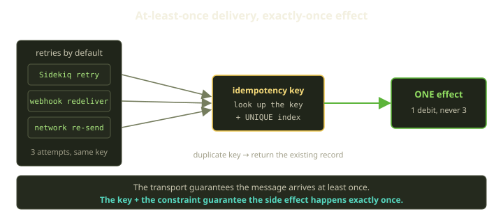
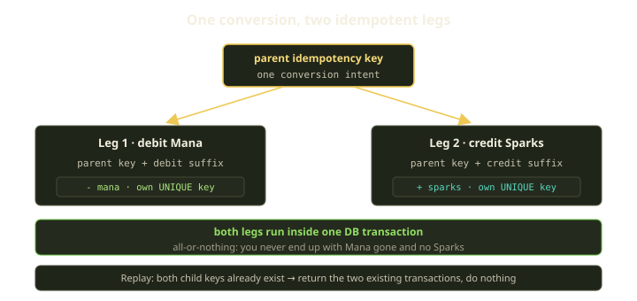
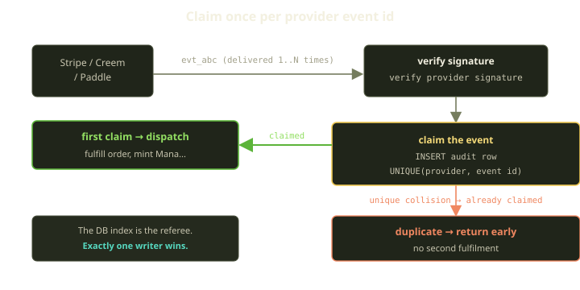

There's a moment every billing engineer eventually has. A customer emails: "I was charged twice." You open the logs, and the request looks fine — one checkout, one order. Then you find the second event. Same payment, redelivered by the provider three minutes later because our `200` got lost on the wire. We processed it twice, minted the currency twice. The math was, briefly, generous to exactly the wrong person.

The lesson isn't "be more careful" — careful doesn't scale. It's that **at-least-once delivery is the only honest contract a distributed system can offer**, and once you accept that, exactly-once *effects* become something you build, on purpose, at every layer that touches money. Here's how we do it at Fibe — across wallet posts, the Mana-to-Sparks conversion, daily funding, provider webhooks, and the keys our SDK ships.

<!-- truncate -->

## Why everything retries

Count the things in Fibe's billing path that will, given enough traffic, send you the same message twice.

- **Sidekiq retries.** Background jobs that raise get retried with backoff. Daily funding runs in a job; so does checkout fulfilment. A transient lock contention or a Redis blip, and the job runs again.
- **Webhook redelivery.** Stripe, Creem, and Paddle all redeliver if they don't see a timely `2xx`. A redeploy that drops a connection mid-response will earn you a duplicate — the provider doing its job correctly.
- **Network retries.** Our Go SDK retries `429`, `5xx`, and transport errors automatically. A `POST` that times out is genuinely ambiguous — did the server commit before the socket died, or not? — and the only safe move is to send it again.

None of these are bugs — they're *reliability features* working as intended. The cost of "the message always arrives" is "the message sometimes arrives twice," so the question is never "how do I stop duplicates?" — it's "how do I make the second, third, and fourth copy do nothing?"



The shape of the answer is always the same: an **idempotency key** carried with the request (the intent), plus a **unique constraint** in the database (the referee) that makes the duplicate physically impossible to commit. Application code alone isn't enough — two concurrent retries can both look up "have I seen this key?", both get "no," and both reach the insert. Only the database can adjudicate a true race, so we back every key with a real `UNIQUE` index and treat the resulting collision as a signal, not a failure. Every layer below is a variation on this idea.

## Layer 1: every wallet post is idempotent

The wallet is where it matters most, so it's where we're strictest. Mana and Sparks balances move through exactly one primitive — a single post operation, with credit and debit as thin wrappers over it — and every call carries an idempotency key. Before touching a balance, the post operation looks for a wallet transaction that already used this key. If one exists, it returns that record and stops. If not, it opens a single database transaction, takes a pessimistic row lock on the wallet, computes the new balance, refuses to go negative, writes the new balance, and records both a wallet transaction and its mirroring double-entry ledger row before committing.

Three things do the work here:

**The early return.** A repeated key returns the *existing* transaction — same record, same id — and never debits again. The caller can't tell the retry apart from the original succeeding.

**The unique constraint.** Every wallet transaction enforces uniqueness on its idempotency key, with a matching index underneath. The pre-check handles the common case; the constraint handles the nasty one — two retries racing in parallel, both finding nothing on the lookup, both reaching the insert. One commits; the other hits a uniqueness violation. We don't treat that violation as an error: we catch it, look the key up again — the winning row is there now — and hand that row back as the result. The duplicate's failure to insert is exactly how we know the original already won.

**The pessimistic lock.** Locking the wallet row serializes concurrent posts to the *same* wallet, so balances never interleave. That's concurrency, not retries — but it lives in the same operation because money needs both.

One more invariant: a post can **never drive a balance negative**; if it would, we raise an insufficient-balance error and roll back. Combined with the double-entry ledger (every transaction mirrored by one ledger entry recording the balance after the move), the wallet is auditable down to the cent — and that audit trail is immune to retries.

:::tip
The rescue clause isn't error handling — it's the *success path for a concurrent retry*.
:::

## Layer 2: the conversion is two idempotent legs

Sparks aren't minted directly. You buy Mana (the tutorial / top-up currency), and standard runtime is funded by converting Mana into Sparks — one-way, with no reverse path. That conversion is *two* wallet movements that have to behave as one: debit Mana, credit Sparks. Instead of one key, we derive **two child keys** from one parent and make each leg independently idempotent. Conceptually, the conversion takes the parent key the caller supplied and suffixes it twice — one suffix for the Mana debit, one for the Sparks credit — so each leg gets its own distinct idempotency key while still tracing back to a single conversion. Both legs then run inside one database transaction.



Why two keys instead of one? Each leg is a *different* wallet post with a *different* uniqueness identity, and we want each individually replay-safe. Wrapping both in one database transaction gives atomicity — if the second leg fails, the whole thing rolls back, so you never get Mana debited with no Sparks credited. The early return handles the clean replay: if both child transactions already exist, we hand back the existing pair without moving anything. Either way the conversion happens exactly once, and the books always balance.

## Layer 3: daily funding keys on the day

A Marquee (a Player's Docker host) is funded daily out of the wallet. Without funding, nothing runs — that's the not-funded gate that answers with a `402` (payment required). A recurring enforcer sweeps the Marquees that should be running, takes a row lock, and funds the day: it debits the day's amount and extends the paid-through time to the end of the service-day. Scheduled jobs love to overlap — a slow run, a re-trigger, a retry after a deploy — so the funding debit is keyed on the Marquee *and the day*. The key reads, in plain terms, as "this Marquee, this calendar day, funding" — a single string that combines the Marquee's identity with the service-day.

That one key makes "fund this Marquee for today" safe to call as many times as you like. The first call debits and extends the paid-through time; every subsequent call for the same Marquee-and-day finds the existing transaction and returns it. We also short-circuit with a cheap "already paid for today?" check before doing the post, as a fast path, but the key is the real guarantee. It's the wallet-post primitive again, with a key shaped to express the business invariant: **one funding debit per Marquee per service-day, no matter how many times the enforcer fires.**

## Layer 4: webhooks claimed once per provider event

Wallet posts and funding are *our* code calling *our* code, so we pick the keys. Webhooks are the opposite: the key comes from someone else who is contractually obligated to send it more than once. Every provider stamps each event with a stable id (`evt_...` on Stripe, equivalents on Creem and Paddle); we treat that id as the idempotency key and **claim** it exactly once before doing any work. The handler first verifies the provider's signature, then attempts the claim; only if the claim succeeds does it dispatch the event into fulfilment.



The claim is a single insert: an audit row keyed on the pair `(provider, event id)`, backed by a unique index. The insert succeeds the first time we've seen the event, and the claim returns a "you won" signal — go fulfil. The insert collides the second time, the claim returns "already claimed," and the handler returns early. Internally the claim simply tries to write the row and interprets a uniqueness violation as the "already claimed" answer rather than as an error.

Notice there's no pre-check lookup here — for webhooks we lean entirely on the constraint, because the whole point is the race: two redeliveries on two app servers at the same millisecond, where only the insert itself has no window between "check" and "write." One writer wins, the rest get "already claimed." Claiming the event and recording that we claimed it are the same atomic operation — which doubles as the audit trail you want when a customer asks what happened to their payment.

Downstream, fulfilment has its *own* idempotency: we snapshot pricing on the order, lock the order row, validate the paid amount against the snapshot, and the minting goes through the same idempotent wallet post — keyed on its own key. So even if a duplicate slipped past the claim, the wallet post behind it wouldn't double-credit. The webhook claim is the front door; the wallet key is the vault.

## Layer 5: the SDK ships the keys

All of this is invisible to a customer using our Go SDK — until their network hiccups. Mutating operations (create a Playground, restart, sync, fund) return `202 Accepted` with a `request_id` to poll, and any can time out mid-flight, so the SDK generates a client-side key and attaches it to the request context:

```go
key := fibe.NewIdempotencyKey()           // 16 random bytes, hex
ctx := fibe.WithIdempotencyKey(ctx, key)
pg, err := client.Playgrounds.Create(ctx, params)   // safe to retry
```

The server caches the response for that key for 24 hours and replays it on a duplicate, flagging it with an `X-Idempotent-Replayed: true` header (surfaced on the SDK's `APIError` as `IdempotentReplayed`). So when the SDK's retry logic fires — on a `429`, a `5xx`, or an ambiguous timeout — the second attempt carries the *same* key, the server recognizes it, and the customer sees one Playground, one charge, one truth.

| Layer | What carries the key | What enforces "once" |
|---|---|---|
| Wallet post | caller-supplied idempotency key | pre-check lookup + a `UNIQUE` index on wallet transactions |
| Mana &#8594; Sparks | two derived child keys in one DB transaction | per-leg uniqueness + atomic transaction |
| Daily funding | a "Marquee + day + funding" key | wallet post's own constraint |
| Provider webhook | provider's event id | a `UNIQUE` index on (provider, event id) in the audit log |
| SDK mutations | client-generated 16-byte key | server-side 24h replay cache |

## What we learned

The pattern under every layer is the same: **treat the duplicate as the happy path, not the error.** The database — not application code — is the only honest arbiter of a race, and the best keys read like a sentence: a key that spells out "this Marquee, this day, this funding run" *is* its own documentation.

We retry everywhere because dropping a payment is worse than processing it twice. So we built the rest of the system to make processing it twice a non-event. In a platform that retries by default, doing a thing exactly once isn't a property you inherit. It's a feature — and we shipped it everywhere money moves.
