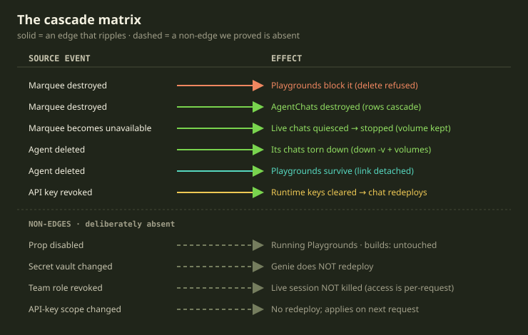
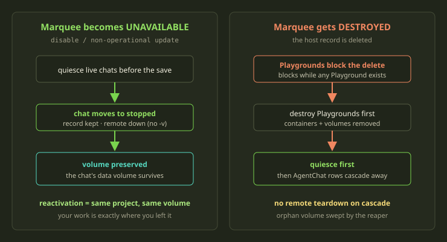
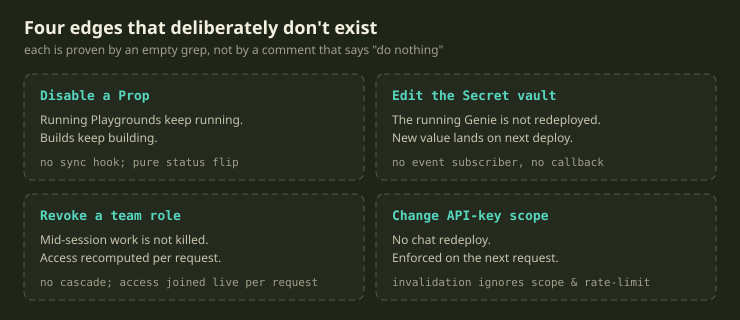

Most of the time, the dangerous question in a distributed system isn't "what does this delete cascade to?" It's "what does it *not* cascade to — and are you sure?"

We spend a lot of energy reasoning about the edges that *do* fire: delete a Marquee, and a chain of consequences unfolds. But the bugs that wake you at 3am are usually the opposite shape. Someone toggles an innocuous setting — disables a Prop, edits a Secret, demotes a teammate — and a long-running environment they didn't mean to touch quietly falls over. The edge that surprised them is one nobody designed; it emerged because some well-meaning "keep things in sync on every save" hook reached one relationship too far.

<!-- truncate -->

This post covers both directions: the cascades we *do* fire, then the more interesting half — the edges we deliberately left out, and how you prove a non-edge exists when there's no line of code to point at.

First, a refresher on the nouns, since the whole story lives in their relationships. A **Player** owns a **Marquee** (a Docker host). On it we deploy **Playgrounds** (long-lived dev environments), **Tricks** (one-shot headless jobs), and **AgentChats** — the sidecars our Genie coding agents run in. Source comes from **Props** (a Git binding). The Marquee sits at the root of most of this; when it goes away, a lot has to decide what to do.

## The shape of a cascade

Deleting things deletes other things. Every parent-child relationship carries an opinion about what should happen to the child when the parent goes away, and the design work is choosing *which* opinion, because each one encodes a different belief about what your data means. There are really only three on offer. A relationship can **cascade** — when the parent dies, the child is destroyed with it. It can **detach** — the child survives, but its pointer back to the parent is cleared. Or it can **block** — the parent simply refuses to be deleted while a child still exists. You can read the Marquee's philosophy off which one it picks for each of the things hanging beneath it.

Three verbs, every one deliberate:

- **Playgrounds block the delete.** You cannot destroy a Marquee while a Playground lives on it; the delete is refused with an error. Losing a running dev environment because a parent got cleaned up is the surprise we refuse to build. Want the Marquee gone? Deal with the Playgrounds first.
- **AgentChats cascade away.** A sidecar tied to a specific host has no meaning without it, so the row goes.
- **Billing orders survive, detached.** The financial record is kept and only its link back to the host is cleared — you don't get to erase the ledger by deleting infrastructure. Money outlives machines.

The same reading works across the graph. A deleted **Agent** takes its AgentChats with it but only *detaches* its link to any Playgrounds — the Playground outlives the agent that spawned it. A **Playspec** refuses to delete while a Playground still holds a lock on it. The choice is never a default; it's a sentence about what the record *is*. Infrastructure can be rebuilt, so it cascades; history and money are facts, so they're preserved; anything holding live user work blocks the delete.

## "Unavailable" is not "destroyed"

The single most important distinction here is between a Marquee *becoming unavailable* and one *being destroyed*. They feel adjacent, but conflating them is how you lose someone's work.

A Marquee can go unavailable for mundane reasons: it's disabled, the VM hiccups, a non-operational state transition lands. None of that means the Player wants their environments gone — just that the host is, for now, unreachable. So when a Marquee is about to slip into an unavailable state, we quiesce the live AgentChats before that transition is allowed to save.

"Quiesce" is precise. Each live chat moves to a stopped state, with the time it stopped and a human-readable reason recorded that says exactly why. But the **row stays**, and so does the chat's Docker volume — the per-chat data volume that holds its working tree. If the Marquee was operational and funded, we attempt a graceful remote shutdown — `docker compose down`, *without* the `-v` flag that would also wipe volumes; otherwise we just flip local state. When the Marquee comes back, Playguard (our reconciler, every 60 seconds) re-deploys the chat against the *same* Compose project and the *same* volume — the Player's work is exactly where they left it.

Destroying a Marquee is the other path. Before any row is removed, the chats are quiesced first; only then do the AgentChat rows cascade away with the host. The reason recorded is the blunt "the Marquee was deleted." The subtlety worth internalizing: the cascade-destroy fires **no remote teardown** — there is deliberately no Docker call wired into the moment an AgentChat row is destroyed. The containers and volume are simply orphaned, and that's fine: every five minutes a reaper sweeps orphaned Genie projects — Compose projects on the host with no backing database row — and runs `docker compose ... down -v --remove-orphans` on them. We don't attempt synchronous cleanup inside the destroy transaction — the host might be the very thing that just went away.

:::tip
The mental model that's served us well: **disable preserves, destroy removes, and neither trusts the remote host to be reachable at the moment of the state change.** Reachability is something a reconciler discovers, not something a callback assumes.
:::

One guard makes that mental model concrete. Before quiescing, we ask a simple question: is any of these chats *still practically reachable* — still answering its health check right now? If so, we **skip** the quiesce for it. Status is a model of reality, and models drift; when the database says a host is going unavailable but the container is happily serving its health endpoint, the live signal wins and the reconciler fixes the bookkeeping next pass.

The same adaptiveness governs deleting an Agent: it's marked as deleting, stays in the database, and a background job tears its chats down — a full teardown that removes containers *and* volumes *if the Marquee is funded*, falling back to a local-only stop if not. That funding check — every runtime operation is gated behind a 402 payment-required response when the Marquee isn't funded — is itself a cascade boundary, deciding whether teardown talks to the host or just updates rows.

## The edges that don't exist

Now the part we actually wanted to write about. Cascades are easy to reason about because they're *visible*: a line of code, a declared relationship, a callback. Non-edges are harder — the design decision is the *absence* of code, and absence rots. A non-edge is enforced only by nobody having added the callback that would make it do something. Six months later a well-intentioned change adds a "keep things in sync on every save" hook, the non-edge silently becomes an edge, and nobody notices until a Player's environment dies from a change they thought was cosmetic. So we treat our most important ones as first-class design facts:

### Disabling a Prop does not touch running Playgrounds

A **Prop** is the Git binding a Playground was built from. Disabling it is a pure status flip — nothing reaches out into running environments on the way through, and the webhook and CI triggers that *do* fire match on the binding and branch without ever consulting the disabled flag. "I don't want new builds from this binding" and "kill everything currently running from it" are *different intentions*; a settings toggle expresses only the first. To stop the current run, you stop the Playground.

### Editing the Secret vault does not redeploy your Genie

This one trips people up the most. You update a value and might reasonably expect every running Genie to pick it up immediately — but a Secret change does exactly two things: it fires a webhook and it writes an audit-log entry. It publishes nothing onto our internal event bus, and it touches no running chat. The new value lands the next time the chat deploys.

A live coding session is *stateful* — an agent mid-thought, a working tree, an open conversation — and bouncing that container over an unrelated secret edit is the kind of surprise that erases work. Secrets propagate at the natural boundary: the next deploy, where a restart is expected.

### Revoking a team role does not kill a live session

When you remove someone from a team, their in-progress work is **not** terminated. There's no cascade hanging off team membership, because access isn't *stored* as a relationship to be torn down — it's *computed live, per request*, by joining the user against what they're currently allowed to see. The teammate's next request is evaluated against the new membership and denied; the session they hold right now keeps its socket.

This is authorization-as-decision, not authorization-as-state. Model access as a persisted edge and revoking it tempts you to cascade; model it as a per-request decision and revocation is automatically gentle — it changes the *answer* to the next question without slamming doors on questions in progress. There's nothing to cascade *from*.

### Changing an API key's scope does not redeploy anything

Revoking or deleting an API key *is* an edge — it clears the agent's runtime keys and triggers a redeploy of the affected chat, because the chat is now running with a credential that has drifted out from under it. But changing a key's **scope or rate limit** is not: the check that decides whether a redeploy is needed deliberately ignores those fields. A credential becoming *invalid* — expiry, losing agent-accessibility, deletion — must propagate now; a credential's *policy* tightening can apply lazily, since it's enforced at the moment the key is used.

## How do you actually prove a non-edge?

You can't write a test that asserts *nothing* happened. So we keep a non-edge from rotting into an edge by grounding it in **searchable absence** — the evidence isn't a comment, it's a search of the codebase that comes back empty. "A Secret change does not redeploy a Genie" is backed by there being no event-bus subscriber on Secrets, no callback from a Secret into a running chat, nothing anywhere that publishes a redeploy off a Secret edit — and by the search that finds none of those things. That makes a fragile intention *re-verifiable mechanically* — the closest thing we've found to a regression test for the absence of behavior. Run the query, and if it ever returns a hit, a non-edge has become an edge that someone needs to defend on purpose.

## What we learned

The choice you make on a relationship is a sentence about the data: *block* says "this holds live work," *detach* says "this fact outlives its parent," *cascade* says "this has no meaning alone." If you can't say the sentence out loud, you've picked the wrong one. And disable and destroy must be different code paths, not one path with a flag — the moment they share logic, someone's volume gets `-v`'d on a disable.

Cascades you'll find by reading the model. The non-edges you'll only find by asking, for every setting, "what running thing *could* this reach — and should it?" Most of the time the answer is "nothing" — and writing that answer down, mechanically checkable, is most of the reliability work.
