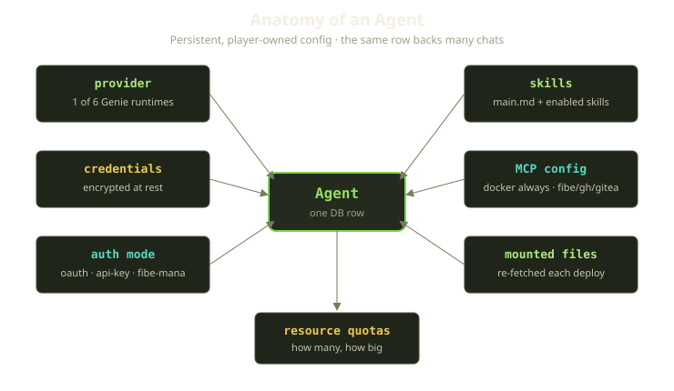
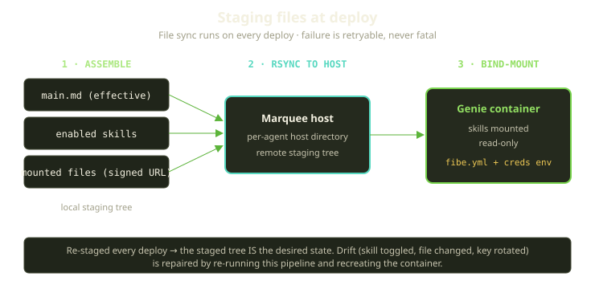
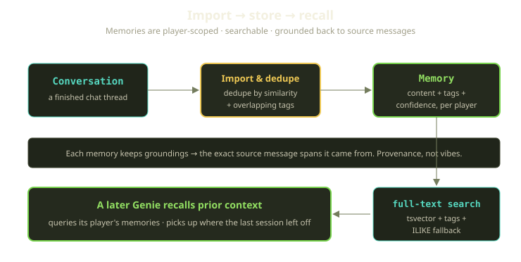

A coding agent out of the box is generic. Claude Code, Codex, Cursor, Gemini — they all boot up knowing nothing about you, your repos, your conventions, or yesterday's conversation. On Fibe we call the running instance a Genie, and the platform's whole job is to make that generic Genie *yours* before a single token is generated.

"Yours" isn't one thing: a provider choice, credentials we have to protect, skill files, files you dragged in, and — the part people underestimate — memory of what happened last time. None of that lives in the container; it lives in an **Agent**, a small, boring, persistent config record the Genie reads from. This post walks through that record, down to how it reaches the container.

<!-- truncate -->

## An Agent is config, not a process

The running thing is an AgentChat — one Docker Compose project on a Marquee, routed by Traefik, healed by Playguard. The Agent is the long-lived config describing *how* to bring that chat up, and one authenticated Agent backs many chats. Stop a chat, purge its volume, restart it tomorrow on a different Marquee — the Agent stays put, and that's where the config lives:

- **Provider** — one of six Genie runtimes: Gemini, Antigravity, Claude Code, OpenAI Codex, Cursor, and opencode. It decides the container image, where credentials live inside it (each runtime expects its own home-directory config folder, like `~/.claude`), and how the credential environment is built.
- **Credentials** — the secret material. Encrypted at rest, always.
- **Auth mode** — how those credentials were obtained: OAuth, a provider API key, or Mana, our gateway that fronts the model for you. Not every provider supports every mode: Cursor and Antigravity can't use Mana.
- **Skills** — the markdown that teaches the Genie how to behave on Fibe: the primary `main.md` plus whichever shared skills you've enabled.
- **MCP config** — which Model Context Protocol servers the Genie can talk to. Docker is always wired up; Fibe, GitHub, and Gitea are conditional.
- **Mounted files** — arbitrary files you want present.
- **Resource quotas** — how many agents you can have, through the shared quota mechanism used everywhere.

The Agent also carries its own lifecycle: pending, then authenticated once credentials are in hand, then drifting to expired, revoked (which wipes the credentials), or deleting. A chat refuses to start unless its Agent is authenticated and usable — a guard on every start and redeploy, so a Genie never comes up holding stale or revoked auth.

## Credentials: encrypted, and that's not optional

The part we'd defend in code review with our whole chest is credential handling. An Agent holds an OAuth token, a provider API key, or a Mana gateway token — any of which can spend real money on your behalf — so the sensitive fields are encrypted at rest, never plaintext, wrapped in a fallback layer so a key rotation never strands older records. Revoking an Agent nulls out the credential fields in the same write that flips the status: the secret is gone, not merely ignored. A few things follow from that:

- **API keys can come from a vault.** An Agent can link to a separate, reusable API key record and resolve the token at deploy time rather than storing its own copy, so you rotate in one place.
- **The Mana gateway never exposes a raw key to the container.** For Claude Code under Mana, we hand the runtime a base-URL pointing at our gateway and a token scoped to it — the container talks to us, we talk to the provider, and the real key never leaves our side.
- **Rotating a key is a deploy event.** Change the linked key and the platform notices the drift and queues a redeploy, because the credential environment is baked into the container at boot.

:::warning
Credentials are the one place we don't do clever. No "temporary plaintext for debugging," no logging the token "just this once" — the moment you make an exception is the moment it lands in a log aggregator.
:::

## Skills are seeded markdown, fetched by slug

A skill is a platform-managed markdown record — slug, content, an enable flag, an order position. Skills are seeded from files in the repository, each with a small YAML header, then live in the database, fetchable by slug at runtime.

Two slugs are special: the primary skill and the system skill are baked in and aren't user-toggleable; everything else flips on or off per agent. The Cursor runtime skill is the odd one out — it ships with Cursor's own `.mdc` rules extension, because that's what its rules engine wants. The enabled, ordered list is memoized and invalidated whenever a skill changes, so toggling propagates quickly.

One safety detail: you can't delete a skill that's still referenced by someone's toggles. Before a delete goes through, the platform scans global settings, player defaults, and per-agent settings for that filename, and aborts if it finds any. Slugs are immutable, too — both rules exist because a skill filename is effectively an API, and you don't yank one out from under live config.

:::tip
When authoring a skill, think of `main.md` as the system prompt and each enabled skill as a focused supplement. The Genie reads them as plain files — no magic injection, no hidden prompt assembly. What you stage is what it sees.
:::

## Deploy time: staging files onto the host

When a chat deploys, the file-sync step runs — every time, not just the first — assembling a local staging directory, rsyncing it to the Marquee host, and bind-mounting it read-only into the workspace.

The staging step is deliberately mechanical. It writes the agent's *effective* `main.md` — the platform default, the default with your additions appended, or a full override — then every enabled skill as its own file, with player-authored skills in a separate subdirectory.

Mounted files are handled differently. Rather than copied from platform storage, each one is **re-downloaded on every deploy** from a short-lived signed URL, straight onto the host — a plain HTTP GET with conservative guardrails: it fails fast on errors, retries a few times, and caps both the connect time (ten seconds) and the total transfer (two minutes) so a slow blob can't wedge a deploy. Re-downloading guarantees the host always matches storage. The signed URL expires in fifteen minutes, short enough that a leaked one is worthless, and files default to read-only unless you marked them writable.

**The staged tree is the desired state.** We don't diff and patch the host; when something drifts — a skill toggled off, a file edited, a credential rotated — the repair is the same pipeline: re-stage from the source of truth, force-recreate, re-attach to Traefik. The recovery path is never the untested path, and a sync failure is *retryable*, not a hard error.

## Memory: recalling yesterday's conversation

Skills and files configure *behavior*. Memory configures *context* — what the Genie knows happened before, what makes a Fibe agent feel less like a fresh shell every morning. It's possible because conversations **persist**: the runtime streams over WebSockets but keeps each thread durable, so the chatter isn't ephemeral scrollback — it's a record.

A Memory is a player-scoped record extracted from an imported conversation: content, normalized tags, a confidence score, a provider, and — importantly — it's **grounded**, keeping pointers back to the exact message spans it came from, not a free-floating assertion the model hallucinated.

The import path is careful not to drown you in duplicates. It checks for a memory with the same key, then for near-duplicates using Postgres trigram similarity — requiring both a content-similarity threshold *and* overlapping tags before it updates the existing memory instead of adding one.

Recall is plain, fast search: a Postgres full-text query over the content, plus two fallbacks — a case-insensitive substring match on the body, and an overlap check against the tag array. All three run in one query, so a hit lands whether the words are in the text or only the tags, in a single cheap round-trip.

The most important property is scope. Every memory belongs to exactly one player, and the platform *validates* that the conversation and any attributed agent belong to that same player — a memory can be tied to an agent, but a cross-player one is unsaveable. A Genie recalls *your* prior conversations, never anyone else's.

## What makes a Genie "yours"

A generic coding agent becomes *ours* through layers of config, each protected at the boundary that matters:

| Layer | What it personalizes | Where it lives | Boundary |
|---|---|---|---|
| Provider + auth mode | Which model, how you pay | Agent config | usable-on-start guard |
| Credentials | Spending on your behalf | Agent config | encrypted at rest, wiped on revoke |
| Skills | How the Genie behaves on Fibe | Skill records, staged as files | system slugs locked, slugs immutable |
| Mounted files | Your files in the workspace | Re-downloaded each deploy | signed 15-min URLs, read-only default |
| MCP config | What tools it can reach | Agent config | docker always, rest conditional |
| Memory | What it remembers | Player-scoped Memory records | per-player validations, grounded |

None of these is exotic — the interesting engineering is the discipline: *one* staging path that runs every time, *one* place credentials are encrypted, *one* validation that pins memory to a player. That discipline is what makes a generic Genie remember your conventions, hold your keys safely, and pick up where yesterday left off — without ever once seeing into someone else's.
