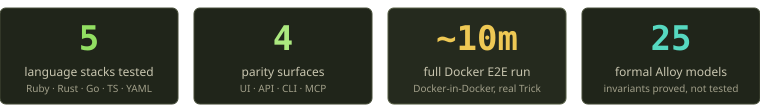
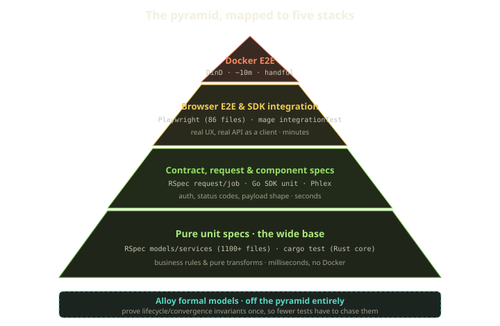
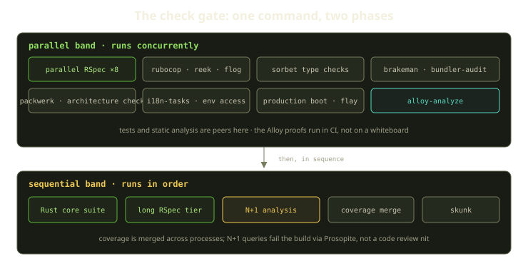
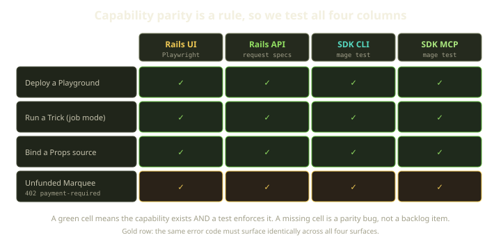
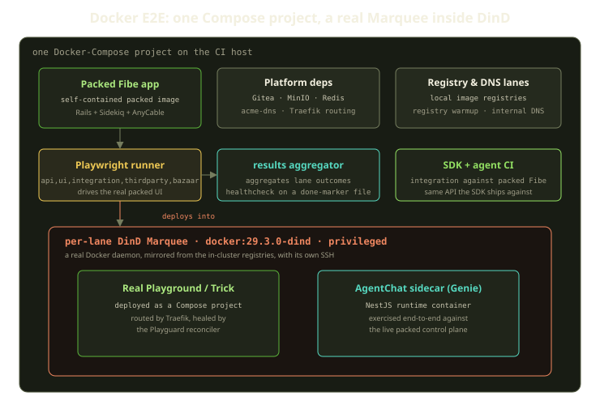
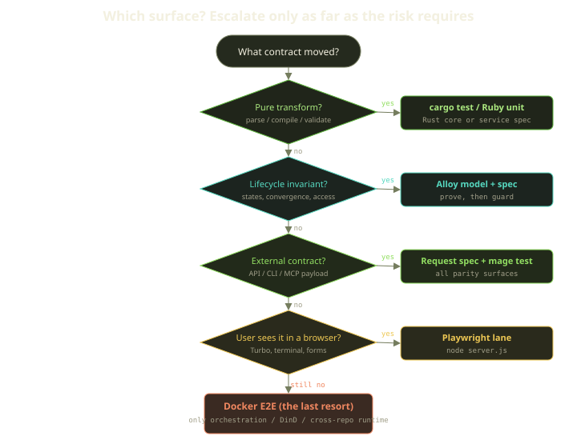

Most products are software that runs on infrastructure. Fibe's product *is* infrastructure: a Player funds a Marquee (a Docker host), and on it we deploy Playgrounds, Tricks, and AI agent sidecars as Docker-Compose projects, route them through Traefik with real wildcard TLS, and continuously heal them with a reconciler. When the thing you ship is "a Docker daemon does what the database said it should," your test pyramid has a problem the textbook diagram never warns you about: the genuinely end-to-end test needs a genuine Docker daemon, and that is slow, heavy, and flaky in all the classic ways.

So we test in five languages, with surfaces that range from sub-millisecond Rust unit tests to a ten-minute Docker-in-Docker run that spins up a real Playground. The interesting part isn't the list. It's the rule we use to decide which surface a given change actually deserves, and how a pile of formal models lets us not write some tests at all.

<!-- truncate -->

## Why a platform breaks the pyramid

The classic testing pyramid says: lots of fast unit tests at the bottom, fewer integration tests in the middle, a handful of slow end-to-end tests at the top. It's good advice. It also quietly assumes that the top of the pyramid is *expensive but not exotic* — spin up the app, click some buttons, tear it down.

For us the top of the pyramid is exotic. A true end-to-end test of "deploy a Playground" has to:

- start a real Rails control plane with Sidekiq, Redis, and AnyCable,
- give it a real Git source (Gitea or GitHub),
- hand it a real Docker host to deploy onto,
- let Traefik actually route the new environment,
- and let the Playguard reconciler actually observe and heal it.

You cannot fake any of those and still claim the test proved the product. The control plane talks to Docker; if Docker is a mock, the test is theatre. That single constraint shapes everything below it. The more behavior we can pull *down* into fast, Docker-free tests, the fewer times we have to pay for the heavy run at the top.

Here's the map. Five surfaces, in roughly the order we reach for them.

| Surface | Tool | What it proves | Typical cost |
|---|---|---|---|
| Rails unit/service/model | RSpec | Business rules, persistence, auth at the boundary | milliseconds–seconds |
| Rust core | `cargo test` | Pure transforms: Compose parsing, label validation, template compilation | milliseconds |
| Rails request/job | RSpec request specs | API status codes, payload shape, idempotency, async jobs | seconds |
| Go SDK + MCP | `mage test` / `mage integrationTest` | The CLI and MCP server as external clients | seconds–minutes |
| Browser | Playwright | Real Turbo/UI behavior a user can see | minutes |
| Full platform | Docker E2E "Trick" harness | Orchestration, DinD, cross-repo runtime | up to ~10 minutes |

And one thing that isn't on the pyramid at all, because it isn't a test: **Alloy formal models**. More on those at the end — they're the reason several rows above are smaller than they'd otherwise have to be.

## The base: most logic never touches Docker

The single most important decision we made was deciding what is *not* infrastructure.

A surprising amount of what looks like Docker logic is actually pure computation. "Given this Template, produce this Compose file." "Given this Compose file, is this label valid?" "Given this env block, normalize it." None of that needs a daemon. None of it needs Rails. It's a pure function from input to output, and pure functions are the cheapest, most deterministic thing on earth to test.

That's exactly why those pieces live in our Rust core. It's a command dispatcher — every computation registers under a stable dotted name with JSON in and JSON out, and there are 77 of them today. The Rails app calls them across a subprocess boundary, and — this matters for testing — our specs are forbidden from stubbing that boundary. The test harness is configured so the subprocess path is always live: a Ruby spec that exercises Compose generation runs the real Rust code, not a Ruby fake of it. The contract is tested once, for real, on both sides of the FFI line.

So a parser bug gets caught by `cargo test` in milliseconds, or by a Ruby service spec a moment later. It does *not* get caught three layers up by a browser test wondering why the environment won't boot. That's the whole game: catch each class of bug at the cheapest layer that can see it.

:::tip
The fastest test you can write is the one for a function that doesn't know infrastructure exists. Before you reach for a heavier harness, ask whether the thing you're testing is secretly a pure transform wearing an infrastructure costume.
:::

The base is wide. There are over 1,100 RSpec spec files in the Rails app and 50-odd Rust source files carrying tests. The vast majority of our coverage lives here, runs without a single container, and finishes fast enough to run on every change.

## One command to run the base

A nice property of keeping most logic Docker-free is that "run the tests" can be a single command that also runs *everything else that gates a change*. In the Rails app that's one check gate, and it's worth describing because it reframes what "testing" means here.

It runs in two phases. First a parallel band where the test run is just one peer among many: RSpec across eight processors runs *alongside* RuboCop, Reek, Brakeman, bundler-audit, Sorbet type checks, Packwerk boundary enforcement, i18n-tasks, an architecture boundary check, a production-boot check, and — when the toolchain is present — the Alloy model checker. Then a sequential band runs the slower, order-sensitive steps in order: the Rust core suite, the long RSpec tier, N+1 analysis, coverage merge across the parallel processes, and a code-quality score.

Two things in there are easy to skim past and shouldn't be.

The first is the Alloy model checker sitting in the *parallel test band*. Our formal models aren't a design-time artifact someone drew once and forgot — the model checker runs in CI next to RSpec. A change that breaks a proven invariant fails the same gate that a broken unit test would. That's what makes the proofs trustworthy: they can't quietly drift from the code, because the code's gate re-checks them.

The second is the N+1 analysis. N+1 query regressions are a performance bug that normally slips through every functional test — the page renders, the spec passes, and you ship a hundred extra queries. We make them a *test failure* instead. Specs run with Prosopite watching, configured to raise: if a spec triggers an N+1 during a run, the build goes red on the spot. There is a single, narrow escape hatch — a helper that pauses the check around a block — for the rare case where the extra queries are genuinely intended. Reaching for it is a deliberate, reviewable statement, not a silent default, and it has to be wrapped explicitly around exactly the code that needs it. Performance becomes something the gate enforces, not something a reviewer has to remember to eyeball.

## The middle: contracts, and the parity rule

One step up from "is this value correct" is "does this boundary behave." For a platform with multiple clients, that boundary question has a multiplier on it that most apps don't have.

Fibe exposes the same capabilities four ways: the Rails web UI, the Rails JSON API, the SDK's CLI commands, and the SDK's MCP tools (the surface AI agents drive). Our engineering rules make capability parity across those four a *default requirement*, not a nice-to-have. If you can deploy a Playground from the UI, you can deploy one from the CLI and the MCP and the API, and the error you get when you can't is the same error everywhere.

That rule is only real if tests enforce it. So a new capability isn't "done" until each column is both reachable and covered.

The error model is where parity earns its keep. The SDK ships a set of stable, typed error codes — a not-funded condition, rate limiting, validation failure, a conflict, a locked resource, a quota overrun, and more — and the contract is that the same condition produces the same code regardless of which door you came through. Try to deploy onto a Marquee that hasn't been funded and you get a `402` payment-required response carrying that stable not-funded code, whether you're clicking a button, calling the API, or asking an agent. That's a row in the parity matrix, and it's tested as one.

The SDK side carries a genuinely meaty reliability layer that we test as pure Go before any of it touches a network:

- **Retry classification.** Retryable means the `429, 500, 502, 503, 504` family; everything else is fatal. Transport errors retry too, *except* context cancellation, deadlines, and net timeouts. Backoff honors a `Retry-After` header when present, otherwise it's exponential — doubling per attempt up to a cap — times random jitter.
- **Idempotency.** Mutations carry a standard `Idempotency-Key` header (sixteen random bytes, hex). The server caches the response for 24 hours and replays it on duplicates, flagged with a replay marker, so a retried "deploy" doesn't deploy twice.
- **Async polling.** A long operation returns `202` with a request handle; the client polls (one-second interval, five-minute timeout by default) until it reaches a terminal status — queued, running, success, or error.
- **Circuit breaker.** Five failures opens it; it stays open for 30 seconds, then allows two half-open probes; two clean probes close it, any half-open failure re-opens it.

Every one of those is a fast Go test. No Fibe server required — the whole point is that the *client's* behavior under failure is deterministic and provable on its own. We can feed the retry classifier a fabricated `503` and assert it backs off; feed it a context deadline and assert it gives up; feed it two identical idempotency keys and assert the second call is a replay. None of that needs a network, let alone a Docker daemon.

Failure has structure here too, which is itself a tested contract. A failed async operation surfaces as a typed error with a stable default code for a remote request that didn't go through, and a Playground that lands in a terminal failure surfaces a dedicated typed error carrying rich detail — the reason it stopped, which step failed, failure diagnostics, the build statuses. That richness exists so the *client* can react intelligently, and so our tests can assert on a specific failure shape rather than "it errored, somehow."

When we need the real server in the loop (genuine `202` flows, real schema dispatch), that's `mage integrationTest`, which runs against a live API with a 600-second budget and eight-way parallelism. The day-to-day `mage test` runs the short suite under a 30-second timeout. Two gears, used deliberately — and a third, `mage ChatE2E`, for the provider-chat runtime matrix that needs a half-hour budget and runs strictly serially because it's exercising real agent runs.

:::note
MCP parity doesn't mean identical names. The rule is *striped capabilities that match existing MCP patterns* — the MCP tool for an action may not be named like the CLI command or the API route. What has to match is the capability and its behavior, not the spelling. So our parity tests assert outcomes, not endpoint strings.
:::

## The browser: where the UX actually lives

Some behavior only exists in the browser. Turbo morphs, live SSH terminals over WebSockets, forms that mustn't lose your input when a stream update lands — none of that is visible from a request spec, because the bug is in how the page reacts, not in what the server returned.

That's the Playwright tier. We run it through a small server (`node server.js`) that drives suites in named lanes — `api`, `ui`, `integration`, `agent`, `thirdparty`, `bazaar` — each with its own config, worker count, and bootstrap identity. There are 86 browser spec files, and they're the only place we assert things like "the protected iframe survives a same-session morph but reloads on a URL change," or "an expired live-stream session reconnects exactly once and not in a loop." Those are real regressions we've shipped and then fenced off with a browser test, because there is no lower layer that can see them.

The discipline here is restraint. The browser is the right tool for "the user observes X," and the wrong tool for "the server computed X." A surprising number of flaky browser tests are really unit tests that wandered upstairs. When a Playwright test fails, the first question isn't "how do I stabilize it" — it's "is this even the right altitude for this assertion?"

## The tip: a real Marquee, inside Docker, inside Docker

Now the exotic part.

The Docker E2E harness — we call it the Trick harness, because it deploys a real Trick — is a single Docker-Compose project that stands up the whole platform and then deploys a real environment inside it. A full run can take up to ten minutes, and it earns every second.

The pieces, from the outside in:

- **Packed Fibe.** The Rails app, built to a dedicated self-contained image with Sidekiq and AnyCable, running in a dedicated end-to-end environment. This is the real control plane, not a fixture.
- **Platform dependencies.** Gitea for managed Git, MinIO for object storage, Redis for locks and cache, acme-dns plus Traefik for real wildcard routing. The control plane talks to all of them exactly as it would in production.
- **Registry and DNS lanes.** Local image registries with a warmup step and an internal DNS service, so the inner Docker daemon can resolve names and pull images without reaching the public internet on the hot path.
- **The Playwright runner and SDK/agent CI**, both pointed at the same packed control plane — the browser and the SDK exercise the *real* running platform, not a separate copy.
- **The DinD Marquee.** This is the trick within the Trick. A privileged `docker:29.3.0-dind` container that is a genuine, separate Docker daemon with its own SSH, mirroring images from the local registries. To the Rails control plane it looks exactly like a bring-your-own-SSH Marquee — because, mechanically, it is one. Inside it we deploy a real Playground (a Compose project), let Traefik route it, and let the Playguard reconciler — which runs every 60 seconds — observe and heal it. We can run an AgentChat Genie sidecar in there too and drive it against the live control plane.

Why Docker-in-Docker instead of just using the host's daemon? Isolation and honesty. Each lane gets its own daemon, so lanes don't fight over container names, networks, or image state, and a test that leaks a container can't poison its neighbors. More importantly, a per-lane daemon *is* a per-Player Marquee in miniature — the same provisioning, the same SSH handshake, the same "deploy a Compose project onto a host I don't otherwise control." A shared host daemon would quietly skip the part of the product that's hardest to get right.

The harness reports through a results aggregator and a healthcheck that flips when a done-marker file appears. Lanes are selectable through environment variables so a focused run doesn't pay for the whole matrix.

:::warning
This tier is a scalpel, not a safety net. If you reach for the Docker E2E to *find* a bug, you've usually skipped three cheaper layers that would have found it faster. Reproduce at the lowest layer that exhibits the failure; reach for DinD only when the bug genuinely lives in orchestration, routing, the daemon, or cross-repo runtime.
:::

## The actual decision: which surface does this change deserve?

The map is the easy part. The skill is selection. We escalate, and we stop as soon as the risk is covered.

In practice it's a short series of questions about *what contract moved*:

1. **Is it a pure transform?** Parsing, compiling, validating, formatting. Test it in Rust (`cargo test`) or a Ruby service spec. Done.
2. **Is it a lifecycle invariant?** State transitions, convergence, access control. Model it in Alloy first (more below), then add a focused spec to guard the implementation.
3. **Is it an external contract?** API status, CLI behavior, MCP payload. Request spec plus `mage test` — and remember the parity rule, so all four columns move together.
4. **Can a user see it in a browser?** Turbo, terminals, forms, live updates. Playwright lane.
5. **Is the risk in orchestration itself?** Only now does the Docker E2E earn its place.

The honest version of this is a heuristic, not a flowchart you obey blindly. But it has a clear failure mode it's designed to prevent: testing too high. A request spec masquerading as a unit test is slow and over-mocked; a browser test standing in for a request spec is flaky and vague; a Docker E2E run used to catch a parser bug is a ten-minute apology. Each layer has a question it's uniquely good at answering, and using it for a different question is how suites rot.

The mirror-image failure — testing too low — is real too. A passing parser test tells you nothing about whether the environment actually boots. So the rule isn't "always go lower," it's "cover each risk exactly once, at the layer that can actually see it."

## Flake management, briefly and unsentimentally

Heavy, real, networked tests flake. Pretending otherwise is how you end up with a `retries: 5` that hides a real bug. Our posture:

- **Default to zero retries, opt in per suite.** Playwright suites default to no retries; a per-lane CI setting can override that where it's warranted. A retry is a deliberate statement that a suite has acceptable nondeterminism, not a blanket sedative.
- **Classify before you raise a timeout.** When something is slow, name the cause: a product wait bug, async job lag, an external credential or quota, a cold dependency, or genuinely slow behavior. Each has a different fix. Bumping the timeout fixes exactly one of them and masks the other four.
- **Assert on events, not sleeps.** Wait for a readiness signal or a state change, not a wall-clock guess. The Docker harness leans on healthchecks and a done-marker file precisely so lanes wait on facts, not vibes.
- **Determinism in fixtures.** Fixed values for anything you assert on; sequences for uniqueness; randomized data only for shape you don't check. Specs run in random order with a per-example statement timeout, so order-dependence surfaces fast.

The reconciler that makes the product self-heal is also, conveniently, the thing that makes the Docker E2E *less* flaky than you'd expect: a Playground that hiccups during a run often gets repaired before the assertion lands, the same way it would for a real Player. We test the healing, and the healing helps the test.

## The cheat code: prove it, don't test it

Here's the part we find genuinely fun. Some of the hardest behavior to test — lifecycle state machines, convergence, access control — we mostly *don't* test by example. We prove it.

We keep 25 formal models in Alloy. They describe the control plane as finite-state contracts: what states a Playground can be in, which transitions are legal, what "converged" means, and — critically — which failures are temporary (and must be retried) versus irrecoverable (and must not be). The convergence model spells out exactly that: a launch candidate is converged only when it's running, or when it's in a failure the platform can classify as irrecoverable without waiting on infrastructure. Temporary Sidekiq hiccups, network blips, a momentarily unavailable Marquee or Docker daemon — those are recoverable and get retried. A fatal Compose-up or an irrecoverable spec failure are not.

An Alloy model checks every reachable state up to a bound, including the weird interleavings a hand-written test would never think to try. So instead of writing a hundred example tests hoping one of them stumbles into the bad interleaving, we ask the model checker to prove no bad interleaving exists. When it finds a counterexample, that's a design bug caught before a single line of Rails was written.

One detail we love: some predicates in the convergence model are deliberately *named for the bug they describe* — they encode Rails-observed behavior that violates the ideal contract, kept around as witnesses. The model doesn't just say "here's the correct design," it carries a memory of the ways reality drifted from it. That's documentation no test gives you.

The models don't replace tests — you still need a spec to confirm the implementation matches the proven design. But they massively shrink how many tests that takes. If the model proves the state machine has no illegal transitions, your specs only have to confirm the code wires up the legal ones, not exhaustively hunt for illegal ones that the proof already ruled out. That's why Alloy sits *off* the pyramid in our diagram: it's not a wider base, it's a different kind of confidence entirely.

## What we learned

A few things have held up across a lot of test runs:

- **Decide what isn't infrastructure, aggressively.** Every pure transform you pull into Rust or a Ruby service spec is a bug you catch in milliseconds instead of minutes. The Rust core exists partly *for testability*.
- **Parity is a test problem, not just a product problem.** Four surfaces means four columns, and a capability isn't shipped until each column is green. The error codes are the load-bearing contract; test them identically everywhere.
- **The expensive tier should feel expensive.** Docker-in-Docker, ten minutes, a real Marquee — that cost is a feature. It keeps the heavy run rare and the cheap layers honest.
- **Flake is a diagnosis, not a setting.** Classify the cause before you touch a timeout or a retry count.
- **Sometimes the best test is a proof.** Alloy lets us retire whole categories of example tests by proving the invariant once. For a state-machine-heavy platform, that's the highest-leverage testing we do.

The goal was never "test everything everywhere." It's to answer each question exactly once, at the cheapest layer that can answer it honestly — and to make the layer that genuinely needs a real Docker daemon as rare, and as trustworthy, as we possibly can.
