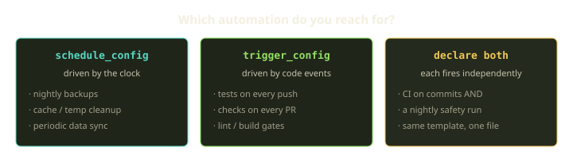
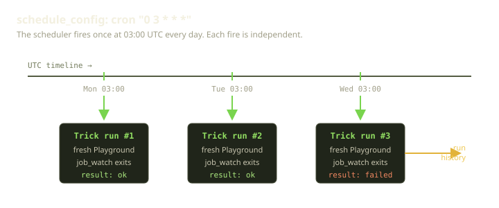
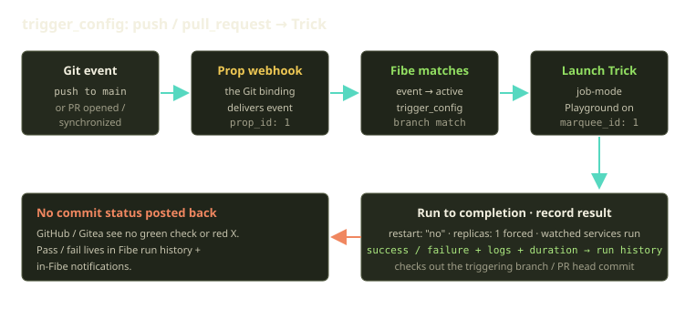

You already have a Trick — a job-mode Template that runs your tests, takes a backup, or migrates a database, then exits and records a result. So far you've been launching it by hand. The next move is to stop: have Fibe fire it at 3 a.m. every night, or fire it the instant someone pushes a commit. Both are two extra keys in the template's `metadata` block. No external cron daemon, no GitHub Actions YAML, no second CI runner that drifts away from your dev environment.

This guide is the hands-on version. We'll wire up a nightly Postgres backup on a cron schedule and a test-runner that fires on every pull request, and we'll be precise about the parts that trip people up: which branch a triggered run actually checks out, why a schedule that "should" fire at midnight runs at the wrong hour, and what Fibe does *not* tell GitHub when a run finishes.

<!-- truncate -->

## The one prerequisite: it has to be a Trick

Both scheduling and VCS triggers are features of **job-mode** templates. They're meaningless on a long-running Playground — a web server never "finishes," so there's nothing to fire-and-forget. Before either block does anything, your template needs the two things that make it a Trick:

```yaml
x-fibe.gg:
  metadata:
    job_mode: true        # 1. mark it one-shot
services:
  worker:
    image: alpine:3
    command: ["sh", "-c", "echo doing work; sleep 2"]
    labels:
      fibe.gg/job_watch: "true"   # 2. this service defines "done"
    restart: "no"
```

`job_mode: true` flips the template to one-shot. `fibe.gg/job_watch: "true"` tells the runtime which container's exit means the run is over — when every watched service has exited, the run completes, and a non-zero exit on any of them fails the run. That pass/fail is the entire reason automation is worth wiring up: a scheduled job that can't report failure is just a cron line you'll never look at again.

:::note
If you put `schedule_config` or `trigger_config` on a template **without** `job_mode: true`, nothing happens. The schema may accept it, but the runtime has nothing to launch on a cadence. This is the single most common "my schedule isn't running" cause. Set `job_mode: true` first.
:::

Everything below lives under `x-fibe.gg.metadata`. The schema accepts these keys at the root `x-fibe.gg` level too, as a compatibility mirror — but put your real config under `metadata`. That's where launch and import behavior reads from.

## Which one do you need?

Before the YAML, the decision. The two blocks answer different questions:



| | `schedule_config` | `trigger_config` |
|---|---|---|
| Fires on | a cron cadence (the clock) | a VCS event (a commit or PR) |
| Typical use | backups, cleanup, periodic sync, report generation | tests, lint, build gates on push or pull request |
| Needs a Prop? | no | yes — the Prop's webhook delivers the event |
| Knows which commit | n/a (runs against whatever the template points at) | yes — the triggering branch / PR head |
| Key fields | `enabled`, `cron`, `marquee_id` | `enabled`, `event_type`, `branch`, `prop_id` (or `repo_url`), `marquee_id` |

You can declare both on the same template; they fire independently, and we'll do that at the end. First, each on its own.

## Cron: `schedule_config`

A scheduled template is a Trick that Fibe launches on a cron schedule. At each fire the scheduler creates a fresh Playground from the template, lets the watched services run, records the result (success/failure, logs, duration), and tears it down. Every fire is a clean, independent run — no shared state carried between nights.



The block has exactly three fields you care about:

```yaml
x-fibe.gg:
  metadata:
    description: "Nightly DB backup"
    category: "Operations"
    job_mode: true
    schedule_config:
      enabled: true
      cron: "0 3 * * *"     # 03:00 daily, UTC by default
      marquee_id: 1
```

### `cron` — 5-field POSIX

It's a standard 5-field POSIX cron expression: minute, hour, day-of-month, month, day-of-week. If you've written a crontab line, you've written this.

```
min hour day-of-month month day-of-week
0   3    *            *     *           ← daily at 03:00
*/5 *    *            *     *           ← every 5 minutes
0   */2  *            *     *           ← every 2 hours
0   0    1            *     *           ← first of every month, midnight
30  6    *            *     1-5         ← 06:30 Mon-Fri
```

Two things to internalize. First, **the expression is interpreted in UTC by default.** If you're in Berlin and you write `0 0 * * *` expecting midnight local, you'll get a run at 01:00 or 02:00 depending on the season. Pick your UTC hour deliberately. (If your runtime offers a per-Marquee timezone override, that's separate config; check the current docs before relying on it.)

Second, **an invalid cron expression is rejected when the schedule is saved or imported**, with `invalid schedule format` — a good failure, at edit time rather than silently at 3 a.m. If you're doing anything clever with ranges or steps, validate it with an external cron tester first.

:::caution
Watch the relationship between cadence and job duration. A schedule like `*/1 * * * *` on a job that takes 90 seconds means each run is still going when the next one fires — Fibe will happily spawn another Playground in parallel, and now you have unbounded growth and two jobs racing on the same resource. Make the period comfortably longer than the job's worst-case duration, and if the job touches shared state (a database, an S3 prefix), make it idempotent or guard it with a lock.
:::

### `marquee_id` — required, even though the schema doesn't insist

This is the Marquee where each fired Playground runs. The schema is lenient — it won't hard-fail if you omit `marquee_id`, because the metadata object allows additional properties — but **the runtime requires it.** It has to be a Marquee you own directly, or one shared with you through an accepted team membership (team-shared Marquees schedule exactly the same way), and it has to be funded and launchable. Pass it as an integer or its string form:

```yaml
schedule_config:
  marquee_id: 1       # integer, or the string "1" (^[1-9][0-9]*$)
```

### `enabled` — the off switch that keeps the config

`enabled: false` disables the schedule without deleting it. Ship a template into the Bazaar *with* a sensible schedule baked in but set to off, and whoever launches it opts in by flipping the flag. Nobody gets a surprise 3 a.m. job they didn't ask for.

### Worked example: nightly Postgres → S3 backup

Here's the whole thing — a real backup job that dumps a database, gzips it, ships it to S3, and runs every night at 03:00 UTC. Credentials are declared as **template variables** with `secret: true` / `sensitive: true`, and the variable `path` writes each value into place at launch. Nothing is hardcoded into the Compose file.

```yaml
services:
  backup:
    image: postgres:17
    environment:
      PGHOST: db.example.internal
      PGUSER: postgres
      PGPASSWORD: placeholder
      PGDATABASE: app
      S3_BUCKET: backups
      S3_KEY_ID: key-id
      S3_SECRET: placeholder
    command:
      - /bin/bash
      - -ec
      - |
        TS=$$(date -u +%Y%m%dT%H%M%SZ)
        FILE=/tmp/$${PGDATABASE}-$${TS}.sql.gz
        pg_dump --no-owner | gzip > "$$FILE"
        AWS_ACCESS_KEY_ID="$$S3_KEY_ID" AWS_SECRET_ACCESS_KEY="$$S3_SECRET" \
          aws s3 cp "$$FILE" "s3://$$S3_BUCKET/$$(basename "$$FILE")"
    labels:
      fibe.gg/job_watch: "true"
    restart: "no"

x-fibe.gg:
  metadata:
    description: "Nightly Postgres → S3 backup"
    category: "Operations"
    job_mode: true
    schedule_config:
      enabled: true
      cron: "0 3 * * *"
      marquee_id: 1

  variables:
    PG_HOST:
      name: "Postgres host"
      required: true
      path: services.backup.environment.PGHOST
    PG_PASS:
      name: "Postgres password"
      required: true
      secret: true
      sensitive: true
      path: services.backup.environment.PGPASSWORD
    S3_SECRET:
      name: "S3 secret access key"
      required: true
      secret: true
      sensitive: true
      path: services.backup.environment.S3_SECRET
    # ... PG_USER, PG_DB, S3_BUCKET, S3_KEY_ID declared the same way
```

Two details that aren't obvious from the page:

- The `$$(...)` and `$${...}` are doubled on purpose: the job script needs literal `$` to reach the shell at runtime, and doubling keeps Compose's own variable interpolation from eating them. The single-`$` forms (`$$FILE`, `$$S3_BUCKET`) are shell variables that resolve inside the container.
- `restart: "no"` is what you want for a job, and job mode forces it anyway — at runtime every service gets `restart: "no"` and `deploy.replicas: 1`. Writing it makes intent obvious and keeps the file honest if someone runs `docker compose up` locally.

To find out whether last night's run succeeded, list the run history for the Trick. Past job-mode runs show up as tricks; filter by the Playspec created from this template:

```bash
fibe trick list --playspec-id <id>
```

## Triggers: `trigger_config`

Now the other half. A VCS-triggered template runs each time a configured Git event fires. A push lands on a branch, or a pull request is opened; Fibe's webhook handler receives the event, matches it against your active triggers, and launches a job-mode Playground per match.



```yaml
x-fibe.gg:
  metadata:
    description: "Run tests on every push to main"
    category: "CI"
    source_defaults: true
    job_mode: true
    trigger_config:
      enabled: true
      event_type: push
      repo_url: https://github.com/owner/repo
      branch: main
      prop_id: 1
      marquee_id: 1
```

### `event_type` — `push` or `pull_request`

This is the field people typo, and the schema does not forgive it. The enum is exactly `push` or `pull_request`. `pr`, `merge`, `tag` — all rejected. It defaults to `push`, but spell it out; future-you shouldn't have to remember the default.

The difference between the two events is where most surprises come from:

- **`push`**: the trigger fires when `branch` *itself* receives a commit. `branch: main` plus `event_type: push` means "every commit landing on main."
- **`pull_request`**: the trigger fires when a PR is opened, synchronized, or reopened, and the PR's **source (head) branch** equals `branch` — matching is on the head branch, *not* the target.

That second point is the gotcha worth tattooing somewhere. A `pull_request` trigger with `branch: develop` fires for PRs *coming from* `develop` — it does **not** fire for PRs merely targeting `develop`. If you've ever set up "run CI on PRs into main" and watched nothing happen, this is almost always why. Match the feature-branch convention your team uses for PR sources, or run on push to the integration branch.

:::caution
`pull_request` covers the `synchronize` event too, which means the trigger re-fires on **every** push to an open PR, not just when the PR opens. That's usually what you want for CI. If you only want to run once on PR open, check the event inside your job script and exit early on synchronize.
:::

### `branch: "*"` is not a thing

There's no wildcard. You cannot write `branch: "*"` to mean "any branch." If you need multiple branches, declare them as separate trigger configs in separate templates. More verbose, but more legible — each template says exactly what it watches.

### `prop_id` vs `repo_url` — the Prop is what makes triggers possible

Here's the relationship that ties this feature to the rest of Fibe. A **Prop** is Fibe's representation of a Git repo connection — managed Gitea, GitHub OAuth, or a GitHub App — and it owns the webhook integration. Without it, GitHub has nowhere to deliver the event and Fibe has nothing to match. So a trigger needs to be wired to a repo, one of two ways:

- `prop_id`: reference an existing Prop you own and have VCS access to. The explicit, durable form.
- `repo_url`: a plain URL that gets resolved to your repository connection at import time.

Provide either. The `prop_id` must reference a Prop *you* own — note an asymmetry with Marquees: team sharing covers Marquees only. You can run a triggered job on a teammate's shared Marquee, but the Prop (and any attached agent) must be yours. Runtime validation rejects a `trigger_config` whose `prop_id` you can't access or whose webhook integration isn't installed, at template create/update time — not silently at the next push.

### `source_defaults: true` — write the template once, reuse it everywhere

Set `metadata.source_defaults: true` and import the template from a source-backed Prop, and Fibe auto-fills `trigger_config.repo_url` and `trigger_config.branch` from it. The payoff: one CI template that doesn't hardcode a repo, reusable across every project that imports it.

```yaml
x-fibe.gg:
  metadata:
    description: "CI test runner"
    category: "CI"
    source_defaults: true
    job_mode: true
    trigger_config:
      enabled: true
      event_type: push
      # repo_url and branch auto-fill from the source Prop
      prop_id: 1
      marquee_id: 1
```

The auto-fill only kicks in when those fields are *absent*. If you set `source_defaults: true` and also hardcode `repo_url`, the hardcoded value wins. For a private template tied to exactly one repo, just hardcode `repo_url` and `branch` and skip the magic.

### Worked example: tests on every PR

```yaml
services:
  test:
    image: node:22
    working_dir: /app
    labels:
      fibe.gg/repo_url: https://github.com/owner/repo
      fibe.gg/branch: main
      fibe.gg/source_mount: /app
      fibe.gg/start_command: npm ci && npm test
      fibe.gg/job_watch: "true"
      fibe.gg/production: "false"

x-fibe.gg:
  metadata:
    description: "Run npm test on every PR opened from develop"
    category: "CI"
    source_defaults: true
    job_mode: true
    trigger_config:
      enabled: true
      event_type: pull_request
      branch: develop      # the PR's source (head) branch
      prop_id: 1
      marquee_id: 1
```

What ties the run to a specific commit is the source-backed build labels on the service. `fibe.gg/repo_url` and `fibe.gg/branch` tell the service where to pull code from; `fibe.gg/source_mount` mounts that checkout at `/app`; `fibe.gg/start_command` is what runs. When the trigger fires from a PR, the run operates against the triggering branch / PR head — so your `npm test` runs against the code in the pull request, which is the entire point.

A reality check on what "CI" means here, drawn straight from what the runtime does:

> Records the run result (success or failure, logs, duration) in the run history; you can list past runs and receive notifications inside Fibe. **No commit status check is posted back to GitHub or Gitea.**

So this is not a drop-in replacement for a green checkmark on your PR. Fibe runs the job and tells *you* (run history, in-Fibe notifications); it does not currently write a status back to the provider, so the PR page won't show pass/fail. If your workflow depends on branch protection blocking merges on a failed check, plan around that gap. What you get is a clean, reproducible run on real infrastructure, on the same engine your Playgrounds use.

## The metadata block, annotated

Both blocks live side by side under `metadata`. Here's the full shape with the load-bearing keys called out — what's required, what auto-fills, and what the runtime enforces versus what the schema merely tolerates.


## Both at once

Nothing stops you declaring `schedule_config` and `trigger_config` on the same template. Fibe launches independently for each — a commit fires the trigger, the clock fires the schedule, and they don't know about each other. This is the natural shape for a CI job you also want to run nightly when nobody's committing, catching a dependency that broke upstream over the weekend:

```yaml
x-fibe.gg:
  metadata:
    description: "Tests on every push + a nightly safety run"
    category: "CI"
    job_mode: true
    schedule_config:
      enabled: true
      cron: "0 3 * * *"
      marquee_id: 1
    trigger_config:
      enabled: true
      event_type: push
      repo_url: https://github.com/owner/repo
      branch: main
      prop_id: 1
      marquee_id: 1
```

The same parallel-run caution applies across both: if a 3 a.m. scheduled run overlaps a push-triggered run, you'll have two Tricks going at once. Idempotent jobs don't care; non-idempotent ones need a guard.

## Where credentials go

One last thing, because it cuts across everything above. Automated jobs run unattended, so they can't prompt for a password. There are exactly three correct homes for a secret a job needs:

| Home | Use it for |
|---|---|
| A launch **variable** (`secret: true` / `sensitive: true`) | values set when the template is launched, written into the Compose node via `path` |
| The **Secret Vault** | shared secrets you don't want living in any template |
| **Job ENV** | environment values scoped to a job-mode run |

What you should *not* do is paste a real password into the Compose `environment:` block and import it. The backup example above uses `placeholder` values precisely so the secret never lives in the template — the `secret: true` variables overwrite them at launch.

## Wrapping up

Two keys in `metadata`, and your one-shot Trick becomes a thing that runs itself — on the clock, on every commit, or both. The engine underneath is the same one your Playgrounds use, so a job that passes interactively passes on a schedule. There's no second runtime to drift away from.
