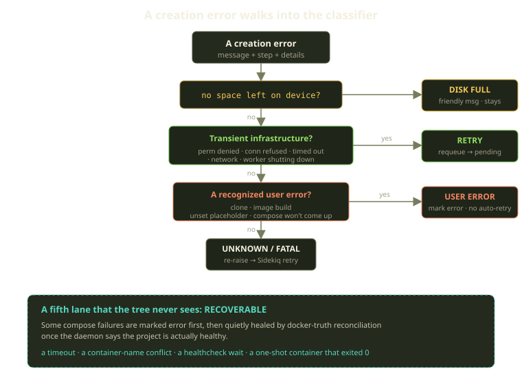
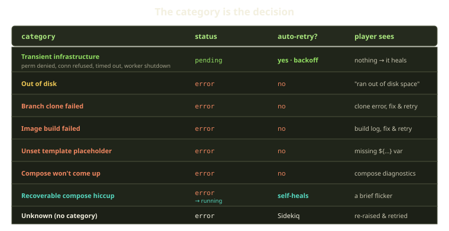
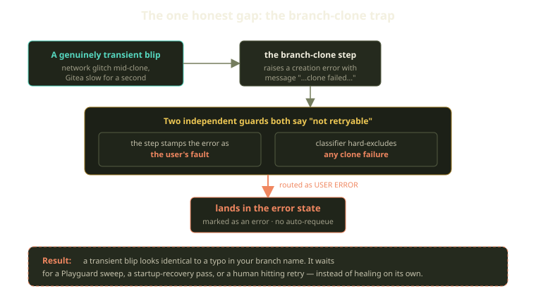

Provisioning a Playground touches more moving parts than we'd like to admit. We SSH into a Marquee, clone source from a Prop, merge registry credentials, build an image, generate a Compose file, and bring it up behind Traefik. Each step can fail, and for wildly different reasons: a flaky network, a typo in a branch name, a server that ran out of disk, a Docker daemon that blinked.

For a long time, "what do we do when step N fails?" was answered by a human reading a Sidekiq backtrace. That doesn't scale, and worse, it's *inconsistent* — the same failure handled two different ways on two different days. So we turned operational judgment into data. Every failure gets a **category**, and the category — not a person, not an ad-hoc rescue clause — decides what's next.

<!-- truncate -->

## The shape of the problem

A Playground moves through eight ordered creation steps, recording which is in flight as it runs: start the reverse proxy, clone the branch, authenticate to the registry, build the image, tear down anything left from a previous attempt, generate the Compose file, start the agent, bring the project up. If something throws, we know which step it was.

But we don't want to know *which line* failed so much as *what kind* of failure it is. There are only a handful of kinds, each with an obviously correct response:

- **Transient infrastructure** — the host was briefly unreachable, a connection got reset, a worker was shutting down mid-job. Nobody did anything wrong; just try again.
- **User error** — the branch doesn't exist, the Dockerfile won't build, a `${VAR}` in the template was never set. Retrying is pointless and a little insulting; show the player what's wrong.
- **Out of disk** — an infra problem that deserves its own friendly message instead of a stack trace.
- **Recoverable compose hiccup** — `compose up` reported a failure, but the daemon will tell us a minute later the project is healthy. Don't panic.
- **Unknown** — we genuinely don't know. Re-raise and let Sidekiq's retry machinery take a turn.

The trick is making the routing *automatic*. The classifier assigns the category the moment the failure happens — while we still have the structured signal, the exit code, the errno text — and from then on it's the single fact every downstream decision reads.

## One classifier, no scattered regexes

The temptation, when a dozen boundaries can each throw, is to sprinkle "does this message contain *connection refused*?" checks at every call site. That's how you get twelve subtly-different definitions of "transient" and a bug that only reproduces on Tuesdays.

Instead there's exactly one home for message-shaped patterns: a single classification module whose rule is blunt — *no ad-hoc message regexes at call sites*. The headline pattern is the transient-infrastructure matcher, one regular expression that recognizes the stderr signatures of a momentary blip: permission denied, connection refused, lost connection, a timeout, a network or temporary failure, a worker shutting down mid-job. They all collapse into one category: *nothing is wrong with the request; try again in a moment*.

Those are third-party stderr signatures we can't get a structured signal from: Docker flattens registry HTTP statuses into text, ssh and rsync embed remote errno strings in their stderr. When a boundary *can* hand us something structured — an exit code, an explicit timed-out flag, a typed error — that always wins; our own transport timeouts, for instance, are classified from the actual exit condition, not by grepping output. The regex is the fallback for the messy text from tools we don't control.

## How the routing actually works

When a step raises, the rescue path asks a short, ordered series of questions. The first to say "yes" wins; the rest never run:

In code it's almost embarrassingly linear. Out of disk? Hand it the friendly disk-space branch and leave it visible. Transient infrastructure? Rewind and re-enqueue the whole creation. Otherwise, mark it as an error the player can see — and then, unless it's a recognized user error, re-raise so Sidekiq's own retry, backoff, and dead-set machinery takes over. Whichever question fires first owns the outcome.

That last branch is the one we like best. We don't pretend to understand failures we don't understand — but we record them for the player before re-raising, so they're never silently swallowed.

## The category is the decision

Here's the whole taxonomy, and what each category buys you:

A few deserve a sentence:

**Transient infrastructure rewinds to pending.** This is the only category that auto-retries the *whole creation*. We rewind the Playground to pending, clear the error fields, stamp the retry state so the next attempt knows where it stands, and re-enqueue the creation job — with exponential backoff capped at five minutes, so a Marquee that's genuinely down doesn't get hammered. Once the wait elapses, the job re-runs from the top.

This recovery write goes straight to the row, deliberately skipping the normal lifecycle machinery — the state-transition table, the callbacks, the validations. A recovery path that has to ask permission from the rules it's recovering *from* deadlocks.

**Out of disk surfaces an error, but kindly.** Retrying immediately won't help, and a raw `no space left on device` is a lousy thing to show a person, so it gets its own branch and a human sentence: *"The environment could not be provisioned because the server ran out of disk space. Please try again later."*

**User errors surface an error, no retry.** A branch that won't clone, an image that won't build, an unset placeholder, a Compose project that won't come up. The system can't fix your typo by trying harder, so it marks the error, attaches whatever diagnostics it has — for a Compose failure, a parsed category, the failed service, suggested next actions — and waits for you.

**Recoverable compose hiccups self-heal.** Some failures from `compose up` — a timeout, a container-name conflict, a one-shot container that exited `0` — get marked as an error in the moment, then recovered by the reconciler that treats the Docker daemon as the source of truth. Once it finds the project healthy, it flips the environment back to running. The player sees a brief flicker of red; a minute later it's green, untouched.

:::tip
A nice property hides in the rebuild path: if the image build fails while rolling out a change to an *already-running* environment, we don't tear the live runtime down. We mark it for a future recreation, restore its previous status, and leave it serving traffic. A failed deploy shouldn't take down a healthy app.
:::

## The honest gap: the branch-clone trap

This taxonomy isn't airtight. It has a sharp edge worth showing — exactly the kind of thing a clean abstraction makes easy to miss.

Look again at the classifier. Right before it would match the transient pattern, it bails out early if the message looks like a failed clone — so a `git clone` failure never gets a chance to be recognized as transient. The intent is reasonable: a failed clone is *usually* the player's fault — a bad branch, a private repo we can't read, a path that doesn't exist — and retrying those is futile. The clone step also stamps a "this was the user's fault" flag into the error details: two independent guards both insisting this is not retryable.

But "usually" is not "always." A network glitch *during* the clone produces a clone failure too, and that one is genuinely transient. Both guards fire anyway:

So a transient blip during the clone step lands in error and *stays there*, looking identical to a typo. It won't auto-requeue; it waits for a Playguard sweep, a startup-recovery pass, or a human clicking retry. The fast self-healing path — the one that would've rescued the same glitch one step later — skips it.

This isn't catastrophic: the slower recovery paths do eventually pick these up, and clone failures genuinely are user-caused far more often than not. But it's a real false-negative, and we know it. The clean fix is to classify clone failures *structurally* the way we already classify ssh and rsync timeouts — "the remote said your ref doesn't exist" (user error) versus "the transport died mid-transfer" (transient) — instead of one text match meaning both. That's the direction we're headed.

:::warning
The lesson generalizes. Any time you classify by *what a message says* instead of *what actually happened*, you inherit the ambiguity of natural-language error strings: "clone failed" is one English phrase standing in for two genuinely different events. Push boundaries toward structured signals at the source and you set fewer of these traps.
:::

## What we learned

The big idea is almost aggressively unglamorous: **encode operational judgment as data, then let the data route the failure.** A category is just a string, but it carries a decision made once, at the moment we had the most information, read by everything downstream without re-litigating it. A few things held up well:

- **One classifier, not twelve.** "Transient" has exactly one definition, tuned in one place.
- **Structured signals beat string matching.** Exit codes don't have synonyms; the places that still hurt — like the clone trap — are the ones still leaning on text.
- **Re-raise what you don't understand.** Unknown failures fall through to Sidekiq instead of being guessed at.
- **Name your sharp edges.** A failure mode you've written down is one you can fix on a schedule; one living in someone's head is one you rediscover at 2 a.m.

When provisioning fails at Fibe now, no one reads a backtrace to decide what to do. The category already decided — and the cases where it decides *wrong* are now things we can see, name, and route around, instead of surprises.
