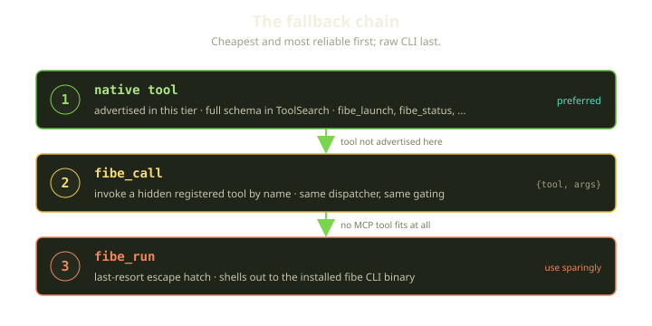
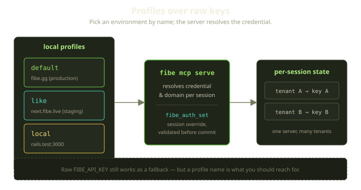

The Fibe SDK is one Go binary doing two jobs. Type `fibe playgrounds list` and it's a normal Cobra CLI. Run `fibe mcp serve` and the same binary becomes a Model Context Protocol server, so an AI agent — Claude, Codex, Cursor, whoever — can drive your Marquee without paying the fork-and-exec cost of shelling out to the CLI on every operation.

That second job came with a problem we didn't appreciate until we watched agents fail at it. A platform like Fibe has a *lot* of capabilities: provision a Marquee, launch a Playground, connect a repo through Props, start a Genie agent chat, read logs, manage secrets, fund a wallet. Expose every one as a native MCP tool and you hand the agent a menu with hundreds of items — which, counterintuitively, makes the agent *worse*. So we split the surface into tiers, where "hidden" never means "gone."

<!-- truncate -->

## Why more tools makes an agent dumber

Here's the thing nobody tells you when you wire up an MCP server: an LLM picks its tool the same way it picks its next token. Every advertised tool — name, description, full input schema — sits in the model's context, and the model does fuzzy retrieval over that set before it acts. Modern clients soften this with a `ToolSearch` step that surfaces a relevant subset, but the search itself degrades as the candidate pool grows. Hand it two hundred tools with overlapping names (`fibe_playgrounds_get`, `fibe_resource_get`, `fibe_agents_messages`, `fibe_agents_activity`...) and the agent reaches for the *almost* right one: it calls list when it wanted get, fills in the wrong argument object because two tools share a field name, burns a turn on a tool it didn't need. In dogfooding, a surface that exposed everything natively had a measurably worse first-tool-pick rate than a small curated one. The agent wasn't dumber; we'd given it a worse haystack.

The naive fix — "only ship the tools agents need" — is wrong too, because we don't know which tools an agent needs. The whole point of an agentic platform is that the agent does things we didn't script. Permanently dropping a capability to keep the menu short is how you end up with an agent that confidently tells the user "Fibe can't do that," when Fibe absolutely can.

So we wanted both: a small advertised surface *and* a complete one. Tiers are how we get there.

## Tiers: one registry, two surfaces

Every tool the SDK knows about is registered, unconditionally, into one dispatcher at startup. Registration and *advertisement* are separate steps: a `--tools` flag decides which registered tools get advertised to the MCP client as native tools. Nothing else changes.

The tiers themselves are plain buckets. Each tool declares which bucket it belongs to, and the set of buckets is fixed. There are seven of them: the meta-tools, a base tier of resource reads, two tiers for the two ways people start work on Fibe, and three more — overseer, local, and other — that round out the long tail of the platform. `--tools core` selects a named subset of four; `--tools full` selects all seven. There is no clever runtime logic here, just a list of bucket names mapped to a list of selectors, which is exactly the boring, auditable property you want for a security-relevant boundary.

`--tools core` advertises exactly four tiers: the meta-tools (discovery, escape hatches, pipeline runner), the base resource reads, and the two tiers covering the two ways people start work on Fibe — `greenfield` (launch from scratch) and `brownfield` (connect an existing repo and its Props). That's the curated surface, small enough that `ToolSearch` stays sharp. `--tools full` advertises every tier: the honest "give me everything natively" mode, noisier by design.


The flag parser is deliberately forgiving. `core` and `full`/`all` are shortcuts, but you can also hand it a comma-separated list of named tiers for something in between:

```bash
# the default we recommend for agent clients
fibe mcp serve --tools core

# everything native — noisier ToolSearch
fibe mcp serve --tools full

# bespoke: meta-tools plus the "other" bucket and nothing else
fibe mcp serve --tools other,meta
```

:::tip
For Claude Desktop, Claude Code, Codex, Cursor, and friends, default to `--tools core`. Reach for `--tools full` only when a client genuinely needs every Fibe tool exposed as a first-class native tool — and accept that tool selection gets harder when you do.
:::

The single most important property: a tool that isn't in your selected tier is still **registered**, just not advertised. In core mode, the `overseer`, `local`, and `other` tiers sit right there in the dispatcher, fully wired up, schemas retained — the agent just doesn't see them in its native tool list. Which raises the obvious question: how does it use them?

## Meta-tools: the escape hatches

The answer is a tiny set of meta-tools that *are* always in the core surface. They turn the full catalog from a wall of tool definitions into something the agent queries on demand, the way a human reads `--help` before running an unfamiliar command. Two do the heavy lifting.

**`fibe_tools_catalog`** lists every registered tool — advertised or not — filterable by tier or substring pattern. Its own description is blunt about why it exists:

> "List all tools registered and available on the Fibe MCP server... We just can't advertise them all because there are hundreds"

Each entry carries a `name`, `description`, `tier`, an `advertised` boolean, and safety hints (`read_only`, `destructive`, `idempotent`). The `advertised:false` flag is the agent's cue: *this tool exists and is callable, it's just not native in your current session.* You can ask narrow questions:

```json
{ "tier": "full", "name_pattern": "webhook" }
{ "tier": "all",  "name_pattern": "props" }
```

**`fibe_call`** then invokes any registered tool by name, whether or not it's advertised:

```json
{ "tool": "fibe_props_get", "args": { "id": 123 } }
```

The part that matters for safety: `fibe_call` bypasses nothing. It dispatches through the *exact same* central handler a direct native call goes through — destructive-op gating, per-session auth, idempotency all still fire. A hidden destructive tool still needs `confirm:true` (forwarded from the top level so the agent doesn't have to nest it):

```json
{ "tool": "fibe_playgrounds_delete", "args": { "id": 123 }, "confirm": true }
```

Two guardrails encode lessons: `fibe_call` refuses to call itself, and refuses to call `fibe_pipeline` — pipelines are powerful enough to get invoked directly, not laundered through the generic caller. Small rules, but they close off the recursive cleverness an agent will absolutely attempt at 2am.

### The fallback chain

Together, the meta-tools give the agent a clear priority order, and we coach clients to follow it:



1. **Native tool.** If the concrete tool is advertised in this tier, just call it. Full schema, best ergonomics, cheapest path.
2. **`fibe_call`.** If the tool is hidden by the current tier, look it up in the catalog and invoke it by name. Same dispatcher, same gates.
3. **`fibe_run`.** The last-resort escape hatch — shells out to the installed `fibe` CLI binary for the rare command with no dedicated MCP tool at all. Its own description says it plainly: "Use sparingly."

That ordering isn't decoration. It's "prefer the typed, schema-checked path; degrade gracefully; never get stuck." An agent that can't find a native tool is never blocked — worst case it discovers the capability through the catalog and calls it.

:::note
`fibe_run` runs the *installed* CLI as a subprocess rather than mutating the server's in-process command tree, so the escape hatch behaves identically to the CLI a developer would type by hand — no drift between "what the agent does" and "what we'd do in our terminal."
:::

## Auth: profiles, not pasted keys

A tool surface is only useful if it's pointed at the right environment with the right identity. Fibe runs in several places — production at `fibe.gg`, staging, your local `rails.test` — and juggling raw API keys while remembering which targets which domain is the worst possible developer experience.

So the SDK leans on **named profiles** — each bundling a credential and a domain under a human name. The MCP server resolves auth per session and records *how* it resolved it — which profile supplied the credential, where the domain came from — so `fibe doctor` can tell you exactly which identity you're operating as and why. Installing the server is a one-liner per environment:

```bash
fibe mcp install --client codex --project ~/play --profile default --tools core   # production
fibe mcp install --client codex --project ~/play --profile like    --tools core   # staging
fibe mcp install --client codex --project ~/play --profile local   --tools core   # local
```



For multi-tenant deployments — one MCP server, many callers — there's `fibe_auth_set`, a session-scoped credential override. It looks trivial and then teaches you something. The naive version just installs the new key into session state. We did that, and discovered the *poisoned session*: a typo'd key gets silently saved, every subsequent call returns 401, and the agent has no idea why.

The fix is small and stubborn. By default, `fibe_auth_set` makes one authenticated round-trip to the API with the new credentials — a cheap "who am I" call — *before* committing them. If that probe fails, it rolls back to the prior credentials and returns an error, so the session keeps working with whatever was valid before:

```text
fibe_auth_set validation failed (credentials NOT saved): <reason>
```

You can pass `validate:false` to skip the check, but the default protects the agent from quietly bricking its own session. Validate-before-commit costs one round-trip and saves an hour of confused debugging.

## What we learned

A few things we'd tell our past selves:

- **Advertise less than you can do.** The advertised surface is a UX decision for the *model*, not a capability decision for the platform. Register everything; advertise a curated slice.
- **Hidden must mean reachable.** A capability the agent can't discover doesn't exist as far as the agent is concerned. Meta-tools turn "hidden" into "one lookup away."
- **One dispatcher, one set of gates.** Hidden tools route through the same handler as native ones, so we never re-implemented destructive-op gating or auth on a second path — fewer places for a security check to be missing.
- **Validate before you commit credentials.** The poisoned-session bug is invisible until it isn't. One ping saves a lot of grief.
- **Generate the docs, gate them in CI.** Determinism is the only thing that keeps a fast-moving tool surface from lying about itself.

The result is an AI tool surface that's small where it needs to be sharp and complete where it needs to be capable — one binary equally happy in your terminal or in an agent's hands. `fibe mcp serve --tools core` is what we ship by default, and the one we'd point your agent at first.
