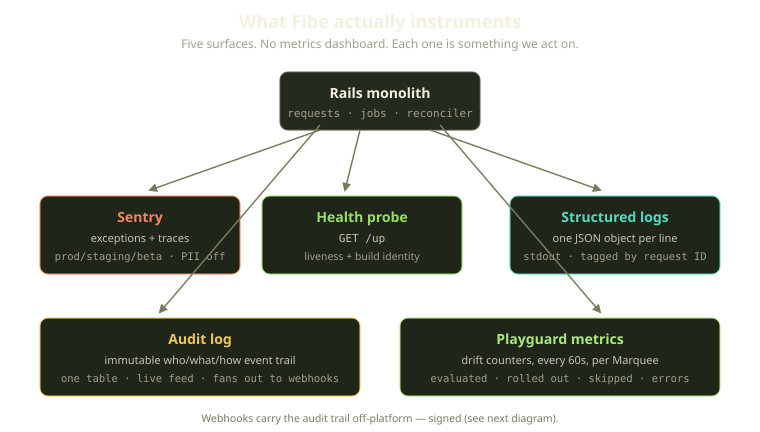
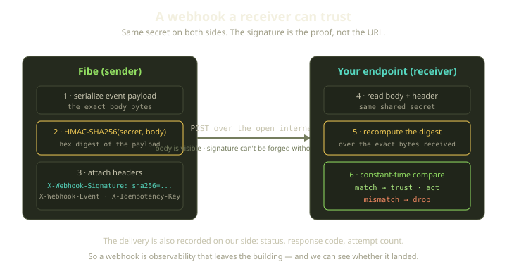
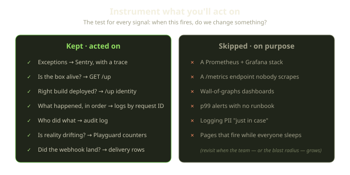

Every infra engineer has a fantasy where a beautiful dashboard catches the incident before the customer does — heatmaps, a p99 graph that turns amber at the right moment, a wall-mounted TV. We don't have any of that. At Fibe, observability is five plain things: errors go to Sentry, a health endpoint, structured JSON logs, an immutable audit log of every meaningful action, and a reconciler that runs every sixty seconds and tells us when reality has drifted. No Prometheus, no Grafana. For a team our size that's not a gap — it's the right call.

<!-- truncate -->

## The dashboard you don't read is worse than no dashboard

The failure mode that kills observability isn't "not enough data" — it's the opposite: someone builds a thirty-panel dashboard, and six weeks later nobody can tell which graph means "things are bad." The signal is drowning.

So we applied one question to every proposed signal: **when this fires, do we change something?** If the honest answer is "we'd look at it, nod, and move on," it's noise — kind to a few surfaces, unkind to everything else.



## Errors: Sentry, and a deliberate silence about everything else

An unhandled exception in production is, by definition, something we did not expect — the one signal where "do we act on it?" is almost always yes. That's where the money went. Sentry is wired up with a handful of deliberate choices, and a sampled fraction of traces (a tenth, by default) rides along so an exception arrives with the context around it rather than naked.

Three of those choices are what make Sentry a signal rather than noise:

- **It only runs where it matters.** Sentry is enabled in production, staging, and beta only; your laptop doesn't report to Sentry, and if the connection string isn't set the whole thing quietly does nothing. Nobody gets paged for a local `nil`.
- **No personally identifiable information, full stop.** We host other people's development environments, so player data stays out of a third-party error tracker by configuration, not by remembering to scrub it. The default that would attach user details to every event is turned off.
- **Clean shutdowns aren't errors.** A worker told to shut down mid-job is a deploy, not a failure, so that case is excluded from reporting — letting it through would teach the team to ignore Sentry, the worst thing an error tracker can do.

:::tip
The most important number in an error tracker isn't how much it captures — it's your false-positive rate. The first time a teammate says "that alert always fires, ignore it," it's already dead.
:::

No error budgets, no SLO burn-rate alerts — just a Sentry feed people actually read, which has caught more real incidents than any graph would.

## Health: is it alive, and is it the right *it*?

The health endpoint lives at `GET /up`, hit constantly by load balancers and deploy tooling. It does two jobs.

The obvious one is liveness. The check sidesteps the normal request filters and session machinery — a probe that depends on the session store can't tell you the session store is down. The interesting one is **build identity verification**: on every check we compare the commit SHA the running process *reports* against the one baked into the image at build time. If the two don't match, `/up` goes red. (When no expected SHA is available — a local build, say — the check simply stays out of the way.)

This catches a nasty class of bug: the deploy that *says* it shipped your commit but didn't — a cached layer, a wrong tag, a half-finished rollout. The symptom is "my fix is deployed but the bug is still here"; the check catches it immediately, because the image whose probe answers `/up` has to be the image you actually built.

:::note
Platform web rolls out with `maxUnavailable: 0`, so new pods must pass their probe before old ones retire. A probe that asserts *which build* is live means a bad image fails it and the rollout stalls — instead of becoming the whole fleet.
:::

We also tell the logger to stay quiet about the health-check path itself, since a probe firing every few seconds would otherwise bury everything else in the logs.

## Logs: one JSON object per line, threaded by request

In production, every log line is a single JSON object on stdout, not multi-line stack soup. The logger emits one object per line, and each line is tagged with the request it belongs to.

What makes them useful is that every line carries a request ID. When something breaks, you take that ID (Sentry has it; the user's error page shows it) and reconstruct the exact sequence of events for one request across every component that touched it — most of what tracing is for, from a single tag.

Assembling a JSON line is the hottest path in the app, so the assembly was pushed down into our Rust core over an in-process FFI bridge — Ruby decides *what* to log, Rust assembles the bytes fast. Stdout plus structured JSON also means we're not married to any backend: where the lines get shipped is a deployment concern, not an application one. You can point them at a file, a log shipper, or a hosted service without the app knowing or caring.

## The audit log is observability the customer can read

We have one **immutable** audit log table recording every meaningful platform action — who, what resource, which channel (web, API, CLI), what happened. A few properties make it pull double duty as an event trail:

- **Immutable by construction.** The model blocks updates and destroys — an audit log you can edit isn't an audit log; it's a suggestion.
- **Written async.** Writes go through a background job, so recording adds zero latency to the request that caused it — observability that slows what it observes gets ripped out.
- **It streams.** When a row persists, an event fires on the affected player's channel and the activity feed updates live — so the audit trail is also the player's real-time "what's happening to my stuff" feed.

When an environment does something surprising, we don't reconstruct the story from log fragments — we read the audit log. A built-in incident timeline, free, because the product needed it anyway.

## Webhooks: signed, so the trail can leave the building

The audit log doesn't have to stay inside Fibe. Players register webhook endpoints and we deliver events to them, so their systems can build on our observability. But a `POST` claiming to be from Fibe is just a `POST` from the internet, so every delivery is signed.



The signature is an HMAC-SHA256 of the exact payload bytes, keyed by a secret only Fibe and the endpoint share. We compute that digest over the serialized body, prefix it with the algorithm name so the receiver knows what it's looking at, and send it in a header alongside the event type and an idempotency key. What you receive on the wire looks like this:

```http
X-Webhook-Signature: sha256=<hex digest>
X-Webhook-Event: <event type>
X-Idempotency-Key: <delivery id>
User-Agent: Fibe-Webhook/1.0
```

The receiver recomputes the HMAC and compares: match means genuinely from Fibe and unaltered, mismatch means drop it. The `X-Idempotency-Key` dedupes the duplicate deliveries our retries occasionally produce. And the loop closes — **we record every delivery attempt**, so we see whether the trail we sent actually landed.

## The reconciler is the monitor

This is the part we'd most want another small team to steal. Fibe's environments are declarative, but Docker hosts are messy living things — containers crash, images go stale. So a reconciler we call **Playguard** runs every 60 seconds against each Marquee (the player's Docker host), comparing desired to actual and healing the drift.

A reconciler is also, accidentally, the best monitoring you can have: it's *already looking at everything you care about, on a fixed cadence, and acting.* Playguard asks "is reality drifting from intent?" 1,440 times a day per host, and every cycle emits a small tally of what it did this time around. Each pass counts how many environments it evaluated, how many it rolled out, how many images it pulled and how many of those pulls failed, how many it deliberately left alone, how many it recovered, and how many ran into outright errors.

Read a few of those tallies in a row and the host tells its own story: a spike in failed image pulls points at a registry problem; a climbing error count while the number of environments evaluated stays flat means the reconciler is looping without making progress. Operational facts straight out of structured logs, no extra pipeline.



The cycle probes Docker first: an unreachable host means it logs why and *returns* rather than reconciling blind, so a run that did nothing because the probe failed reads very differently from one where all was fine.

:::warning
A reconciler-as-monitor only works if the counters are honest about *inaction*: work skipped, work that errored, and a host that was unreachable all have to be first-class outcomes, each with its own tally, not silent early returns. One that counts only successes looks healthy right until it isn't doing anything at all — silence is not success.
:::

## "But what about real metrics?"

We know how this reads to a larger team: charming, but you'll regret it. Maybe — the honest trade-off:

| We can answer... | ...with this, today |
|---|---|
| Is the app throwing errors? | Sentry feed |
| Is a box alive and on the right build? | `GET /up` |
| What happened during one request? | structured logs, by request ID |
| Who did what, and when? | the audit log |
| Is a host drifting from intent? | Playguard counters, every 60s |
| Did a webhook get delivered? | delivery records |
| What's the p99 of endpoint X over 30 days? | **we can't, not easily** |

That last row is the honest cost: we have no long-horizon, queryable time-series, and reconstructing a month-long latency trend from logs would be painful. The day that question becomes load-bearing is the day we add the metrics stack — not before. We'd rather trust five surfaces than half-trust fifteen.

## What we learned

A few rules earned the right to stay. Start from the action, not the data: if you can't name what you'd change when a signal fires, you don't need it. Protect your error feed like it's the last honest thing in the building. And if you already run a reconciler, you already have a monitor.

Good observability for a small team looks less like a NASA control room and more like a short list of things you actually check. Ours fits on one diagram — that's the point.
