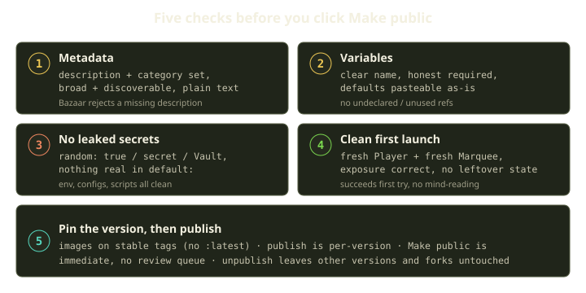
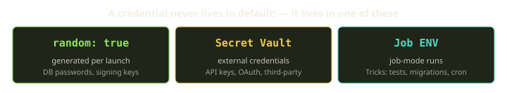
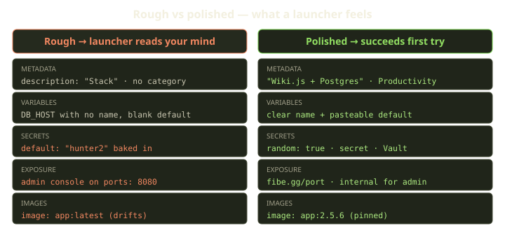
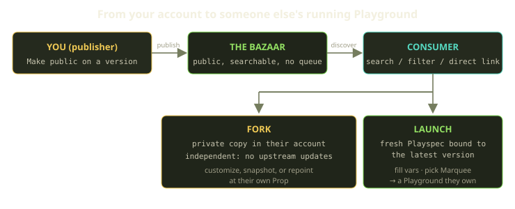

You've got a template that works. It launches on your Marquee, the URLs resolve, the database comes up. So you flip the **Make public** toggle and it's in the Bazaar — instantly, for everyone, with no review queue standing between your YAML and the next person who clicks Launch.

That last part is the whole reason this checklist exists. A public version is live the moment you publish it. There's no reviewer to catch the password you left in a `default:`, no queue to bounce the template back because you forgot a category. The bar you ship at is the bar you set yourself. This is a walkthrough of how to set it high: what to check, why each check matters to the person on the other end, and a literal copy-paste list at the bottom.

<!-- truncate -->

## What "publishing" actually does

The Bazaar is the public marketplace for templates. It's not a separate codebase or a fork of your work — it's a *view filter*. The same template that powers your private launches powers the public listing. Publishing doesn't copy anything; it sets one version's visibility to public.

That has two consequences worth internalizing before you touch the toggle:

1. **Publishing is per-version.** Each version has its own **Make public** action. A draft version can sit private right next to a published one on the same template. Unpublishing a version leaves the others — and any existing forks — completely alone.
2. **It's immediate and unmoderated up front.** Anyone can find your published version in search, open it by direct link, and fork or launch it the second it goes public. Fibe staff can take down templates that are malicious, broken, or misleading after the fact, but nothing gates the version before it goes live.

So the question this whole post answers is: *will someone who clicks your template in the Bazaar get a successful launch on the first try, without having to read your mind?* If yes, publish. If you're not sure, you've got work to do.



## 1. Metadata: make it findable, make it honest

Metadata is the difference between a template someone *finds* and a template that sits in the dark. The Bazaar floor is two fields, both under `x-fibe.gg.metadata`:

```yaml
x-fibe.gg:
  metadata:
    description: "Wiki.js + Postgres — collaborative documentation server"
    category: "Productivity"
```

`description` is what shows on the Bazaar card and in the launcher summary. `category` is the filter people browse by. Both are free-form strings — there's no enum — but the Bazaar **rejects a publish with no description**, so this isn't optional decoration.

Two rules earn you most of the discoverability:

- **The description says what *launches*, not what's *in* the file.** "Ruby on Rails web stack with Postgres, Redis, and Sidekiq workers" tells a launcher what they're getting. "Stack", "Web app", or "see README" tells them nothing. Write the sentence the way the consumer will read it — they see this *before* they decide to launch.
- **The category is broad enough to match.** `metadata.category` is a free-form string, but the Bazaar's *filterable* category is picked from a curated list when you create or edit the template. Keep them aligned with one of those names: `Web`, `Productivity`, `CI`, `Operations`, `Development`, `Database`, `AI`, `Storage`, `Communication`, `Security`. A niche category nobody filters by is the same as no category.

:::caution Markdown in `description` renders as plain text
The Bazaar shows the description as plain text — no headings, no bold, no links. If you paste a Markdown blurb in there, the launcher sees the asterisks and pound signs. Keep it to a sentence or two of prose. And don't confuse the description with the template *name*: the name is set separately when you create or import the template; the description is the body.
:::

One more field pays off if you're publishing a source-backed template meant to be reused across repos:

```yaml
x-fibe.gg:
  metadata:
    description: "CI test runner — runs npm test against the source repo on push"
    category: "CI"
    source_defaults: true
    job_mode: true
    trigger_config:
      enabled: true
      event_type: push
      # repo_url and branch auto-fill from the source Prop
      prop_id: 1
      marquee_id: 1
```

`source_defaults: true` tells the runtime to auto-fill `fibe.gg/repo_url` and `fibe.gg/branch` from the Prop the template is imported from. That's what lets one CI template work against any repo: the launcher imports it from their own Prop and the source binding fills itself in. Keep `job_mode`, `schedule_config`, and `trigger_config` *inside* `metadata` — root-level copies are schema-accepted compatibility mirrors, but root-only execution settings aren't portable across all public import flows. If you mirror them at the root for a schema-facing tool, keep the values identical.

:::note Cover image is optional but it helps
A cover image isn't required, but it lifts discovery. It must be JPEG, PNG, SVG, or WebP and under 500 KB by default.
:::

## 2. Variables: be honest about what launchers must provide

Here's the failure mode that frustrates consumers more than any other: a template that secretly depends on a value the launcher had no way to know about. The runtime doesn't know your environment. If a value is required, it has to come from a declared variable, a default, an env file, or a platform secret — never from "the launcher knows".

Walk your `x-fibe.gg.variables` block with the launcher in mind:

- **Every variable has a clear `name:`.** This is the display label in the launch form. `name: "Postgres password"` beats a bare `DB_PASS` key with no name — the launcher sees the label, not the key.
- **Defaults are pasteable into a fresh launch as-is.** A `default:` that only works on *your* host is a trap. If the default is blank or environment-specific, the launch fails for everyone but you.
- **Validation patterns are slash-wrapped.** Write `validation: "/^[a-z0-9-]+$/"`, not a bare regex. A bare pattern won't behave the way you expect.
- **Whole-value bindings use `path:` / `paths:`; inline `$$var__NAME` is for string fragments only.** If a variable supplies an entire node value, bind it with `path:`. Use the inline `$$var__NAME` token only when you're splicing a value into the middle of a string.
- **No dangling references.** Every `$$var__NAME` you reference must be declared, and every declared variable should be used. An undeclared reference and an unused declaration are both common pre-publish failures. (If you declare a variable purely to bind a whole node with `path:`/`paths:`, that counts as "used".)

Here's a clean variables block for a web app with a generated DB password and a user-supplied site name:

```yaml
x-fibe.gg:
  variables:
    SITE_NAME:
      name: "Site name"
      default: "My Wiki"
      path: services.app.environment.SITE_NAME
    DB_PASSWORD:
      name: "Database password"
      random: true
      secret: true
      path: services.db.environment.POSTGRES_PASSWORD
```

`SITE_NAME` has a real default the launcher can keep or change. `DB_PASSWORD` never asks the launcher for anything — it's generated. Which is exactly the next check.

## 3. No leaked secrets: nothing real in `default:`

This is the one that bites publishers because it's invisible in your own testing. The template works for *you* because the secret is right there in the YAML. Then it's public, and now your secret is public too.

The rule is blunt: **no real secrets in `default:`. None.** Not in variable defaults, not in service `environment:` blocks, not in config files baked into the image, not in startup scripts. A credential belongs in exactly one of three places, depending on what kind it is.



| Kind of credential | Where it goes | How |
|---|---|---|
| Generated per launch (DB password, signing key) | The variable itself | `random: true` — the runtime generates a fresh value at launch |
| External credential (API key, OAuth token) | Secret Vault | The launcher supplies it from their own Vault, never baked in |
| Job-mode run secret | Job ENV | Set on the Trick's run, not in the template body |

The `random: true` path is the one publishers underuse. Any value that just needs to *exist and be secret* — a Postgres password, a Rails `SECRET_KEY_BASE`, a session signing key — should be generated, not authored. The launcher never sees a prompt for it, and there's no value to leak because there's no value until launch.

The Secret Vault is for credentials that come from *outside* — an OpenAI key, a GitHub token, an SMTP password. You can't generate those; the launcher has to bring them. So the template references the Vault and the launcher supplies their own. Marking a variable `secret: true` (and `sensitive` where appropriate) keeps the value out of logs and out of the rendered compose where it doesn't belong.

:::caution The security rejects that get a template taken down
Beyond bare secrets, these patterns will get a template pulled from the Bazaar. Don't publish anything that:

- Publicly exposes an admin console (pgAdmin, MinIO Console, Sidekiq dashboard) without authentication. Put it behind `fibe.gg/visibility: internal` with `fibe.gg/port: PORT` — internal exposure adds Basic Auth.
- Hardcodes real secrets, private URLs, or customer-specific paths.
- Mounts the Docker socket (`/var/run/docker.sock`).
- Runs privileged containers without a documented reason.
- Requires non-generic host paths like `/data/...` or `/mnt/...`.
- Publishes non-HTTP ports through Compose `ports:` for external access — Fibe routing is HTTPS, and TCP/UDP exposure isn't covered.
:::

## 4. A clean first launch: exposure correct, no leftover state

Validation passing is necessary but not sufficient. A template can be schema-valid and still launch into a broken or confusing state. The real test is a launch from a *clean* setup, and there are a few things to confirm before you trust it.

**Exposure goes through `fibe.gg/port`, never Compose `ports:`.** This is the single most common slip-up. Public HTTP routing is a `fibe.gg/port` label; Compose `ports:` left in from a local dev file won't route through Traefik and can expose things you didn't mean to. A quick before/after:

```yaml
# Before — copied from a local docker-compose.yml, won't route
services:
  app:
    image: wikijs:2.5.6
    ports:
      - "3000:3000"

# After — routed by Fibe, TLS terminated, healthy
services:
  app:
    image: wikijs:2.5.6
    labels:
      fibe.gg/port: "3000"
```

A few more runtime-quality checks that separate a polished template from a rough one:

- **Web services bind `0.0.0.0` inside the container.** A service bound to `127.0.0.1` is unreachable from Traefik. This one is easy to miss because it works locally.
- **Internal-only services use `fibe.gg/visibility: internal` with `fibe.gg/port: PORT`.** Anything that shouldn't be on the public internet — an admin UI, a metrics endpoint — gets internal exposure, which puts Basic Auth in front of it.
- **Migrations and setup are explicit.** A dedicated `setup` service, or the setup folded into the app's `command:`. Don't assume the launcher will run a migration by hand.
- **Healthchecks don't depend on the external internet.** A healthcheck that curls a third-party URL will flap when that site has a bad day.
- **Images pinned to a stable tag.** `:latest` drifts; a template that worked a year ago breaks silently when upstream ships a breaking change. Pin to `app:2.5.6`, not `app:latest`.

The way you *prove* the launch is clean is to do it from scratch. After you publish, **launch from a fresh Player with a fresh Marquee.** That's the only honest test of whether your required variables are complete — your own account has state and history that a stranger's doesn't. While you're there, capture a screenshot of the working app and drop it in the launch's mutters, so the next person browsing the timeline can see what success looks like.



## 5. Pin the version, then publish

Templates are immutable and versioned — once you cut a version, it doesn't change underneath the people who launched it. That's a feature, and it's why image pinning matters at the template level too: a pinned version that references `:latest` is only *pretending* to be immutable, because the image it pulls drifts even though the YAML doesn't.

So the order is: get the YAML right, pin the images to stable tags, *then* mark the version public. Because publishing is per-version, you can keep iterating on a private draft version while a known-good version stays published. When you're ready, the **Make public** action on the specific version is the publish step — and it's live immediately.

If you later need to pull it, unpublishing a version is just as scoped: the other versions stay published, and anyone who already forked or launched keeps working. A running Playground doesn't care if the publisher unpublishes — the version was already cloned into the launcher's Playspec at launch time.

## What the consumer sees

It's worth seeing the whole loop from the other side, because everything above is in service of making *their* experience smooth.



A consumer **discovers** your template by searching name, description, or keyword, or by filtering on category. Search ranks by match (closest name first) and returns at most 10 results; an empty search still shows up to 5 Fibe-maintained templates so nobody hits a blank page. They open the detail page for your description, cover image, and version history with changelogs — the variables you ask for appear when they go to launch.

From there they do one of two things:

- **Launch.** Fibe creates a fresh Playspec bound to the template's latest version, the consumer fills in the variables you declared, picks a target Marquee, and launches. The result is a normal Playground they fully own; your original template stays where it was, and their Playspec just carries a reference to the version they launched.
- **Fork.** Forking makes a private copy in their account. The fork is independent — your future updates don't flow into it. Consumers fork when they want to customize without publishing their own version, hold a known-good snapshot even if you update yours, or repoint the template at their own Prop instead of yours.

Notice how much of this rides on the checklist. Honest variables make the launch form fillable. A real default makes "Launch" a one-click action instead of a research project. A pinned image makes the snapshot they fork actually reproducible.

## Personal vs Fibe-maintained listings

One distinction to keep straight. For a template *you* own, publishing a version just means setting that version public — it's visible to you and launchable by others immediately. That's everything above.

**Fibe-maintained catalog entries have an extra gate.** The version must be public, *approved*, and backed by source mirrors that are ready to launch. When Fibe staff approve a player-owned template for the maintained catalog, that approved version becomes a Fibe-maintained listing rather than staying attached to your account. You don't need to do anything special to publish normally — just know that the maintained catalog is a separate, higher bar, not the default path.

## The copy-paste checklist

Walk this once before you click **Make public**, and re-walk it on major updates.

```text
BASICS
[ ] YAML parses cleanly; root has a services: map
[ ] Template validates and a preview launch succeeds
[ ] Would start on a plain Docker host with equivalent env values

METADATA
[ ] x-fibe.gg.metadata.description explains what LAUNCHES (plain text, a sentence or two)
[ ] category is broad and aligned to a curated name (Web, CI, Database, ...)
[ ] job_mode / schedule_config / trigger_config only present when they apply, inside metadata
[ ] source_defaults: true if the template is meant to be reused across repos

VARIABLES
[ ] Every variable has a clear name:
[ ] Defaults are pasteable into a fresh launch as-is
[ ] validation: patterns are slash-wrapped "/.../"
[ ] Whole-value bindings use path: / paths:; inline $$var__NAME for fragments only
[ ] No undeclared $$var__ references; no declared-but-unused variables

SECRETS
[ ] No real secrets in default: anywhere — env, configs, scripts
[ ] Generated values use random: true; external creds use the Secret Vault
[ ] No Docker socket mount, no privileged container without a documented reason
[ ] Admin consoles behind fibe.gg/visibility: internal

FIRST LAUNCH
[ ] Public HTTP via fibe.gg/port, never Compose ports:
[ ] Web services bind 0.0.0.0 inside the container
[ ] Migrations / setup explicit (a setup service or in the command:)
[ ] Healthchecks don't depend on the external internet
[ ] Images pinned to a stable tag (no :latest)

VERSIONING + AFTER
[ ] Version pinned, then Make public on that version
[ ] Test launch from a fresh Player + fresh Marquee
[ ] Screenshots of success captured in the launch's mutters
[ ] Refresh cadence planned — pinned tags still drift over time
```

## Rules of thumb

- **The consumer can't read your mind.** Every hidden assumption — a secret in the YAML, a host-specific default, an undeclared variable — becomes their failed launch. If a value is required, declare it.
- **Generate, don't author, secrets.** `random: true` for anything that just needs to be secret; Secret Vault for credentials that come from outside; Job ENV for job-mode runs. Nothing real ever sits in `default:`.
- **Route through `fibe.gg/port`, expose admin consoles internally.** Compose `ports:` is the most common slip-up, and an unauthenticated admin console is the fastest way to get a template pulled.
- **Pin everything, then publish per-version.** Stable image tags keep an "immutable" version actually immutable. Publishing and unpublishing are scoped to one version and never disturb forks or running Playgrounds.
- **The only honest test is a clean one.** Launch from a fresh Player and a fresh Marquee. Your own account lies to you about what's required.

Get those right and your template earns the thing the Bazaar runs on: a stranger clicks Launch and it just works.
