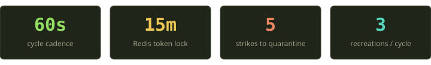
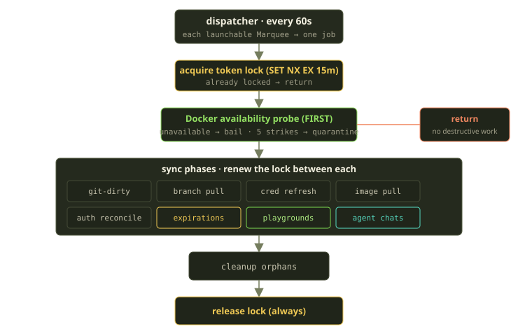
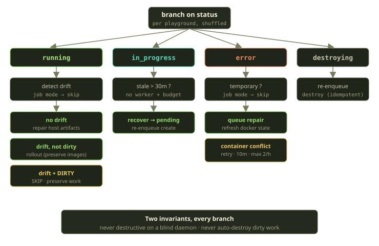
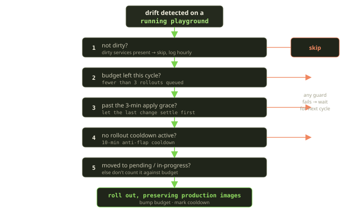

Kubernetes has a luxury Fibe doesn't: it owns the nodes. The kubelet lives on the box, watches the local container runtime, and the control plane can assume the daemon is there and answering. We can't assume any of that. A Player's Marquee might be a Scaleway VM we provisioned, or it might be a laptop under someone's desk reachable only over SSH. The Docker daemon can vanish mid-reconcile. The network can swallow a `docker compose up` halfway through. And the one rule we are never allowed to break is the one that matters most to the person using it: **don't throw away my work.**

Playguard is our answer. It's a control loop — the same shape as a Kubernetes reconciler — that runs once a minute per Marquee, compares declared state against real Docker state over an SSH link we don't trust, and nudges reality back toward what you asked for. The interesting parts aren't the happy paths. They're all the places where it decides to do *nothing*, on purpose.

<!-- truncate -->

## The control-loop framing

If you've written a Kubernetes operator, the mental model is already in your head. There's a desired state and an observed state, and a loop whose only job is to shrink the gap between them. You don't write "create the deployment" as a one-shot command and hope; you write a function that, run repeatedly, converges.

Fibe's desired state is the Playground's declared lifecycle status — one of nine values, with the running state being the one everyone cares about. The observed state is whatever Docker Compose actually reports running on the remote host. The contract we hold ourselves to is blunt:

> The declared lifecycle status is the source of truth for intended behavior. Runtime is *evidence*, not authority.

That sentence does a lot of work. It means a Playground that's marked running but whose containers are gone is **not converged** — there's a gap, and the loop owes you a repair. It also means the reverse: a stale error sitting on a host that's actually healthy is *also* a gap, and the loop will quietly promote it back to running. The status is the goal; Docker is the witness; Playguard is the thing that keeps interrogating the witness.

What makes our version harder than a kubelet's is the transport. Every observation crosses a network to a host we don't control, and the observation itself can fail in ways that are indistinguishable from "everything is broken." A timed-out SSH connection looks a lot like a dead daemon, which looks a lot like a host that's been wiped. Treat those the same and you'll happily tear down a perfectly good environment because a packet got lost. So most of Playguard's complexity is really one idea expressed many times: **when you can't see clearly, don't act.**

## What "converged" actually means

Before walking the loop, it's worth pinning down the word, because "self-healing" gets thrown around loosely and ours has a precise definition. A Playground is converged when its runtime evidence agrees with its declared status — and crucially, *both directions of disagreement count as gaps*. We wrote the completeness conditions out as formal assertions (we model the convergence contract in Alloy and check the safety properties as part of the design), and they read like a checklist of "things that are NOT converged":

- running + unhealthy Docker → not converged. The status claims it's up; the witness disagrees. Repair owed.
- running + filesystem drift → not converged. The containers may be fine but the host artifacts have wandered.
- running + a stale failure message → not converged. There's a lie in the record; clear it.
- a *temporary* error → not converged. It must be retried until it resolves or proves permanent.
- an *irrecoverable* error → **converged.** This is the one people miss. A genuinely-broken thing that has correctly stopped is at rest. Retrying it forever would be the bug.

That last pair is the whole philosophy in two lines. Convergence isn't "make everything green." It's "make the declared state and the evidence agree" — and sometimes the truthful agreement is an error state. A loop that can't tell the difference between a transient blip and a permanent failure either gives up too early or thrashes forever. Ours classifies the failure first, then decides whether the gap is real.

The other thing the model makes explicit: **convergence is eventual, not magical.** Each pass moves *one* evidence source closer to the declared state. We don't try to fix everything about a Playground in a single 60-second window. We refresh Docker truth, or repair an artifact, or queue a rollout — one step — and trust that running again in a minute, with bounds keeping us from overshooting, gets us the rest of the way. That's the same bet every control loop makes, and it only pays off if every individual action is safe to take in isolation. Which is exactly why the skips matter so much.

## One cycle, start to finish

A dispatcher wakes up every 60 seconds and fans out. It doesn't do any work itself — it just enumerates every launchable Marquee and enqueues one per-Marquee job per host. Nothing about that fan-out is clever; the leverage is entirely in *which* Marquees it bothers to enumerate.

That launchable filter is the first guard, and it's doing real gatekeeping. A Marquee only qualifies if its billing runtime is active, its agent runtime is operational, it's SSH-reachable, and it has a root domain. No funding, no work — this is the same payment-required gate (a `402` for an unfunded Marquee) that governs everything else, and Playguard respects it for free just by iterating the right set of hosts. Everything downstream gets to assume it's looking at a host someone is actually paying to keep alive.

Each per-Marquee job runs on a dedicated queue for remote operations and walks through entry guards before it touches anything. There are three of them, in a specific order that we actually corrected in our own docs during a re-audit: first a quick check that the Marquee is still active, then a billing entitlement assertion, then the launchable filter again as a backstop. The entitlement check runs *first*, and when it fails it's caught and logged as a clean skip rather than allowed to crash the pass — an unfunded Marquee is a normal, expected outcome, not an error. Either way an unfunded or unreachable host exits early having done nothing.

### The lock

Only one Playguard run should touch a Marquee at a time. Two concurrent passes racing to recreate the same Playground is exactly the kind of bug that turns a hiccup into an outage. We use a Redis token lock — set-if-not-exists with a 15-minute expiry and a random per-pass token.

The token is the important detail. A naive delete-on-release lock has a classic failure: if your job stalls long enough for the expiry to lapse, a *second* job grabs the lock, and then your first job wakes up and deletes the second job's lock on its way out. The token fixes this — release is a Lua compare-and-delete that only removes the lock if the token still matches. You can only release a lock you still own.

But a 15-minute expiry on a loop that can do a lot of remote I/O is its own risk: what if the work legitimately runs long and the lock expires *during* the pass? That's why the lock is **renewed between phases**. After each major step we re-assert ownership by extending the lock. If that renewal fails — someone else has the lock now — the pass bails immediately rather than continuing to mutate state it no longer has the right to touch. Lose the lock, lose the turn. Clean.

:::tip Why renew instead of just using a longer TTL
A longer TTL means a crashed worker holds the lock longer before anyone else can make progress. A shorter TTL with renewal gives you both: fast recovery if a worker dies, *and* protection for a legitimately long pass. The renewal checkpoints are also natural "am I still allowed to be here?" gates.
:::

### Docker probe first — always

Here's the decision that everything else hangs off of. Before any sync work, before looking at a single Playground, Playguard probes the Docker daemon. If it's reachable, the pass proceeds. If it isn't, the pass is over — and if the host has failed enough times in a row to count as unhealthy, the same step that found it unreachable also quarantines it.

If the daemon isn't reachable, that's the end of the road for this pass. We do not proceed to "well, let me just check if the containers are still there" — because we *can't* check, and a reconciler that acts on a blind observation is a reconciler that deletes things. This is the single most important decision in the whole loop. Everything downstream gets to assume Docker answered.

The probe doesn't panic on the first miss, though. Networks blip. It tracks consecutive failures in the cache with a 30-minute lifetime, and only escalates after a stable run of them: five consecutive failures before the host is declared *unhealthy*. One lost packet means nothing; five misses in a row is a pattern.

At that fifth strike Playguard will quarantine the host: flip the Marquee into an error state and disable its CI workflows so we stop trying to schedule work onto a box that isn't answering. With one exception that we think is the most Fibe thing in the whole loop.

If a Player has a live Genie chat session open on that Marquee, we **do not quarantine it**, even after five failures. The probe might be flaking while the actual user is mid-conversation with their coding agent. Marking the host as errored would yank the chat out from under them to satisfy a health counter. So we leave it active, record an audit event noting the quarantine was deliberately skipped, and let the next pass try again. The reconciler's job is to converge state; it is not to win arguments with reality at the user's expense.

### Then, the sync phases

Only after Docker has answered does the real work start, and it runs as a sequence of phases with a lock renewal between each one:

| Phase | What it does |
|---|---|
| git-dirty sync | Records which Playgrounds have uncommitted work, so later phases can refuse to touch them |
| branch pull | Fast-forwards remote clones to track their branches |
| credential refresh | Re-syncs git credentials onto the host |
| image pull | Pulls images declared by Playspecs |
| auth reconcile | Reconciles the Marquee's registry auth service |
| expirations | Destroys clean expired Playgrounds; parks dirty ones instead of deleting them |
| playgrounds | The per-resource decision loop (below) |
| agent chats | Reconciles Genie sidecars |
| orphans | Cleans up containers nobody declared |

The git-dirty sync running *early* is deliberate. By the time we get to the per-Playground decisions, "is this environment dirty?" is already a known fact, and dirtiness is the master veto. Which brings us to the heart of it.

## Per-Playground decisions

For each Playground on the Marquee, Playguard branches on its declared status. The list is shuffled first (so a single poison-pill environment can't starve the rest by always going first) and sliced into batches sized by the recreation budget. Each Playground is handled in isolation — one throwing an exception records a metric and the loop moves on to the next.

The branch table is short. A running Playground goes to drift detection. An in-progress one is a candidate for interruption recovery, but only once it's been stuck long enough to count as stale. A destroying one gets its destroy re-driven. An error one goes through the error-recovery path. Everything else — the transitional and terminal states — is left untouched on purpose. The whole design lives in those four branches and, just as much, in the states that have no branch at all.

### running → drift detection

A running Playground is the common case, and it's where the interesting reasoning lives. We hand it to drift detection, which compares the desired filesystem and runtime against what's actually on the host. Three outcomes:

- **No drift.** Everything matches. We still take one cheap action — repair any missing host-file artifacts in place — and return. A running env that's converged stays visible and untouched.
- **Drift, and the env is clean.** This is the repair case. We roll out, preserving production images, and the Playground heads back through the pending state to get rebuilt into a correct state.
- **Drift, but the env is dirty.** We **skip.** Full stop. There's uncommitted work on that host and a rollout would blow it away. The drift can wait; the work cannot.

That last branch is the invariant in its purest form. A reconciler's instinct is to converge — drift detected, fix the drift. We deliberately override that instinct when fixing it would cost the user something irreversible. We log it (on an hourly cooldown so we don't spam) and leave it alone until either the drift clears or the user commits their work.

:::warning Drift plus dirty is not a bug to "fix later"
It's tempting to treat the skip as a TODO — "eventually we should roll these out." It isn't. The skip *is* the correct converged-enough state for a dirty environment. The only safe paths out are the user committing or explicitly discarding. Anything automatic that crosses that line is a data-loss incident waiting for a postmortem.
:::

### The five-guard rollout gate

When we *do* decide a `running` Playground needs a rollout, the decision isn't "yes." It's "yes, if it survives five more guards." Drift detection tells you a rollout is *warranted*; the gate decides whether it's *safe and wise right now*.

1. **Not dirty.** Same veto as above — a second checkpoint right before the irreversible action. (One special case: if the drift is *only* a missing service, we retry the current compose in place rather than skip, because that preserves work too.)
2. **Budget available.** No more than three rollouts get queued in a single cycle. Recreations are expensive and load-bearing; capping them keeps one bad Playspec from triggering a thundering herd across a Marquee.
3. **Past the apply grace.** If we applied a change less than 3 minutes ago, back off — give the previous action time to take effect before we judge it.
4. **No active cooldown.** After a rollout we set a 10-minute cooldown, keyed per-Playground in the cache. This is the anti-flap guard: if a rollout doesn't fully fix things, we don't immediately roll out again and again every 60 seconds.
5. **It actually landed.** After we trigger the rollout, we only count it against the budget if the Playground actually moved into the pending or in-progress state. A rollout that no-op'd shouldn't burn a budget slot meant for a real one.

Pass all five and we finally trigger the rollout — and we trigger it in a mode that preserves the existing production images. That preserve-images mode is the bit that lets a *live* environment heal without a cold rebuild. The rollout rebuilds what drifted while keeping the running production images, so the user's environment converges with minimal disruption rather than going dark for a from-scratch build.

### in_progress → recover the interrupted

A Playground stuck in the in-progress state usually means a creation job died mid-flight — a worker got OOM-killed, a deploy crashed, the process vanished. After it's been stuck for 30 minutes, Playguard recovers it back to pending and re-enqueues creation.

The 30-minute number is conservative on purpose, and it's gated carefully. We only recover if there's *no active creation job* still working the environment and there's recreation budget. The danger here is obvious: reset an environment that a live worker is actively building and you've created two builders racing on the same one. So the recovery checks for an owning worker first. There's also a faster sibling that runs every 60 seconds with a 2-minute grace and the same no-live-worker guard — it catches the common interruptions quickly, while Playguard's 30-minute pass is the long-tail backstop.

### error → is it actually broken?

The error branch is the most nuanced one because half the time the error isn't real anymore. The host came back; the network recovered; the thing that failed was transient. So error recovery does several things in order:

- Skip Playgrounds running in job mode (Tricks) — those have their own completion lifecycle.
- If the error falls into a **temporary** category (connection refused, timed out, worker shutting down, and friends — classified structurally from the failure itself, not by pattern-matching on error text), queue a creation repair.
- **Refresh Docker state.** This is the self-heal: ask the host what's really running. If the containers are actually healthy, the error was a ghost, and we clear it and promote back to running.
- Repair desired-image drift if that's what's wrong.
- Apply the **container-conflict** policy if the failure was a name collision.

Container conflicts get their own careful retry budget, because a retry that keeps colliding is just noise. A conflict retry only fires if the env isn't dirty, hasn't been retried in the last 10 minutes, and hasn't already burned its two allowed attempts this hour. Two strikes inside an hour and we stop auto-retrying and let a human or a later cycle take it — bounded effort, no infinite loops. The three numbers there (a 10-minute cooldown between attempts, a rolling one-hour window, a hard cap of two attempts in that window) are deliberately small; a name collision that survives two careful retries is telling you something a third retry won't fix.

And the irrecoverable errors? Those are *also* converged. A Playground that failed for a real, permanent reason (the user's clone failed, the image won't build) has correctly reached its terminal state. Refusing to retry a genuinely-broken thing forever is just as much a part of convergence as repairing a recoverable one.

### destroying → finish the job

A Playground in the destroying state that's still around means a destroy got interrupted. We idempotently re-enqueue the destroy job — idempotently being the key word: if a destroy is already running we leave it alone, otherwise we kick one off, and either way the outcome is the same.

Destroying is a one-way door — the only legal exit is full destruction, which isn't really a status at all, it's the absence of a database record. So there's nothing clever to do here except make sure the destroy actually finishes.

## Agent chats get the same treatment

Genie chats — the AI coding agents running as sidecars — reconcile in the same pass, with logic tuned for "a human is probably watching this right now." The status branches are familiar: a pending chat enqueues a start, a running one is reconciled, an errored one is reconciled too.

The running path is where the user-respect shows up again. A missed healthcheck **never** stops or errors a running chat. Recovery is only even *considered* after a 2-minute grace, and then:

- reachable and healthy → clear any recovery message, done.
- a timeout → no-op. A timeout is ambiguous; we don't punish a chat for one.
- *sustained* unreachable → queue an idempotent redeploy, not a terminal state.

And an errored chat that turns out to be reachable gets promoted straight back to running — a false failure can't hide a chat the user can actually see and use. The whole posture is: a reachable chat is always viewable, and we'd rather redeploy in the background than show someone a dead session that's actually fine.

## A worked example: the host drops

Abstract invariants are easy to nod along to and hard to trust. So here's the concrete one we test against — a Marquee's Docker host goes dark for a while and comes back. Walk it minute by minute and you can see every principle firing.

**The host drops.** A Player's laptop sleeps, or their home network flaps. The next Playguard pass probes Docker and gets nothing. The availability probe ticks one failure into the cache. The pass logs and returns — no sync, no per-Playground decisions, no teardown. The Playground that was running stays running. Its declared status hasn't changed because *nothing trustworthy told us to change it.* The Docker Compose project, the cloned repo, the rendered Compose file — all still sitting on the host's disk, untouched.

**It stays down for a few minutes.** Each pass probes, fails, increments. After five consecutive failures the host is unhealthy. Now quarantine *could* fire — flip the Marquee into an error state, disable CI. Unless there's an open Genie session, in which case we hold off and keep trying. Either way, still nothing destructive has happened to a single Playground. We froze; we didn't delete.

**The host comes back.** Next probe succeeds. The availability cache clears its failure streak. The pass proceeds for the first time in a while, and now the real reconvergence begins:

- If a creation got interrupted mid-flight and the Playground is stuck in the in-progress state past 30 minutes (with no live worker owning it), recover it to pending and re-enqueue. The faster sibling pass, running every 60 seconds with a 2-minute grace, has likely already caught it.
- If a Playground is sitting in an error state from a transient failure during the outage, refresh Docker state. The containers are actually healthy now? Clear the error, promote to running. The error was a ghost the moment the host returned.
- If artifacts drifted while we couldn't see them, repair them in place or queue a bounded rollout.

The Player opens their laptop, glances at their environment, and it's just... there. Maybe it took a minute to settle. No "your environment was destroyed, please recreate." That outcome — *nothing dramatic happened* — is the entire point, and it's only possible because every pass during the outage chose to do nothing rather than guess.

This is also where the bounds earn their keep. When a host comes back and several Playgrounds all want attention at once, the recreation budget caps us at three rollouts this cycle; the rest wait a minute. That's not a limitation we apologize for — it's load-shedding that keeps a recovering host from being hammered into the ground by its own healer.

## What this all adds up to

Step back and the pile of cooldowns and budgets and grace periods resolves into a small number of principles. They're worth stating plainly because they're the same principles that should govern any reconciler operating on infrastructure it doesn't fully own.

**Never act on a blind observation.** The Docker probe runs first and the pass bails if the daemon is unreachable. A failed inspection is treated as exactly that — a failed inspection, not evidence of absence. Drift detection reports "no drift detected" when it couldn't actually see the host, so nothing downstream ever interprets "I couldn't look" as "it's gone." This single discipline is what makes it safe to run a destructive-capable loop every 60 seconds against flaky remote hosts.

**Never auto-destroy dirty work.** Dirtiness is checked early and vetoes rollout, vetoes container-conflict retry, and turns expiration from a delete into a park — a dirty environment that's "expired" is set aside as having unsaved changes rather than torn down. There is no automatic path from "you have uncommitted changes" to "your changes are gone." We made that non-negotiable and then built every branch to honor it.

**Bound everything.** Three recreations per cycle, a 10-minute rollout cooldown, two container-conflict retries per hour, a 3-minute apply grace, a 15-minute lock renewed between phases. Self-healing without bounds is just a different kind of outage — a feedback loop that amplifies instead of damps. Every repair action sits behind a budget or a cooldown so the loop converges instead of oscillating.

**Refusing to act is a valid outcome.** This is the one that takes a while to internalize. A reconciler that always *does something* feels productive and is dangerous. Half of Playguard's branches end in a deliberate skip: skip the dirty env, skip the recently-applied one, skip the chat the user is watching, skip the host that might just be flaky. Quarantine — outright refusing to schedule work onto a host that won't answer — is itself a stable converged state. Doing nothing, when nothing is the safe thing, is the feature.

We borrowed the control-loop shape from Kubernetes because it's the right shape: declare the goal, observe reality, shrink the gap, repeat. What we couldn't borrow was the assumption that you can trust your observations. Out here on someone else's Docker host, the hardest engineering wasn't making the loop converge — it was teaching it when to keep its hands in its pockets. Every minute, on every Marquee, that's mostly what it does. And that's why your work is still there in the morning.
